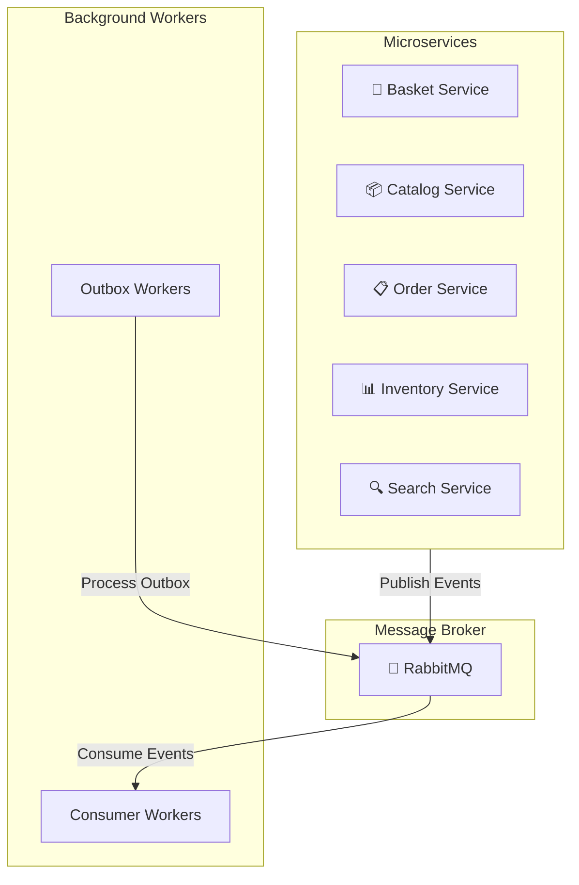
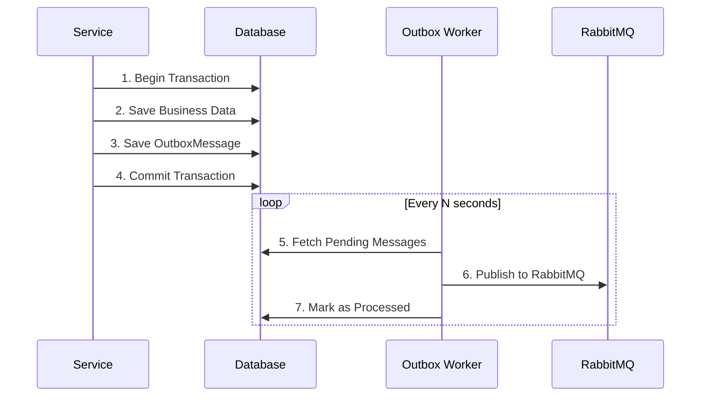
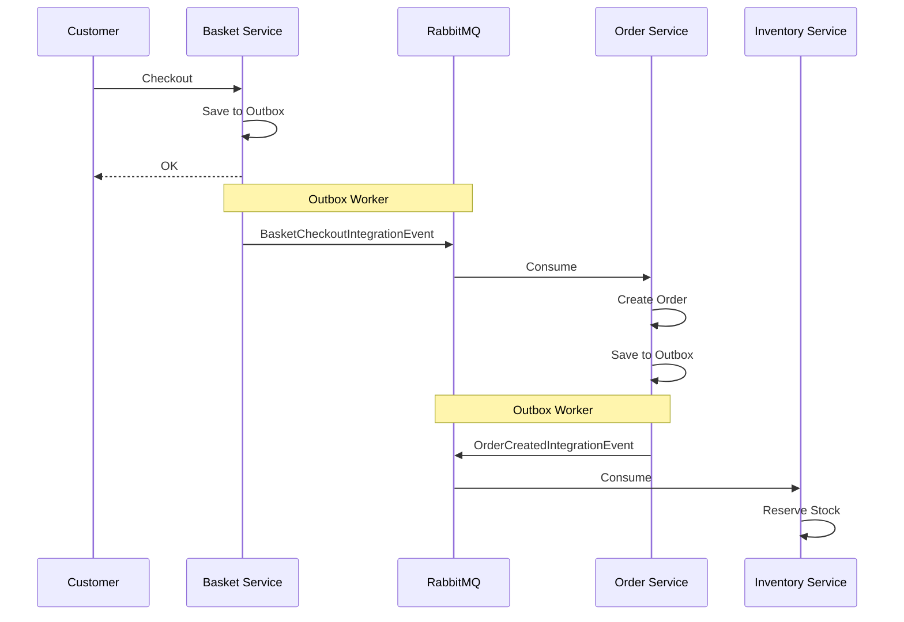
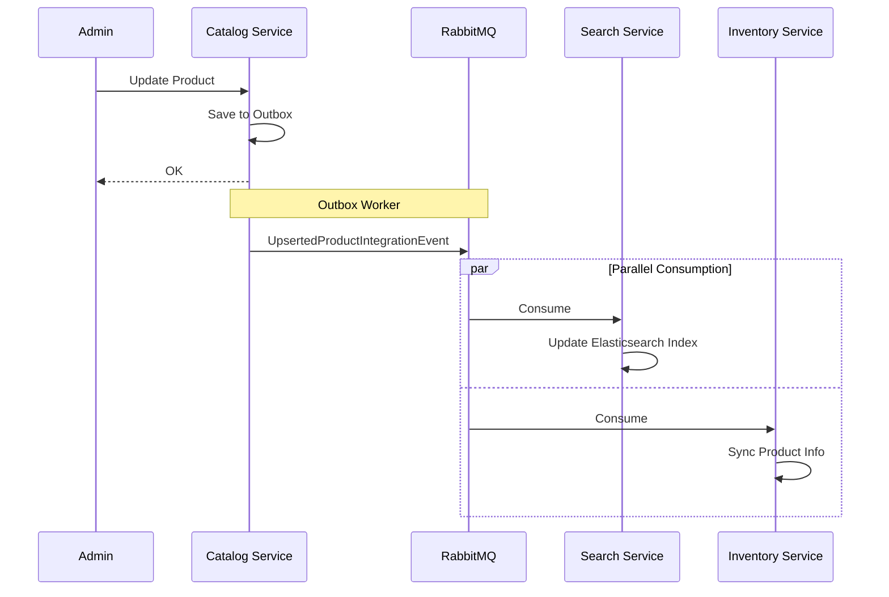
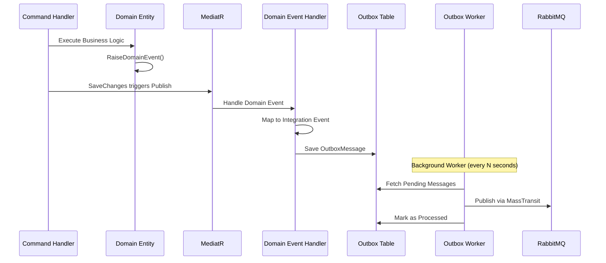
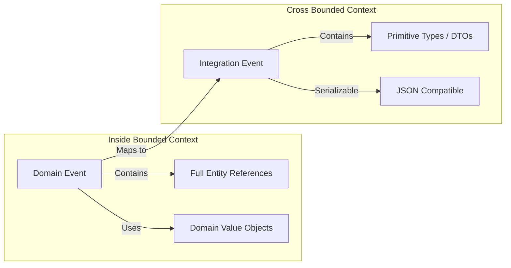
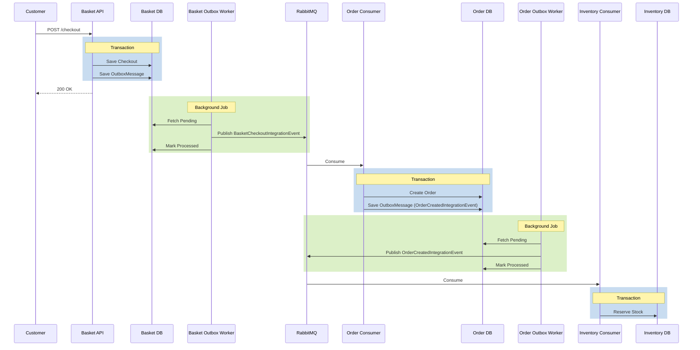

# Phân Tích Kiến Trúc RabbitMQ trong Dự Án Microservices

## Tổng Quan

Dự án sử dụng **MassTransit** (version 8.5.1) làm abstraction layer cho **RabbitMQ** để giao tiếp giữa các microservices. Kiến trúc được thiết kế theo mô hình **Event-Driven Architecture** với **Outbox Pattern** đảm bảo độ tin cậy cao.

---

## 1. Cấu Trúc Tổng Quan



---

## 2. Cấu Hình MassTransit với RabbitMQ

### 2.1 Extension Method Đăng Ký MassTransit

**File:** `Shared/EventSourcing/MassTransit/Extentions.cs`

```csharp
public static IServiceCollection AddMessageBroker(
    this IServiceCollection services,
    IConfiguration cfg,
    Assembly? assembly = null)
{
    services.AddMassTransit(config =>
    {
        // Sử dụng kebab-case cho tên endpoint (best practice)
        config.SetKebabCaseEndpointNameFormatter();

        // Tự động đăng ký tất cả consumers từ assembly
        if (assembly != null)
            config.AddConsumers(assembly);

        // Cấu hình RabbitMQ transport
        config.UsingRabbitMq((context, configurator) =>
        {
            configurator.Host(new Uri(cfg[$"{MessageBrokerCfg.Section}:{MessageBrokerCfg.Host}"]!), host =>
            {
                host.Username(cfg[$"{MessageBrokerCfg.Section}:{MessageBrokerCfg.UserName}"]!);
                host.Password(cfg[$"{MessageBrokerCfg.Section}:{MessageBrokerCfg.Password}"]!);
            });
            configurator.ConfigureEndpoints(context);
        });
    });

    return services;
}
```

### 2.2 Các Service Đăng Ký MessageBroker

| Service | Có Consumer | Có Outbox Worker |
|---------|-------------|------------------|
| Basket | ✅ | ✅ |
| Catalog | ✅ | ✅ |
| Order | ✅ | ✅ |
| Inventory | ✅ | ✅ |
| Search | ✅ | ❌ |

---

## 3. Integration Events (Các Event Giao Tiếp)

### 3.1 Danh Sách Integration Events

**Namespace:** `EventSourcing.Events`

| Event | Mô Tả | Publisher | Consumer(s) |
|-------|-------|-----------|-------------|
| `BasketCheckoutIntegrationEvent` | Giỏ hàng được checkout | Basket | Order |
| `OrderCreatedIntegrationEvent` | Đơn hàng được tạo | Order | Inventory, Catalog |
| `OrderCancelledIntegrationEvent` | Đơn hàng bị hủy | Order | Inventory |
| `OrderDeliveredIntegrationEvent` | Đơn hàng được giao | Order | Inventory |
| `UpsertedProductIntegrationEvent` | Sản phẩm được thêm/cập nhật | Catalog | Search, Inventory |
| `DeletedUnPublishedProductIntegrationEvent` | Sản phẩm unpublished bị xóa | Catalog | Search |
| `StockChangedIntegrationEvent` | Tồn kho thay đổi | Inventory | Catalog |
| `ReservationExpiredIntegrationEvent` | Reservation hết hạn | Inventory | Order |

### 3.2 Base Integration Event

```csharp
// File: Shared/EventSourcing/Events/IntegrationEvent.cs
public record IntegrationEvent
{
    public Guid Id { get; init; } = Guid.NewGuid();
    public DateTime CreatedOnUtc { get; init; } = DateTime.UtcNow;
}
```

### 3.3 Ví Dụ: OrderCreatedIntegrationEvent

```csharp
public sealed record OrderCreatedIntegrationEvent : IntegrationEvent
{
    public Guid CustomerId { get; init; }
    public string OrderNo { get; init; } = default!;
    public List<OrderItemIntegrationEvent> OrderItems { get; init; } = default!;
    public decimal TotalPrice { get; init; }
}

public sealed record OrderItemIntegrationEvent
{
    public Guid ProductId { get; init; }
    public string ProductName { get; init; } = default!;
    public int Quantity { get; init; }
    public decimal Price { get; init; }
}
```

---

## 4. Event Consumers (Xử Lý Events)

### 4.1 Danh Sách Consumers

| Consumer | Service | Event Subscribed |
|----------|---------|------------------|
| `StockChangedEventHandler` | Catalog.Worker.Consumer | `StockChangedIntegrationEvent` |
| `OrderCreatedIntegrationEventHandler` | Catalog.Worker.Consumer | `OrderCreatedIntegrationEvent` |
| `OrderCancelledIntegrationEventHandler` | Inventory.Worker.Consumer | `OrderCancelledIntegrationEvent` |
| `OrderCreatedIntegrationEventHandler` | Inventory.Worker.Consumer | `OrderCreatedIntegrationEvent` |
| `OrderDeliveredIntegrationEventHandler` | Inventory.Worker.Consumer | `OrderDeliveredIntegrationEvent` |
| `UpsertedProductIntegrationEventHandler` | Inventory.Worker.Consumer | `UpsertedProductIntegrationEvent` |
| `BasketCheckoutIntegrationEventHandler` | Order.Worker.Consumer | `BasketCheckoutIntegrationEvent` |
| `ReservationExpiredIntegrationEventHandler` | Order.Worker.Consumer | `ReservationExpiredIntegrationEvent` |
| `DeletedUnPublishedProductIntegrationEventHandler` | Search.Worker.Consumer | `DeletedUnPublishedProductIntegrationEvent` |
| `UpsertedProductIntegrationEventHandler` | Search.Worker.Consumer | `UpsertedProductIntegrationEvent` |

### 4.2 Ví Dụ: Consumer Implementation

```csharp
// File: Search.Worker.Consumer/EventHandlers/Integrations/UpsertedProductIntegrationEventHandler.cs

public sealed class UpsertedProductIntegrationEventHandler(
    ISender sender,
    ILogger<UpsertedProductIntegrationEventHandler> logger)
    : IConsumer<UpsertedProductIntegrationEvent>
{
    public async Task Consume(ConsumeContext<UpsertedProductIntegrationEvent> context)
    {
        logger.LogInformation("Integration Event handled: {IntegrationEvent}", 
            context.Message.GetType().Name);

        var integrationEvent = context.Message;

        // Map integration event to DTO
        var dto = new UpsertProductDto
        {
            ProductId = integrationEvent.ProductId.ToString(),
            Name = integrationEvent.Name,
            Sku = integrationEvent.Sku,
            // ... other mappings
        };

        // Dispatch command via MediatR
        await sender.Send(new UpsertProductCommand(dto));
    }
}
```

---

## 5. Outbox Pattern Implementation

### 5.1 Tổng Quan Outbox Pattern



### 5.2 OutboxMessage Entity

```csharp
public class OutboxMessageEntity
{
    public Guid Id { get; set; }
    public string Type { get; set; }        // Event type name
    public string Content { get; set; }      // JSON serialized event
    public DateTime CreatedOnUtc { get; set; }
    public DateTime? ProcessedOnUtc { get; set; }
    public int AttemptCount { get; set; }
    public int MaxAttempts { get; set; }
    public string? Error { get; set; }
}
```

### 5.3 Outbox Processor

```csharp
// File: Services/Order/Worker/Order.Woker.Outbox/Processors/OutboxProcessor.cs

internal sealed class OutboxProcessor
{
    private readonly string _connectionString;
    private readonly int _batchSize;
    private readonly IPublishEndpoint _publish;
    private readonly ILogger<OutboxProcessor> _logger;

    public OutboxProcessor(
        IConfiguration cfg,
        IPublishEndpoint publish,
        ILogger<OutboxProcessor> logger)
    {
        _connectionString = cfg[$"{ConnectionStringsCfg.Section}:{ConnectionStringsCfg.Database}"]!;
        _batchSize = cfg.GetValue<int>($"{WorkerCfg.Outbox.Section}:{WorkerCfg.Outbox.BatchSize}", 1000);
        _publish = publish;
        _logger = logger;
    }

    public async Task ProcessAsync(CancellationToken cancellationToken)
    {
        // 1. Fetch pending messages from database
        var messages = await FetchPendingMessagesAsync();

        foreach (var message in messages)
        {
            try
            {
                // 2. Deserialize message
                var messageType = GetOrAddMessageType(message.Type);
                var deserializedMessage = JsonSerializer.Deserialize(message.Content, messageType)!;

                // 3. Publish to RabbitMQ via MassTransit
                await _publish.Publish(deserializedMessage, cancellationToken);

                // 4. Mark as processed
                message.IncreaseAttemptCount();
            }
            catch (Exception ex)
            {
                _logger.LogError(ex, "Failed to publish message {Id}", message.Id);
            }
        }
    }
}
```

### 5.4 Outbox Background Service

```csharp
// File: Services/Order/Worker/Order.Woker.Outbox/Program.cs

var builder = Host.CreateApplicationBuilder(args);

builder.Services
    .AddApplicationServices()
    .AddInfrastructureServices(builder.Configuration)
    .AddWorkerServices(builder.Configuration)
    .AddHostedService<OutboxBackgroundService>();

var host = builder.Build();
host.Run();
```

### 5.5 Cấu Hình Outbox Worker

```csharp
// File: Shared/Common/Configurations/WorkerCfg.cs

public sealed class WorkerCfg
{
    public class Outbox
    {
        public const string Section = "WorkerSettings:Outbox";
        public const string BatchSize = "BatchSize";
        public const string ProcessorFrequency = "ProcessorFrequency";
        public const string MaxParallelism = "MaxParallelism";
    }
}
```

---

## 6. Event Flow Diagrams

### 6.1 Checkout Flow



### 6.2 Product Update Flow



---

## 7. Cấu Trúc Project

```
src/
├── Services/
│   ├── Basket/
│   │   └── Worker/
│   │       ├── Basket.Worker.Consumer/     # Consume events
│   │       └── Basket.Worker.Outbox/       # Publish events reliably
│   │
│   ├── Catalog/
│   │   └── Worker/
│   │       ├── Catalog.Worker.Consumer/
│   │       └── Catalog.Woker.Outbox/
│   │
│   ├── Order/
│   │   └── Worker/
│   │       ├── Order.Worker.Consumer/
│   │       └── Order.Woker.Outbox/
│   │
│   ├── Inventory/
│   │   └── Worker/
│   │       ├── Inventory.Worker.Consumer/
│   │       └── Inventory.Woker.Outbox/
│   │
│   └── Search/
│       └── Worker/
│           └── Search.Worker.Consumer/     # Chỉ consume, không có Outbox
│
└── Shared/
    ├── EventSourcing/
    │   ├── Events/                         # Integration Events definitions
    │   │   ├── Baskets/
    │   │   ├── Catalog/
    │   │   ├── Inventories/
    │   │   ├── Orders/
    │   │   └── IntegrationEvent.cs
    │   └── MassTransit/
    │       └── Extentions.cs               # MassTransit configuration
    │
    └── Common/
        └── Configurations/
            └── WorkerCfg.cs                # Outbox configuration
```

---

## 8. Best Practices Được Áp Dụng

### ✅ Outbox Pattern
- Đảm bảo **at-least-once delivery**
- Tránh mất message khi service crash
- Transaction atomicity giữa business data và event

### ✅ Separation of Concerns
- **Worker.Consumer**: Chỉ xử lý incoming events
- **Worker.Outbox**: Chỉ publish outgoing events
- **API/Application**: Chỉ focus business logic

### ✅ MassTransit Conventions
- `SetKebabCaseEndpointNameFormatter()`: Endpoint names theo format chuẩn
- `AddConsumers(assembly)`: Auto-register consumers
- `ConfigureEndpoints(context)`: Auto-configure exchanges & queues

### ✅ Retry Mechanism
- `AttemptCount` và `MaxAttempts` trong OutboxMessage
- Failed messages được retry tự động

---

## 9. Cấu Hình RabbitMQ (appsettings.json)

```json
{
  "MessageBroker": {
    "Host": "amqp://localhost:5672",
    "UserName": "guest",
    "Password": "guest"
  },
  "WorkerSettings": {
    "Outbox": {
      "BatchSize": 1000,
      "ProcessorFrequency": 5000,
      "MaxParallelism": 4
    }
  }
}
```

---

## 10. Kết Luận

Dự án triển khai một hệ thống messaging mạnh mẽ với:

1. **MassTransit + RabbitMQ**: Abstraction layer giúp dễ dàng thay đổi message broker
2. **Outbox Pattern**: Đảm bảo độ tin cậy cao cho event publishing
3. **Dedicated Workers**: Tách biệt consuming và publishing
4. **Shared Event Library**: Các service share chung event definitions

Kiến trúc này phù hợp cho production với yêu cầu **high availability** và **eventual consistency**.

---

## 11. Chi Tiết: Domain Event → Integration Event Flow

### 11.1 Tổng Quan Flow



### 11.2 Domain Events trong Dự Án

| Domain Event | Service | Trigger |
|--------------|---------|---------|
| `BasketCheckoutDomainEvent` | Basket | Khi checkout giỏ hàng |
| `UpsertedProductDomainEvent` | Catalog | Khi tạo/cập nhật sản phẩm |
| `DeletedUnPublishedProductDomainEvent` | Catalog | Khi xóa sản phẩm chưa publish |
| `StockChangedDomainEvent` | Inventory | Khi tồn kho thay đổi |
| `InventoryItemDeletedDomainEvent` | Inventory | Khi xóa inventory item |
| `ReservationCreatedDomainEvent` | Inventory | Khi tạo reservation |
| `ReservationCommittedDomainEvent` | Inventory | Khi commit reservation |
| `ReservationExpiredDomainEvent` | Inventory | Khi reservation hết hạn |
| `OrderCreatedDomainEvent` | Order | Khi tạo đơn hàng |
| `OrderCancelledDomainEvent` | Order | Khi hủy đơn hàng |
| `OrderDeliveredDomainEvent` | Order | Khi giao đơn hàng |

### 11.3 Ví Dụ Chi Tiết: BasketCheckout Flow

#### Step 1: Domain Entity Raise Event

```csharp
// Services/Basket/Core/Basket.Domain/Entities/ShoppingCart.cs
public class ShoppingCart : AggregateRoot<Guid>
{
    public void Checkout(string userName, BillingAddress billingAddress)
    {
        // Business logic...
        
        // Raise domain event
        RaiseDomainEvent(new BasketCheckoutDomainEvent(this, billingAddress));
    }
}
```

#### Step 2: Domain Event Handler Maps to Integration Event

```csharp
// Services/Basket/Core/Basket.Application/Features/Basket/EventHandlers/Domain/BasketCheckoutDomainEventHandler.cs

public sealed class BasketCheckoutDomainEventHandler(
    IOutboxRepository outboxRepo,
    ILogger<BasketCheckoutDomainEventHandler> logger) 
    : INotificationHandler<BasketCheckoutDomainEvent>
{
    public async Task Handle(BasketCheckoutDomainEvent @event, CancellationToken cancellationToken)
    {
        logger.LogInformation("Domain Event handled: {DomainEvent}", @event.GetType().Name);
        
        // Map Domain Event → Integration Event → Outbox
        await PushToOutboxAsync(@event, cancellationToken);
    }

    private async Task PushToOutboxAsync(BasketCheckoutDomainEvent @event, CancellationToken cancellationToken)
    {
        // 1. Map Domain Event to Integration Event
        var message = new BasketCheckoutIntegrationEvent
        {
            Id = Guid.NewGuid().ToString(),
            UserName = @event.Basket.UserName,
            CustomerId = @event.Basket.CustomerId,
            TotalPrice = @event.Basket.TotalPrice,
            // ... other mappings
        };

        // 2. Create Outbox Message
        var outboxMessage = OutboxMessageEntity.Create(
            id: Guid.NewGuid(),
            eventType: message.EventType!,
            content: JsonConvert.SerializeObject(message),
            occurredOnUtc: DateTimeOffset.UtcNow);

        // 3. Save to Outbox table (same transaction as business data)
        await outboxRepo.AddAsync(outboxMessage, cancellationToken);
    }
}
```

#### Step 3: Outbox Repository Interface

```csharp
// Services/Basket/Core/Basket.Application/Repositories/IOutboxRepository.cs

public interface IOutboxRepository
{
    Task<bool> AddAsync(OutboxMessageEntity message, CancellationToken cancellationToken = default);
    Task<IEnumerable<OutboxMessageEntity>> GetPendingMessagesAsync(int batchSize, CancellationToken cancellationToken = default);
    Task<bool> UpdateMessagesAsync(IEnumerable<OutboxMessageEntity> messages, CancellationToken cancellationToken = default);
}
```

### 11.4 Outbox Message Entity

```csharp
public class OutboxMessageEntity
{
    public Guid Id { get; set; }
    public string EventType { get; set; }       // Fully qualified type name
    public string Content { get; set; }          // JSON serialized
    public DateTimeOffset OccurredOnUtc { get; set; }
    public DateTimeOffset? ProcessedOnUtc { get; set; }
    public int AttemptCount { get; set; }
    public int MaxAttempts { get; set; } = 5;
    public string? Error { get; set; }

    public static OutboxMessageEntity Create(
        Guid id,
        string eventType,
        string content,
        DateTimeOffset occurredOnUtc)
    {
        return new OutboxMessageEntity
        {
            Id = id,
            EventType = eventType,
            Content = content,
            OccurredOnUtc = occurredOnUtc
        };
    }

    public void IncreaseAttemptCount() => AttemptCount++;
    
    public void MarkAsProcessed() => ProcessedOnUtc = DateTimeOffset.UtcNow;
}
```

### 11.5 Outbox Processor Chi Tiết

```csharp
// Services/Catalog/Worker/Catalog.Woker.Outbox/Processors/OutboxProcessor.cs

internal sealed class OutboxProcessor
{
    private readonly int _batchSize;
    private static readonly ConcurrentDictionary<string, Type> TypeCache = new();
    private readonly IOutboxRepository _outboxRepo;
    private readonly IPublishEndpoint _publish;
    private readonly ILogger<OutboxProcessor> _logger;

    public OutboxProcessor(
        IOutboxRepository outboxRepo,
        IConfiguration cfg,
        IPublishEndpoint publish,
        ILogger<OutboxProcessor> logger)
    {
        _batchSize = cfg.GetValue<int>($"{WorkerCfg.Outbox.Section}:{WorkerCfg.Outbox.BatchSize}", 1000);
        _outboxRepo = outboxRepo;
        _publish = publish;
        _logger = logger;
    }

    public async Task<int> ExecuteAsync(CancellationToken cancellationToken = default)
    {
        // 1. Fetch pending messages
        var messages = await _outboxRepo.GetPendingMessagesAsync(_batchSize, cancellationToken);
        var processedCount = 0;

        foreach (var message in messages)
        {
            try
            {
                _logger.LogInformation(
                    "Publishing message {Id} of type {EventType} (attempt {AttemptCount}/{MaxAttempts})",
                    message.Id, message.EventType, message.AttemptCount, message.MaxAttempts);

                // 2. Deserialize message
                var messageType = GetOrAddMessageType(message.EventType);
                var deserializedMessage = JsonSerializer.Deserialize(message.Content, messageType)!;

                // 3. Publish to RabbitMQ via MassTransit
                await _publish.Publish(deserializedMessage, cancellationToken);

                // 4. Mark as processed
                message.IncreaseAttemptCount();
                message.MarkAsProcessed();
                processedCount++;
            }
            catch (Exception ex)
            {
                message.Error = ex.Message;
                message.IncreaseAttemptCount();
                _logger.LogError(ex, "Failed to publish message {Id}", message.Id);
            }
        }

        // 5. Batch update all messages
        await _outboxRepo.UpdateMessagesAsync(messages, cancellationToken);
        
        return processedCount;
    }

    private static Type GetOrAddMessageType(string typeName)
    {
        return TypeCache.GetOrAdd(typeName, name => Type.GetType(name)!);
    }
}
```

---

## 12. Mapping: Domain Event ↔ Integration Event

| Domain Event | Integration Event | Mapping Location |
|--------------|-------------------|------------------|
| `BasketCheckoutDomainEvent` | `BasketCheckoutIntegrationEvent` | `BasketCheckoutDomainEventHandler` |
| `UpsertedProductDomainEvent` | `UpsertedProductIntegrationEvent` | `UpsertedProductDomainEventHandler` |
| `DeletedUnPublishedProductDomainEvent` | `DeletedUnPublishedProductIntegrationEvent` | `DeletedUnPublishedProductDomainEventHandler` |
| `StockChangedDomainEvent` | `StockChangedIntegrationEvent` | `StockChangedDomainEventHandler` |
| `OrderCreatedDomainEvent` | `OrderCreatedIntegrationEvent` | `OrderCreatedDomainEventHandler` |
| `OrderCancelledDomainEvent` | `OrderCancelledIntegrationEvent` | `OrderCancelledDomainEventHandler` |
| `OrderDeliveredDomainEvent` | `OrderDeliveredIntegrationEvent` | `OrderDeliveredDomainEventHandler` |
| `ReservationExpiredDomainEvent` | `ReservationExpiredIntegrationEvent` | `ReservationExpiredDomainEventHandler` |

---

## 13. Tại Sao Tách Domain Event và Integration Event?



### Lý Do:

| Aspect | Domain Event | Integration Event |
|--------|--------------|-------------------|
| **Scope** | Trong 1 Bounded Context | Giữa các Bounded Contexts |
| **Data** | Entity references đầy đủ | Chỉ primitive types/IDs |
| **Serialization** | Không cần | Phải serialize được (JSON) |
| **Versioning** | Internal, dễ thay đổi | Public contract, cần backward compatible |
| **Coupling** | High (cùng domain) | Low (chỉ share contract) |

---

## 14. Complete Event Flow Example: Order Creation



---

## 15. Tổng Kết Kiến Trúc

```
┌─────────────────────────────────────────────────────────────────┐
│                        MICROSERVICES                            │
├─────────────┬─────────────┬─────────────┬─────────────┬────────┤
│   Basket    │   Catalog   │    Order    │  Inventory  │ Search │
│   Service   │   Service   │   Service   │   Service   │Service │
├─────────────┼─────────────┼─────────────┼─────────────┼────────┤
│ Domain      │ Domain      │ Domain      │ Domain      │   -    │
│ Events      │ Events      │ Events      │ Events      │        │
├─────────────┼─────────────┼─────────────┼─────────────┼────────┤
│ Domain      │ Domain      │ Domain      │ Domain      │   -    │
│ Handlers    │ Handlers    │ Handlers    │ Handlers    │        │
├─────────────┼─────────────┼─────────────┼─────────────┼────────┤
│ Outbox      │ Outbox      │ Outbox      │ Outbox      │   -    │
│ Table       │ Table       │ Table       │ Table       │        │
├─────────────┴─────────────┴─────────────┴─────────────┴────────┤
│                      OUTBOX WORKERS                             │
│  ┌──────────────────────────────────────────────────────────┐  │
│  │ Basket.Worker.Outbox | Catalog.Worker.Outbox | ...       │  │
│  └──────────────────────────────────────────────────────────┘  │
├─────────────────────────────────────────────────────────────────┤
│                         RABBITMQ                                │
│  ┌──────────────────────────────────────────────────────────┐  │
│  │  Exchanges & Queues (MassTransit kebab-case naming)      │  │
│  └──────────────────────────────────────────────────────────┘  │
├─────────────────────────────────────────────────────────────────┤
│                      CONSUMER WORKERS                           │
│  ┌──────────────────────────────────────────────────────────┐  │
│  │ Basket.Consumer | Catalog.Consumer | Order.Consumer | ...│  │
│  └──────────────────────────────────────────────────────────┘  │
└─────────────────────────────────────────────────────────────────┘
```

---

## 16. Key Takeaways

1. **Domain Events** → Xử lý business logic trong cùng bounded context
2. **Domain Event Handlers** → Map Domain Event → Integration Event → Outbox
3. **Outbox Pattern** → Đảm bảo at-least-once delivery, transaction atomicity
4. **Outbox Workers** → Background service publish messages đến RabbitMQ
5. **MassTransit** → Abstraction layer cho RabbitMQ, auto-configure endpoints
6. **Consumer Workers** → Xử lý Integration Events từ RabbitMQ
7. **Separation** → Domain Events internal, Integration Events external contract
