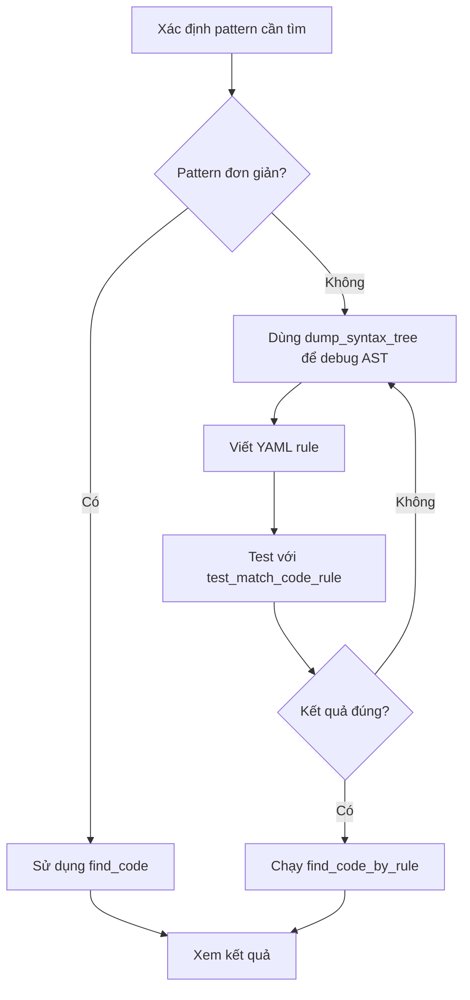

# AST-Grep MCP Server - Báo Cáo Đánh Giá & Hướng Dẫn Sử Dụng

> **Ngày đánh giá**: 16/01/2026  
> **Dự án test**: ProgCoder Shop Microservices (C#/.NET)  
> **Phiên bản ast-grep**: 0.40.5

---

## 1. Tổng Quan

### 1.1. AST-Grep là gì?

AST-Grep là một công cụ tìm kiếm và phân tích code dựa trên **Abstract Syntax Tree (AST)** thay vì text thông thường. Điều này cho phép:

- Tìm kiếm chính xác các cấu trúc code (không match trong comments/strings)
- Sử dụng meta-variables để match các patterns linh hoạt
- Hỗ trợ 20+ ngôn ngữ lập trình thông qua Tree-sitter

### 1.2. AST-Grep MCP Server

MCP Server cung cấp 4 tools chính:

| Tool | Mục đích | Độ phức tạp |
|------|----------|-------------|
| `dump_syntax_tree` | Debug cấu trúc AST | Thấp |
| `test_match_code_rule` | Validate YAML rule với code snippet | Trung bình |
| `find_code` | Tìm kiếm với pattern đơn giản | Thấp |
| `find_code_by_rule` | Tìm kiếm với YAML rule phức tạp | Cao |

---

## 2. Kết Quả Test Thực Tế

### 2.1. Usecase 1: Tìm MassTransit Consumers ✅

**Pattern**: `IConsumer<$EVENT>`

**Kết quả**: Tìm thấy **10 consumers** trên toàn bộ project

```
✅ OrderCancelledIntegrationEventHandler
✅ OrderDeliveredIntegrationEventHandler  
✅ OrderCreatedIntegrationEventHandler
✅ BasketCheckoutIntegrationEventHandler
✅ ReservationExpiredIntegrationEventHandler
✅ StockChangedEventHandler
✅ UpsertedProductIntegrationEventHandler (Search)
✅ UpsertedProductIntegrationEventHandler (Notification)
✅ DeletedUnPublishedProductIntegrationEventHandler
✅ OrderCreatedIntegrationEventHandler (Communication)
```

**Đánh giá**: ⭐⭐⭐⭐⭐ - Pattern đơn giản, kết quả chính xác 100%

---

### 2.2. Usecase 2: Tìm CQRS Commands ✅

**Pattern**: `ICommand<$RESULT>`

**Kết quả**: Tìm thấy **46 commands** với các return types:
- `Unit` - Commands không trả về giá trị
- `Guid` - Commands trả về ID của entity mới
- `bool` - Commands trả về trạng thái thành công
- Custom types như `ApplyCouponResult`, `EvaluateCouponResult`

**Đánh giá**: ⭐⭐⭐⭐⭐ - Pattern hoạt động hoàn hảo

---

### 2.3. Usecase 3: Tìm FluentValidation Validators ✅

**Pattern**: `AbstractValidator<$TYPE>`

**Kết quả**: Tìm thấy **44 validators** across all services:
- Basket: 3 validators
- Discount: 10 validators  
- Report: 3 validators
- Catalog: Nhiều validators cho Product, Category, Brand
- Order, Inventory, Notification...

**Đánh giá**: ⭐⭐⭐⭐⭐ - Rất hữu ích cho code review

---

### 2.4. Usecase 4: Tìm Logger Usage ✅

**Pattern**: `logger.LogError($$$)`

**Kết quả**: Tìm thấy **20 occurrences** của LogError trong:
- Integration event handlers
- Job orchestrator
- Exception handlers

**Đánh giá**: ⭐⭐⭐⭐⭐ - Hỗ trợ `$$$` (multiple arguments) hoạt động tốt

---

### 2.5. Usecase 5: Tìm MediatR Configuration ✅

**Pattern**: `services.AddMediatR($$$)`

**Kết quả**: Tìm thấy **8 configurations** tại tất cả services:
- Basket.Application
- Catalog.Application  
- Discount.Application
- Inventory.Application
- Notification.Application
- Order.Application
- Report.Application
- Search.Application

**Đánh giá**: ⭐⭐⭐⭐⭐ - Liệt kê đầy đủ DI registrations

---

### 2.6. Usecase 6: Tìm Marten Document Store Usage ✅

**Pattern**: `session.Store($ENTITY)`

**Kết quả**: Tìm thấy **20 occurrences** trong:
- OutboxRepository
- SeedDataService
- Command handlers (CreateProduct, UpdateBrand, etc.)

**Đánh giá**: ⭐⭐⭐⭐⭐ - Liệt kê chính xác tất cả store operations

---

### 2.7. Usecase 7: Tìm Try-Catch Blocks (YAML Rule) ✅

**YAML Rule**:
```yaml
id: find-try-catch
language: csharp
rule:
  kind: try_statement
  has:
    kind: catch_clause
    stopBy: end
```

**Kết quả**: Tìm thấy **53 try-catch blocks** với đầy đủ context

**Đánh giá**: ⭐⭐⭐⭐⭐ - YAML rules rất mạnh cho complex patterns

---

### 2.8. Usecase 8: Tìm gRPC Services (YAML Rule) ✅

**YAML Rule**:
```yaml
id: find-grpc-services  
language: csharp
rule:
  kind: class_declaration
  has:
    kind: base_list
    has:
      kind: qualified_name
      has:
        kind: identifier
        regex: Base$
        stopBy: end
```

**Kết quả**: Tìm thấy **5 gRPC service implementations**:
- ReportGrpcService
- DiscountGrpcService  
- OrderGrpcService
- CatalogGrpcService
- InventoryGrpcService (có thể còn thêm)

**Đánh giá**: ⭐⭐⭐⭐ - Cần hiểu AST structure để viết đúng rule

---

### 2.9. Usecase 9: Tìm Exception Throwing ✅

**Pattern**: `throw new $EXCEPTION($$$)`

**Kết quả**: Tìm thấy **102 throw statements** với các exception types:
- `InvalidOperationException`
- `ValidationException`
- `RpcException`
- `ArgumentNullException`
- `ArgumentOutOfRangeException`
- `ClientValidationException` (custom)

**Đánh giá**: ⭐⭐⭐⭐⭐ - Rất hữu ích cho error handling audit

---

### 2.10. Usecase 10: Tìm Event Publishing ✅

**Pattern**: `await $CONTEXT.Publish($$$)`

**Kết quả**: Tìm thấy **12 publish operations** trong:
- OutboxProcessor (Catalog, Inventory, Basket)
- Domain event dispatchers
- Command handlers

**Đánh giá**: ⭐⭐⭐⭐⭐ - Trace được event flow trong hệ thống

---

### 2.11. Usecase 11: Tìm Query Handlers ✅

**Pattern**: `IQueryHandler<$QUERY, $RESULT>`

**Kết quả**: Tìm thấy **41 query handlers** across services

**Đánh giá**: ⭐⭐⭐⭐⭐ - CQRS pattern analysis hoàn chỉnh

---

### 2.12. Usecase 12: Tìm Notification Handlers (Domain Events) ✅

**Pattern**: `INotificationHandler<$EVENT>`

**Kết quả**: Tìm thấy **13 notification handlers**:
- BasketCheckoutDomainEventHandler
- LocationChangedDomainEventHandler
- StockChangedDomainEventHandler
- OrderCreatedDomainEventHandler
- OrderCancelledDomainEventHandler
- OrderDeliveredDomainEventHandler
- UpsertedProductDomainEventHandler
- DeletedUnPublishedProductDomainEventHandler
- ReservationCommittedDomainEventHandler
- ...

**Đánh giá**: ⭐⭐⭐⭐⭐ - Domain event pattern tracking hoàn hảo

---

## 3. Đánh Giá Tổng Thể

### 3.1. Điểm Mạnh

| Tiêu chí | Đánh giá | Ghi chú |
|----------|----------|---------|
| **Độ chính xác** | ⭐⭐⭐⭐⭐ | Chỉ match code, không match comments/strings |
| **Tốc độ** | ⭐⭐⭐⭐⭐ | Scan toàn bộ project trong < 2 giây |
| **Linh hoạt** | ⭐⭐⭐⭐ | Meta-variables ($NAME, $$$) rất mạnh |
| **Multi-language** | ⭐⭐⭐⭐⭐ | Hỗ trợ 20+ ngôn ngữ bao gồm C# |
| **YAML Rules** | ⭐⭐⭐⭐ | Mạnh nhưng cần học cú pháp |
| **Debug tools** | ⭐⭐⭐⭐⭐ | dump_syntax_tree rất hữu ích |

### 3.2. Điểm Yếu

| Tiêu chí | Đánh giá | Ghi chú |
|----------|----------|---------|
| **Learning curve** | ⭐⭐⭐ | Cần hiểu AST structure để viết patterns phức tạp |
| **Error messages** | ⭐⭐⭐ | Một số lỗi YAML không rõ ràng |
| **Documentation** | ⭐⭐⭐⭐ | Tốt nhưng thiếu ví dụ cho C# |

### 3.3. So Sánh với Các Tool Khác

| Feature | ast-grep | grep_search | code-graph-rag |
|---------|----------|-------------|----------------|
| **Tìm kiếm structural** | ✅ Tốt nhất | ❌ Text only | ⚠️ Semantic |
| **Tốc độ** | ⭐⭐⭐⭐⭐ | ⭐⭐⭐⭐⭐ | ⭐⭐⭐ |
| **Meta-variables** | ✅ $NAME, $$$ | ❌ | ❌ |
| **Relationship analysis** | ❌ | ❌ | ✅ |
| **Refactoring** | ✅ (ast-grep cli) | ❌ | ❌ |

---

## 4. Hướng Dẫn Sử Dụng

### 4.1. Workflow Đề Xuất



### 4.2. Quick Reference - Common Patterns

#### Tìm kiếm cơ bản
```
# Tìm class implements interface
pattern: IConsumer<$EVENT>

# Tìm method calls với nhiều arguments  
pattern: logger.LogError($$$)

# Tìm generic types
pattern: AbstractValidator<$TYPE>
```

#### YAML Rules phức tạp
```yaml
# Tìm class có attribute cụ thể
id: find-attributed-classes
language: csharp
rule:
  kind: class_declaration
  has:
    kind: attribute_list
    has:
      pattern: "[ApiController]"
    stopBy: end

# Tìm methods async
id: find-async-methods
language: csharp  
rule:
  kind: method_declaration
  has:
    kind: modifier
    pattern: async
    stopBy: end
```

### 4.3. Meta-Variables Reference

| Meta-variable | Mô tả | Ví dụ |
|---------------|-------|-------|
| `$NAME` | Match single AST node | `class $NAME` |
| `$$$` | Match 0 hoặc nhiều nodes | `Method($$$)` |
| `$$ARGS` | Named multi-match | `Method($$ARGS)` |
| `$_` | Wildcard (bỏ qua) | `if ($COND) $_` |

### 4.4. Debugging Tips

1. **Luôn dùng `dump_syntax_tree` trước** khi viết YAML rule phức tạp
2. **Format `cst`** cho chi tiết đầy đủ, `pattern` để xem cách ast-grep interpret
3. **`stopBy: end`** trong `has`/`inside` rules để traverse đầy đủ
4. **`max_results`** để giới hạn output khi test

### 4.5. Common Errors & Solutions

| Lỗi | Nguyên nhân | Giải pháp |
|-----|-------------|-----------|
| "No matches found" | Pattern không khớp AST structure | Dùng dump_syntax_tree để debug |
| "unknown field stopBy" | stopBy ở sai vị trí | Đặt stopBy trong has/inside, không ở root |
| Pattern match quá rộng | Meta-variable quá general | Thêm `kind` constraint trong YAML |

---

## 5. Kết Luận

### 5.1. Đánh Giá Chung

AST-Grep MCP Server là một **công cụ mạnh mẽ** cho việc:
- **Code analysis** - Tìm kiếm patterns trong codebase lớn
- **Code review** - Audit coding conventions, error handling
- **Architectural review** - Liệt kê components theo pattern (CQRS, Event handlers, etc.)

### 5.2. Khuyến Nghị Sử Dụng

| Use case | Công cụ đề xuất |
|----------|-----------------|
| Tìm kiếm nhanh text | grep_search |
| Tìm kiếm structural code | ast-grep |
| Phân tích relationships | code-graph-rag |
| Hiểu context codebase | Kết hợp cả 3 |

### 5.3. Điểm Số Tổng Thể

**⭐⭐⭐⭐⭐ (4.5/5)** - Công cụ xuất sắc cho structural code search, đặc biệt hữu ích trong dự án microservices với nhiều patterns lặp lại.

---

## 6. Tham Khảo

- [AST-Grep Official Docs](https://ast-grep.github.io/)
- [YAML Rule Reference](https://ast-grep.github.io/reference/yaml.html)
- [Language Support](https://ast-grep.github.io/reference/languages.html)
- [Pattern Syntax](https://ast-grep.github.io/reference/patterns.html)
