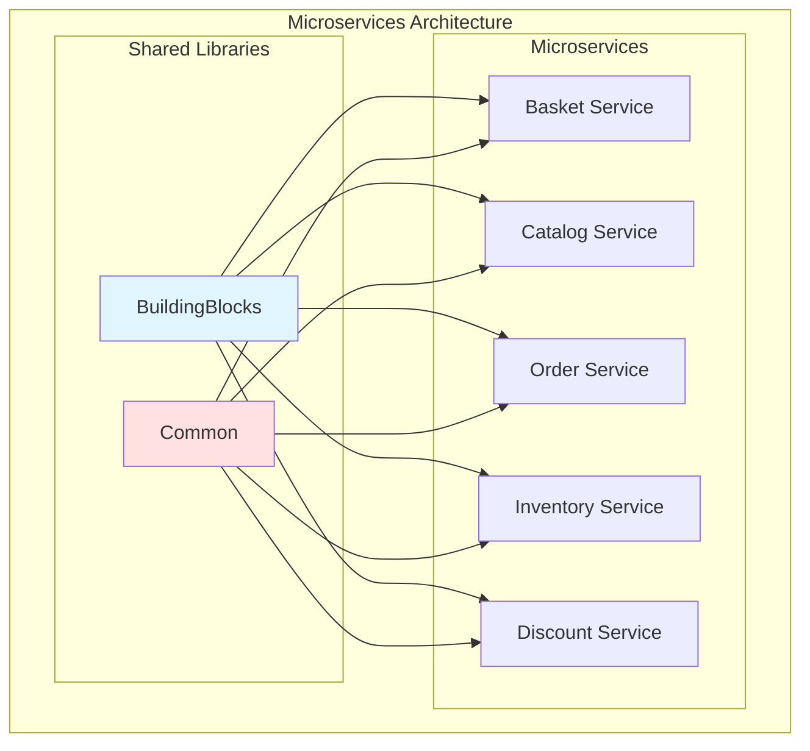
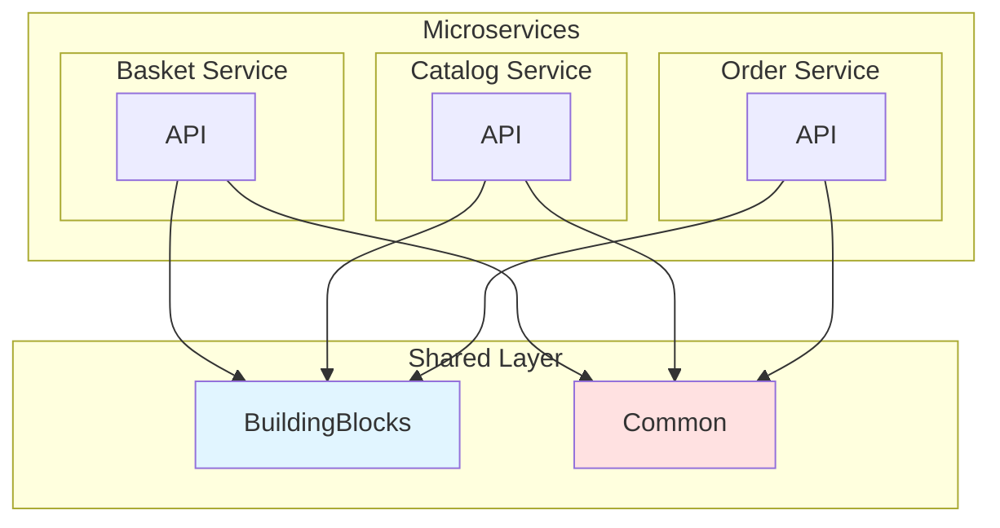
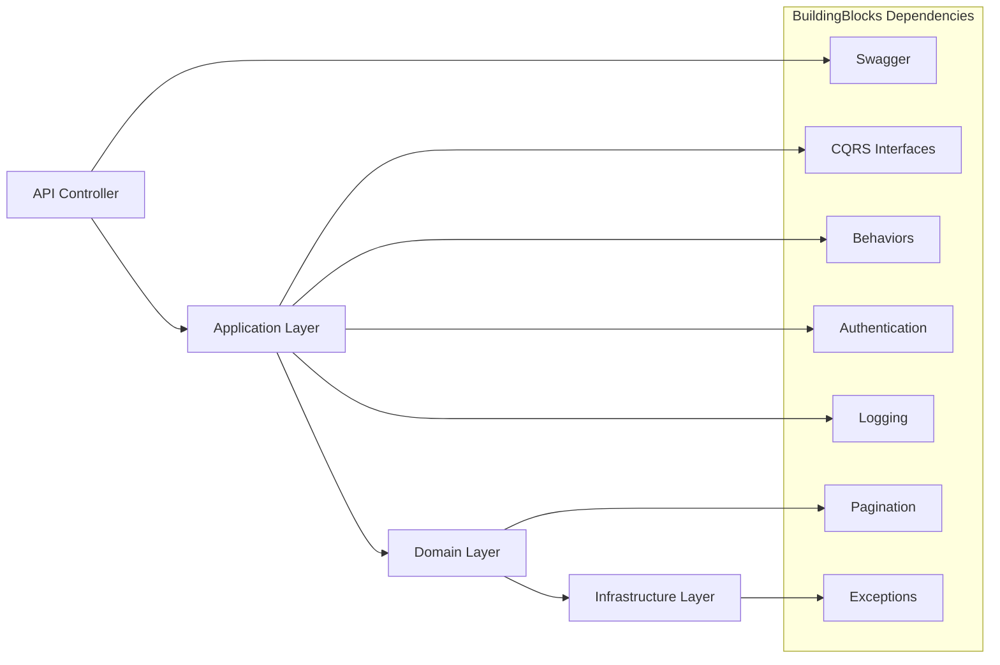
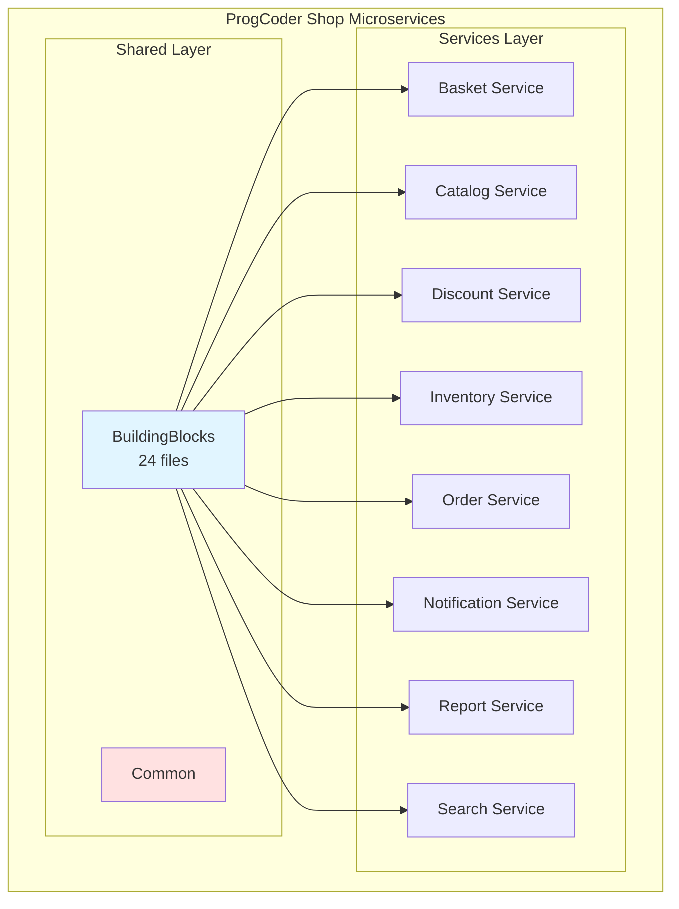

# BuildingBlocks - Phân Tích Chi Tiết

## Table of Contents
1. [BuildingBlocks Là Gì?](#1-buildingblocks-là-gì)
2. [Cấu Trúc Thư Mục](#2-cấu-trúc-thư-mục)
3. [Các Thành Phần Chính](#3-các-thành-phần-chính)
4. [Dependencies & Packages](#4-dependencies--packages)
5. [Vai Trò Trong Kiến Trúc Microservices](#5-vai-trò-trong-kiến-trúc-microservices)
6. [Tại Sao Cần BuildingBlocks?](#6-tại-sao-cần-buildingblocks)
7. [So Sánh: Có vs Không Có BuildingBlocks](#7-so-sánh-có-vs-không-có-buildingblocks)
8. [Best Practices](#8-best-practices)
9. [Kết Luận](#9-kết-luận)

---

## 1. BuildingBlocks Là Gì?

**BuildingBlocks** là một **Shared Library** (thư viện chia sẻ) chứa các thành phần **cross-cutting concerns** được dùng chung bởi **tất cả microservices** trong hệ thống ProgCoder Shop.

### 1.1. Định Nghĩa

```
📦 BuildingBlocks = Shared Infrastructure Code

├── Nơi chứa code dùng chung (shared code)
├── Tăng tính tái sử dụng (reusability)
├── Đảm bảo tính đồng nhất (consistency)
└── Giảm code duplication
```

### 1.2. Vị Trí Trong Solution

```
📁 src/
├── 📁 Services/
│   ├── 📦 Basket.Application
│   ├── 📦 Catalog.Application
│   ├── 📦 Discount.Application
│   ├── 📦 Inventory.Application
│   ├── 📦 Order.Application
│   ├── 📦 Report.Application
│   └── 📦 Search.Application
│
└── 📁 Shared/
    ├── 📦 BuildingBlocks ← **NÓ ĐÂY!**
    └── 📦 Common
```

### 1.3. Kiến Trúc Architectural



---

## 2. Cấu Trúc Thư Mục

### 2.1. Tree Structure

```
📦 BuildingBlocks/
├── 📁 Authentication/          # JWT & Authorization
│   └── 📁 Extensions/
│       ├── AuthorizationExtension.cs
│       └── UserContextExtension.cs
│
├── 📁 Behaviors/              # MediatR Pipeline Behaviors
│   ├── ValidationBehavior.cs
│   └── LoggingBehavior.cs
│
├── 📁 CQRS/                  # CQRS Interfaces
│   ├── ICommand.cs
│   ├── ICommandHandler.cs
│   ├── IQuery.cs
│   └── IQueryHandler.cs
│
├── 📁 DistributedTracing/     # OpenTelemetry
│   └── DistributedTracingExtension.cs
│
├── 📁 Exceptions/             # Custom Exceptions
│   ├── NotFoundException.cs
│   ├── UnauthorizedException.cs
│   ├── NoPermissionException.cs
│   ├── ClientValidationException.cs
│   ├── InternalServerException.cs
│   └── 📁 Handler/
│       └── CustomExceptionHandler.cs
│
├── 📁 Logging/                # Serilog Configuration
│   ├── SerilogLoggingExtensions.cs
│   └── ActivityTraceEnricher.cs
│
├── 📁 Pagination/             # Pagination Support
│   ├── PaginatedResult.cs
│   ├── PagingResult.cs
│   └── 📁 Extensions/
│       └── PagingExtensions.cs
│
├── 📁 Swagger/                # Swagger/OpenAPI Configuration
│   ├── AuthorizeCheckOperationFilter.cs
│   └── 📁 Extensions/
│       ├── SwaggerGenExtension.cs
│       └── FormOpenApiExtensions.cs
│
└── 📁 Validators/             # FluentValidation Custom Validators
    └── CustomValidators.cs
```

### 2.2. Component Overview

| Component | File Count | Mục đích chính |
|-----------|-------------|----------------|
| **Authentication** | 2 | JWT authentication & authorization setup |
| **Behaviors** | 2 | MediatR pipeline behaviors (validation, logging) |
| **CQRS** | 4 | CQRS pattern interfaces |
| **DistributedTracing** | 1 | OpenTelemetry distributed tracing |
| **Exceptions** | 6 | Custom exception types & handler |
| **Logging** | 2 | Serilog configuration & enrichment |
| **Pagination** | 3 | Pagination result types & extensions |
| **Swagger** | 3 | Swagger/OpenAPI generation & filters |
| **Validators** | 1 | Custom FluentValidation validators |
| **TOTAL** | **24 files** | Cross-cutting concerns cho tất cả services |

---

## 3. Các Thành Phần Chính

### 3.1. Authentication & Authorization

#### **3.1.1. AuthorizationExtension**

**File:** `src/Shared/BuildingBlocks/Authentication/Extensions/AuthorizationExtension.cs`

```csharp
public static class AuthenticationExtensions
{
    public static IServiceCollection AddAuthenticationAndAuthorization(
        this IServiceCollection services,
        IConfiguration cfg)
    {
        // 1. Cấu hình JWT Bearer Authentication
        services.AddAuthentication(options =>
        {
            options.DefaultAuthenticateScheme = JwtBearerDefaults.AuthenticationScheme;
            options.DefaultChallengeScheme = JwtBearerDefaults.AuthenticationScheme;
        })
        .AddJwtBearer(options =>
        {
            options.Authority = authority;
            options.Audience = audience;
            options.RequireHttpsMetadata = requireHttps;
            options.SaveToken = true;

            // Token validation parameters
            options.TokenValidationParameters = new TokenValidationParameters
            {
                ValidateIssuer = true,
                ValidateAudience = false,
                ValidateLifetime = true,
                ValidateIssuerSigningKey = true,
                ClockSkew = TimeSpan.FromSeconds(60)
            };

            // Custom token validation logic
            options.Events = new JwtBearerEvents
            {
                OnTokenValidated = ctx =>
                {
                    // Extract roles from realm_access claim
                    // Add to ClaimsIdentity
                }
            };
        });

        // 2. Cấu hình Authorization
        services.AddAuthorization();

        return services;
    }
}
```

**Chức năng:**
- ✅ Configure JWT Bearer authentication
- ✅ Validate JWT tokens
- ✅ Extract and map roles from Keycloak/OAuth2
- ✅ Setup authorization policies

**Được dùng bởi:** Tất cả services

---

### 3.2. CQRS Pattern

#### **3.2.1. ICommand & IQuery**

**File:** `src/Shared/BuildingBlocks/CQRS/ICommand.cs`

```csharp
public interface ICommand : ICommand<Unit>
{
}

public interface ICommand<out TResponse> : IRequest<TResponse>
{
}
```

**File:** `src/Shared/BuildingBlocks/CQRS/IQuery.cs`

```csharp
public interface IQuery<out TResponse> : IRequest<TResponse>
    where TResponse : notnull
{
}
```

**Chức năng:**
- ✅ Define base interfaces for Commands và Queries
- ✅ Extend MediatR's `IRequest<TResponse>`
- ✅ Enable type-safe command/query handling
- ✅ Support dependency injection của MediatR

**Ví dụ sử dụng:**
```csharp
// Command (Write operation)
public record CreateOrderCommand(CreateOrderDto Dto) : ICommand<Guid>;

// Query (Read operation)
public record GetOrderByIdQuery(Guid OrderId) : IQuery<OrderDto>;
```

#### **3.2.2. ICommandHandler & IQueryHandler**

**File:** `src/Shared/BuildingBlocks/CQRS/ICommandHandler.cs`

```csharp
public interface ICommandHandler<in TCommand>
    : ICommandHandler<TCommand, Unit>
    where TCommand : ICommand<Unit>
{
}

public interface ICommandHandler<in TCommand, TResponse>
    : IRequestHandler<TCommand, TResponse>
    where TCommand : ICommand<TResponse>
    where TResponse : notnull
{
}
```

**File:** `src/Shared/BuildingBlocks/CQRS/IQueryHandler.cs`

```csharp
public interface IQueryHandler<in TQuery, TResponse>
    : IRequestHandler<TQuery, TResponse>
    where TQuery : IQuery<TResponse>
    where TResponse : notnull
{
}
```

**Chức năng:**
- ✅ Define base interfaces for Handlers
- ✅ Enable MediatR to discover handlers
- ✅ Support generic type constraints

**Ví dụ sử dụng:**
```csharp
// Command Handler
public sealed class CreateOrderCommandHandler
    : ICommandHandler<CreateOrderCommand, Guid>
{
    public async Task<Guid> Handle(
        CreateOrderCommand command,
        CancellationToken cancellationToken)
    {
        // Business logic
    }
}

// Query Handler
public sealed class GetOrderByIdQueryHandler
    : IQueryHandler<GetOrderByIdQuery, OrderDto>
{
    public async Task<OrderDto> Handle(
        GetOrderByIdQuery query,
        CancellationToken cancellationToken)
    {
        // Query logic
    }
}
```

---

### 3.3. MediatR Pipeline Behaviors

#### **3.3.1. ValidationBehavior**

**File:** `src/Shared/BuildingBlocks/Behaviors/ValidationBehavior.cs`

```csharp
public sealed class ValidationBehavior<TRequest, TResponse>
    (IEnumerable<IValidator<TRequest>> validators)
    : IPipelineBehavior<TRequest, TResponse>
    where TRequest : ICommand<TResponse>
{
    public async Task<TResponse> Handle(
        TRequest request,
        RequestHandlerDelegate<TResponse> next,
        CancellationToken cancellationToken)
    {
        var context = new ValidationContext<TRequest>(request);

        var validationResults =
            await Task.WhenAll(validators.Select(v =>
                v.ValidateAsync(context, cancellationToken)));

        var failures =
            validationResults
                .Where(r => r.Errors.Any())
                .SelectMany(r => r.Errors)
                .ToList();

        if (failures.Any())
            throw new ValidationException(failures);

        return await next();
    }
}
```

**Chức năng:**
- ✅ Validate requests trước khi handler chạy
- ✅ Run validators in parallel
- ✅ Aggregate all validation errors
- ✅ Throw ValidationException if invalid

#### **3.3.2. LoggingBehavior**

**File:** `src/Shared/BuildingBlocks/Behaviors/LoggingBehavior.cs`

```csharp
public sealed class LoggingBehavior<TRequest, TResponse>
    (ILogger<LoggingBehavior<TRequest, TResponse>> logger)
    : IPipelineBehavior<TRequest, TResponse>
    where TRequest : notnull, IRequest<TResponse>
    where TResponse : notnull
{
    public async Task<TResponse> Handle(
        TRequest request,
        RequestHandlerDelegate<TResponse> next,
        CancellationToken cancellationToken)
    {
        // Log start
        logger.LogInformation(
            "[START] Handle request={Request} - Response={Response} - RequestData={RequestData}",
            typeof(TRequest).Name,
            typeof(TResponse).Name,
            request);

        var timer = new Stopwatch();
        timer.Start();

        var response = await next();

        timer.Stop();
        var timeTaken = timer.Elapsed;

        // Performance warning if > 3 seconds
        if (timeTaken.Seconds > 3)
            logger.LogWarning(
                "[PERFORMANCE] The request {Request} took {TimeTaken} seconds.",
                typeof(TRequest).Name,
                timeTaken.Seconds);

        // Log end
        logger.LogInformation(
            "[END] Handled {Request} with {Response}",
            typeof(TRequest).Name,
            typeof(TResponse).Name);

        return response;
    }
}
```

**Chức năng:**
- ✅ Log request/response data
- ✅ Measure execution time
- ✅ Performance warning for slow requests (>3s)
- ✅ Debugging & troubleshooting support

---

### 3.4. Exceptions

#### **3.4.1. Custom Exceptions**

**Các exception types trong BuildingBlocks:**

| Exception | Mô tả | Khi nào throw |
|-----------|---------|--------------|
| `NotFoundException` | Entity not found | Khi tìm entity nhưng không có |
| `UnauthorizedException` | User not authenticated | Khi JWT invalid hoặc expired |
| `NoPermissionException` | User not authorized | Khi user không có quyền |
| `ClientValidationException` | Client-side validation error | Khi business validation fail |
| `InternalServerException` | Server error | Khi unexpected error occurs |

**Ví dụ NotFoundException:**
```csharp
public sealed class NotFoundException : Exception
{
    public object? Details { get; }

    public NotFoundException(string message) : base(message)
    {
    }

    public NotFoundException(string message, object? details) : base(message)
    {
        Details = details;
    }
}
```

**Sử dụng:**
```csharp
var product = await _productRepository.GetByIdAsync(productId);

if (product == null)
    throw new NotFoundException(
        "Product not found",
        new { ProductId = productId });
```

#### **3.4.2. CustomExceptionHandler**

**File:** `src/Shared/BuildingBlocks/Exceptions/Handler/CustomExceptionHandler.cs`

Chức năng:
- ✅ Global exception handler
- ✅ Convert exceptions to appropriate HTTP status codes
- ✅ Standardize error response format

---

### 3.5. Pagination

#### **3.5.1. PaginatedResult**

**File:** `src/Shared/BuildingBlocks/Pagination/PaginatedResult.cs`

```csharp
public sealed class PaginatedResult<T>(
    int pageNumber,
    int pageSize,
    long count,
    IEnumerable<T> items,
    bool hasItem = false) where T : class
{
    public IEnumerable<T> Items { get; } = items;
    public int PageNumber { get; } = pageNumber;
    public int PageSize { get; } = pageSize;
    public long Count { get; } = count;
    public bool HasItem { get; } = hasItem;
}
```

**Chức năng:**
- ✅ Standardized pagination response
- ✅ Contains items + metadata (page, pageSize, count)
- ✅ Generic type - support any entity type

**API Response:**
```json
{
  "items": [
    { "id": 1, "name": "Product 1" },
    { "id": 2, "name": "Product 2" }
  ],
  "pageNumber": 1,
  "pageSize": 10,
  "count": 100,
  "hasItem": true
}
```

#### **3.5.2. PagingExtensions**

**File:** `src/Shared/BuildingBlocks/Pagination/Extensions/PagingExtensions.cs`

```csharp
public static class PagingExtensions
{
    public static IQueryable<T> WithPaging<T>(
        this IQueryable<T> query,
        PagingRequest paging)
    {
        return query
            .Skip((paging.PageNumber - 1) * paging.PageSize)
            .Take(paging.PageSize);
    }
}
```

**Chức năng:**
- ✅ Extension method cho IQueryable
- ✅ Apply Skip & Take pagination logic
- ✅ Clean, reusable API

**Sử dụng:**
```csharp
var orders = await _unitOfWork.Orders
    .Where(x => x.CustomerId == customerId)
    .WithPaging(new PagingRequest { PageNumber = 1, PageSize = 10 })
    .ToListAsync();
```

---

### 3.6. Swagger/OpenAPI

#### **3.6.1. SwaggerGenExtension**

**File:** `src/Shared/BuildingBlocks/Swagger/Extensions/SwaggerGenExtension.cs`

**Chức năng:**
- ✅ Configure Swagger/OpenAPI generation
- ✅ Add JWT Bearer authentication support
- ✅ Add OAuth2 authentication support
- ✅ Configure API documentation metadata
- ✅ Add custom operation filters

**Code snippet:**
```csharp
public static IServiceCollection AddSwaggerServices(
    this IServiceCollection services,
    IConfiguration cfg)
{
    services.AddSwaggerGen(opts =>
    {
        // API metadata
        opts.SwaggerDoc("v1", new OpenApiInfo
        {
            Title = "ProgCoder Shop API",
            Version = "v1",
            Description = "API documentation",
            Contact = new OpenApiContact
            {
                Name = "Support",
                Email = "support@progcoder.com"
            }
        });

        // Bearer token authentication
        opts.AddSecurityDefinition("Bearer", new OpenApiSecurityScheme
        {
            In = ParameterLocation.Header,
            Name = "Authorization",
            Type = SecuritySchemeType.ApiKey,
            Scheme = "Bearer",
            BearerFormat = "JWT",
            Description = "Enter 'Bearer {token}'"
        });

        // OAuth2 authentication
        opts.AddSecurityDefinition("oauth2", new OpenApiSecurityScheme
        {
            Type = SecuritySchemeType.OAuth2,
            Flows = new OpenApiOAuthFlows
            {
                AuthorizationCode = new OpenApiOAuthFlow
                {
                    AuthorizationUrl = authUrl,
                    TokenUrl = tokenUrl,
                    Scopes = oauthScopes
                }
            }
        });

        // Custom operation filter
        opts.OperationFilter<AuthorizeCheckOperationFilter>();
    });

    return services;
}
```

---

### 3.7. Logging & Distributed Tracing

#### **3.7.1. SerilogLoggingExtensions**

**File:** `src/Shared/BuildingBlocks/Logging/SerilogLoggingExtensions.cs`

**Chức năng:**
- ✅ Configure Serilog logging
- ✅ Add Console sink
- ✅ Add Seq sink (log aggregation)
- ✅ Add OpenTelemetry sink (distributed tracing)

#### **3.7.2. ActivityTraceEnricher**

**File:** `src/Shared/BuildingBlocks/Logging/ActivityTraceEnricher.cs`

**Chức năng:**
- ✅ Enrich logs with trace context
- ✅ Add correlation IDs
- ✅ Support distributed tracing across services

---

### 3.8. Custom Validators

**File:** `src/Shared/BuildingBlocks/Validators/CustomValidators.cs`

**Chức năng:**
- ✅ Provide custom FluentValidation validators
- ✅ Reusable validation rules across services

---

## 4. Dependencies & Packages

### 4.1. BuildingBlocks.csproj

```xml
<Project Sdk="Microsoft.NET.Sdk">
  <ItemGroup>
    <!-- CQRS & Validation -->
    <PackageReference Include="MediatR" />
    <PackageReference Include="FluentValidation" />
    <PackageReference Include="FluentValidation.AspNetCore" />
    <PackageReference Include="FluentValidation.DependencyInjectionExtensions" />

    <!-- Authentication -->
    <PackageReference Include="Microsoft.AspNetCore.Authentication.JwtBearer" />

    <!-- Logging & Tracing -->
    <PackageReference Include="Serilog" />
    <PackageReference Include="Serilog.AspNetCore" />
    <PackageReference Include="Serilog.Sinks.Console" />
    <PackageReference Include="Serilog.Sinks.OpenTelemetry" />
    <PackageReference Include="Serilog.Sinks.Seq" />
    <PackageReference Include="OpenTelemetry.Extensions.Hosting" />
    <PackageReference Include="OpenTelemetry.Instrumentation.AspNetCore" />
    <PackageReference Include="OpenTelemetry.Instrumentation.Http" />
    <PackageReference Include="OpenTelemetry.Instrumentation.Runtime" />
    <PackageReference Include="OpenTelemetry.Exporter.OpenTelemetryProtocol" />
    <PackageReference Include="SharpAbp.Abp.OpenTelemetry.Exporter.Prometheus.AspNetCore" />

    <!-- API Documentation -->
    <PackageReference Include="Swashbuckle.AspNetCore" />
    <PackageReference Include="Microsoft.AspNetCore.OpenApi" />

    <!-- Utilities -->
    <PackageReference Include="Microsoft.FeatureManagement.AspNetCore" />
    <PackageReference Include="Json.Formater" />
    <PackageReference Include="MongoDB.Driver" />
  </ItemGroup>

  <!-- Common project reference -->
  <ItemGroup>
    <ProjectReference Include="..\Common\Common.csproj" />
  </ItemGroup>
</Project>
```

### 4.2. Package Categories

| Category | Packages | Mục đích |
|-----------|-----------|-----------|
| **CQRS & Validation** | MediatR, FluentValidation | Command/Query pattern, input validation |
| **Authentication** | Microsoft.AspNetCore.Authentication.JwtBearer | JWT Bearer authentication |
| **Logging** | Serilog, Serilog.AspNetCore, Serilog.Sinks.* | Structured logging |
| **Distributed Tracing** | OpenTelemetry.*, SharpAbp.Abp.* | Distributed tracing across services |
| **API Documentation** | Swashbuckle.AspNetCore, Microsoft.AspNetCore.OpenApi | Swagger/OpenAPI |
| **Utilities** | Microsoft.FeatureManagement, Json.Formater, MongoDB.Driver | Feature flags, JSON formatting, MongoDB |

---

## 5. Vai Trò Trong Kiến Trúc Microservices

### 5.1. Architectural Diagram



### 5.2. BuildingBlocks trong Dependency Chain



### 5.3. Dependency Flow

```
┌─────────────────────────────────────────────────────────────┐
│              Basket Service (Example)                      │
├─────────────────────────────────────────────────────────────┤
│                                                         │
│  📦 Basket.Application                                    │
│      ├── ProjectReference: BuildingBlocks                    │
│      ├── Uses: ICommand, IQuery, PaginatedResult          │
│      ├── Uses: ValidationBehavior, LoggingBehavior           │
│      └── Uses: NotFoundException, CustomValidators          │
│                                                         │
│  📦 Basket.Infrastructure                                │
│      ├── ProjectReference: BuildingBlocks                    │
│      ├── Uses: Serilog (from BuildingBlocks)               │
│      ├── Uses: OpenTelemetry (from BuildingBlocks)          │
│      └── Uses: MongoDB.Driver (from BuildingBlocks)        │
│                                                         │
└─────────────────────────────────────────────────────────────┘
```

---

## 6. Tại Sao Cần BuildingBlocks?

### 6.1. Vấn Đề Không Có BuildingBlocks

#### **Scenario: Tất cả services tự implement**

```
❌ Basket Service:
├── Authentication code (tự viết)
├── Logging code (tự viết)
├── Pagination code (tự viết)
├── Exception handling (tự viết)
├── CQRS interfaces (tự viết)
└── Swagger configuration (tự viết)

❌ Catalog Service:
├── Authentication code (copy từ Basket)
├── Logging code (copy từ Basket)
├── Pagination code (copy từ Basket)
├── Exception handling (copy từ Basket)
├── CQRS interfaces (copy từ Basket)
└── Swagger configuration (copy từ Basket)

❌ Order Service:
├── Authentication code (copy từ Basket)
├── Logging code (copy từ Basket)
├── Pagination code (copy từ Basket)
├── Exception handling (copy từ Basket)
├── CQRS interfaces (copy từ Basket)
└── Swagger configuration (copy từ Basket)
```

**Vấn đề:**
- ❌ Code duplication (lặp lại 8 lần cho 8 services)
- ❌ Inconsistent implementation (mỗi service implement hơi khác)
- ❌ Maintenance nightmare (fix bug phải sửa 8 nơi)
- ❌ No standardization (error messages, logging format khác nhau)
- ❌ High technical debt

### 6.2. Giải Pháp Có BuildingBlocks

```
✅ Basket Service:
└── ProjectReference: BuildingBlocks

✅ Catalog Service:
└── ProjectReference: BuildingBlocks

✅ Order Service:
└── ProjectReference: BuildingBlocks
```

**Lợi ích:**
- ✅ Single source of truth
- ✅ Consistent implementation
- ✅ Easy maintenance (fix 1 chỗ, apply 8 services)
- ✅ Standardization (tất cả services như nhau)
- ✅ Faster development (dùng sẵn code)

### 6.3. So Sánh Có vs Không Có BuildingBlocks

| Tiêu chí | Không có BuildingBlocks | Có BuildingBlocks |
|-----------|----------------------|-----------------|
| **Code Duplication** | ❌ Cao (mỗi service tự implement) | ✅ Thấp (share code) |
| **Consistency** | ❌ Không đồng nhất | ✅ Đồng nhất |
| **Maintenance** | ❌ Khó (sửa nhiều nơi) | ✅ Dễ (sửa 1 chỗ) |
| **Time to Market** | ❌ Chậm (viết nhiều code) | ✅ Nhanh (dùng sẵn) |
| **Testing** | ❌ Test nhiều nơi giống nhau | ✅ Test 1 lần, dùng nhiều nơi |
| **Onboarding** | ❌ Khó (phải hiểu từng service) | ✅ Dễ (học BuildingBlocks 1 lần) |

---

## 7. So Sánh: Có vs Không Có BuildingBlocks

### 7.1. Example: Implement Authentication

#### **KHÔNG có BuildingBlocks (Mỗi service tự implement)**

```csharp
// Basket Service
public static IServiceCollection AddAuthentication(this IServiceCollection services)
{
    // ❌ 50+ lines authentication code
    services.AddAuthentication(options => { /* ... */ })
        .AddJwtBearer(options => { /* ... */ });

    services.AddAuthorization();
    return services;
}

// Catalog Service
public static IServiceCollection AddAuthentication(this IServiceCollection services)
{
    // ❌ 50+ lines giống hệt
    services.AddAuthentication(options => { /* ... */ })
        .AddJwtBearer(options => { /* ... */ });

    services.AddAuthorization();
    return services;
}

// Order Service
public static IServiceCollection AddAuthentication(this IServiceCollection services)
{
    // ❌ 50+ lines giống hệt
    services.AddAuthentication(options => { /* ... */ })
        .AddJwtBearer(options => { /* ... */ });

    services.AddAuthorization();
    return services;
}
```

**Total code:** 50 lines × 8 services = **400 lines duplicated**

#### **CÓ BuildingBlocks (Use shared code)**

```csharp
// Trong BuildingBlocks
public static class AuthenticationExtensions
{
    public static IServiceCollection AddAuthenticationAndAuthorization(
        this IServiceCollection services,
        IConfiguration cfg)
    {
        // ✅ 80 lines authentication code
        services.AddAuthentication(options => { /* ... */ })
            .AddJwtBearer(options => { /* ... */ });
        services.AddAuthorization();
        return services;
    }
}

// Basket Service
services.AddAuthenticationAndAuthorization(cfg);

// Catalog Service
services.AddAuthenticationAndAuthorization(cfg);

// Order Service
services.AddAuthenticationAndAuthorization(cfg);
```

**Total code:** 80 lines (viết 1 lần) + 3 lines × 8 services = **104 lines**

**Savings:** 400 - 104 = **296 lines (74% reduction)**

### 7.2. Example: Implement Pagination

#### **KHÔNG có BuildingBlocks**

```csharp
// Basket Service
public sealed class PaginatedResult<T>
{
    public IEnumerable<T> Items { get; set; }
    public int PageNumber { get; set; }
    public int PageSize { get; set; }
    public long Count { get; set; }
}

// Catalog Service
public sealed class PaginatedResult<T>
{
    public IEnumerable<T> Items { get; set; }
    public int PageNumber { get; set; }
    public int PageSize { get; set; }
    public long Count { get; set; }
}

// Order Service
public sealed class PaginatedResult<T>
{
    public IEnumerable<T> Items { get; set; }
    public int PageNumber { get; set; }
    public int PageSize { get; set; }
    public long Count { get; set; }
}
```

**Total code:** 8 lines × 8 services = **64 lines duplicated**

#### **CÓ BuildingBlocks**

```csharp
// Trong BuildingBlocks
public sealed class PaginatedResult<T>(...) { /* 24 lines */ }

// Basket Service
using BuildingBlocks.Pagination;
var result = new PaginatedResult<Product>(...);

// Catalog Service
using BuildingBlocks.Pagination;
var result = new PaginatedResult<Product>(...);

// Order Service
using BuildingBlocks.Pagination;
var result = new PaginatedResult<Order>(...);
```

**Total code:** 24 lines (viết 1 lần) + 1 line × 8 services = **32 lines**

**Savings:** 64 - 32 = **32 lines (50% reduction)**

---

## 8. Best Practices

### 8.1. Khi Nên Đưa Code Vào BuildingBlocks

| Loại code | Nên đưa vào BuildingBlocks? | Giải thích |
|-----------|-----------------------------|-------------|
| Cross-cutting concerns | ✅ Yes | Authentication, logging, exception handling |
| Shared types/interfaces | ✅ Yes | ICommand, IQuery, PaginatedResult |
| Utility functions | ✅ Yes | Extension methods, helpers |
| Business logic | ❌ No | Logic cụ thể cho 1 service |
| Domain entities | ❌ No | Entities thuộc về domain riêng |
| Infrastructure implementation | ⚠️ Maybe | Nếu dùng chung (như MongoDB driver) |

### 8.2. Anti-patterns Tránh Dùng

| Anti-pattern | Tại sao tránh? | Giải pháp |
|--------------|----------------|------------|
| Đưa business-specific logic vào BuildingBlocks | Violates separation of concerns | Giữ logic trong service |
| Làm BuildingBlocks quá lớn | Khó maintain, phụ thuộc nặng | Chỉ giữ cross-cutting concerns |
| Không version BuildingBlocks | Services không đồng bộ | Version BuildingBlocks như service |
| Thay đổi Breaking Changes thường | Làm hỏng tất cả services | Use semantic versioning |

### 8.3. Guidelines for BuildingBlocks

```
📋 Guidelines:

1. ✅ Cross-cutting concerns only
   - Authentication, authorization
   - Logging, monitoring, tracing
   - Error handling, exceptions
   - Pagination, filtering

2. ✅ Stable API
   - Không thay đổi interface thường xuyên
   - Use semantic versioning
   - Provide migration guides

3. ✅ Well-documented
   - XML documentation comments
   - Examples, usage guides
   - Changelogs

4. ✅ Well-tested
   - High test coverage
   - Unit tests cho public APIs
   - Integration tests cho behaviors

5. ✅ Minimal dependencies
   - Chỉ pull packages cần thiết
   - Avoid heavy transitive dependencies
```

### 8.4. Common BuildingBlocks trong Microservices

| Thường thấy | Mô tả |
|-------------|---------|
| **Shared Core** | Interfaces, base classes, utilities |
| **Shared Infrastructure** | Database setup, message brokers, caching |
| **Shared Domain** | Value objects, domain events dùng chung |
| **Shared API** | DTOs, common models, response formats |
| **Shared Security** | Authentication, authorization, JWT handling |
| **Shared Observability** | Logging, tracing, metrics |

---

## 9. Kết Luận

### 9.1. BuildingBlocks Là Gì?

**BuildingBlocks** là một **shared library** chứa các **cross-cutting concerns** được dùng chung bởi **tất cả microservices** trong hệ thống.

### 9.2. Đặc Điểm Chính

```
📦 BuildingBlocks Characteristics:

├── Shared Code
│   └── Dùng bởi tất cả services
│
├── Cross-cutting Concerns
│   ├── Authentication & Authorization
│   ├── Logging & Distributed Tracing
│   ├── CQRS Pattern
│   ├── Validation
│   ├── Exception Handling
│   ├── Pagination
│   └── API Documentation (Swagger)
│
├── Reusable Infrastructure
│   ├── MediatR Pipeline Behaviors
│   ├── FluentValidation Integration
│   ├── Serilog Configuration
│   ├── OpenTelemetry Setup
│   └── JWT Bearer Authentication
│
└── Consistency & Standardization
    ├── Đảm bảo tất cả services implement giống nhau
    ├── Đồng nhất error handling, logging, API response
    └── Dễ maintain và upgrade
```

### 9.3. Lợi Ích Chính

| Lợi ích | Giải thích |
|-----------|-------------|
| ✅ **DRY (Don't Repeat Yourself)** | Không duplicate code |
| ✅ **Consistency** | Tất cả services giống nhau |
| ✅ **Maintainability** | Sửa 1 chỗ, apply 8 services |
| ✅ **Time to Market** | Faster development, dùng sẵn code |
| ✅ **Testability** | Test 1 lần, dùng nhiều nơi |
| ✅ **Onboarding** | Developer chỉ cần học BuildingBlocks 1 lần |
| ✅ **Standardization** | Đồng nhất API response, logging, errors |
| ✅ **Scalability** | Dễ thêm service mới (đã có foundation) |

### 9.4. Kiến Trúc với BuildingBlocks



### 9.5. Key Takeaways

1. ✅ **BuildingBlocks là shared library** chứa cross-cutting concerns
2. ✅ **Dùng bởi tất cả services** (8 services)
3. ✅ **24 files** chia thành 9 components
4. ✅ **Giảm code duplication** - viết 1 lần, dùng nhiều lần
5. ✅ **Đảm bảo tính đồng nhất** - tất cả services giống nhau
6. ✅ **Dễ maintain** - sửa 1 chỗ, apply tất cả services
7. ✅ **Faster onboarding** - developer học BuildingBlocks 1 lần
8. ✅ **Foundation cho microservices** - dễ thêm service mới

### 9.6. Khi Nên Tạo BuildingBlocks

- ✅ Multiple microservices hoặc modules
- ✅ Code duplication tăng lên
- ✅ Need consistency across services
- ✅ Cross-cutting concerns phát sinh
- ✅ Team size tăng, cần standardization

### 9.7. Component Mapping

| Component | File(s) | Sử dụng bởi |
|-----------|-----------|--------------|
| CQRS | `ICommand.cs`, `ICommandHandler.cs`, `IQuery.cs`, `IQueryHandler.cs` | Tất cả Command/Query Handlers |
| Behaviors | `ValidationBehavior.cs`, `LoggingBehavior.cs` | MediatR Pipeline (tất cả services) |
| Authentication | `AuthorizationExtension.cs`, `UserContextExtension.cs` | JWT authentication (tất cả services) |
| Exceptions | `NotFoundException.cs`, `UnauthorizedException.cs`, etc. | Error handling (tất cả services) |
| Logging | `SerilogLoggingExtensions.cs`, `ActivityTraceEnricher.cs` | Serilog configuration (tất cả services) |
| Pagination | `PaginatedResult.cs`, `PagingExtensions.cs` | API endpoints có pagination |
| Swagger | `SwaggerGenExtension.cs`, `AuthorizeCheckOperationFilter.cs` | API documentation (tất cả services) |
| Distributed Tracing | `DistributedTracingExtension.cs` | OpenTelemetry (tất cả services) |
| Validators | `CustomValidators.cs` | FluentValidation (tất cả services) |

---

## Kết Luận

**BuildingBlocks đóng vai trò gì trong hệ thống?**

1. ✅ **Shared Foundation** - Nền tảng chia sẻ cho tất cả microservices
2. ✅ **Cross-cutting Concerns** - Chứa logic dùng chung (auth, log, tracing, etc.)
3. ✅ **Code Reusability** - Giảm duplication, tăng efficiency
4. ✅ **Consistency** - Đảm bảo tất cả services implement giống nhau
5. ✅ **Maintainability** - Dễ maintain, upgrade, fix bug
6. ✅ **Standardization** - Đồng nhất API response, error handling, logging
7. ✅ **Time to Market** - Faster development, dùng sẵn code
8. ✅ **Onboarding** - Developer chỉ cần học BuildingBlocks 1 lần

**Trong kiến trúc microservices ProgCoder Shop, BuildingBlocks là một thành phần CRUCIAL - nó là nền tảng chia sẻ giúp hệ thống scalable, maintainable, và consistent.**

---

## Tài Liệu Tham Khảo

- [Shared Libraries Pattern](https://martinfowler.com/bliki/SharedKernel.html)
- [Cross-Cutting Concerns](https://en.wikipedia.org/wiki/Cross-cutting_concern)
- [Microservices Best Practices](https://microservices.io/patterns/microservices.html)
- [BuildingBlocks Code Reference](./src/Shared/BuildingBlocks/)

---

**Document Version:** 1.0
**Last Updated:** January 22, 2026
**Author:** ProgCoder Shop Team
