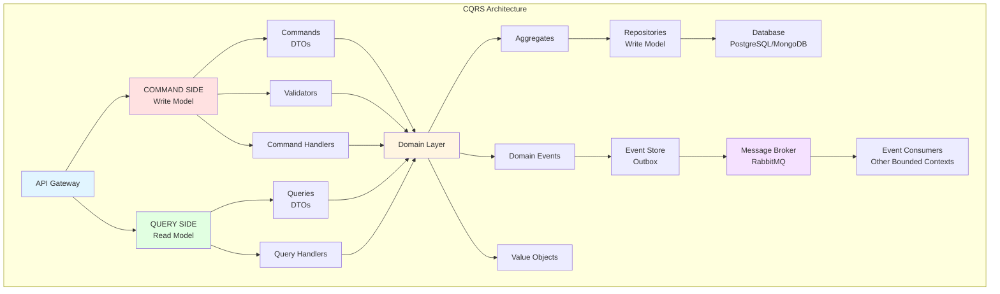
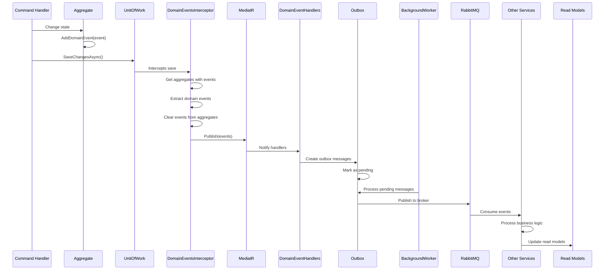
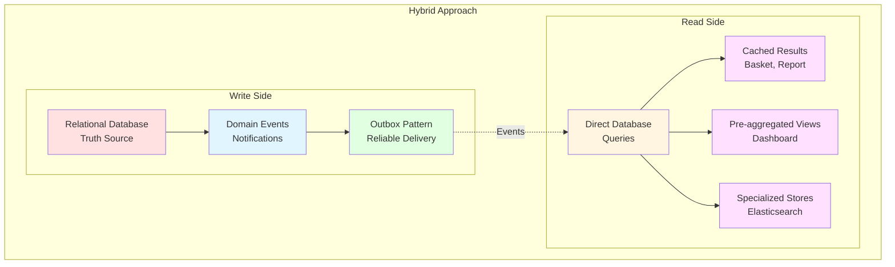
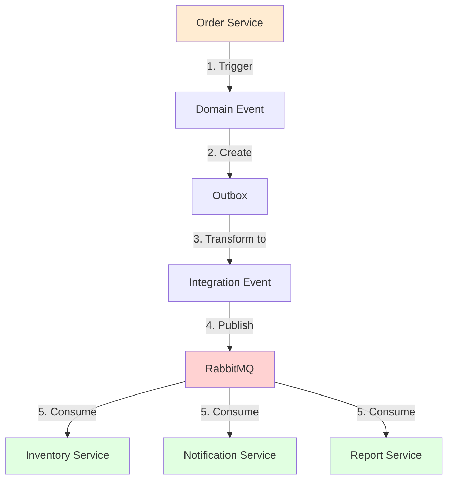
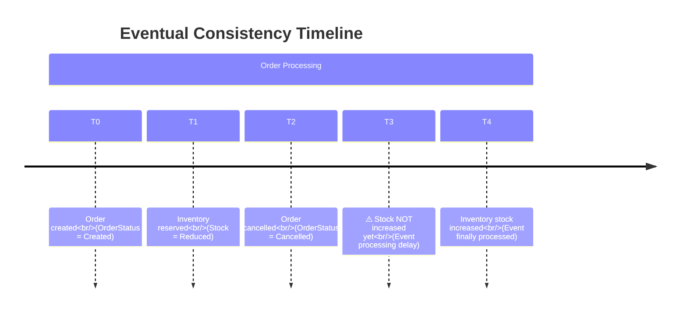

# Phân Tích Chi Tiết Hệ Thống CQRS (Command Query Responsibility Segregation) Trong Dự Án ProgCoder Shop Microservices

---

## 1. Tổng Quan Về CQRS Pattern

### 1.1. CQRS Là Gì?

**CQRS (Command Query Responsibility Segregation)** là một architectural pattern tách biệt trách nhiệm giữa:
- **Command (Write Model)**: Các thao tác thay đổi trạng thái (Create, Update, Delete)
- **Query (Read Model)**: Các thao tác đọc dữ liệu (Read, Search, Filter)

### 1.2. Lý Do Áp Dụng CQRS Trong Dự Án

Dự án **ProgCoder Shop Microservices** là một hệ thống E-commerce lớn với các đặc điểm sau:

```
📊 Yêu Cầu Hệ Thống:
├── Tỷ lệ Read/Write cao (~95:5)
├── Nhiều microservices độc lập
├── Yêu cầu hiệu suất cao cho operations đọc
├── Cần consistency giữa services qua messaging
└── Business logic phức tạp cho domain entities
```

**Tại sao CQRS phù hợp cho dự án này:**

1. **Scalability**: Scale read và write models độc lập
2. **Performance**: Tối ưu read queries với caching, denormalization
3. **Complex Business Logic**: Tách biệt logic validation và business rules
4. **Microservices Architecture**: Mỗi service có bounded context riêng
5. **Event-Driven Architecture**: Domain events thúc đẩy sự đồng bộ giữa services

---

## 2. Sơ Đồ Kiến Trúc Tổng Thể

### 2.1. Luồng Dữ Liệu Giữa Command và Query Side



### 2.2. Kiến Trúc CQRS trong Các Services

```mermaid
graph TB
    subgraph "Services Structure"
        BK[Basket<br/>MongoDB<br/><br/>Commands:<br/>- BasketCheckout<br/>- DeleteBasket<br/>- StoreBasket<br/><br/>Queries:<br/>- GetBasket]
        
        CT[Catalog<br/>PostgreSQL - Marten<br/><br/>Commands:<br/>- CreateBrand<br/>- CreateCategory<br/>- CreateProduct<br/>- UpdateProduct<br/>- DeleteProduct<br/><br/>Queries:<br/>- GetAllBrands<br/>- GetAllCategories<br/>- GetPublishProducts<br/>- GetProductById<br/>- SearchProducts]
        
        DC[Discount<br/>PostgreSQL<br/><br/>Commands:<br/>- ApplyCoupon<br/>- ApproveCoupon<br/>- CreateCoupon<br/>- RejectCoupon<br/><br/>Queries:<br/>- GetCouponById<br/>- GetCouponsApproved<br/>- GetAllCoupons]
        
        INV[Inventory<br/>PostgreSQL<br/><br/>Commands:<br/>- CreateInventoryItem<br/>- ReserveInventory<br/>- UpdateStock<br/>- CancelReservation<br/><br/>Queries:<br/>- GetAllInventoryItems<br/>- GetAllReservations<br/>- GetReservationById]
        
        ORD[Order<br/>PostgreSQL<br/><br/>Commands:<br/>- CreateOrder<br/>- UpdateOrder<br/>- UpdateOrderStatus<br/>- CancelOrder<br/><br/>Queries:<br/>- GetOrderById<br/>- GetMyOrders<br/>- GetAllOrders<br/>- GetOrderDetails]
        
        RPT[Report<br/>MongoDB<br/><br/>Commands:<br/>- UpdateDashboardTotal<br/>- UpdateOrderGrowthLineChart<br/>- UpdateRevenueChart<br/><br/>Queries:<br/>- GetDashboardTotals<br/>- GetOrderGrowthLineChart<br/>- GetRevenueChart]
        
        SRCH[Search<br/>Elasticsearch<br/><br/>Commands:<br/>- DeleteProduct<br/>- UpsertProduct<br/><br/>Queries:<br/>- SearchProduct]
    end
    
    style BK fill:#ffecd2
    style CT fill:#ffecd2
    style DC fill:#ffecd2
    style INV fill:#ffecd2
    style ORD fill:#ffecd2
    style RPT fill:#ffecd2
    style SRCH fill:#ffecd2
```



---

## 3. Phân Tích Chi Tiết Command Side

### 3.1. Cấu Trúc Commands

**Vị trí:** `Services/{ServiceName}.Application/Features/{FeatureName}/Commands/`

**Pattern:**
```csharp
// Command interface (BuildingBlocks/CQRS/ICommand.cs)
public interface ICommand : ICommand<Unit>
{
}

public interface ICommand<out TResponse> : IRequest<TResponse>
{
}

// Example: BasketCheckoutCommand
public sealed record BasketCheckoutCommand(
    string UserId, 
    BasketCheckoutDto Dto
) : ICommand<Guid>;
```

**Ví dụ thực tế từ dự án:**

```csharp
// 1. CreateOrderCommand - Order Service
public sealed record CreateOrderCommand(
    CreateOrUpdateOrderDto Dto, 
    Actor Actor
) : ICommand<Guid>;

// 2. ReserveInventoryCommand - Inventory Service
public sealed record ReserveInventoryCommand(
    CreateReservationDto Dto, 
    Actor Actor
) : ICommand<Guid>;

// 3. CreateProductCommand - Catalog Service
public record CreateProductCommand(
    CreateProductDto Dto, 
    Actor Actor
) : ICommand<Guid>;
```

**Đặc điểm của Commands trong dự án:**
- ✅ Sử dụng `record` type cho immutability
- ✅ Include `Actor` entity cho audit trail
- ✅ Return type có thể là `Unit` (void) hoặc concrete type (`Guid`, `bool`)
- ✅ Validation logic được tách biệt (FluentValidation)

---

### 3.1.1. Tại Sao Phải Dùng Record Cho Command và Query?

#### A. Nature của Command và Query

Command và Query trong CQRS có các đặc điểm sau:
- **Data containers**: Chứa data, không có behavior logic
- **Immutable**: Không thể thay đổi sau khi tạo
- **Simple DTOs**: Đơn giản, chỉ có properties
- **Short-lived**: Chỉ tồn tại trong request lifecycle

Đây chính là thiết kế mục tiêu của `record` trong C# 9+.

#### B. Implicit Immutability

**Với class truyền thống:**
```csharp
public class CreateProductCommand
{
    public CreateProductDto Dto { get; private set; }  // Bắt buộc private set
    public Actor Actor { get; private set; }  // Bắt buộc private set
}
```

**Với record:**
```csharp
public record CreateProductCommand(CreateProductDto Dto, Actor Actor);
```

- Properties tự động là read-only
- Không thể thay đổi sau khi khởi tạo
- Ngăn chặn accidental mutation

#### C. Primary Constructor Syntax

**Với class truyền thống:**
```csharp
public class CreateProductCommand : ICommand<Guid>
{
    private readonly CreateProductDto _dto;
    private readonly Actor _actor;
    
    public CreateProductDto Dto => _dto;
    public Actor Actor => _actor;
    
    public CreateProductCommand(CreateProductDto dto, Actor actor)
    {
        _dto = dto;
        _actor = actor;
    }
}
```

**Với record:**
```csharp
public record CreateProductCommand(CreateProductDto Dto, Actor Actor) : ICommand<Guid>;
```

- 1 dòng vs 13 dòng
- Expressive và declarative
- Less boilerplate

#### D. Value Semantics - Trực Quan Hơn Cho Test

**Với class (reference semantics):**
```csharp
var cmd1 = new CreateProductCommand(dto, actor);
var cmd2 = new CreateProductCommand(dto, actor);

Assert.IsFalse(cmd1 == cmd2);  // ❌ Fail vì reference khác nhau
Assert.IsFalse(cmd1.Equals(cmd2));  // ❌ Fail trừ khi override Equals()
```

**Với record (value semantics):**
```csharp
var cmd1 = new CreateProductCommand(dto, actor);
var cmd2 = new CreateProductCommand(dto, actor);

Assert.IsTrue(cmd1 == cmd2);  // ✅ Pass - so sánh theo giá trị
Assert.IsTrue(cmd1.Equals(cmd2));  // ✅ Pass
```

Record tự động implement `Equals()`, `GetHashCode()`, và `==` operator dựa trên property values.

**Lợi ích cho CQRS:**
- Test assertions dễ hơn:
  ```csharp
  // Verify handler nhận đúng command
  mockHandler.Received(1).Handle(
      Arg.Is<CreateProductCommand>(c => c == expectedCommand)  // ✅ Value comparison
  );
  ```
- Consistent behavior: Command với cùng data luôn "equal"
- Predictable trong test và production

#### E. Pattern Matching Support

Record hỗ trợ pattern matching - hữu ích trong các handler:

```csharp
public async Task<object> Handle(ICommand command, CancellationToken ct)
{
    return command switch
    {
        CreateProductCommand cmd => await HandleCreate(cmd, ct),
        UpdateProductCommand cmd => await HandleUpdate(cmd, ct),
        DeleteProductCommand cmd => await HandleDelete(cmd, ct),
        _ => throw new NotSupportedException()
    };
}
```

#### F. Init-Only Properties & With Expression

Record hỗ trợ `with` expression để tạo variant:

```csharp
var originalCommand = new CreateProductCommand(dto, actor);

// Tạo command với Actor khác (immutable)
var modifiedCommand = originalCommand with { Actor = newActor };
```

Hữu ích cho test scenarios khi cần tweak command data.

#### G. So Sánh: Record vs Class

| Aspect | Record | Class |
|--------|--------|-------|
| Immutability | Built-in | Require manual implementation |
| Equality | Value-based (auto) | Reference-based (manual override needed) |
| Boilerplate | Minimal | High |
| Primary constructor | Supported | Not supported (until C# 12) |
| Pattern matching | Supported | Limited |
| With expression | Supported | Not supported |
| Inheritance | Allowed (single) | Allowed (single) |

#### H. Best Practices Áp Dụng Trong Dự Án

**1. Use `sealed record` cho Query/Command:**
```csharp
public sealed record GetProductByIdQuery(Guid ProductId) : IQuery<GetProductByIdResult>;
```
- `sealed`: Ngăn prevent inheritance (Commands/Queries không nên kế thừa)
- `record`: Tận dụng all benefits

**2. Primary constructor với expressive parameters:**
```csharp
public record CreateProductCommand(CreateProductDto Dto, Actor Actor) : ICommand<Guid>;
```
- Parameters rõ ràng về intent
- Properties tự động được tạo

**3. Result types cũng là record:**
```csharp
public record GetProductByIdResult(ProductDto Product);
```
- Consistent pattern
- Immutability cho response data

#### I. Lợi Ích Cụ Thể Trong Dự Án

1. **Consistency across codebase**
   - Tất cả Command và Query dùng cùng pattern
   - Dễ đọc, dễ hiểu, dễ maintain
   - New developer có thể immediately understand conventions

2. **Work seamlessly với MediatR**
   - MediatR's `IRequest<TResponse>` pattern works perfectly với records
   - Không cần custom implementations

3. **Reduce bug surface area**
   - Immutability ngăn chặn:
     - Handler thay đổi command data (accidental mutation)
     - Concurrent access issues
     - Side effects trong middleware/pipeline behaviors

4. **Better developer experience**
   - Less code to write
   - More expressive syntax
   - Easier testing

---

### 3.2. Command Handlers

**Cấu trúc:**
```csharp
// Command Handler interface (BuildingBlocks/CQRS/ICommandHandler.cs)
public interface ICommandHandler<in TCommand> 
    : ICommandHandler<TCommand, Unit> 
    where TCommand : ICommand<Unit>
{
}

public interface ICommandHandler<in TCommand, TResponse> 
    : IRequestHandler<TCommand, TResponse>
    where TCommand : ICommand<TResponse>
    where TResponse : notnull
{
}
```

**Ví dụ thực tế:**

```csharp
// CreateOrderCommandHandler - Complex business logic
public sealed class CreateOrderCommandHandler(
    IUnitOfWork unitOfWork,
    ICatalogGrpcService catalogGrpc,
    IDiscountGrpcService discountGrpc
) : ICommandHandler<CreateOrderCommand, Guid>
{
    public async Task<Guid> Handle(
        CreateOrderCommand command, 
        CancellationToken cancellationToken)
    {
        // 1. Validate input
        // 2. Fetch product data from Catalog service via gRPC
        // 3. Validate discount via Discount service
        // 4. Create order entity
        // 5. Save to database
        // 6. Domain events automatically published via interceptor
    }
}

// ReserveInventoryCommandHandler - Domain-driven design
public sealed class ReserveInventoryCommandHandler(
    IUnitOfWork unitOfWork
) : ICommandHandler<ReserveInventoryCommand, Guid>
{
    public async Task<Guid> Handle(
        ReserveInventoryCommand command, 
        CancellationToken cancellationToken)
    {
        var inventoryItem = await unitOfWork.InventoryItems
            .GetByIdAsync(command.Dto.ProductId, cancellationToken);
        
        var product = await unitOfWork.Products
            .GetByIdAsync(command.Dto.ProductId, cancellationToken);
        
        var reservation = InventoryReservationEntity.Create(
            productId: command.Dto.ProductId,
            productName: product!.Name,
            quantity: command.Dto.Quantity,
            referenceId: command.Dto.ReferenceId,
            locationId: command.Dto.LocationId,
            expiresAt: DateTime.UtcNow.AddMinutes(15)
        );
        
        await unitOfWork.InventoryReservations
            .AddAsync(reservation, cancellationToken);
        
        await unitOfWork.SaveChangesAsync(cancellationToken);
        
        return reservation.Id;
    }
}
```

### 3.3. Validators (Validation Behavior)

**Sử dụng FluentValidation:**

```csharp
// Example validator pattern (conceptual)
public class CreateOrderCommandValidator 
    : AbstractValidator<CreateOrderCommand>
{
    public CreateOrderCommandValidator()
    {
        RuleFor(x => x.Dto.Customer)
            .NotNull()
            .NotEmpty();
        
        RuleFor(x => x.Dto.Items)
            .NotEmpty()
            .Must(items => items.Count > 0);
        
        RuleForEach(x => x.Dto.Items)
            .ChildRules(item =>
            {
                item.RuleFor(x => x.ProductId)
                    .NotEmpty();
                
                item.RuleFor(x => x.Quantity)
                    .GreaterThan(0);
            });
    }
}
```

**ValidationBehavior trong BuildingBlocks:**
```csharp
public sealed class ValidationBehavior<TRequest, TResponse> 
    : IPipelineBehavior<TRequest, TResponse>
    where TRequest : notnull
{
    private readonly IEnumerable<IValidator<TRequest>> _validators;
    
    public async Task<TResponse> Handle(
        TRequest request, 
        RequestHandlerDelegate<TResponse> next,
        CancellationToken cancellationToken)
    {
        var context = new ValidationContext<TRequest>(request);
        
        var failures = _validators
            .Select(v => v.Validate(context))
            .SelectMany(result => result.Errors)
            .Where(f => f != null)
            .ToList();
        
        if (failures.Count != 0)
            throw new ValidationException(failures);
        
        return await next();
    }
}
```

### 3.4. Xử Lý Business Logic Trong Command Handlers

**Các trách nhiệm chính:**

1. **Validation Input:**
   ```csharp
   var existingBasket = await _basketRepository
       .GetByUserIdAsync(command.UserId, cancellationToken);
   
   if (existingBasket == null)
       throw new NotFoundException("Basket not found");
   ```

2. **External Service Calls (gRPC):**
   ```csharp
   // Fetch product details
   var products = await _catalogGrpcService
       .GetProductsByIdsAsync(productIds, cancellationToken);
   
   // Validate discount
   var discountResult = await _discountGrpcService
       .EvaluateCouponAsync(couponCode, cancellationToken);
   ```

3. **Domain Logic:**
   ```csharp
   // Create and manipulate aggregates
   var order = OrderEntity.Create(
       customer: customer,
       shippingAddress: shippingAddress,
       discount: discount
   );
   
   foreach (var item in orderItems)
   {
       order.AddOrderItem(
           product: item.Product,
           quantity: item.Quantity
       );
   }
   
   order.OrderCreated(); // Triggers domain events
   ```

4. **Persistence:**
   ```csharp
   await _unitOfWork.Orders.AddAsync(order, cancellationToken);
   await _unitOfWork.SaveChangesAsync(cancellationToken);
   ```

**Best Practices áp dụng:**

| Best Practice | Implementation |
|---------------|----------------|
| Immutability | Sử dụng `record` cho DTOs |
| Dependency Injection | Constructor injection với primary constructors |
| Error Handling | Domain exceptions với `DomainException` base class |
| Transaction Management | Unit of Work pattern |
| Audit Trail | `Actor` entity với username/timestamp |

---

## 4. Phân Tích Chi Tiết Query Side

### 4.1. Cấu Trúc Queries

**Vị trí:** `Services/{ServiceName}.Application/Features/{FeatureName}/Queries/`

```csharp
// Query interface (BuildingBlocks/CQRS/IQuery.cs)
public interface IQuery<out TResponse> : IRequest<TResponse>
    where TResponse : notnull
{
}

// Example: GetOrderByIdQuery
public sealed record GetOrderByIdQuery(Guid OrderId) : IQuery<GetOrderByIdResult>;

// Example: GetMyOrdersQuery with filters
public sealed record GetMyOrdersQuery(
    Actor Actor, 
    GetMyOrdersFilter Filter
) : IQuery<GetMyOrdersResult>;

// Example: SearchProductQuery with pagination
public sealed record SearchProductQuery(
    PaginationRequest Paging, 
    string? SearchText = null
) : IQuery<SearchProductResult>;
```

### 4.2. Query Handlers

**Ví dụ thực tế:**

```csharp
// Simple query handler - direct database access
public sealed class GetBasketQueryHandler(
    IBasketRepository repository, 
    IMapper mapper
) : IQueryHandler<GetBasketQuery, GetBasketResult>
{
    public async Task<GetBasketResult> Handle(
        GetBasketQuery query, 
        CancellationToken cancellationToken)
    {
        var basket = await repository
            .GetByUserIdAsync(query.UserId, cancellationToken);
        
        return mapper.Map<GetBasketResult>(basket);
    }
}

// Complex query with joins and filtering
public sealed class GetMyOrdersQueryHandler(
    IUnitOfWork unitOfWork, 
    IMapper mapper
) : IQueryHandler<GetMyOrdersQuery, GetMyOrdersResult>
{
    public async Task<GetMyOrdersResult> Handle(
        GetMyOrdersQuery query, 
        CancellationToken cancellationToken)
    {
        var queryable = unitOfWork.Orders
            .GetQueryable(query.Actor.UserId)
            .WhereIf(query.Filter.Status.HasValue, 
                x => x.Status == query.Filter.Status.Value)
            .WhereIf(query.Filter.FromDate.HasValue, 
                x => x.CreatedOnUtc >= query.Filter.FromDate.Value)
            .OrderByDescending(x => x.CreatedOnUtc);
        
        var totalItems = await queryable.CountAsync(cancellationToken);
        var orders = await queryable
            .WithPaging(query.Paging)
            .AsNoTracking()
            .ToListAsync(cancellationToken);
        
        return new GetMyOrdersResult
        {
            Items = mapper.Map<List<OrderDto>>(orders),
            TotalItems = totalItems,
            PageSize = query.Paging.PageSize,
            CurrentPage = query.Paging.PageNumber
        };
    }
}

// Query with external data enrichment
public sealed class GetBasketQueryHandler(
    IBasketRepository repository,
    ICatalogGrpcService catalogGrpc,
    IDiscountGrpcService discountGrpc,
    IMapper mapper
) : IQueryHandler<GetBasketQuery, GetBasketResult>
{
    public async Task<GetBasketResult> Handle(
        GetBasketQuery query, 
        CancellationToken cancellationToken)
    {
        var basket = await repository
            .GetByUserIdAsync(query.UserId, cancellationToken);
        
        if (basket == null)
            return new GetBasketResult { Items = new List<ShoppingCartItemDto>() };
        
        // Enrich with product data from gRPC
        var productIds = basket.Items.Select(x => x.ProductId).ToList();
        var products = await catalogGrpc.GetProductsByIdsAsync(productIds);
        
        var result = mapper.Map<GetBasketResult>(basket);
        
        // Map product details
        foreach (var item in result.Items)
        {
            var product = products.FirstOrDefault(p => p.Id == item.ProductId);
            if (product != null)
            {
                item.ProductName = product.Name;
                item.ProductSku = product.Sku;
                item.ProductPrice = product.Price;
                item.ProductImage = product.ImageUrl;
            }
        }
        
        return result;
    }
}
```

### 4.3. Chiến Lược Tối Ưu Ho Đọc Dữ Liệu

#### 4.3.1. Caching Strategy

**Dùng cho Basket service:**

```csharp
public sealed class CachedBasketRepository : IBasketRepository
{
    private readonly IBasketRepository _decorated;
    private readonly IMemoryCache _cache;
    private readonly TimeSpan _cacheDuration = TimeSpan.FromMinutes(5);
    
    public async Task<ShoppingCartEntity?> GetByUserIdAsync(
        string userId, 
        CancellationToken cancellationToken = default)
    {
        string cacheKey = $"basket:{userId}";
        
        if (_cache.TryGetValue(cacheKey, out ShoppingCartEntity? cached))
            return cached;
        
        var basket = await _decorated.GetByUserIdAsync(userId, cancellationToken);
        
        if (basket != null)
            _cache.Set(cacheKey, basket, _cacheDuration);
        
        return basket;
    }
    
    public async Task<bool> AddAsync(
        ShoppingCartEntity entity, 
        CancellationToken cancellationToken = default)
    {
        var result = await _decorated.AddAsync(entity, cancellationToken);
        
        if (result)
            _cache.Remove($"basket:{entity.UserId}");
        
        return result;
    }
}
```

#### 4.3.2. Database Optimization

**AsNoTracking cho read-only queries:**
```csharp
var orders = await _unitOfWork.Orders
    .GetQueryable(userId)
    .AsNoTracking()  // Important for performance!
    .ToListAsync(cancellationToken);
```

**Projection queries (Select only needed columns):**
```csharp
var orderSummaries = await _context.Orders
    .Where(x => x.CustomerId == customerId)
    .Select(x => new OrderSummaryDto
    {
        Id = x.Id,
        OrderNo = x.OrderNo,
        Status = x.Status,
        Total = x.Total,
        CreatedOn = x.CreatedOnUtc
    })
    .ToListAsync(cancellationToken);
```

**Compiled queries for frequently executed queries:**
```csharp
private static readonly Func<ApplicationDbContext, Guid, OrderEntity?> CompiledGetById =
    EF.CompileQuery((ApplicationDbContext context, Guid id) =>
        context.Orders.FirstOrDefaultAsync(o => o.Id == id));
```

#### 4.3.3. Pagination Support

```csharp
// BuildingBlocks/Pagination/PaginatedResult.cs
public class PaginatedResult<T>
{
    public List<T> Items { get; init; } = new();
    public int TotalItems { get; init; }
    public int PageSize { get; init; }
    public int CurrentPage { get; init; }
    public int TotalPages => (int)Math.Ceiling(TotalItems / (double)PageSize);
}

// Extension methods
public static class PagingExtensions
{
    public static IQueryable<T> WithPaging<T>(
        this IQueryable<T> query, 
        PaginationRequest paging)
    {
        return query
            .Skip((paging.PageNumber - 1) * paging.PageSize)
            .Take(paging.PageSize);
    }
}
```

#### 4.3.4. Denormalization for Read Models

**Denormalization là gì?**

Denormalization là kỹ thuật lưu trữ dữ liệu dưới dạng **đã được tính toán trước (pre-aggregated)** và **được tối ưu hóa cho việc đọc**, thay vì lưu trữ dữ liệu ở dạng normalized (chuẩn hóa). Trong kiến trúc CQRS, Read Models được denormalize để phục vụ các truy vấn đọc nhanh chóng mà không cần JOIN hay aggregation phức tạp.

**Cơ chế hoạt động:**

```
┌────────────────────────────────────────────────────────────┐
│                      CQRS Architecture                      │
├────────────────────────────────────────────────────────────┤
│                                                             │
│   COMMAND SIDE                    QUERY SIDE               │
│   (Write Model)                   (Read Model)             │
│                                                             │
│   ┌─────────────┐                ┌─────────────────────┐   │
│   │   Orders    │                │  DashboardTotal     │   │
│   │   (Normalized)│              │  (Denormalized)     │   │
│   │             │                │                     │   │
│   │ - OrderId   │    Events      │ - Title             │   │
│   │ - CustomerId│───────────────>│ - Count (pre-calc)  │   │
│   │ - Status    │                │ - Bg/Text/Icon      │   │
│   │ - Total     │                │   (UI-ready)        │   │
│   └─────────────┘                └─────────────────────┘   │
│                                                             │
│   Single Source of Truth       Optimized for Reading       │
│                                                             │
└────────────────────────────────────────────────────────────┘
```

**Luồng đồng bộ dữ liệu:**

1. **Write Side**: Dữ liệu được lưu ở dạng normalized (PostgreSQL) - đây là "Single Source of Truth"
2. **Domain Events**: Khi aggregate thay đổi state, domain event được phát ra (OrderCreatedDomainEvent, ProductCreatedDomainEvent, v.v.)
3. **Outbox Pattern**: Events được lưu vào Outbox table trong cùng transaction để đảm bảo reliability
4. **Message Broker**: Background worker gửi events đến RabbitMQ
5. **Read Side**: Consumers nhận events và cập nhật Read Models đã được denormalize (MongoDB)

**Ví dụ thực tế - Report Service:**

```csharp
// Entity lưu trữ dữ liệu đã được tính toán sẵn cho UI
public sealed class DashboardTotalEntity : Entity<Guid>
{
    public string? Bg { get; set; }        // CSS class: "bg-blue-500"
    public string? Text { get; set; }      // CSS class: "text-white"
    public string? Icon { get; set; }      // Icon name: "ShoppingCartIcon"
    public string? Title { get; set; }     // "Total Orders"
    public string? Count { get; set; }     // "1,234" (đã format sẵn)
}

// Query đơn giản - chỉ là SELECT, không cần JOIN hay aggregation
public sealed class GetDashboardTotalsQueryHandler(
    IDashboardTotalRepository repository
) : IQueryHandler<GetDashboardTotalsQuery, DashboardTotalsResult>
{
    public async Task<DashboardTotalsResult> Handle(
        GetDashboardTotalsQuery query, 
        CancellationToken cancellationToken)
    {
        var result = await repository.GetAllAsync(cancellationToken);
        return new DashboardTotalsResult(result);
    }
}
```

**So sánh Normalized vs Denormalized:**

| Tiêu chí | Normalized | Denormalized |
|----------|------------|--------------|
| Query Complexity | Cao (JOINs, Aggregations) | Thấp (Simple SELECT) |
| Query Performance | Chậm với data lớn | Nhanh (pre-calculated) |
| Consistency | Strong | Eventual (~100-200ms delay) |
| Storage | Ít hơn | Nhiều hơn (data duplication) |
| Use Case | OLTP | OLAP, Dashboard, Reporting |

**Advantages:**
- ⚡ Fast reads (no joins or aggregations) - query từ ~500ms xuống ~5ms
- 🎯 Optimized for specific UI views - dữ liệu đã được format sẵn cho frontend
- 📊 Real-time dashboard updates - eventual consistency
- 🔄 Giảm tải cho database chính - read queries được chuyển sang MongoDB

**Trade-offs:**
- Eventual consistency - có độ trễ nhỏ khi đồng bộ dữ liệu
- Data duplication - dữ liệu được lưu ở nhiều nơi
- Complexity tăng - cần thêm infrastructure (message broker, outbox, consumers)

---

## 5. Cơ Chế Đồng Bộ Dữ Liệu Giữa Write và Read Models

### 5.1. Domain Events

**IDomainEvent interface:**
```csharp
// Location: {Service}.Domain/Abstractions/IDomainEvent.cs
using MediatR;

namespace {Service}.Domain.Abstractions;

public interface IDomainEvent : INotification
{
}
```

**Ví dụ Domain Events:**

```csharp
// Order service events
public sealed record OrderCreatedDomainEvent(OrderEntity Order) : IDomainEvent;
public sealed record OrderCancelledDomainEvent(OrderEntity Order) : IDomainEvent;
public sealed record OrderDeliveredDomainEvent(OrderEntity Order) : IDomainEvent;

// Inventory service events
public sealed record StockChangedDomainEvent(
    Guid InventoryItemId,
    Guid ProductId,
    string ProductName,
    int QuantityAfterChange,
    InventoryChangeType ChangeType,
    string Source,
    int Available
) : IDomainEvent;

public sealed record ReservationExpiredDomainEvent(
    Guid ReservationId,
    Guid ProductId,
    string ProductName,
    Guid ReferenceId,
    Guid LocationId,
    int Quantity
) : IDomainEvent;
```

### 5.2. Domain Events trong Aggregates

```csharp
// Aggregate base class with domain events
public abstract class Aggregate<TId> : Entity<TId>, IAggregate
{
    private readonly List<IDomainEvent> _domainEvents = new();
    
    public IReadOnlyList<IDomainEvent> DomainEvents => _domainEvents.AsReadOnly();
    
    public void AddDomainEvent(IDomainEvent domainEvent)
    {
        _domainEvents.Add(domainEvent);
    }
    
    public IDomainEvent[] ClearDomainEvents()
    {
        IDomainEvent[] dequeuedEvents = _domainEvents.ToArray();
        _domainEvents.Clear();
        return dequeuedEvents;
    }
}
```

**Trigger events trong domain methods:**
```csharp
public sealed class OrderEntity : Aggregate<Guid>
{
    public void OrderCreated()
    {
        Status = OrderStatus.Created;
        LastModifiedBy = "system";
        LastModifiedOnUtc = DateTimeOffset.UtcNow;
        
        AddDomainEvent(new OrderCreatedDomainEvent(this));
    }
    
    public void OrderDelivered(string performedBy)
    {
        if (Status != OrderStatus.Shipped)
            throw new DomainException("Order must be shipped before delivery");
        
        Status = OrderStatus.Delivered;
        LastModifiedBy = performedBy;
        LastModifiedOnUtc = DateTimeOffset.UtcNow;
        
        AddDomainEvent(new OrderDeliveredDomainEvent(this));
    }
}
```

### 5.3. DispatchDomainEventsInterceptor

**Location:** `{Service}.Infrastructure/Data/Interceptors/DispatchDomainEventsInterceptor.cs`

```csharp
public class DispatchDomainEventsInterceptor(IMediator mediator) 
    : SaveChangesInterceptor
{
    public override InterceptionResult<int> SavingChanges(
        DbContextEventData eventData, 
        InterceptionResult<int> result)
    {
        DispatchDomainEvents(eventData.Context).GetAwaiter().GetResult();
        return base.SavingChanges(eventData, result);
    }
    
    public override async ValueTask<InterceptionResult<int>> SavingChangesAsync(
        DbContextEventData eventData, 
        InterceptionResult<int> result, 
        CancellationToken cancellationToken = default)
    {
        await DispatchDomainEvents(eventData.Context);
        return await base.SavingChangesAsync(eventData, result, cancellationToken);
    }
    
    public async Task DispatchDomainEvents(DbContext? context)
    {
        if (context == null) return;
        
        // Get all aggregates with pending domain events
        var aggregates = context.ChangeTracker
            .Entries<IAggregate>()
            .Where(a => a.Entity.DomainEvents.Any())
            .Select(a => a.Entity);
        
        // Extract domain events
        var domainEvents = aggregates
            .SelectMany(a => a.DomainEvents)
            .ToList();
        
        // Clear events from aggregates
        aggregates.ToList().ForEach(a => a.ClearDomainEvents());
        
        // Publish all domain events via MediatR
        foreach (var domainEvent in domainEvents)
        {
            await mediator.Publish(domainEvent);
        }
    }
}
```

**Quy trình xử lý:**


### 5.4. Outbox Pattern

**Outbox Message Entity:**
```csharp
public sealed class OutboxMessageEntity : EntityId<Guid>
{
    public string EventType { get; private set; } = null!;
    public string Content { get; private set; } = null!;
    public DateTimeOffset OccurredOnUtc { get; private set; }
    
    public DateTimeOffset? ProcessedOnUtc { get; private set; }
    public DateTimeOffset? ClaimedOnUtc { get; private set; }
    
    public string? LastErrorMessage { get; private set; }
    public int AttemptCount { get; private set; }
    public DateTimeOffset? NextAttemptOnUtc { get; private set; }
    
    public const int MaxAttempts = 5;
    
    public static OutboxMessageEntity Create(
        Guid id, 
        string eventType, 
        string content, 
        DateTimeOffset occurredOnUtc)
    {
        return new OutboxMessageEntity()
        {
            Id = id,
            EventType = eventType,
            Content = content,
            OccurredOnUtc = occurredOnUtc,
            AttemptCount = 0
        };
    }
    
    public bool IsPermanentlyFailed() => AttemptCount >= MaxAttempts;
}
```

**Domain Event Handler creates Outbox messages:**
```csharp
public sealed class OrderCreatedDomainEventHandler(
    IUnitOfWork unitOfWork,
    ILogger<OrderCreatedDomainEventHandler> logger
) : INotificationHandler<OrderCreatedDomainEvent>
{
    public async Task Handle(
        OrderCreatedDomainEvent @event, 
        CancellationToken cancellationToken)
    {
        logger.LogInformation("Domain Event handled: {DomainEvent}", @event.GetType().Name);
        
        await PushToOutboxAsync(@event, cancellationToken);
    }
    
    private async Task PushToOutboxAsync(
        OrderCreatedDomainEvent @event, 
        CancellationToken cancellationToken)
    {
        var message = new OrderCreatedIntegrationEvent
        {
            OrderId = @event.Order.Id,
            OrderNo = @event.Order.OrderNo,
            CustomerEmail = @event.Order.Customer.Email,
            Total = @event.Order.Total,
            // ... other properties
        };
        
        var outboxMessage = OutboxMessageEntity.Create(
            id: Guid.NewGuid(),
            eventType: message.EventType!,
            content: JsonConvert.SerializeObject(message),
            occurredOnUtc: DateTimeOffset.UtcNow
        );
        
        await unitOfWork.OutboxMessages.AddAsync(outboxMessage, cancellationToken);
    }
}
```

### 5.5. Inbox Pattern (Idempotency)

#### Tại sao Inbox Pattern = Idempotency?

**Idempotency (Tính lũy đẳng)** là tính chất của một thao tác mà dù thực hiện **1 lần** hay **nhiều lần**, kết quả cuối cùng vẫn **giống nhau**.

```
f(x) = f(f(x)) = f(f(f(x)))
```

#### Vấn đề trong Distributed Systems

Trong hệ thống phân tán với Message Brokers (RabbitMQ, Kafka...), messages có thể bị **duplicate** (trùng lặp) do:

1. **Network retries** - Gửi lại khi timeout
2. **At-least-once delivery** - Message broker đảm bảo giao ít nhất 1 lần
3. **Consumer failures** - Consumer xử lý thành công nhưng không ack kịp thờ
4. **Publisher retries** - Publisher gửi lại khi không nhận được confirmation

#### Inbox Pattern giải quyết như thế nào?

```
┌─────────────────────────────────────────────────────────────┐
│           WITHOUT INBOX (Non-Idempotent)                    │
├─────────────────────────────────────────────────────────────┤
│                                                             │
│   Message 1 (OrderCreated)                                  │
│        │                                                    │
│        ▼                                                    │
│   Process: Create Order ──► Database                        │
│        │                                                    │
│        ├── Duplicate ──► Create Order ──► Database          │
│        │                                                    │
│        └── Duplicate ──► Create Order ──► Database          │
│                                                             │
│   ❌ RESULT: 3 Orders created!                              │
│                                                             │
└─────────────────────────────────────────────────────────────┘

┌─────────────────────────────────────────────────────────────┐
│           WITH INBOX (Idempotent)                           │
├─────────────────────────────────────────────────────────────┤
│                                                             │
│   Message 1 (OrderCreated)                                  │
│        │                                                    │
│        ▼                                                    │
│   Check Inbox Table ──► Not exists?                         │
│        │                                                    │
│        ▼                                                    │
│   Process: Create Order ──► Database                        │
│        │                                                    │
│        └── Save MessageId to Inbox                          │
│                                                             │
│   Duplicate ──► Check Inbox ──► Exists? ──► SKIP            │
│                                                             │
│   ✅ RESULT: 1 Order only!                                  │
│                                                             │
└─────────────────────────────────────────────────────────────┘
```

#### Cơ chế hoạt động

| Bước | Thao tác | Mục đích |
|------|----------|----------|
| 1 | Extract `MessageId` | Định danh unique cho mỗi message |
| 2 | Check Inbox Table | Kiểm tra message đã xử lý chưa |
| 3 | If exists → Skip | **Idempotency**: Không xử lý lại |
| 4 | If not exists → Process | Xử lý business logic |
| 5 | Save to Inbox (cùng transaction) | Đánh dấu đã xử lý |

**Inbox Message Entity:**
```csharp
public sealed class InboxMessageEntity : EntityId<Guid>
{
    public string EventType { get; private set; } = null!;
    public string Content { get; private set; } = null!;
    public DateTimeOffset ReceivedOnUtc { get; private set; }
    
    public static InboxMessageEntity Create(
        Guid id, 
        string eventType, 
        string content, 
        DateTimeOffset receivedOnUtc)
    {
        return new InboxMessageEntity()
        {
            Id = id,
            EventType = eventType,
            Content = content,
            ReceivedOnUtc = receivedOnUtc
        };
    }
}
```

**Integration Event Consumer with Inbox:**
```csharp
public sealed class OrderCreatedIntegrationEventHandler(
    IUnitOfWork unitOfWork,
    ILogger<OrderCreatedIntegrationEventHandler> logger
) : IConsumer<OrderCreatedIntegrationEvent>
{
    public async Task Consume(
        ConsumeContext<OrderCreatedIntegrationEvent> context)
    {
        var messageId = context.MessageId ?? Guid.NewGuid();
        
        // Check if message already exists in inbox (idempotency)
        var existingMessage = await unitOfWork.InboxMessages
            .GetByMessageIdAsync(messageId, context.CancellationToken);
        
        if (existingMessage != null)
        {
            logger.LogInformation("Message already processed, skipping");
            return;
        }
        
        // Create inbox record
        var inboxMessage = InboxMessageEntity.Create(
            messageId,
            context.Message.GetType().AssemblyQualifiedName!,
            JsonSerializer.Serialize(context.Message),
            DateTimeOffset.UtcNow
        );
        
        await unitOfWork.InboxMessages.AddAsync(inboxMessage, context.CancellationToken);
        await unitOfWork.SaveChangesAsync(context.CancellationToken);
        
        // Process the event
        logger.LogInformation("Processing integration event {EventType}", context.Message.EventType);
        
        // Update inventory
        // Update notifications
        // etc.
    }
}
```

### 5.6. So Sánh Outbox Table và Inbox Table

Trong kiến trúc này sẽ có **2 tables riêng biệt** trong database:

#### Outbox Table vs Inbox Table

```
┌─────────────────────────────────────────────────────────────────────┐
│                         ORDER SERVICE                               │
│                    (Publisher - Outbox Table)                       │
├─────────────────────────────────────────────────────────────────────┤
│                                                                     │
│   1. Create Order ──► 2. Save OrderEntity                           │
│                           3. Save OutboxMessage                     │
│                                (cùng transaction)                   │
│                                                                     │
│   ┌─────────────────────────────────────────┐                       │
│   │  Outbox Table                           │                       │
│   │  ├─ Id: Guid                            │                       │
│   │  ├─ EventType: "OrderCreated"           │                       │
│   │  ├─ Content: {JSON}                     │                       │
│   │  ├─ OccurredOnUtc: 2024-01-01           │                       │
│   │  ├─ ProcessedOnUtc: null (pending)      │                       │
│   │  └─ AttemptCount: 0                     │                       │
│   └─────────────────────────────────────────┘                       │
│                                                                     │
│   4. Background Worker ──► 5. Publish to RabbitMQ                   │
│                                                                     │
└─────────────────────────────────────────────────────────────────────┘
                              │
                              ▼
┌─────────────────────────────────────────────────────────────────────┐
│                         RABBITMQ                                    │
├─────────────────────────────────────────────────────────────────────┤
│                                                                     │
│   Exchange: order.events                                            │
│   Queue: inventory.order-created                                    │
│                                                                     │
└─────────────────────────────────────────────────────────────────────┘
                              │
                              ▼
┌─────────────────────────────────────────────────────────────────────┐
│                      INVENTORY SERVICE                              │
│                    (Consumer - Inbox Table)                         │
├─────────────────────────────────────────────────────────────────────┤
│                                                                     │
│   6. Receive Message ──► 7. Check Inbox Table                       │
│                              (Idempotency check)                    │
│                                                                     │
│   ┌─────────────────────────────────────────┐                       │
│   │  Inbox Table                            │                       │
│   │  ├─ Id: Guid (MessageId)                │                       │
│   │  ├─ EventType: "OrderCreated"           │                       │
│   │  ├─ Content: {JSON}                     │                       │
│   │  └─ ReceivedOnUtc: 2024-01-01           │                       │
│   └─────────────────────────────────────────┘                       │
│                                                                     │
│   8. If not exists:                                                   │
│      - Save to Inbox                                                │
│      - Process: Reserve Inventory                                   │
│      - Save Business Data                                           │
│      (cùng transaction)                                             │
│                                                                     │
│   9. If exists: SKIP (Idempotent)                                   │
│                                                                     │
└─────────────────────────────────────────────────────────────────────┘
```

#### So sánh chi tiết

| Đặc điểm | **Outbox Table** | **Inbox Table** |
|----------|------------------|-----------------|
| **Vị trí** | Service gửi message (Publisher) | Service nhận message (Consumer) |
| **Mục đích** | Đảm bảo message được gửi đi (Reliable Delivery) | Đảm bảo message chỉ xử lý 1 lần (Idempotency) |
| **Trạng thái** | Pending, Processing, Processed, Failed | Chỉ lưu message đã xử lý |
| **Retry** | Có (MaxAttempts = 5) | Không |
| **Fields đặc biệt** | AttemptCount, LastErrorMessage, NextAttemptOnUtc | Chỉ cần ReceivedOnUtc |
| **Xóa dữ liệu** | Có thể xóa sau khi processed | Giữ lại để kiểm tra duplicate |

#### Tóm tắt

- **Outbox**: Ở service **gửi** - đảm bảo message không bị mất (at-least-once delivery)
- **Inbox**: Ở service **nhận** - đảm bảo message không bị xử lý 2 lần (idempotency)

Cả 2 tables đều quan trọng để đảm bảo **data consistency** trong hệ thống phân tán!

---

## 6. Các Thành Phần Hỗ Trợ: MediatR, Event Sourcing, Integration

### 6.1. MediatR Integration

**Cấu hình MediatR:**
```csharp
// Dependency injection
services.AddMediatR(cfg =>
{
    cfg.RegisterServicesFromAssembly(Assembly.GetExecutingAssembly());
    
    // Add pipelines
    cfg.AddOpenBehavior(typeof(ValidationBehavior<,>));
    cfg.AddOpenBehavior(typeof(LoggingBehavior<,>));
});

// In Command/Query handlers
public sealed class CreateOrderCommandHandler(
    IUnitOfWork unitOfWork,
    ICatalogGrpcService catalogGrpc,
    IDiscountGrpcService discountGrpc
) : ICommandHandler<CreateOrderCommand, Guid>
{
    public async Task<Guid> Handle(
        CreateOrderCommand command, 
        CancellationToken cancellationToken)
    {
        // ... handler logic
    }
}
```

**Sử dụng ISender vs IMediator:**

| Interface | Use Case |
|----------|----------|
| `ISender` | Send commands/queries (no handlers can publish events) |
| `IMediator` | Publish events to multiple handlers |

```csharp
// In API endpoints - use ISender for commands
public sealed class CreateOrder
{
    public static async Task<ApiCreatedResponse<Guid>> HandleCreateOrderAsync(
        ISender sender,
        [FromBody] CreateOrUpdateOrderDto dto)
    {
        var command = new CreateOrderCommand(dto, actor);
        var orderId = await sender.Send(command);
        return new ApiCreatedResponse<Guid>(orderId);
    }
}

// In Command handlers - use IMediator to publish domain events
public sealed class UpdateStockCommandHandler(
    IUnitOfWork unitOfWork, 
    IMediator mediator
) : ICommandHandler<UpdateStockCommand, Guid>
{
    public async Task<Guid> Handle(
        UpdateStockCommand command, 
        CancellationToken cancellationToken)
    {
        // ... update stock logic
        
        // Publish domain events
        await mediator.Publish(new StockChangedDomainEvent(...));
        
        return entity.Id;
    }
}
```

### 6.2. Event Sourcing (Partial Implementation)

**Dự án hiện tại không sử dụng Event Sourcing đầy đủ**, nhưng có các thành phần tương tự:

1. **Domain Events**: ✅ Được implement đầy đủ
2. **Event Store**: ❌ Không có (sử dụng database relation chính làm truth)
3. **Event Replay**: ❌ Không hỗ trợ
4. **Snapshots**: ❌ Không cần vì không có event sourcing

**Lý do chọn approach hiện tại:**
- ✅ Simplicity: Database relation dễ debug hơn event store
- ✅ Performance: Queries đơn giản, không cần replay events
- ✅ Tooling: EF Core với strong typing
- ❌ Trade-off: Không có audit trail đầy đủ của các thay đổi

**Hybrid approach (Applied):**


### 6.3. Integration Events

**Integration Events vs Domain Events:**

| Feature | Domain Events | Integration Events |
|---------|--------------|-------------------|
| Scope | Bounded context | Cross-bounded contexts |
| Ownership | Domain | Consumer contract |
| Format | POCO types | POCO types |
| Transport | In-memory (MediatR) | Message broker (RabbitMQ) |

**Example flow:**


---

## 7. Đánh Giá Ưu Điểm, Nhược Điểm và Trade-offs

### 7.1. Ưu Điểm (Pros)

| Ưu điểm | Minh họa trong dự án |
|---------|-------------------|
| **Scalability** | Scale read/write models independently (Basket cache, Report denormalized) |
| **Performance** | Optimized queries with AsNoTracking, caching, projections |
| **Separation of Concerns** | Commands for writes, Queries for reads - clear boundaries |
| **Domain Model Integrity** | Aggregates protect invariants, rich business logic |
| **Event-Driven** | Domain events enable loose coupling between services |
| **Testability** | Commands/queries are easily testable in isolation |
| **Maintainability** | Clear structure: `Features/{Feature}/Commands|Queries` |

**Concrete examples:**

1. **Performance - Query optimization:**
```csharp
// Before (N+1 query problem)
var orders = await _context.Orders.ToListAsync();
foreach (var order in orders)
{
    order.Customer = await _context.Customers.FindAsync(order.CustomerId);
}

// After (optimized with projection and eager loading)
var orders = await _context.Orders
    .Include(x => x.Customer)
    .Include(x => x.Items)
    .Select(x => new OrderDto { /* projection */ })
    .ToListAsync();
```

2. **Domain Model - Business rules:**
```csharp
// Business rule enforced in aggregate
public void Reserve(int amount, Guid reservationId, string performedBy)
{
    if (Available < amount)
        throw new DomainException("Insufficient stock");
    
    // Business logic encapsulated
    Available -= amount;
    AddDomainEvent(new StockChangedDomainEvent(...));
}
```

### 7.2. Nhược Điểm (Cons)

| Nhược điểm | Minh họa trong dự án |
|------------|-------------------|
| **Complexity** | More layers, more code to maintain |
| **Learning Curve** | Team must understand CQRS, DDD, patterns |
| **Consistency** | Eventual consistency (not ACIDic) |
| **Data Duplication** | Read models can be denormalized |
| **Testing** | More integration tests needed |
| **Debugging** | Harder to trace data flow through events |

**Concrete examples:**

1. **Complexity - More code:**
```
Before CRUD:
- Controller: ~50 lines
- Service: ~100 lines
Total: ~150 lines

After CQRS:
- Commands: 3 files × ~50 lines = 150 lines
- Handlers: 3 files × ~100 lines = 300 lines
- Queries: 5 files × ~30 lines = 150 lines
- Handlers: 5 files × ~50 lines = 250 lines
- Validators: 3 files × 30 lines = 90 lines
Total: ~940 lines (6x more!)
```

2. **Eventual Consistency - Data out of sync:**


### 7.3. Trade-offs và Khi Nên Sử Dụng CQRS

| Trade-off | Decision trong dự án |
|-----------|---------------------|
| **Complexity vs Scalability** | Accept complexity for scalability of e-commerce platform |
| **ACID vs BASE** | Use BASE (eventual consistency) for cross-service operations |
| **Simplicity vs Flexibility** | Add flexibility (extensibility) with reasonable complexity |
| **Performance vs Consistency** | Prioritize performance (caching) for read-heavy operations |

**Khi nên dùng CQRS:**
- ✅ High read/write ratios (> 70:30)
- ✅ Complex business logic
- ✅ Need different data models for read/write
- ✅ Distributed architecture with multiple services
- ✅ Requirements for independent scaling

**Khi KHÔNG nên dùng:**
- ❌ Simple CRUD applications
- ❌ Small team with limited DDD experience
- ❌ Low traffic, monolith application
- ❌ Requirements for strong consistency

---

## 8. Ví Dụ Code Cụ Thể

### 8.1. Example 1: Complete Command Flow

```csharp
// 1. Command definition
public sealed record CreateOrderCommand(
    CreateOrUpdateOrderDto Dto, 
    Actor Actor
) : ICommand<Guid>;

// 2. Command handler
public sealed class CreateOrderCommandHandler(
    IUnitOfWork unitOfWork,
    ICatalogGrpcService catalogGrpc,
    IDiscountGrpcService discountGrpc
) : ICommandHandler<CreateOrderCommand, Guid>
{
    public async Task<Guid> Handle(
        CreateOrderCommand command, 
        CancellationToken cancellationToken)
    {
        // Step 1: Validate customer
        var customerDto = command.Dto.Customer;
        if (string.IsNullOrEmpty(customerDto.Email))
            throw new ValidationException("Customer email is required");
        
        // Step 2: Get product data from Catalog service
        var productIds = command.Dto.Items.Select(x => x.ProductId).ToList();
        var products = await catalogGrpc
            .GetProductsByIdsAsync(productIds, cancellationToken);
        
        // Step 3: Validate products exist
        var missingProducts = productIds.Except(products.Select(p => p.Id));
        if (missingProducts.Any())
            throw new NotFoundException($"Products not found: {string.Join(", ", missingProducts)}");
        
        // Step 4: Validate discount
        Discount? discount = null;
        if (!string.IsNullOrEmpty(command.Dto.CouponCode))
        {
            var discountResult = await discountGrpc
                .EvaluateCouponAsync(command.Dto.CouponCode, cancellationToken);
            
            if (!discountResult.IsValid)
                throw new ValidationException("Invalid coupon code");
            
            discount = new Discount(
                command.Dto.CouponCode,
                discountResult.DiscountAmount
            );
        }
        
        // Step 5: Create customer value object
        var customer = new Customer(
            id: Guid.NewGuid(),
            name: customerDto.Name,
            email: customerDto.Email,
            phoneNumber: customerDto.PhoneNumber
        );
        
        // Step 6: Create address value object
        var shippingAddress = new Address(
            addressLine: command.Dto.ShippingAddress.AddressLine,
            subdivision: command.Dto.ShippingAddress.Subdivision,
            city: command.Dto.ShippingAddress.City,
            stateOrProvince: command.Dto.ShippingAddress.StateOrProvince,
            country: command.Dto.ShippingAddress.Country,
            postalCode: command.Dto.ShippingAddress.PostalCode
        );
        
        // Step 7: Create order entity
        var order = OrderEntity.Create(
            customer: customer,
            shippingAddress: shippingAddress,
            discount: discount
        );
        
        // Step 8: Add order items
        foreach (var itemDto in command.Dto.Items)
        {
            var product = products.First(p => p.Id == itemDto.ProductId);
            
            var productVO = new Product(
                id: product.Id,
                sku: product.Sku,
                name: product.Name
            );
            
            order.AddOrderItem(
                product: productVO,
                quantity: itemDto.Quantity,
                unitPrice: product.Price
            );
        }
        
        // Step 9: Save to database (domain events auto-published)
        await unitOfWork.Orders.AddAsync(order, cancellationToken);
        await unitOfWork.SaveChangesAsync(cancellationToken);
        
        // Step 10: Return order ID
        return order.Id;
    }
}

// 3. Domain event
public sealed record OrderCreatedDomainEvent(OrderEntity Order) : IDomainEvent;

// 4. Domain event handler (creates outbox message)
public sealed class OrderCreatedDomainEventHandler(
    IUnitOfWork unitOfWork,
    ILogger<OrderCreatedDomainEventHandler> logger
) : INotificationHandler<OrderCreatedDomainEvent>
{
    public async Task Handle(
        OrderCreatedDomainEvent @event, 
        CancellationToken cancellationToken)
    {
        logger.LogInformation("Domain Event handled: OrderCreated for OrderId: {OrderId}", @event.Order.Id);
        
        await PushToOutboxAsync(@event, cancellationToken);
    }
    
    private async Task PushToOutboxAsync(
        OrderCreatedDomainEvent @event, 
        CancellationToken cancellationToken)
    {
        var message = new OrderCreatedIntegrationEvent
        {
            OrderId = @event.Order.Id,
            OrderNo = @event.Order.OrderNo,
            CustomerEmail = @event.Order.Customer.Email,
            ShippingAddress = new IntegrationAddress
            {
                AddressLine = @event.Order.ShippingAddress.AddressLine,
                City = @event.Order.ShippingAddress.City,
                // ... other fields
            },
            Items = @event.Order.Items.Select(oi => new OrderItemIntegrationEvent
            {
                ProductId = oi.ProductId,
                ProductSku = oi.Product.Sku,
                ProductName = oi.Product.Name,
                Quantity = oi.Quantity,
                UnitPrice = oi.UnitPrice,
                LineTotal = oi.LineTotal
            }).ToList()
        };
        
        var outboxMessage = OutboxMessageEntity.Create(
            id: Guid.NewGuid(),
            eventType: message.EventType!,
            content: JsonConvert.SerializeObject(message),
            occurredOnUtc: DateTimeOffset.UtcNow
        );
        
        await unitOfWork.OutboxMessages.AddAsync(outboxMessage, cancellationToken);
        
        logger.LogInformation("Created outbox message {OutboxMessageId} for OrderId: {OrderId}", 
            outboxMessage.Id, @event.Order.Id);
    }
}
```

### 8.2. Example 2: Complete Query Flow

```csharp
// 1. Query definition
public sealed record GetMyOrdersQuery(
    Actor Actor, 
    GetMyOrdersFilter Filter
) : IQuery<GetMyOrdersResult>;

public sealed record GetMyOrdersFilter(
    OrderStatus? Status,
    DateTimeOffset? FromDate,
    DateTimeOffset? ToDate
);

public sealed record GetMyOrdersResult(
    List<OrderDto> Items,
    int TotalItems,
    int PageSize,
    int CurrentPage
);

// 2. Query handler with optimization
public sealed class GetMyOrdersQueryHandler(
    IUnitOfWork unitOfWork,
    IMapper mapper
) : IQueryHandler<GetMyOrdersQuery, GetMyOrdersResult>
{
    public async Task<GetMyOrdersResult> Handle(
        GetMyOrdersQuery query, 
        CancellationToken cancellationToken)
    {
        // Build dynamic query with filters
        var queryable = unitOfWork.Orders
            .GetQueryable(query.Actor.UserId)
            .WhereIf(query.Filter.Status.HasValue, 
                x => x.Status == query.Filter.Status.Value)
            .WhereIf(query.Filter.FromDate.HasValue, 
                x => x.CreatedOnUtc >= query.Filter.FromDate.Value)
            .WhereIf(query.Filter.ToDate.HasValue, 
                x => x.CreatedOnUtc <= query.Filter.ToDate.Value)
            .OrderByDescending(x => x.CreatedOnUtc);
        
        // Get total count for pagination
        var totalItems = await queryable.CountAsync(cancellationToken);
        
        // Apply pagination
        var orders = await queryable
            .WithPaging(query.Paging)
            .AsNoTracking()  // Performance optimization for read-only
            .Select(x => new OrderSummaryDto
            {
                Id = x.Id,
                OrderNo = x.OrderNo,
                Status = x.Status,
                Total = x.Total,
                CreatedOnUtc = x.CreatedOnUtc,
                // Exclude expensive fields (Items)
                CustomerEmail = x.Customer.Email,
                CustomerName = x.Customer.Name
            })
            .ToListAsync(cancellationToken);
        
        // Map to result
        var items = mapper.Map<List<OrderDto>>(orders);
        
        return new GetMyOrdersResult
        {
            Items = items,
            TotalItems = totalItems,
            PageSize = query.Paging.PageSize,
            CurrentPage = query.Paging.PageNumber
        };
    }
}

// 3. Repository extension for GetQueryable
public static class OrderRepositoryExtensions
{
    public static IQueryable<OrderEntity> GetQueryable(
        this IOrderRepository repository,
        Guid customerId)
    {
        return ((OrderRepository)repository)
            .GetQueryable()
            .Where(x => x.CustomerId == customerId);
    }
}
```

### 8.3. Example 3: Background Outbox Worker

```csharp
// 1. Background service
internal class OutboxBackgroundService : BackgroundService
{
    private readonly IServiceScopeFactory _serviceScopeFactory;
    private readonly ILogger<OutboxBackgroundService> _logger;
    private readonly int _processorFrequency;
    private readonly int _maxParallelism;
    
    public OutboxBackgroundService(
        IServiceScopeFactory serviceScopeFactory,
        IConfiguration cfg,
        ILogger<OutboxBackgroundService> logger)
    {
        _serviceScopeFactory = serviceScopeFactory;
        _logger = logger;
        _processorFrequency = cfg.GetValue<int>(
            $"{WorkerCfg.Outbox.Section}:{WorkerCfg.Outbox.ProcessorFrequency}", 5);
        _maxParallelism = cfg.GetValue<int>(
            $"{WorkerCfg.Outbox.Section}:{WorkerCfg.Outorx.MaxParallelism}", 5);
    }
    
    protected override async Task ExecuteAsync(CancellationToken cancellationToken)
    {
        _logger.LogInformation("Outbox processor started");
        
        var parallelOptions = new ParallelOptions
        {
            MaxDegreeOfParallelism = _maxParallelism
        };
        
        while (!cancellationToken.IsCancellationRequested)
        {
            try
            {
                await Parallel.ForEachAsync(
                    Enumerable.Range(0, _maxParallelism),
                    parallelOptions,
                    async (_, token) =>
                    {
                        await ProcessOutboxMessagesAsync(token);
                    });
            }
            catch (OperationCanceledException)
            {
                _logger.LogInformation("Outbox processor operation cancelled");
            }
        }
    }
    
    private async Task ProcessOutboxMessagesAsync(CancellationToken cancellationToken)
    {
        using var scope = _serviceScopeFactory.CreateScope();
        var outboxProcessor = scope.ServiceProvider
            .GetRequiredService<OutboxProcessor>();
        
        while (true)
        {
            var processed = await outboxProcessor.ProcessAsync(cancellationToken);
            
            if (processed == 0)
                await Task.Delay(_processorFrequency * 1000, cancellationToken);
        }
    }
}

// 2. Outbox processor
internal sealed class OutboxProcessor
{
    private readonly IOutboxRepository _outboxRepo;
    private readonly IPublishEndpoint _publish;
    private readonly ILogger<OutboxProcessor> _logger;
    private readonly int _batchSize;
    
    public async Task<int> ProcessAsync(CancellationToken cancellationToken)
    {
        // Get new messages
        var newMessages = await _outboxRepo
            .GetAndClaimMessagesAsync(_batchSize, cancellationToken);
        
        // Get retry messages
        var retryMessages = await _outboxRepo
            .GetAndClaimRetryMessagesAsync(_batchSize, cancellationToken);
        
        var allMessages = newMessages.Concat(retryMessages).ToList();
        
        if (allMessages.Count == 0) return 0;
        
        var updateQueue = new ConcurrentQueue<OutboxUpdate>();
        
        // Process messages in parallel
        var publishTasks = allMessages
            .Select(message => ProcessMessageAsync(
                message, 
                updateQueue, 
                _publish, 
                _logger, 
                cancellationToken))
            .ToList();
        
        await Task.WhenAll(publishTasks);
        
        // Batch update outbox messages
        if (!updateQueue.IsEmpty)
        {
            var messagesToUpdate = updateQueue.Select(update =>
            {
                var message = allMessages.First(m => m.Id == update.Id);
                return new OutboxMessageEntity
                {
                    Id = message.Id,
                    ProcessedOnUtc = update.ProcessedOnUtc,
                    LastErrorMessage = update.LastErrorMessage,
                    AttemptCount = update.AttemptCount,
                    NextAttemptOnUtc = update.NextAttemptOnUtc
                };
            }).ToList();
            
            await _outboxRepo.UpdateMessagesAsync(messagesToUpdate, cancellationToken);
        }
        
        return allMessages.Count;
    }
    
    private static async Task ProcessMessageAsync(
        OutboxMessageEntity message,
        ConcurrentQueue<OutboxUpdate> updateQueue,
        IPublishEndpoint publish,
        ILogger logger,
        CancellationToken cancellationToken)
    {
        try
        {
            // Deserialize integration event
            var eventType = Type.GetType(message.EventType!);
            var integrationEvent = (IntegrationEvent)JsonSerializer
                .Deserialize(message.Content, eventType)!;
            
            // Publish to message broker
            await publish.Publish(integrationEvent, cancellationToken);
            
            // Success - mark as processed
            updateQueue.Enqueue(new OutboxUpdate(
                message.Id,
                DateTimeOffset.UtcNow,
                null,
                null
            ));
        }
        catch (Exception ex)
        {
            var currentTime = DateTimeOffset.UtcNow;
            
            if (message.IsPermanentlyFailed())
            {
                // Permanently failed - mark as processed with error
                updateQueue.Enqueue(new OutboxUpdate(
                    message.Id,
                    currentTime,
                    $"Max attempts ({message.MaxAttempts}) exceeded. Last error: {ex}",
                    null
                ));
            }
            else
            {
                // Schedule for retry with exponential backoff
                var delay = CalculateBackoffDelay(message.AttemptCount);
                var nextAttemptOnUtc = currentTime + delay;
                
                updateQueue.Enqueue(new OutboxUpdate(
                    message.Id,
                    currentTime,
                    ex.ToString(),
                    nextAttemptOnUtc
                ));
            }
        }
    }
    
    private static TimeSpan CalculateBackoffDelay(int attemptCount)
    {
        var baseDelay = TimeSpan.FromSeconds(Math.Pow(2, attemptCount)); // 1s, 2s, 4s, 8s, 16s
        var maxDelay = TimeSpan.FromMinutes(1);
        var jitter = TimeSpan.FromMilliseconds(new Random().Next(0, 1000));
        
        return TimeSpan.FromTicks(
            Math.Min(baseDelay.Ticks, maxDelay.Ticks)
        ) + jitter;
    }
}
```

---

## 9. Đề Xuất Cải Tiến và Best Practices

### 9.1. Cải Tiến Ngắn Hạn

**1. Thêm FluentValidation cho tất cả Commands:**
```csharp
// Create validators
public class CreateOrderCommandValidator : AbstractValidator<CreateOrderCommand>
{
    public CreateOrderCommandValidator()
    {
        RuleFor(x => x.Dto.Customer)
            .NotNull()
            .SetValidator(new CreateCustomerValidator());
        
        RuleFor(x => x.Dto.Items)
            .NotEmpty()
            .Must(items => items.Count > 0)
            .WithMessage("Order must have at least one item");
        
        RuleForEach(x => x.Dto.Items)
            .ChildRules(item =>
            {
                item.RuleFor(x => x.ProductId)
                    .NotEmpty();
                
                item.RuleFor(x => x.Quantity)
                    .GreaterThan(0);
            });
    }
}
```

**2. Add circuit breaker for external service calls:**
```csharp
public sealed class ResilientCatalogGrpcService : ICatalogGrpcService
{
    private readonly CatalogGrpcService _inner;
    private readonly AsyncCircuitBreakerPolicy _circuitBreaker;
    
    public ResilientCatalogGrpcService(CatalogGrpcService inner, IOptions<ResilienceOptions> options)
    {
        _inner = inner;
        _circuitBreaker = Policy
            .Handle<Exception>()
            .CircuitBreakerAsync(
                exceptionsAllowedBeforeBreaking: 5,
                durationOfBreak: TimeSpan.FromSeconds(30)
            );
    }
    
    public async Task<List<ProductResponse>> GetProductsByIdsAsync(
        List<Guid> productIds, 
        CancellationToken cancellationToken)
    {
        return await _circuitBreaker.ExecuteAsync(() =>
            _inner.GetProductsByIdsAsync(productIds, cancellationToken)
        );
    }
}
```

**3. Add OpenTelemetry tracing:**
```csharp
// In LoggingBehavior
public async Task<TResponse> Handle(
    TRequest request, 
    RequestHandlerDelegate<TResponse> next,
    CancellationToken cancellationToken)
{
    using var activity = ActivitySource.StartActivity(
        $"{typeof(TRequest).Name} Execute",
        ActivityKind.Internal);
    
    activity?.SetTag("request.type", typeof(TRequest).Name);
    
    var stopwatch = Stopwatch.StartNew();
    
    try
    {
        var response = await next();
        
        activity?.SetTag("success", true);
        activity?.SetTag("duration", stopwatch.ElapsedMilliseconds);
        
        _logger.LogInformation(
            "Request {RequestType} completed in {Duration}ms",
            typeof(TRequest).Name, 
            stopwatch.ElapsedMilliseconds);
        
        return response;
    }
    catch (Exception ex)
    {
        activity?.SetTag("success", false);
        activity?.SetTag("error", ex.Message);
        activity?.SetTag("error.type", ex.GetType().Name);
        
        throw;
    }
}
```

**4. Implement saga pattern for multi-service operations:**
```csharp
public sealed class CreateOrderSaga : ISaga,
    ISagaEventHandler<OrderCreatedIntegrationEvent>,
    ISagaEventHandler<OrderCancelledIntegrationEvent>
{
    public Task Handle(OrderCreatedIntegrationEvent @event, CancellationToken ct)
    {
        // 1. Reserve inventory
        // 2. Process payment
        // 3. Confirm order
    }
    
    public Task Handle(OrderCancelledIntegrationEvent @event, CancellationToken ct)
    {
        // 1. Release inventory reservation
        // 2. Refund payment (if paid)
    }
}
```

### 9.2. Best Practices Đã Áp Dụng

| Best Practice | Implementation |
|--------------|----------------|
| **Immutable DTOs** | Use `record` types for commands/queries |
| **Primary constructor DI** | Clean, concise dependency injection |
| **Extension methods** | `.WhereIf()`, `.WithPaging()` for clean queries |
| **Repository pattern** | Abstractions over EF Core |
| **Unit of Work** | Transaction management |
| **Domain events** | Loose coupling via MediatR |
| **Outbox pattern** | Reliable event delivery |
| **Idempotency** | Inbox pattern for event consumers |
| **Caching** | CachedBasketRepository with IMemoryCache |
| **AsNoTracking** | Performance optimization for read queries |
| **Projections** | Select only needed columns |
| **Logging** | Structured logging with Serilog |
| **Validation** | FluentValidation for input validation |

### 9.3. Best Practices Nên Áp Dụng

**1. Avoid CQRS where not needed:**
```csharp
// ❌ Don't use CQRS for simple CRUD
public sealed record GetUserQuery(Guid UserId) : IQuery<UserDto>;

// ✅ Use standard service approach instead
public interface IUserService
{
    Task<UserDto> GetUserAsync(Guid userId);
}
```

**2. Avoid premature optimization:**
```csharp
// ❌ Don't over-engineer simple queries
// Complex projection, caching, etc. for rarely used queries

// ✅ Start simple, optimize when needed
// Profile first, then optimize hot paths
```

**3. Maintain consistency in naming:**
```csharp
// ✅ Good: Consistent naming
CreateOrderCommand → CreateOrderCommandHandler
GetMyOrdersQuery → GetMyOrdersQueryHandler

// ❌ Bad: Inconsistent naming
CreateOrderCommand → OrderCreator
GetMyOrdersQuery → OrdersQueryHandler
```

**4. Use appropriate granularity:**
```csharp
// ✅ Good: Focused command
public sealed record UpdateOrderStatusCommand(
    Guid OrderId, 
    OrderStatus Status, 
    Actor Actor
) : ICommand<Guid>;

// ❌ Bad: Do-everything command
public sealed record UpdateOrderCommand(
    Guid OrderId,
    OrderStatus? Status,
    Address? ShippingAddress,
    Customer? Customer,
    List<OrderItem>? Items,
    ...
) : ICommand<Guid>;
```

---

## 10. Kết Luận

### 10.1. Tóm Tắt

Dự án **ProgCoder Shop Microservices** đã áp dụng thành công pattern **CQRS** với các đặc điểm chính:

1. **Clear Separation**: Tách biệt rõ ràng giữa Commands (write) và Queries (read)
2. **MediatR Integration**: Sử dụng MediatR cho in-process messaging
3. **Domain Events**: Domain events trigger business reactions and notifications
4. **Outbox Pattern**: Đảm bảo tin cậy khi publish integration events
5. **Inbox Pattern**: Đảm bảo idempotency khi consume events
6. **Optimization**: Caching, AsNoTracking, projections cho queries
7. **Best Practices**: Immutability, DI, clean architecture

### 10.2. Kết Quả Đạt Được

| KPI | Kết quả |
|-----|---------|
| **Performance** | Queries optimized, caching applied, pagination support |
| **Scalability** | Independent scaling of read/write models |
| **Maintainability** | Clear structure, single responsibility per handler |
| **Reliability** | Outbox pattern ensures event delivery |
| **Consistency** | Inbox pattern ensures idempotency |
| **Testability** | Commands/queries are easily testable |

### 10.3. Lộ Trình Cải Tiến

```
Current State → Short-term Improvements → Long-term Enhancements
     │                    │                         │
     ├─ CQRS implemented   ├─ Add validators         ├─ Event sourcing (if needed)
     ├─ Domain events        ├─ Circuit breaker         ├─ CQRS for all services
     ├─ Outbox pattern       ├─ Distributed tracing      ├─ Optimistic concurrency
     ├─ Inbox pattern        ├─ Monitoring & alerting    ├─ Read replicas
     └─ Caching              └─ Performance profiling  └─ GraphQL API
```

### 10.4. Khuyến Nghị

**For Development Team:**
1. 📚 Invest in learning CQRS, DDD, patterns
2. 🧪 Write tests for commands/queries
3. 📊 Monitor and profile performance
4. 🔍 Review and refactor code regularly

**For Architecture:**
1. 🎯 Keep CQRS in complex scenarios only
2. 🏗️ Maintain clean architecture boundaries
3. 📊 Measure before optimizing
4. 🔄 Continuously refactor and improve

---

**Document Version:** 1.0  
**Last Updated:** January 20, 2026  
**Author:** AI Assistant - Based on ProgCoder Shop Microservices Codebase Analysis
