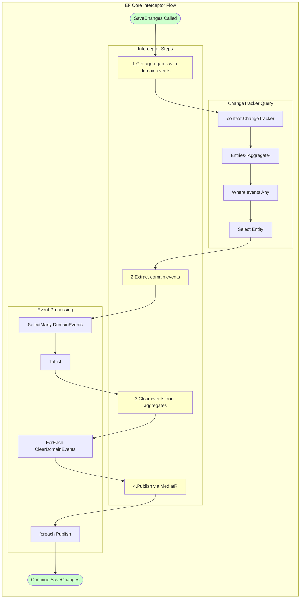

# Phân Tích Cấu Trúc CQRS Trong Dự Án ProgCoder Shop Microservices

## Tài Liệu Trực Quan Hóa Bằng Flowchart

---

## Mục Lục

1. [Tổng Quan CQRS](#1-tổng-quan-cqrs)
2. [Kiến Trúc Tổng Thể](#2-kiến-trúc-tổng-thể)
3. [Command Side (Write Model)](#3-command-side-write-model)
4. [Query Side (Read Model)](#4-query-side-read-model)
5. [Pipeline Behaviors](#5-pipeline-behaviors)
6. [Domain Events và Đồng Bộ Dữ Liệu](#6-domain-events-và-đồng-bộ-dữ-liệu)
7. [Cấu Trúc Thư Mục](#7-cấu-trúc-thư-mục)
8. [Ví Dụ Thực Tế](#8-ví-dụ-thực-tế)

---

## 1. Tổng Quan CQRS

### 1.1. CQRS Là Gì?


### 1.2. Lý Do Áp Dụng


---

## 2. Kiến Trúc Tổng Thể

### 2.1. Luồng Dữ Liệu CQRS


### 2.2. Kiến Trúc Theo Services


---

## 3. Command Side (Write Model)

### 3.1. Cấu Trúc Command


### 3.2. Command Handler Flow


### 3.3. Command Handler Chi Tiết


---

## 4. Query Side (Read Model)

### 4.1. Cấu Trúc Query


### 4.2. Query Handler Flow


### 4.3. Query Optimization Strategies


---

## 5. Pipeline Behaviors

### 5.1. MediatR Pipeline


### 5.2. Validation Behavior Chi Tiết


### 5.3. Logging Behavior Chi Tiết


---

## 6. Domain Events và Đồng Bộ Dữ Liệu

### 6.1. Domain Events Flow


### 6.2. Outbox Pattern


### 6.3. Inbox Pattern (Idempotency)


### 6.4. DispatchDomainEventsInterceptor Chi Tiết



### 6.5. Write vs Read Model - Normalized vs Denormalized


### 6.6. So Sánh Normalized vs Denormalized


### 6.7. Hybrid Approach - Kiến Trúc Thực Tế


---

## 7. Cấu Trúc Thư Mục

### 7.1. Project Structure

```mermaid
flowchart TB
    subgraph "CQRS Project Structure"
        direction TB
        
        ROOT["src/Services/{ServiceName}/"]
        
        subgraph "Application Layer"
            APP["{Service}.Application/"]
            
            subgraph "Features"
                F1["Order/"]
                F2["Product/"]
                F3["Basket/"]
            end
            
            subgraph "Commands"
                C1["CreateOrderCommand.cs"]
                C2["UpdateOrderCommand.cs"]
                C3["DeleteOrderCommand.cs"]
            end
            
            subgraph "Queries"
                Q1["GetOrderByIdQuery.cs"]
                Q2["GetMyOrdersQuery.cs"]
                Q3["GetAllOrdersQuery.cs"]
            end
            
            DTO["Dtos/"]
            MAP["Mappings/"]
        end
        
        subgraph "Domain Layer"
            DOM["{Service}.Domain/"]
            ENT["Entities/"]
            VO["ValueObjects/"]
            EV["Events/"]
            EX["Exceptions/"]
        end
        
        subgraph "Infrastructure Layer"
            INF["{Service}.Infrastructure/"]
            DATA["Data/"]
            REPO["Repositories/"]
            GRPC["gRPC Services/"]
        end
        
        ROOT --> APP
        ROOT --> DOM
        ROOT --> INF
        
        APP --> F1
        F1 --> C1
        F1 --> Q1
        APP --> DTO
        APP --> MAP
        
        DOM --> ENT
        DOM --> VO
        DOM --> EV
        DOM --> EX
        
        INF --> DATA
        INF --> REPO
        INF --> GRPC
    end
    
    style ROOT fill:#ffffcc
    style APP fill:#ccccff
    style DOM fill:#ccffcc
    style INF fill:#ffcccc
```

### 7.2. BuildingBlocks Structure

```mermaid
flowchart TB
    subgraph "Shared BuildingBlocks"
        direction TB
        
        BB["BuildingBlocks/"]
        
        subgraph "CQRS"
            C1["ICommand.cs"]
            C2["ICommandHandler.cs"]
            C3["IQuery.cs"]
            C4["IQueryHandler.cs"]
        end
        
        subgraph "Behaviors"
            B1["ValidationBehavior.cs"]
            B2["LoggingBehavior.cs"]
        end
        
        subgraph "Domain"
            D1["Entity.cs"]
            D2["Aggregate.cs"]
            D3["IDomainEvent.cs"]
        end
        
        subgraph "Pagination"
            P1["PaginatedResult.cs"]
            P2["PagingExtensions.cs"]
        end
        
        BB --> C1
        BB --> C2
        BB --> C3
        BB --> C4
        BB --> B1
        BB --> B2
        BB --> D1
        BB --> D2
        BB --> D3
        BB --> P1
        BB --> P2
    end
    
    style BB fill:#ffffcc
    style C1 fill:#ccccff
    style C2 fill:#ccccff
    style C3 fill:#ccccff
    style C4 fill:#ccccff
    style B1 fill:#ccffcc
    style B2 fill:#ccffcc
```

---

## 8. Ví Dụ Thực Tế

### 8.1. CreateOrder Flow - End to End

```mermaid
flowchart TB
    subgraph "Create Order - Complete Flow"
        direction TB
        
        CLIENT["Client<br/>POST /api/orders"]
        
        subgraph "Order Service"
            API["Order.Api<br/>Carter Module"]
            
            subgraph "Application Layer"
                CMD["CreateOrderCommand<br/>record"]
                VAL["CreateOrderCommandValidator<br/>FluentValidation"]
                HANDLER["CreateOrderCommandHandler"]
            end
            
            subgraph "Domain Layer"
                ENTITY["OrderEntity<br/>Aggregate Root"]
                EVENT["OrderCreatedDomainEvent"]
            end
            
            subgraph "Infrastructure Layer"
                UOW["UnitOfWork"]
                REPO["OrderRepository"]
                DB[(PostgreSQL)]
                OUTBOX["OutboxMessage"]
            end
        end
        
        subgraph "External Services"
            CATALOG["Catalog Service<br/>gRPC"]
            DISCOUNT["Discount Service<br/>gRPC"]
        end
        
        subgraph "Event Processing"
            BG["Background Worker"]
            RMQ["RabbitMQ"]
            INV["Inventory Service<br/>Consumer"]
            NOTIF["Notification Service<br/>Consumer"]
            REPORT["Report Service<br/>Consumer"]
        end
        
        CLIENT --> API
        API --> CMD
        CMD --> VAL
        VAL -->|Valid| HANDLER
        
        HANDLER --> CATALOG
        HANDLER --> DISCOUNT
        
        HANDLER --> ENTITY
        ENTITY --> EVENT
        
        HANDLER --> UOW
        UOW --> REPO
        REPO --> DB
        
        EVENT --> OUTBOX
        OUTBOX -.->|Poll| BG
        BG --> RMQ
        RMQ --> INV
        RMQ --> NOTIF
        RMQ --> REPORT
    end
    
    style CLIENT fill:#ccffcc
    style API fill:#ccccff
    style HANDLER fill:#ffffcc
    style ENTITY fill:#ffcccc
    style DB fill:#ccffff
    style RMQ fill:#ffccff
    style INV fill:#ccffcc
    style NOTIF fill:#ccffcc
    style REPORT fill:#ccffcc
```

### 8.2. GetOrder Flow - End to End

```mermaid
flowchart TB
    subgraph "Get Order - Complete Flow"
        direction TB
        
        CLIENT["Client<br/>GET /api/orders/{id}"]
        
        subgraph "Order Service"
            API["Order.Api<br/>Carter Module"]
            
            subgraph "Application Layer"
                QRY["GetOrderByIdQuery<br/>record"]
                HANDLER["GetOrderByIdQueryHandler"]
            end
            
            subgraph "Infrastructure Layer"
                UOW["UnitOfWork"]
                REPO["OrderRepository"]
                DB[(PostgreSQL)]
                MAP["AutoMapper"]
            end
        end
        
        subgraph "Response"
            DTO["OrderDto"]
            RESULT["GetOrderByIdResult"]
        end
        
        CLIENT --> API
        API --> QRY
        QRY --> HANDLER
        
        HANDLER --> UOW
        UOW --> REPO
        REPO -->|GetByIdWithRelationshipAsync| DB
        DB -->|OrderEntity| REPO
        REPO -->|Entity| HANDLER
        
        HANDLER -->|Map| MAP
        MAP -->|OrderDto| DTO
        DTO --> RESULT
        RESULT --> API
        API --> CLIENT
    end
    
    style CLIENT fill:#ccffcc
    style API fill:#ccccff
    style HANDLER fill:#ffffcc
    style DB fill:#ccffff
    style DTO fill:#ccffcc
```

### 8.3. Data Flow Comparison

```mermaid
flowchart TB
    subgraph "Command vs Query Data Flow"
        direction LR
        
        subgraph "Command Flow (Write)"
            direction TB
            C1["API Endpoint"]
            C2["Command"]
            C3["Validation"]
            C4["Handler"]
            C5["Domain Logic"]
            C6["SaveChanges"]
            C7["Domain Events"]
            C8["Outbox"]
            C9["Message Broker"]
            
            C1 --> C2 --> C3 --> C4 --> C5 --> C6 --> C7 --> C8 --> C9
        end
        
        subgraph "Query Flow (Read)"
            direction TB
            Q1["API Endpoint"]
            Q2["Query"]
            Q3["Handler"]
            Q4["Repository"]
            Q5["Cache Check"]
            Q6["Database"]
            Q7["Mapping"]
            Q8["Result"]
            
            Q1 --> Q2 --> Q3 --> Q4
            Q4 --> Q5
            Q5 -->|Cache Hit| Q7
            Q5 -->|Cache Miss| Q6 --> Q7
            Q7 --> Q8
        end
        
        C1 -.->|"Different Paths"| Q1
    end
    
    style C1 fill:#ffcccc
    style C2 fill:#ffcccc
    style C3 fill:#ffcccc
    style C4 fill:#ffcccc
    style C5 fill:#ffcccc
    style C6 fill:#ffcccc
    style C7 fill:#ffcccc
    style C8 fill:#ffcccc
    style C9 fill:#ffcccc
    
    style Q1 fill:#ccccff
    style Q2 fill:#ccccff
    style Q3 fill:#ccccff
    style Q4 fill:#ccccff
    style Q5 fill:#ccccff
    style Q6 fill:#ccccff
    style Q7 fill:#ccccff
    style Q8 fill:#ccccff
```

---

## Tóm Tắt

### Kiến Trúc CQRS Trong Dự Án

```mermaid
flowchart TB
    subgraph "CQRS Architecture Summary"
        direction TB
        
        A["Clean Architecture<br/>+ CQRS + DDD"]
        
        B["Command Side"]
        C["Query Side"]
        
        D["MediatR Pipeline"]
        E["Domain Events"]
        
        F["Outbox Pattern"]
        G["Inbox Pattern"]
        
        H["Event-Driven<br/>Microservices"]
        
        A --> B
        A --> C
        
        B --> D
        C --> D
        
        B --> E
        E --> F
        F --> H
        
        H --> G
    end
    
    style A fill:#ffffcc
    style B fill:#ffcccc
    style C fill:#ccccff
    style D fill:#ccffcc
    style E fill:#ffffcc
    style F fill:#ffccff
    style G fill:#ffccff
    style H fill:#ccffff
```

### Các Thành Phần Chính

| Thành Phần | Mục Đích | Vị Trí |
|------------|----------|--------|
| **ICommand/IQuery** | Định nghĩa contracts | BuildingBlocks.CQRS |
| **Command/Query** | DTOs chứa request data | Features/{Feature}/ |
| **Handlers** | Business logic | Features/{Feature}/ |
| **Validators** | Input validation | Cùng file với Command |
| **Behaviors** | Cross-cutting concerns | BuildingBlocks.Behaviors |
| **Domain Events** | Loose coupling | Domain/Events/ |
| **Outbox** | Reliable messaging | Infrastructure/Data/ |

---

**Document Version:** 1.0  
**Last Updated:** February 2026  
**Author:** AI Assistant - Visual CQRS Documentation for ProgCoder Shop Microservices
