# Phân Tích Chi Tiết Thiết Kế DDD - ProgCoder Shop Microservices

## Mục Lục

1. [Tổng Quan Kiến Trúc DDD](#1-tổng-quan-kiến-trúc-ddd)
2. [Cấu Trúc Các Layers](#2-cấu-trúc-các-layers)
3. [Bounded Contexts & Microservices](#3-bounded-contexts--microservices)
4. [Thành Phần Domain Chính](#4-thành-phần-domain-chính)
5. [Luồng Hoạt Động CQRS](#5-luồng-hoạt-động-cqrs)
6. [Event-Driven Architecture](#6-event-driven-architecture)
7. [Tương Tác Giữa Các Services](#7-tương-tác-giữa-các-services)
8. [Repository Pattern & Unit of Work](#8-repository-pattern--unit-of-work)
9. [Kết Luận](#9-kết-luận)

---

## 1. Tổng Quan Kiến Trúc DDD

Dự án ProgCoder Shop Microservices áp dụng **Domain-Driven Design (DDD)** kết hợp với kiến trúc **Microservices** và **CQRS Pattern**. Đây là một hệ thống thương mại điện tử phức tạp với nhiều nghiệp vụ nghiệp vụ độc lập, được chia thành các bounded contexts riêng biệt.

### 1.1 Các Nguyên Tắc DDD Áp Dụng

Dự án tuân thủ các nguyên tắc cốt lõi của DDD bao gồm việc phân tách rõ ràng giữa các tầng nghiệp vụ, sử dụng ngôn ngữ chung (Ubiquitous Language) trong toàn bộ codebase, và đóng gói logic domain bên trong các aggregate roots. Mỗi bounded context được thiết kế để quản lý một phạm vi nghiệp vụ cụ thể, giúp hệ thống dễ dàng mở rộng và bảo trì.

### 1.2 Kiến Trúc Tổng Thể

```mermaid
graph TB
    subgraph Client_Layer ["Client Layer"]
        Admin["App.Admin\n(Next.js)"]
        Store["App.Store\n(Next.js)"]
    end

    subgraph Gateway ["API Gateway\nYARP"]
        Gateway["http://localhost:15009"]
    end

    subgraph Bounded_Contexts ["Bounded Contexts"]
        Catalog["Catalog Service\nProduct, Brand, Category"]
        Basket["Basket Service\nShopping Cart"]
        Order["Order Service\nOrders, Items"]
        Inventory["Inventory Service\nStock, Reservations"]
        Discount["Discount Service\nCoupons"]
        Notification["Notification Service\nNotifications, Delivery"]
        Search["Search Service\nProduct Search"]
        Report["Report Service\nAnalytics"]
    end

    subgraph Infrastructure ["Infrastructure"]
        RabbitMQ["RabbitMQ\nMessage Broker"]
        PostgreSQL[(["PostgreSQL\nCatalog, Order"])]
        MySQL[(["MySQL\nBasket"])]
        SQLServer[(["SQL Server\nInventory"])]
        MongoDB[(["MongoDB\nNotification"])]
        Redis[(["Redis\nCache"])]
        Elasticsearch[(["Elasticsearch\nSearch"])]
    end

    Admin --> Gateway
    Store --> Gateway
    Gateway --> Catalog
    Gateway --> Basket
    Gateway --> Order
    Gateway --> Inventory
    Gateway --> Discount
    Gateway --> Notification
    Gateway --> Search
    Gateway --> Report

    Catalog --> PostgreSQL
    Basket --> MySQL
    Order --> PostgreSQL
    Inventory --> SQLServer
    Notification --> MongoDB
    Search --> Elasticsearch
    Search --> Redis

    Catalog --> RabbitMQ
    Basket --> RabbitMQ
    Order --> RabbitMQ
    Inventory --> RabbitMQ
    Notification --> RabbitMQ
```

---

## 2. Cấu Trúc Các Layers

### 2.1 Tổng Quan Layers

Mỗi service trong hệ thống tuân theo cấu trúc **Clean Architecture** với 4 layers chính:

```
src/Services/[ServiceName]/Core/[ServiceName].Domain/          # Domain Layer
src/Services/[ServiceName]/Core/[ServiceName].Application/      # Application Layer
src/Services/[ServiceName]/Infrastructure/                       # Infrastructure Layer
src/Services/[ServiceName]/[ServiceName].Api/                    # Presentation Layer
```

### 2.2 Domain Layer (Core Domain)

Domain Layer chứa toàn bộ logic nghiệp vụ cốt lõi, bao gồm các Entities, Value Objects, Aggregates, Domain Events, và Domain Services. Đây là trái tim của hệ thống DDD, nơi các quy tắc kinh doanh được đóng gói và thực thi.

**Cấu trúc thư mục Domain:**

```
.Domain/
├── Abstractions/
│   ├── Aggregate.cs
│   ├── Entity.cs
│   └── IDomainEvent.cs
├── Entities/
│   ├── ProductEntity.cs
│   ├── BrandEntity.cs
│   └── CategoryEntity.cs
├── Events/
│   ├── UpsertedProductDomainEvent.cs
│   └── DeletedUnPublishedProductDomainEvent.cs
├── Exceptions/
│   └── DomainException.cs
├── Enums/
│   └── ProductStatus.cs
└── Repositories/
    └── IProductRepository.cs
```

**Các thành phần chính trong Domain Layer:**

| Thành Phần | Mô Tả | Ví Dụ |
|------------|-------|-------|
| Entity | Các đối tượng có identity riêng biệt | ProductEntity, OrderEntity |
| Aggregate | Nhóm các entities liên quan với một root | ProductAggregate |
| Value Object | Các đối tượng không có identity, immutable | Address, Money |
| Domain Event | Sự kiện xảy ra trong domain | OrderCreatedEvent |
| Domain Service | Logic nghiệp vụ không thuộc entity nào | InventoryCheckService |

### 2.3 Application Layer

Application Layer chịu trách nhiệm điều phối các use cases, xử lý các commands và queries theo pattern CQRS. Layer này sử dụng MediatR để implement mediator pattern, giúp tách biệt việc gửi commands/queries và xử lý chúng.

**Cấu trúc thư mục Application:**

```
.Application/
├── Features/
│   ├── Product/
│   │   ├── Commands/
│   │   │   ├── CreateProductCommand.cs
│   │   │   ├── UpdateProductCommand.cs
│   │   │   └── DeleteProductCommand.cs
│   │   └── Queries/
│   │       ├── GetProductQuery.cs
│   │       └── SearchProductQuery.cs
│   └── Basket/
│       ├── Commands/
│       │   ├── StoreBasketCommand.cs
│       │   └── BasketCheckoutCommand.cs
│       └── Queries/
│           └── GetBasketQuery.cs
├── Repositories/
│   └── IProductRepository.cs
├── DTOs/
│   └── ProductDto.cs
└── Services/
    └── IProductService.cs
```

### 2.4 Infrastructure Layer

Infrastructure Layer triển khai các interfaces được định nghĩa trong Application và Domain layers. Layer này chịu trách nhiệm về giao tiếp với cơ sở dữ liệu, message broker, external services, và các công nghệ cụ thể khác.

**Cấu trúc thư mục Infrastructure:**

```
.Infrastructure/
├── Data/
│   ├── ApplicationDbContext.cs
│   └── Configurations/
├── Repositories/
│   ├── ProductRepository.cs
│   └── BasketRepository.cs
├── UnitOfWork/
│   └── UnitOfWork.cs
├── Migrations/
└── Services/
    └── EmailService.cs
```

### 2.5 Presentation Layer

Presentation Layer bao gồm các API endpoints (Carter Minimal API), gRPC services, và Workers. Layer này nhận requests từ clients, validate input, và delegate cho Application layer xử lý.

**Cấu trúc thư mục Presentation:**

```
.[ServiceName].Api/
├── Controllers/
│   └── ProductController.cs
├── Program.cs
├── appsettings.json
└── [ServiceName].Api.csproj

.[ServiceName].Worker/
├── Consumers/
│   └── ProductEventConsumer.cs
├── Program.cs
└── [ServiceName].Worker.csproj
```

---

## 3. Bounded Contexts & Microservices

### 3.1 Danh Sách Bounded Contexts

Dự án được chia thành 8 bounded contexts chính, mỗi context quản lý một phạm vi nghiệp vụ cụ thể:

| Service | Mô Tả | Database | Protocol |
|---------|-------|----------|----------|
| **Catalog** | Quản lý sản phẩm, thương hiệu, danh mục | PostgreSQL | REST API + gRPC |
| **Basket** | Giỏ hàng mua sắm | MySQL + Redis | REST API |
| **Order** | Quản lý đơn hàng | PostgreSQL | REST API + gRPC |
| **Inventory** | Quản lý kho hàng | SQL Server | REST API + gRPC |
| **Discount** | Mã giảm giá, khuyến mãi | PostgreSQL | gRPC |
| **Notification** | Thông báo, giao hàng | MongoDB | REST API |
| **Search** | Tìm kiếm sản phẩm | Elasticsearch | REST API |
| **Report** | Báo cáo, analytics | PostgreSQL | REST API |

### 3.2 Chi Tiết Từng Bounded Context

#### 3.2.1 Catalog Service

Catalog Service là bounded context chịu trách nhiệm quản lý toàn bộ thông tin về sản phẩm. Đây là service quan trọng nhất trong hệ thống, cung cấp thông tin sản phẩm cho tất cả các services khác thông qua gRPC và Domain Events.

**Domain Entities:**

```csharp
public sealed class ProductEntity : Aggregate<Guid>
{
    public string Name { get; set; }
    public string Sku { get; set; }
    public string ShortDescription { get; set; }
    public string LongDescription { get; set; }
    public string Slug { get; set; }
    public decimal Price { get; set; }
    public decimal? SalePrice { get; set; }
    public bool Published { get; set; }
    public bool Featured { get; set; }
    public ProductStatus Status { get; set; }
    public Guid? BrandId { get; set; }
    public List<Guid>? CategoryIds { get; set; }
    public List<ProductImageEntity>? Images { get; set; }
}
```

**Business Logic quan trọng:**

```csharp
public void Publish(string performedBy)
{
    Published = true;
    LastModifiedBy = performedBy;
    LastModifiedOnUtc = DateTimeOffset.UtcNow;
}

public void ChangeStatus(ProductStatus status, string performedBy)
{
    if (Status == status)
        throw new DomainException(MessageCode.DecisionFlowIllegal);
    
    Status = status;
    LastModifiedBy = performedBy;
    LastModifiedOnUtc = DateTimeOffset.UtcNow;
}
```

**Domain Events:**

```csharp
public sealed record UpsertedProductDomainEvent(Guid ProductId) : IDomainEvent;
public sealed record DeletedUnPublishedProductDomainEvent(Guid ProductId) : IDomainEvent;
```

#### 3.2.2 Basket Service

Basket Service quản lý giỏ hàng của người dùng. Service này sử dụng Redis cho caching và MySQL cho persistence, đảm bảo hiệu suất cao khi xử lý thao tác giỏ hàng thường xuyên.

**Domain Entities:**

```csharp
public sealed class ShoppingCartEntity : Aggregate<Guid>
{
    public string UserId { get; set; }
    public List<ShoppingCartItemEntity> Items { get; set; }
    public decimal TotalPrice { get; set; }
    public int TotalQuantity { get; set; }
}
```

**Business Workflow - Basket Checkout:**

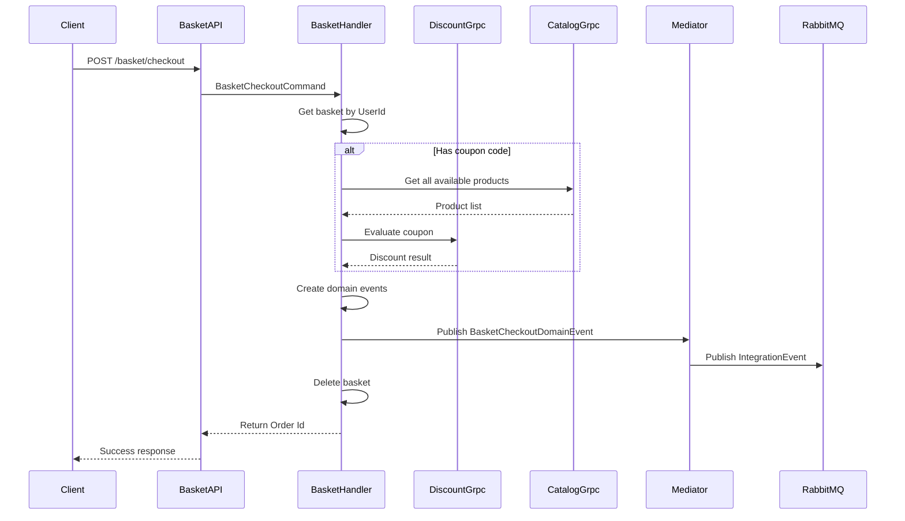

#### 3.2.3 Order Service

Order Service quản lý toàn bộ vòng đời của đơn hàng, từ khi tạo đơn cho đến khi hoàn thành hoặc hủy. Service này tích hợp chặt chẽ với Inventory Service để đảm bảo tính nhất quán của kho hàng.

**Domain Entities:**

```csharp
public sealed class OrderEntity : Aggregate<Guid>
{
    public Guid UserId { get; set; }
    public OrderStatus Status { get; set; }
    public decimal TotalAmount { get; set; }
    public List<OrderItemEntity> Items { get; set; }
    public Address ShippingAddress { get; set; }
    public PaymentInfo PaymentInfo { get; set; }
}
```

**Order Domain Events:**

```csharp
public sealed record OrderCreatedDomainEvent(Guid OrderId) : IDomainEvent;
public sealed record OrderCancelledDomainEvent(Guid OrderId) : IDomainEvent;
public sealed record OrderDeliveredDomainEvent(Guid OrderId) : IDomainEvent;
```

**Order State Machine:**

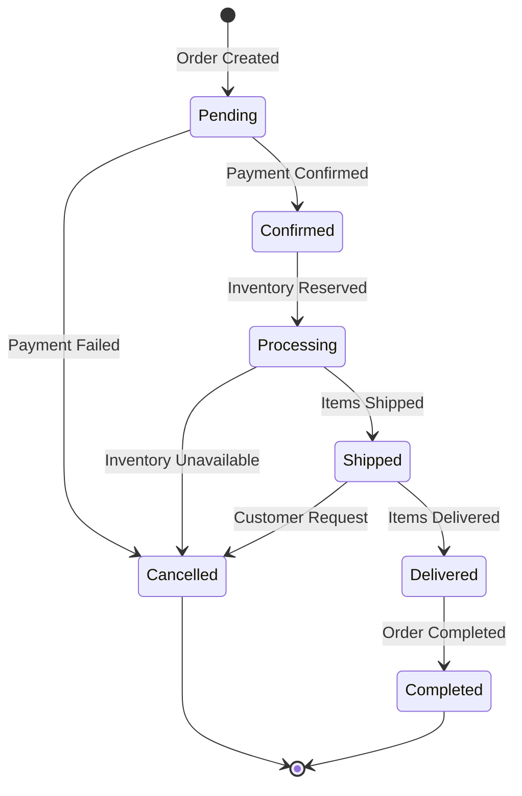

#### 3.2.4 Inventory Service

Inventory Service quản lý hàng tồn kho, reservations, và vị trí lưu trữ. Service này đảm bảo tính nhất quán của số lượng hàng trong toàn hệ thống.

**Domain Entities:**

```csharp
public sealed class InventoryItemEntity : Aggregate<Guid>
{
    public Guid ProductId { get; set; }
    public int Quantity { get; set; }
    public int ReservedQuantity { get; set; }
    public int AvailableQuantity => Quantity - ReservedQuantity;
    public LocationEntity Location { get; set; }
}
```

**Inventory Reservation Flow:**

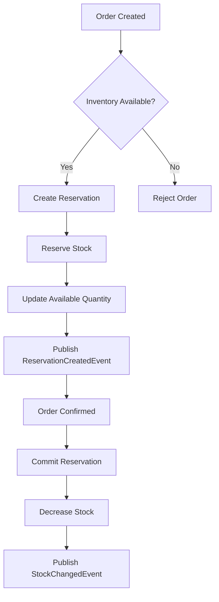

#### 3.2.5 Discount Service

Discount Service quản lý các mã giảm giá và chương trình khuyến mãi. Service này cung cấp gRPC endpoint để các services khác có thể validate và tính toán giảm giá.

**Domain Entities:**

```csharp
public sealed class CouponEntity : Aggregate<Guid>
{
    public string Code { get; set; }
    public decimal DiscountAmount { get; set; }
    public decimal DiscountPercentage { get; set; }
    public DateTime StartDate { get; set; }
    public DateTime EndDate { get; set; }
    public int UsageLimit { get; set; }
    public int UsageCount { get; set; }
}
```

#### 3.2.6 Notification Service

Notification Service quản lý thông báo và giao hàng. Service này sử dụng MongoDB để lưu trữ thông báo linh hoạt.

**Domain Entities:**

```csharp
public sealed class NotificationEntity : Aggregate<Guid>
{
    public Guid UserId { get; set; }
    public string Title { get; set; }
    public string Content { get; set; }
    public NotificationType Type { get; set; }
    public bool IsRead { get; set; }
}
```

#### 3.2.7 Search Service

Search Service cung cấp chức năng tìm kiếm nâng cao sử dụng Elasticsearch. Service này subscribe các domain events từ Catalog Service để cập nhật index.

#### 3.2.8 Report Service

Report Service cung cấp các báo cáo và analytics cho admin, sử dụng Redis cache để tối ưu hiệu suất.

---

## 4. Thành Phần Domain Chính

### 4.1 Aggregate Root Pattern

Mỗi Aggregate trong dự án kế thừa từ abstract class `Aggregate<TId>`, cung cấp cơ chế quản lý Domain Events:

```csharp
public abstract class Aggregate<TId> : Entity<TId>, IAggregate<TId>
{
    private readonly List<IDomainEvent> _domainEvents = new();

    public IReadOnlyList<IDomainEvent> DomainEvents => _domainEvents.AsReadOnly();

    public void AddDomainEvent(IDomainEvent domainEvent)
    {
        _domainEvents.Add(domainEvent);
    }

    public IDomainEvent[] ClearDomainEvents()
    {
        IDomainEvent[] dequeuedEvents = _domainEvents.ToArray();
        _domainEvents.Clear();
        return dequeuedEvents;
    }
}
```

**Ý nghĩa:**
- Mỗi Aggregate có thể tạo và lưu trữ các Domain Events
- Các events được clear sau khi được xử lý để tránh duplicate processing
- Đảm bảo tính nhất quán trong Aggregate boundary

### 4.2 Entity Base Class

```csharp
public abstract class Entity<TId> : IEquatable<Entity<TId>>
{
    public TId Id { get; protected set; }
    
    public bool Equals(Entity<TId>? other)
    {
        return other != null && Id!.Equals(other.Id);
    }
}
```

### 4.3 Domain Event Interface

```csharp
public interface IDomainEvent : INotification
{
    Guid EventId => Guid.NewGuid();
    DateTimeOffset OccurredOn => DateTime.Now;
    string EventType => GetType()?.AssemblyQualifiedName ?? string.Empty;
}
```

### 4.4 Exception Handling

```csharp
public class DomainException : Exception
{
    public string ErrorCode { get; }
    
    public DomainException(string errorCode)
    {
        ErrorCode = errorCode;
    }
}
```

---

## 5. Luồng Hoạt Động CQRS

### 5.1 Command Flow

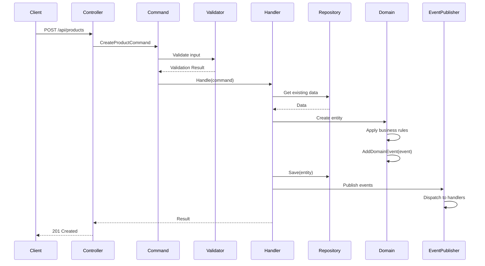

### 5.2 Query Flow

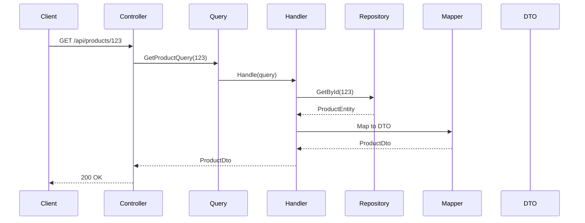

### 5.3 Command Handler Pattern

```csharp
public sealed class CreateProductCommandHandler(
    IProductRepository repository,
    IMapper mapper) : ICommandHandler<CreateProductCommand, Guid>
{
    public async Task<Guid> Handle(CreateProductCommand command, CancellationToken ct)
    {
        // 1. Validate input (via FluentValidation)
        // 2. Create domain entity
        var entity = ProductEntity.Create(...);
        
        // 3. Add domain events
        entity.AddDomainEvent(new UpsertedProductDomainEvent(entity.Id));
        
        // 4. Persist
        await repository.AddAsync(entity, ct);
        await repository.SaveChangesAsync(ct);
        
        // 5. Return result
        return entity.Id;
    }
}
```

### 5.4 Query Handler Pattern

```csharp
public sealed class GetProductQueryHandler(
    IProductRepository repository,
    IMapper mapper) : IQueryHandler<GetProductQuery, GetProductResult>
{
    public async Task<GetProductResult> Handle(GetProductQuery query, CancellationToken ct)
    {
        var entity = await repository.GetByIdWithDetailsAsync(query.Id, ct);
        
        if (entity == null)
            throw new NotFoundException(MessageCode.ProductNotFound);
        
        var dto = mapper.Map<ProductDto>(entity);
        
        return new GetProductResult(dto);
    }
}
```

---

## 6. Event-Driven Architecture

### 6.1 Event Types

#### 6.1.1 Domain Events

Domain Events xảy ra trong boundaries của một aggregate, được raise bởi aggregate và xử lý trong cùng service:

```csharp
// Raised by Order Aggregate
public sealed record OrderCreatedDomainEvent(Guid OrderId) : IDomainEvent;

// Handler trong cùng Order Service
public class OrderCreatedDomainEventHandler 
    : INotificationHandler<OrderCreatedDomainEvent>
{
    public async Task Handle(OrderCreatedDomainEvent notification, ...)
    {
        // Xử lý logic phụ trợ sau khi order được tạo
    }
}
```

#### 6.1.2 Integration Events

Integration Events được publish ra bên ngoài service boundaries, giao tiếp giữa các microservices:

```csharp
public record BasketCheckoutIntegrationEvent(
    Guid OrderId,
    Guid UserId,
    decimal TotalAmount,
    List<OrderItemDto> Items,
    AddressDto ShippingAddress) : INotification;
```

### 6.2 Event Processing Flow

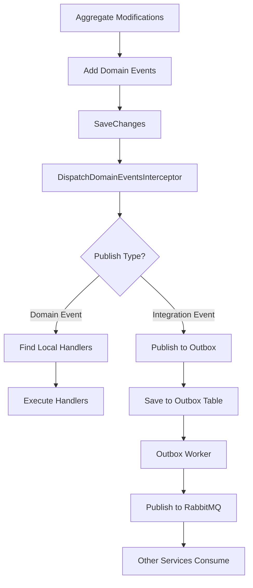

### 6.3 Outbox Pattern

Dự án sử dụng **Outbox Pattern** để đảm bảo eventual consistency:

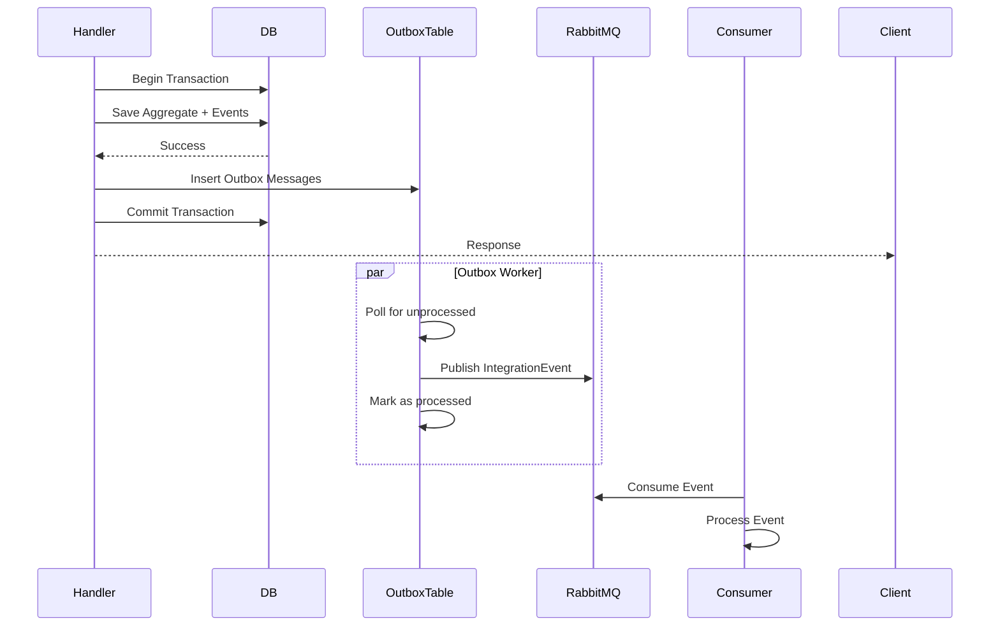

### 6.4 Interceptor Implementation

```csharp
public class DispatchDomainEventsInterceptor : SaveChangesInterceptor
{
    public override async ValueTask<int> SavedChangesAsync(...)
    {
        var result = await base.SavedChangesAsync(...);
        
        var entities = context.ChangeTracker
            .Entries<Aggregate>()
            .Where(e => e.Entity.DomainEvents.Any())
            .Select(e => e.Entity)
            .ToArray();
        
        foreach (var aggregate in entities)
        {
            var events = aggregate.ClearDomainEvents();
            foreach (var @event in events)
            {
                await mediator.Publish(@event, cancellationToken);
            }
        }
        
        return result;
    }
}
```

---

## 7. Tương Tác Giữa Các Services

### 7.1 Checkout Flow - Full Sequence

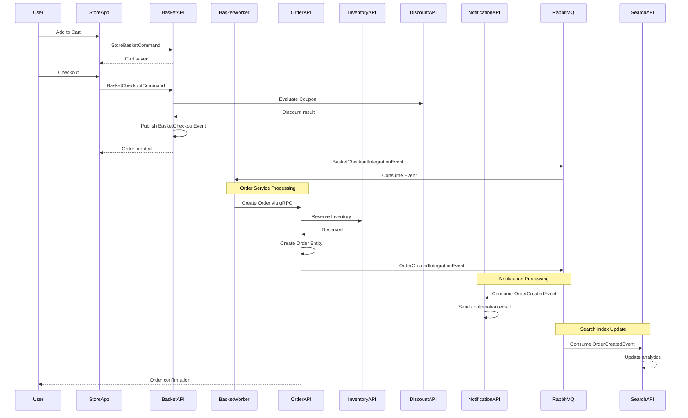

### 7.2 Inventory Reservation Flow

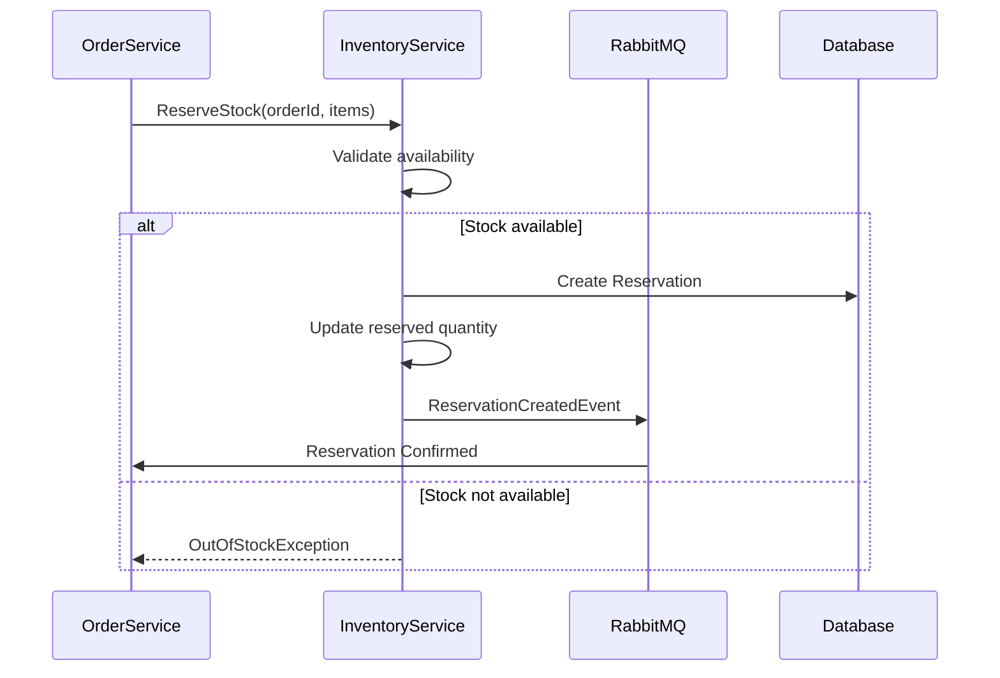

### 7.3 Cross-Service Communication

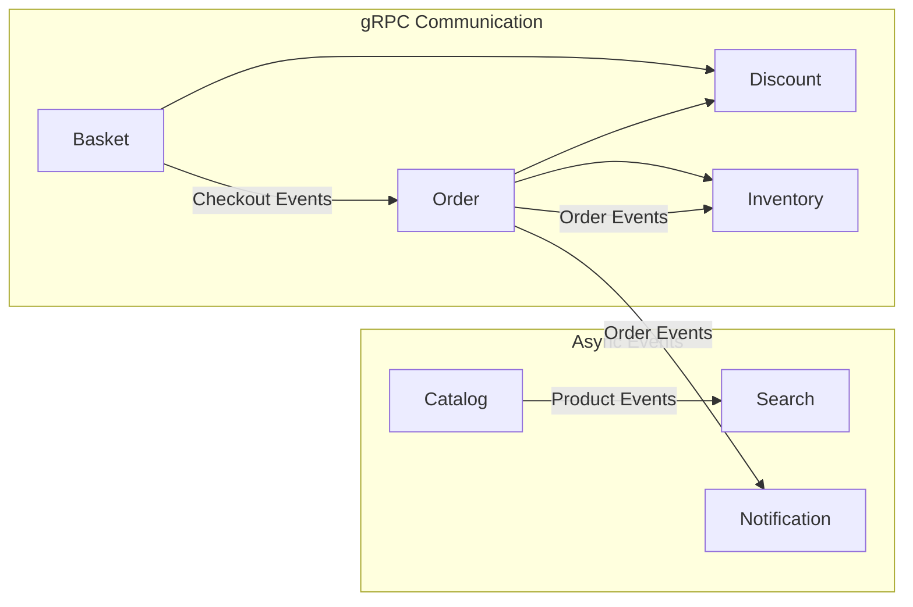

---

## 8. Repository Pattern & Unit of Work

### 8.1 Repository Interface Structure

```csharp
// Defined in Domain Layer
public interface IProductRepository
{
    Task<ProductEntity> GetByIdAsync(Guid id, CancellationToken ct = default);
    Task<ProductEntity> GetByIdWithDetailsAsync(Guid id, CancellationToken ct = default);
    Task AddAsync(ProductEntity entity, CancellationToken ct = default);
    Task UpdateAsync(ProductEntity entity, CancellationToken ct = default);
    Task DeleteAsync(Guid id, CancellationToken ct = default);
}

// Defined in Application Layer
public interface IProductRepository : IRepository<ProductEntity>
{
    Task<IEnumerable<ProductEntity>> GetByCategoryAsync(Guid categoryId);
    Task<IEnumerable<ProductEntity>> GetByBrandAsync(Guid brandId);
    Task<ProductEntity> GetBySkuAsync(string sku);
}
```

### 8.2 Repository Implementation

```csharp
public class ProductRepository : IProductRepository
{
    private readonly ApplicationDbContext _context;
    
    public ProductRepository(ApplicationDbContext context)
    {
        _context = context;
    }
    
    public async Task<ProductEntity> GetByIdAsync(Guid id, CancellationToken ct)
    {
        return await _context.Products
            .AsNoTracking()
            .FirstOrDefaultAsync(p => p.Id == id, ct);
    }
    
    public async Task AddAsync(ProductEntity entity, CancellationToken ct)
    {
        await _context.Products.AddAsync(entity, ct);
    }
    
    public async Task SaveChangesAsync(CancellationToken ct)
    {
        await _context.SaveChangesAsync(ct);
    }
}
```

### 8.3 Unit of Work Pattern

```csharp
public interface IUnitOfWork
{
    IOrderRepository Orders { get; }
    IOrderItemRepository OrderItems { get; }
    IInboxMessageRepository InboxMessages { get; }
    IOutboxMessageRepository OutboxMessages { get; }
    
    Task<int> SaveChangesAsync(CancellationToken ct = default);
    Task<IDbTransaction> BeginTransactionAsync(CancellationToken ct = default);
}

public class UnitOfWork : IUnitOfWork
{
    private readonly ApplicationDbContext _context;
    
    public IOrderRepository Orders { get; }
    public IOrderItemRepository OrderItems { get; }
    public IInboxMessageRepository InboxMessages { get; }
    public IOutboxMessageRepository OutboxMessages { get; }
    
    public async Task<int> SaveChangesAsync(CancellationToken ct)
    {
        return await _context.SaveChangesAsync(ct);
    }
}
```

### 8.4 Transaction Flow

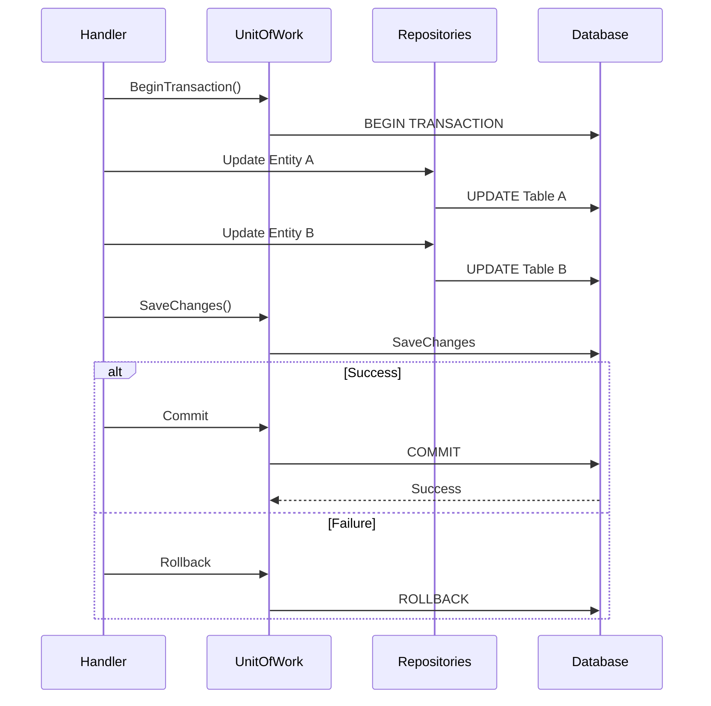

---

## 9. Kết Luận

### 9.1 Điểm Mạnh Của Kiến Trúc

Dự án ProgCoder Shop Microservices thể hiện một thiết kế DDD vững chắc với nhiều điểm mạnh đáng kể. Việc tách biệt rõ ràng các bounded contexts giúp mỗi service có thể phát triển, deploy và scale độc lập mà không ảnh hưởng đến các services khác. Architecture CQRS giúp tách biệt rõ ràng giữa read và write operations, tối ưu hiệu suất cho từng loại operation. Việc sử dụng Domain Events kết hợp với Outbox Pattern đảm bảo tính nhất quán dữ liệu trong môi trường distributed.

### 9.2 Các Best Practices Được Áp Dụng

Dự án tuân thủ nhiều best practices của DDD bao gồm việc sử dụng Ubiquitous Language trong toàn bộ codebase với các class và method names phản ánh nghiệp vụ kinh doanh. Aggregate Boundaries được thiết kế cẩn thận để đảm bảo tính nhất quán trong mỗi aggregate. Value Objects được sử dụng cho các đối tượng không có identity như Address, Money để tránh primitive obsession. Exception handling tập trung vào việc sử dụng các domain exceptions có ý nghĩa business thay vì technical exceptions.

### 9.3 Các Pattern Chính Được Sử Dụng

| Pattern | Mục Đích | Ví Dụ Triển Khai |
|---------|----------|------------------|
| CQRS | Tách biệt Read/Write | Commands → Handlers, Queries → Handlers |
| Domain Events | Loose coupling | IDomainEvent, INotificationHandler |
| Outbox Pattern | Reliable messaging | OutboxMessageEntity, OutboxRepository |
| Repository Pattern | Data access abstraction | IProductRepository, ProductRepository |
| Unit of Work | Transaction management | IUnitOfWork, UnitOfWork |
| Saga Pattern | Distributed transactions | Order → Inventory → Notification |
| Strategy Pattern | Runtime algorithm selection | DatabaseProviderFactory |

### 9.4 Recommendations Cho Tương Lai

Để tiếp tục cải thiện hệ thống, một số enhancements có thể được xem xét bao gồm việc implement Event Sourcing cho các critical aggregates để có full audit trail. Việc sử dụng Domain Events versioning sẽ giúp handle event schema changes tốt hơn. Có thể cân nhắc implement CQRS với Read Models để optimize read operations bằng cách sử dụng denormalized views. Cuối cùng, việc implement circuit breaker pattern cho inter-service gRPC calls sẽ improve resilience.

---

*Tài liệu được tạo dựa trên phân tích code sử dụng code-graph-rag MCP tool.*