# Phan tich thiet ke Domain-Driven Design (DDD) - ProG Coder Shop Microservices

## 1. Tong quan kien truc

Du an **ProG Coder Shop Microservices** ap dung **Domain-Driven Design (DDD)** ket hop voi **Clean Architecture**, **CQRS**, va **Event-Driven Architecture** de xay dung mot nen tang thuong mai dien tu co kha nang mo rong cao.

### 1.1. So do kien truc tong quat

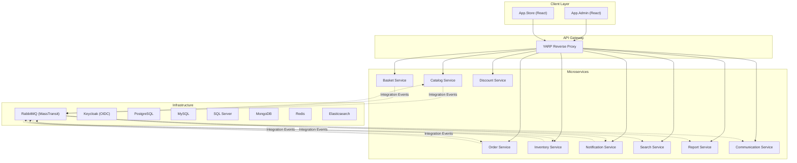

### 1.2. Cau truc phan lop cua moi Service

Moi microservice deu tuan thu mot cau truc 3 tang nhat quan:

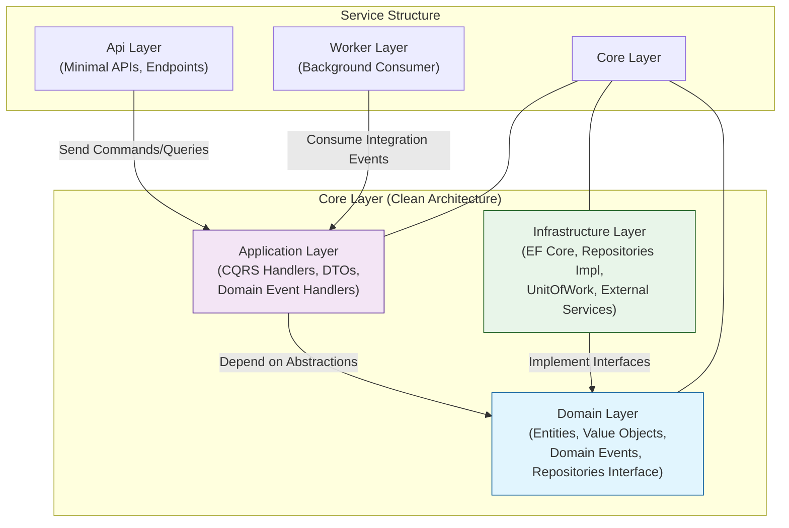

| Service | Api | Core (Domain/Application/Infrastructure) | Worker |
|---------|-----|------------------------------------------|--------|
| Catalog | Minimal APIs | Product, Category, Brand entities | StockChanged consumer |
| Basket | Minimal APIs | ShoppingCart aggregate (MongoDB) | - |
| Order | Minimal APIs | Order aggregate, OrderItem, Value Objects | BasketCheckout, ReservationExpired consumers |
| Inventory | Minimal APIs | InventoryItem, Location, Reservation | OrderCreated/Cancelled/Delivered consumers |
| Discount | Minimal APIs | Coupon entity | - |
| Notification | Minimal APIs | Notification, Template, Delivery | UpsertedProduct consumer |
| Search | Minimal APIs | ProductEntity (Elasticsearch) | UpsertedProduct, DeletedProduct consumers |
| Report | Minimal APIs | Dashboard, Charts entities | - |
| Communication | Minimal APIs | - | OrderCreated consumer (SignalR) |

---

## 2. Domain Layer - Tactical Design Patterns

### 2.1. Entity Base Class

Moi entity trong he thong deu ke thua tu `Entity<T>` - mot abstract class cung cap:
- **Identity** (`Id`) voi kieu generic
- **Audit trail** (`CreatedOnUtc`, `CreatedBy`, `LastModifiedOnUtc`, `LastModifiedBy`)

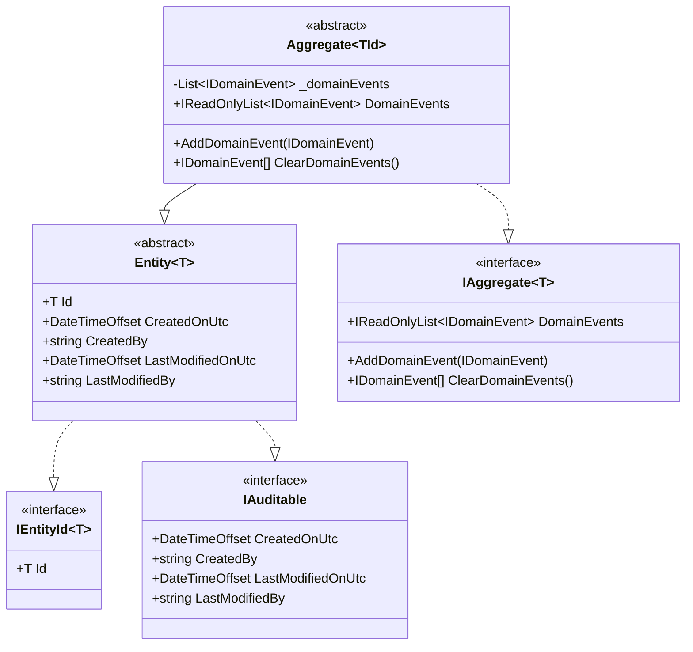

> [!NOTE]
> Moi service **tu dinh nghia** bo abstractions cua rieng minh (`Entity`, `Aggregate`, `EntityId`, interfaces). Dieu nay phu hop voi nguyen tac **Bounded Context** cua DDD - moi context co model rieng, khong chia se domain model.

### 2.2. Aggregate Roots

Aggregate Root la diem vao duy nhat de thao tac voi mot nhom entities lien quan. Trong du an:

| Service | Aggregate Root | Child Entities | Mo ta |
|---------|---------------|----------------|-------|
| **Order** | `OrderEntity` | `OrderItemEntity` | Quan ly don hang va cac san pham trong don |
| **Basket** | `ShoppingCartEntity` | `ShoppingCartItemEntity` | Gio hang va cac san pham trong gio |
| **Inventory** | `InventoryItemEntity` | `InventoryHistoryEntity`, `InventoryReservationEntity` | Ton kho, lich su va dat truoc |
| **Catalog** | Product (implicit) | `ProductImageEntity` | San pham va hinh anh |
| **Notification** | `NotificationEntity` | `DeliveryEntity`, `TemplateEntity`, `MessagePayloadEntity` | Thong bao va viec gui |

### 2.3. Value Objects

Value Objects la cac doi tuong bat bien, duoc xac dinh boi gia tri cua chung thay vi identity:

| Value Object | Service | Thuoc tinh chinh | Dac diem |
|-------------|---------|-----------------|---------|
| `Address` | Order | AddressLine, City, Country, PostalCode... | Factory method `Of()` voi validation |
| `Customer` | Order | Thong tin khach hang | Embedded trong Order |
| `OrderNo` | Order | So don hang | Dinh danh nghiep vu |
| `Discount` | Order | DiscountAmount | Ap dung giam gia |
| `Product` | Order, Inventory | Id, Price, ProductName | Reference den Catalog |
| `Money` | Catalog, Basket | Gia tri tien te | Dung chung cho gia san pham |

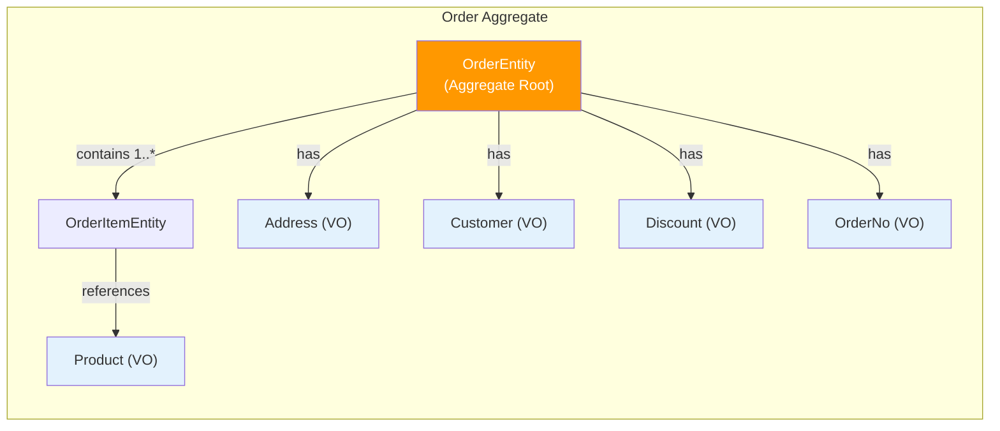

### 2.4. Domain Events

Domain Events duoc phat ra khi co thay doi trang thai quan trong trong Aggregate. Chung implement interface `IDomainEvent` (ke thua `INotification` cua MediatR).

| Service | Domain Event | Trigger |
|---------|-------------|---------|
| **Order** | `OrderCreatedDomainEvent` | Khi don hang duoc tao |
| **Order** | `OrderCancelledDomainEvent` | Khi don hang bi huy |
| **Order** | `OrderDeliveredDomainEvent` | Khi don hang duoc giao |
| **Basket** | `BasketCheckoutDomainEvent` | Khi khach hang checkout |
| **Catalog** | `UpsertedProductDomainEvent` | Khi san pham duoc tao/cap nhat |
| **Catalog** | `DeletedUnPublishedProductDomainEvent` | Khi san pham unpublished bi xoa |
| **Inventory** | `StockChangedDomainEvent` | Khi so luong ton kho thay doi |
| **Inventory** | `ReservationCreatedDomainEvent` | Khi dat truoc ton kho |
| **Inventory** | `ReservationCommittedDomainEvent` | Khi dat truoc duoc xac nhan |
| **Inventory** | `ReservationReleasedDomainEvent` | Khi dat truoc duoc giai phong |
| **Inventory** | `ReservationExpiredDomainEvent` | Khi dat truoc het han |
| **Inventory** | `InventoryItemDeletedDomainEvent` | Khi ton kho bi xoa |
| **Inventory** | `LocationChangedDomainEvent` | Khi dia diem ton kho thay doi |
| **Inventory** | `TransferOutDomainEvent` | Khi chuyen ton kho ra |

---

## 3. Application Layer - CQRS Pattern

### 3.1. CQRS Interfaces

He thong su dung **MediatR** lam pipeline de tach biet luong doc (Query) va ghi (Command):

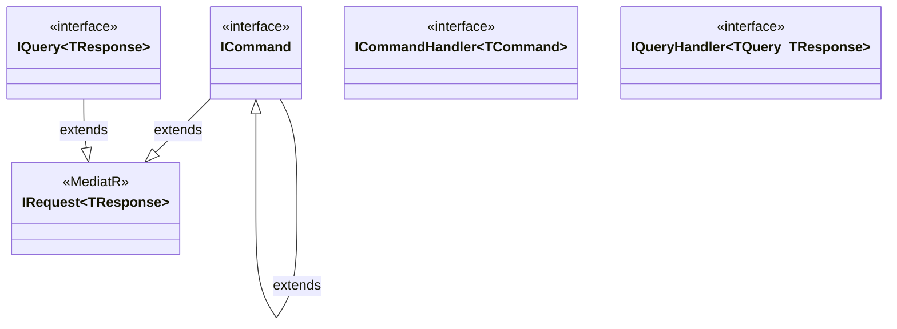

### 3.2. Luong xu ly Command

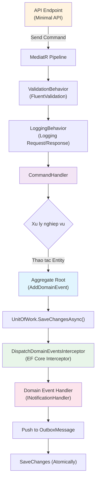

### 3.3. Danh sach Handlers theo Service

#### Catalog Service
| Loai | Handler | Chuc nang |
|------|---------|----------|
| Command | `CreateProductCommandHandler` | Tao san pham moi |
| Command | `UpdateProductCommandHandler` | Cap nhat san pham |
| Command | `DeleteProductCommandHandler` | Xoa san pham |
| Command | `PublishProductCommandHandler` | Xuat ban san pham |
| Command | `UnpublishProductCommandHandler` | Huy xuat ban |
| Command | `ChangeProductStatusCommandHandler` | Doi trang thai san pham |
| Command | `CreateCategoryCommandHandler` | Tao danh muc |
| Command | `UpdateCategoryCommandHandler` | Cap nhat danh muc |
| Command | `DeleteCategoryCommandHandler` | Xoa danh muc |
| Command | `DeleteBrandCommandHandler` | Xoa thuong hieu |
| Command | `InitialDataCommandHandler` | Khoi tao du lieu he thong |
| Query | `GetProductsQueryHandler` | Lay danh sach san pham (paging) |
| Query | `GetProductByIdQueryHandler` | Lay chi tiet san pham |
| Query | `GetPublishProductsQueryHandler` | Lay san pham da xuat ban |
| Query | `GetPublishProductByIdQueryHandler` | Lay chi tiet san pham da xuat ban |
| Query | `GetAllProductsQueryHandler` | Lay tat ca san pham |
| Query | `GetAllAvailableProductsQueryHandler` | Lay tat ca san pham hien co |
| Query | `GetCountProductQueryHandler` | Dem so luong san pham |
| Query | `GetTreeCategoriesQueryHandler` | Lay cay danh muc |
| Query | `GetAllCategoriesQueryHandler` | Lay tat ca danh muc |
| Domain Event | `UpsertedProductDomainEventHandler` | Xu ly khi san pham duoc tao/cap nhat |
| Domain Event | `DeletedUnPublishedProductDomainEventHandler` | Xu ly khi san pham unpublished bi xoa |

#### Order Service
| Loai | Handler | Chuc nang |
|------|---------|----------|
| Domain Event | `OrderCreatedDomainEventHandler` | Chuyen domain event thanh outbox message |
| Domain Event | `OrderCancelledDomainEventHandler` | Xu ly khi don hang bi huy |
| Domain Event | `OrderDeliveredDomainEventHandler` | Xu ly khi don hang duoc giao |

#### Basket Service
| Loai | Handler | Chuc nang |
|------|---------|----------|
| Command | `StoreBasketCommandHandler` | Luu gio hang |
| Command | `BasketCheckoutCommandHandler` | Checkout gio hang |
| Command | `DeleteBasketCommandHandler` | Xoa gio hang |
| Query | `GetBasketQueryHandler` | Lay thong tin gio hang |
| Domain Event | `BasketCheckoutDomainEventHandler` | Xu ly checkout event |

#### Notification Service
| Loai | Handler | Chuc nang |
|------|---------|----------|
| Command | `CreateDeliveryCommandHandler` | Tao viec gui thong bao |
| Command | `ProcessDeliveryCommandHandler` | Xu ly viec gui thong bao |
| Command | `MarkAsReadNotificationCommandHandler` | Danh dau da doc |
| Query | `GetAllNotificationsQueryHandler` | Lay tat ca thong bao |
| Query | `GetNotificationsQueryHandler` | Lay thong bao (paging) |
| Query | `GetCountNotificationUnreadQueryHandler` | Dem thong bao chua doc |
| Query | `GetTop10NotificationsUnreadQueryHandler` | Lay 10 thong bao chua doc |
| Query | `GetDueDeliveriesQueryHandler` | Lay viec gui den han |
| Query | `GetKeycloakUsersQueryHandler` | Lay danh sach user tu Keycloak |
| Query | `GetKeycloakUsersByRoleQueryHandler` | Lay user theo role |

---

## 4. Infrastructure Layer

### 4.1. Repository va Unit of Work Pattern

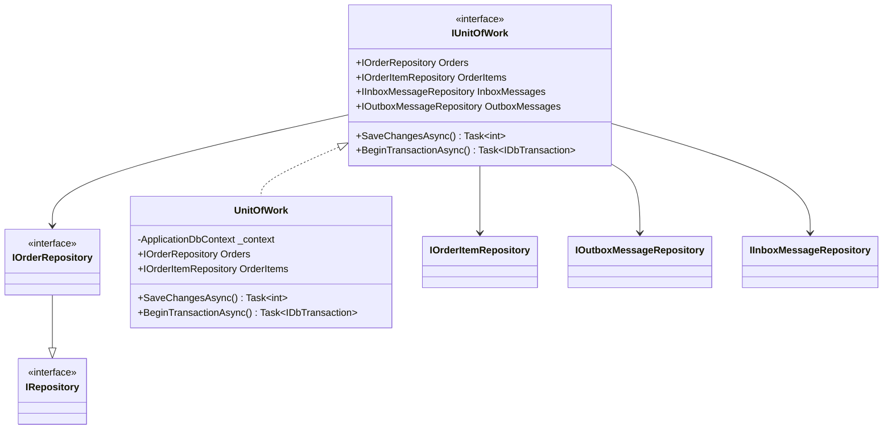

### 4.2. Repositories theo Service

| Service | Command Repository | Query Repository | Dac biet |
|---------|-------------------|-----------------|---------|
| **Order** | `IOrderRepository`, `IOrderItemRepository` | (chung) | `IOutboxMessageRepository`, `IInboxMessageRepository` |
| **Inventory** | `IInventoryItemRepository`, `ILocationRepository`, `IInventoryReservationRepository`, `IInventoryHistoryRepository` | (chung) | `IOutboxMessageRepository`, `IInboxMessageRepository` |
| **Basket** | `IBasketRepository` | (chung) | `IOutboxRepository` (MongoDB) |
| **Catalog** | (implicit qua DbContext) | (implicit) | `IOutboxRepository` |
| **Discount** | `ICouponRepository` | (chung) | - |
| **Notification** | `ICommandNotificationRepository`, `ICommandDeliveryRepository` | `IQueryNotificationRepository`, `IQueryDeliveryRepository`, `IQueryTemplateRepository` | Tach Command/Query Repository |
| **Search** | `IProductRepository` | (chung) | Elasticsearch-based |
| **Report** | `IDashboardTotalRepository`, `IOrderGrowthLineChartRepository`, `ITopProductPieChartRepository` | (chung) | - |

> [!IMPORTANT]
> **Notification Service** tach biet ro rang giua Command Repository va Query Repository, the hien CQRS o tang data access.

### 4.3. DispatchDomainEventsInterceptor

Day la EF Core `SaveChangesInterceptor` duoc su dung trong **Order** va **Inventory** services. No tu dong dispatch domain events khi `SaveChangesAsync` duoc goi:

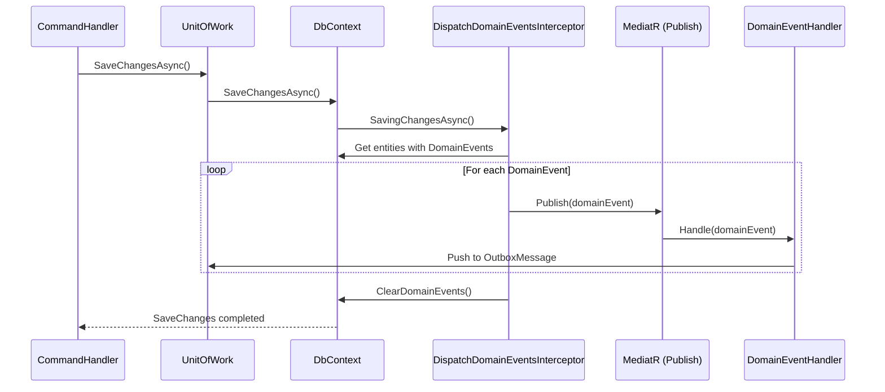

---

## 5. Event-Driven Architecture - Giao tiep giua cac Service

### 5.1. Integration Events

Integration Events la co che giao tiep **bat dong bo** giua cac Bounded Context thong qua RabbitMQ (MassTransit). Tat ca deu ke thua tu `IntegrationEvent` record trong Shared/EventSourcing:

| Integration Event | Publisher | Consumers |
|------------------|-----------|-----------|
| `BasketCheckoutIntegrationEvent` | Basket | **Order** (tao don hang) |
| `OrderCreatedIntegrationEvent` | Order | **Inventory** (dat truoc ton kho), **Communication** (realtime notification), **Report** (cap nhat bieu do) |
| `OrderCancelledIntegrationEvent` | Order | **Inventory** (giai phong ton kho) |
| `OrderDeliveredIntegrationEvent` | Order | **Inventory** (xac nhan dat truoc) |
| `UpsertedProductIntegrationEvent` | Catalog | **Search** (cap nhat index), **Notification** (thong bao san pham moi) |
| `DeletedUnPublishedProductIntegrationEvent` | Catalog | **Search** (xoa khoi index) |
| `StockChangedIntegrationEvent` | Inventory | **Catalog** (cap nhat trang thai ton kho) |
| `ReservationExpiredIntegrationEvent` | Inventory | **Order** (huy don hang het han) |

### 5.2. Outbox Pattern

De dam bao consistency giua viec luu du lieu va phat su kien, he thong su dung **Outbox Pattern**:

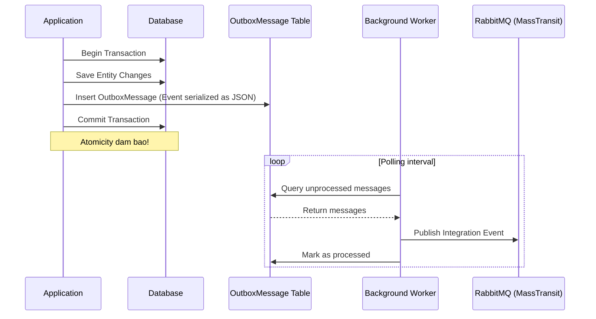

### 5.3. Inbox Pattern

**Order** va **Inventory** services su dung **Inbox Pattern** de dam bao idempotency khi nhan Integration Events:

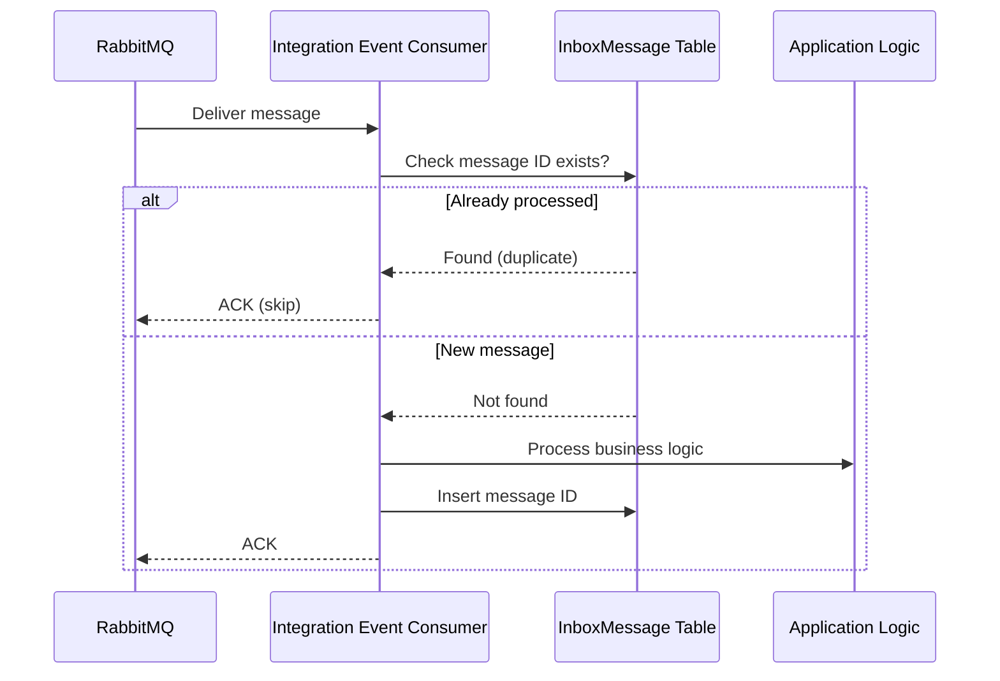

---

## 6. Luong nghiep vu chinh

### 6.1. Luong Dat Hang (Order Flow)

Day la luong nghiep vu phuc tap nhat, bao gom nhieu Bounded Context tuong tac voi nhau theo mo hinh **Choreography-based Saga**:

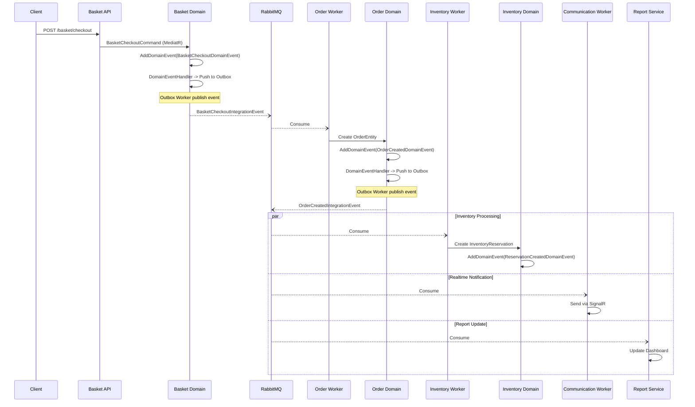

### 6.2. Luong Huy Don Hang (Compensation)

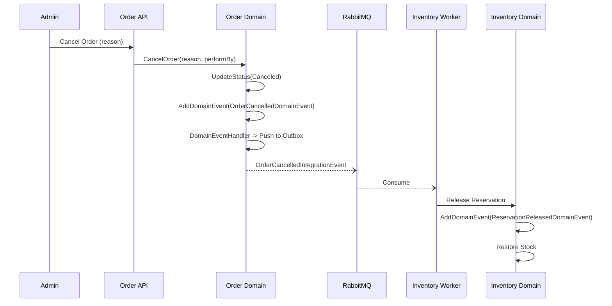

### 6.3. Luong Catalog -> Search Sync

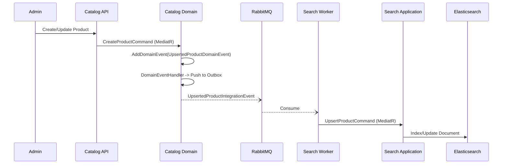

---

## 7. Cross-Cutting Concerns

### 7.1. MediatR Pipeline Behaviors

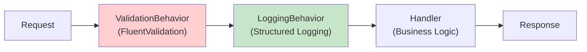

| Behavior | Chuc nang |
|----------|----------|
| `ValidationBehavior` | Tu dong validate request bang FluentValidation truoc khi den handler |
| `LoggingBehavior` | Log thong tin request/response de tracing va debug |

### 7.2. Shared Libraries

| Library | Chuc nang |
|---------|----------|
| **BuildingBlocks** | CQRS interfaces, Behaviors, Exceptions, Pagination, Swagger, Authentication, Logging, Validators |
| **Common** | Configurations, Helpers, Models dung chung |
| **Contracts** | Shared DTOs va contracts giua cac service |
| **EventSourcing** | Integration Events definitions, MassTransit extensions |

### 7.3. Exception Handling

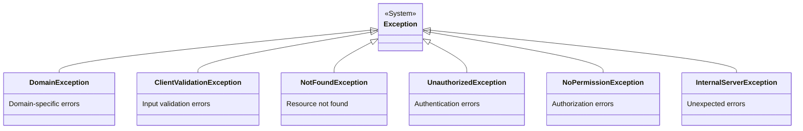

---

## 8. Database Strategy

| Service | Database | Technology | Ly do |
|---------|----------|-----------|-------|
| Catalog | PostgreSQL | EF Core | Quan he phuc tap giua Product/Category/Brand |
| Order | PostgreSQL | EF Core | ACID transactions cho don hang |
| Inventory | PostgreSQL | EF Core | Consistency cho ton kho |
| Basket | MongoDB | MongoDB Driver | Schema linh hoat cho gio hang |
| Discount | PostgreSQL | EF Core/Dapper | Don gian, hieu suat cao |
| Notification | PostgreSQL | EF Core | Luu tru thong bao va template |
| Search | Elasticsearch | NEST Client | Full-text search |
| Report | MySQL | EF Core | Read-optimized cho bao cao |
| Communication | - | In-memory | Chi xu ly realtime, khong luu tru |

---

## 9. Bounded Context Map

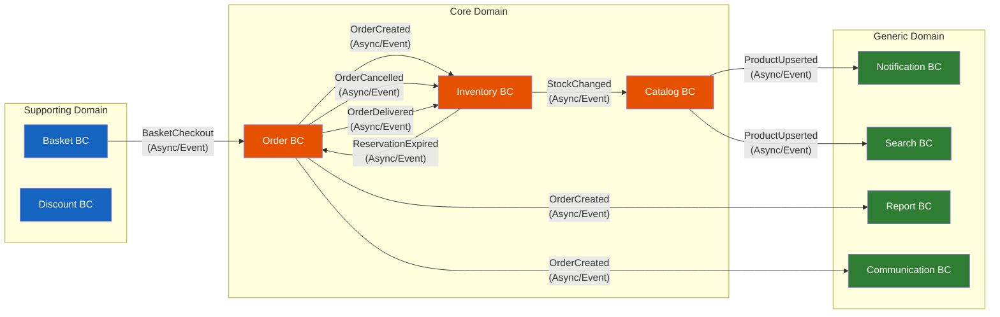

> [!TIP]
> Tat ca giao tiep giua cac Bounded Context deu thong qua **Integration Events** (bat dong bo qua RabbitMQ). Khong co Bounded Context nao goi truc tiep API cua context khac, dam bao **loose coupling** toi da.

---

## 10. Tong ket

### Diem manh cua thiet ke DDD trong du an

1. **Bounded Context ro rang**: Moi service co domain model rieng, khong chia se entity giua cac context.
2. **Rich Domain Model**: Aggregate Roots chua business logic (factory methods, domain methods, domain events) thay vi anemic model.
3. **Event-Driven Communication**: Tat ca giao tiep inter-service deu bat dong bo qua events, dao bao loose coupling.
4. **Outbox/Inbox Pattern**: Dam bao reliable messaging va idempotency.
5. **CQRS nhat quan**: Tach biet ro rang Command va Query handlers qua MediatR pipeline.
6. **Clean Architecture**: Dependency inversion - Domain layer khong phu thuoc vao Infrastructure.

### Diem can cai thien

1. **Value Objects chua immutable hoan toan**: `Address` co public setters, nen su dung `record` hoac private setters.
2. **Thieu domain validation tap trung**: Mot so entities khong co invariant checks day du trong constructor/factory methods.
3. **Bo abstractions lap lai**: Moi service dinh nghia lai `Entity`, `Aggregate`, `EntityId` - co the extract thanh shared package cho DDD base classes ma van giu duoc bounded context independence.

---

*Tai lieu nay duoc tao tu dong bang code-graph-rag-index MCP server va phan tich source code truc tiep.*
*Ngay tao: 2026-02-15*
