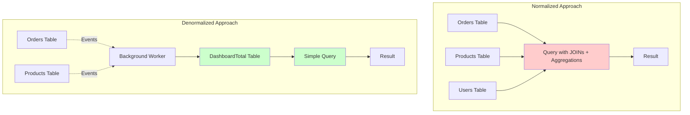
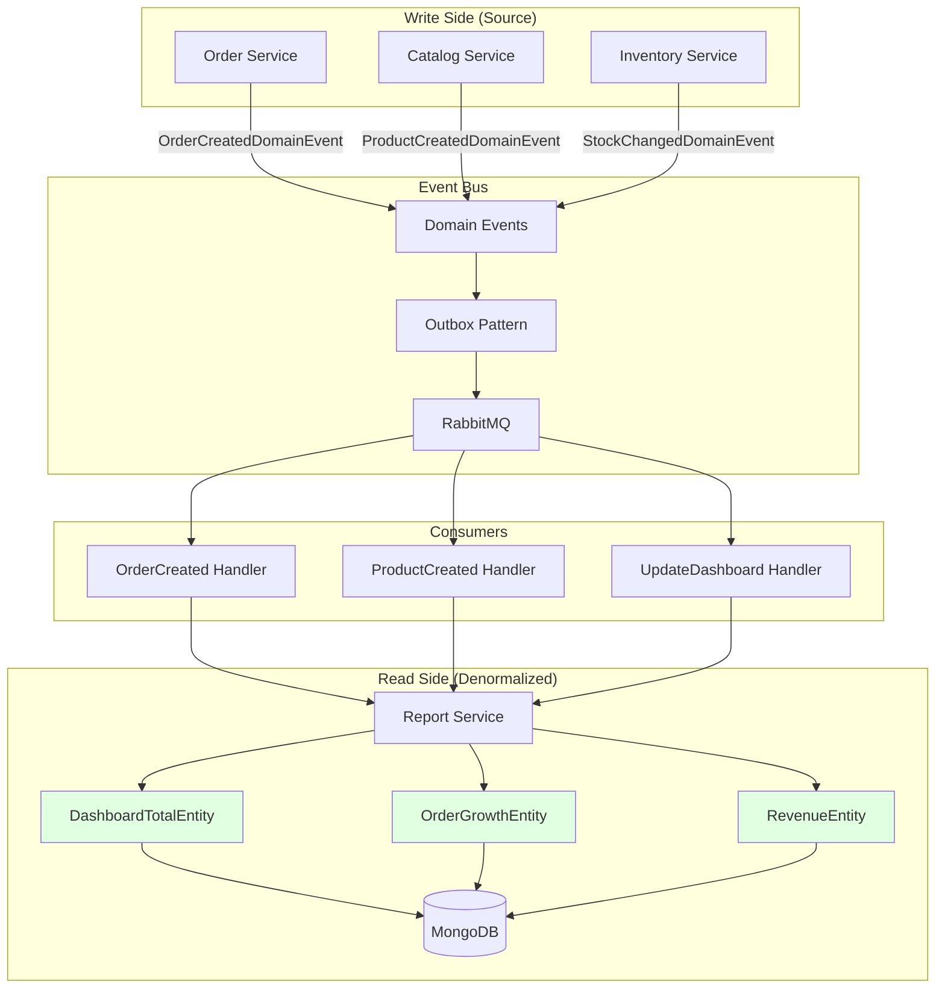
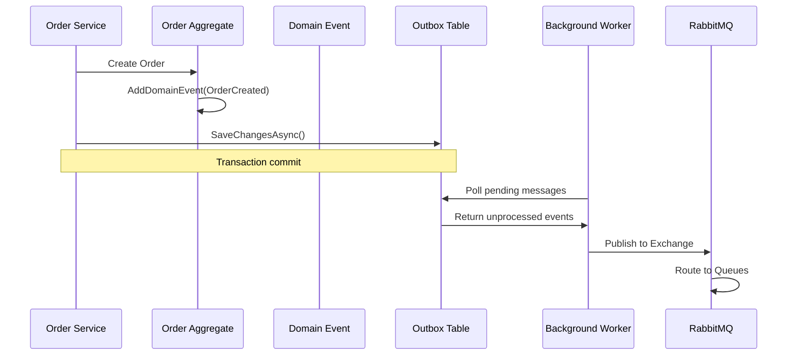
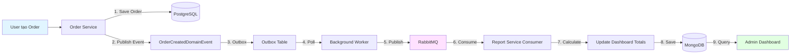
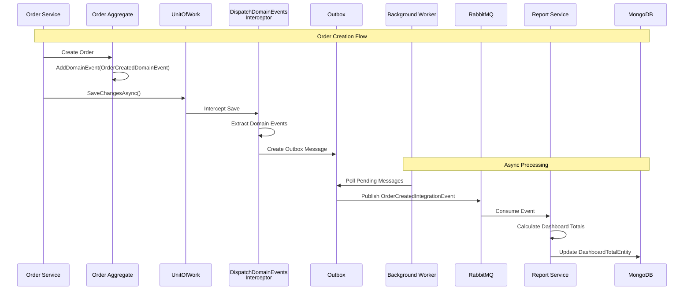
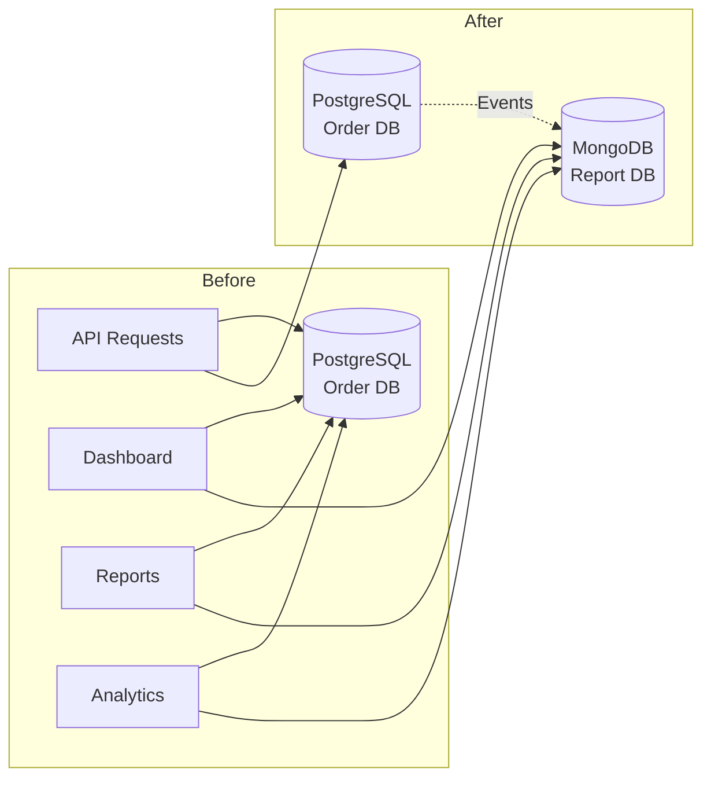
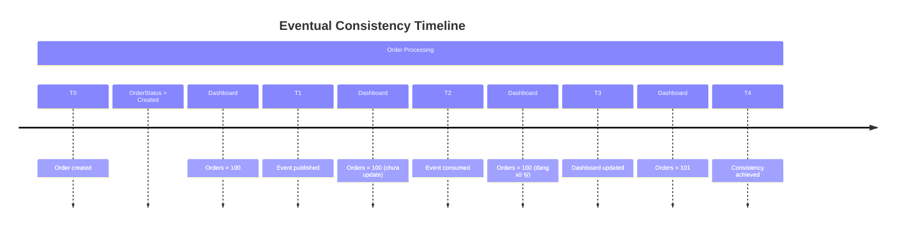

# Denormalization for Read Models - Tài Liệu Chi Tiết

## ProgCoder Shop Microservices

---

## Mục Lục

1. [Tổng Quan](#1-tổng-quan)
2. [Denormalization Là Gì?](#2-denormalization-là-gì)
3. [Kiến Trúc Triển Khai](#3-kiến-trúc-triển-khai)
4. [Ví Dụ Thực Tế - Report Service](#4-ví-dụ-thực-tế---report-service)
5. [Cơ Chế Đồng Bộ Dữ Liệu](#5-cơ-chế-đồng-bộ-dữ-liệu)
6. [So Sánh Normalized vs Denormalized](#6-so-sánh-normalized-vs-denormalized)
7. [Lợi Ích và Trade-offs](#7-lợi-ích-và-trade-offs)
8. [Best Practices](#8-best-practices)
9. [Kết Luận](#9-kết-luận)

---

## 1. Tổng Quan

### 1.1. Bối Cảnh Dự Án

**ProgCoder Shop Microservices** là hệ thống E-commerce với:
- Tỷ lệ Read/Write cao (~95:5)
- Yêu cầu hiệu suất cao cho operations đọc
- Dashboard real-time cho admin
- Báo cáo và thống kê phức tạp

### 1.2. Tại Sao Cần Denormalization?

```
┌─────────────────────────────────────────────────────────────┐
│                    Problem Statement                        │
├─────────────────────────────────────────────────────────────┤
│  Dashboard cần hiển thị:                                    │
│  ├── Tổng số đơn hàng (từ Order Service)                    │
│  ├── Tổng số sản phẩm (từ Catalog Service)                  │
│  ├── Tổng doanh thu (từ Order Service)                      │
│  └── Số đơn chờ xử lý (từ Order Service)                    │
│                                                             │
│  Giải pháp truyền thống: JOIN + COUNT nhiều bảng            │
│  => Chậm, tốn tài nguyên, không scalable                    │
└─────────────────────────────────────────────────────────────┘
```

---

## 2. Denormalization Là Gì?

### 2.1. Định Nghĩa

**Denormalization** là kỹ thuật lưu trữ dữ liệu dưới dạng **đã được tính toán trước (pre-aggregated)** và **được tối ưu hóa cho việc đọc**, thay vì lưu trữ dữ liệu ở dạng normalized (chuẩn hóa).

### 2.2. Nguyên Tắc Hoạt Động



### 2.3. Trong Context CQRS

```
┌────────────────────────────────────────────────────────────┐
│                      CQRS Architecture                      │
├────────────────────────────────────────────────────────────┤
│                                                             │
│   COMMAND SIDE                    QUERY SIDE               │
│   (Write Model)                   (Read Model)             │
│                                                             │
│   ┌─────────────┐                ┌─────────────────────┐   │
│   │   Orders    │                │  DashboardTotal     │   │
│   │   (Normalized)│              │  (Denormalized)     │   │
│   │             │                │                     │   │
│   │ - OrderId   │    Events      │ - Title             │   │
│   │ - CustomerId│───────────────>│ - Count (pre-calc)  │   │
│   │ - Status    │                │ - Bg/Text/Icon      │   │
│   │ - Total     │                │   (UI-ready)        │   │
│   └─────────────┘                └─────────────────────┘   │
│                                                             │
│   Single Source of Truth       Optimized for Reading       │
│                                                             │
└────────────────────────────────────────────────────────────┘
```

---

## 3. Kiến Trúc Triển Khai

### 3.1. Sơ Đồ Tổng Thể



### 3.2. Giải Thích Chi Tiết Sơ Đồ Tổng Thể

#### 3.2.1. Write Side (Source) - Nguồn Dữ Liệu

```
┌─────────────────────────────────────────────────────────────┐
│                    WRITE SIDE (SOURCE)                      │
├─────────────────────────────────────────────────────────────┤
│                                                             │
│  ┌─────────────────┐  ┌─────────────────┐                   │
│  │  Order Service  │  │ Catalog Service │                   │
│  │  ─────────────  │  │  ─────────────  │                   │
│  │  • Orders       │  │  • Products     │                   │
│  │  • OrderItems   │  │  • Categories   │                   │
│  │  • Payments     │  │  • Brands       │                   │
│  └────────┬────────┘  └────────┬────────┘                   │
│           │                    │                            │
│           │ Domain Events      │ Domain Events              │
│           ▼                    ▼                            │
│  ┌─────────────────────────────────────┐                   │
│  │  Inventory Service                  │                   │
│  │  ────────────────                   │                   │
│  │  • InventoryItems                   │                   │
│  │  • Reservations                     │                   │
│  │  • StockHistory                     │                   │
│  └─────────────────────────────────────┘                   │
│                                                             │
│  Mục đích: Lưu trữ dữ liệu gốc (Single Source of Truth)    │
│  Database: PostgreSQL (Normalized)                         │
└─────────────────────────────────────────────────────────────┘
```

**Chi tiết:**
- **Order Service**: Quản lý đơn hàng, khi có đơn hàng mới sẽ phát ra `OrderCreatedDomainEvent`
- **Catalog Service**: Quản lý sản phẩm, phát ra `ProductCreatedDomainEvent` khi thêm sản phẩm
- **Inventory Service**: Quản lý tồn kho, phát ra `StockChangedDomainEvent` khi thay đổi tồn kho

#### 3.2.2. Event Bus - Trung Gian Truyền Tin

```
┌─────────────────────────────────────────────────────────────┐
│                    EVENT BUS LAYER                          │
├─────────────────────────────────────────────────────────────┤
│                                                             │
│  ┌──────────────┐    ┌──────────────┐    ┌──────────────┐  │
│  │ Domain Events│───▶│    Outbox    │───▶│   RabbitMQ   │  │
│  │  (MediatR)   │    │   Pattern    │    │   Broker     │  │
│  └──────────────┘    └──────────────┘    └──────────────┘  │
│                                                             │
│  1. DOMAIN EVENTS                                           │
│     • Phát ra khi aggregate thay đổi state                  │
│     • In-memory (MediatR INotification)                     │
│     • Ví dụ: OrderCreatedDomainEvent                        │
│                                                             │
│  2. OUTBOX PATTERN                                          │
│     • Lưu events vào database table (cùng transaction)      │
│     • Đảm bảo không mất events nếu service crash            │
│     • Background worker gửi events đến message broker       │
│                                                             │
│  3. RABBITMQ                                                │
│     • Message broker phân phối events                       │
│     • Durable queues (survive restart)                      │
│     • Publish/Subscribe pattern                             │
│                                                             │
└─────────────────────────────────────────────────────────────┘
```

**Luồng dữ liệu qua Event Bus:**



#### 3.2.3. Read Side (Denormalized) - Dữ Liệu Tối Ưu Cho Đọc

```
┌─────────────────────────────────────────────────────────────┐
│                  READ SIDE (DENORMALIZED)                   │
├─────────────────────────────────────────────────────────────┤
│                                                             │
│  ┌─────────────────────────────────────────────────────┐   │
│  │              Report Service                         │   │
│  │  ┌───────────────┐  ┌───────────────┐              │   │
│  │  │DashboardTotal │  │ OrderGrowth   │              │   │
│  │  │   Entity      │  │   Entity      │              │   │
│  │  │ ────────────  │  │ ────────────  │              │   │
│  │  │ Title         │  │ Date          │              │   │
│  │  │ Count         │  │ OrderCount    │              │   │
│  │  │ Bg/Text/Icon  │  │ Revenue       │              │   │
│  │  │ (UI-ready)    │  │ (Chart data)  │              │   │
│  │  └───────┬───────┘  └───────┬───────┘              │   │
│  │          │                  │                       │   │
│  │  ┌───────┴───────┐  ┌───────┴───────┐              │   │
│  │  │ RevenueEntity │  │   ...more     │              │   │
│  │  │ ────────────  │  │   read models │              │   │
│  │  │ Month         │  │               │              │   │
│  │  │ TotalRevenue  │  │               │              │   │
│  │  │ GrowthRate    │  │               │              │   │
│  │  └───────────────┘  └───────────────┘              │   │
│  └─────────────────────────────────────────────────────┘   │
│                           │                                 │
│                           ▼                                 │
│  ┌─────────────────────────────────────────────────────┐   │
│  │                  MongoDB                            │   │
│  │  • Flexible schema (phù hợp với denormalized data)  │   │
│  │  • High read throughput                             │   │
│  │  • Horizontal scaling (sharding)                    │   │
│  └─────────────────────────────────────────────────────┘   │
│                                                             │
│  Mục đích: Lưu trữ dữ liệu đã tính toán sẵn, tối ưu đọc   │
└─────────────────────────────────────────────────────────────┘
```

**Các Read Models trong Report Service:**

| Entity | Mục Đích | Dữ Liệu Lưu Trữ |
|--------|----------|-----------------|
| **DashboardTotalEntity** | Widget tổng quan | Title, Count, Bg, Text, Icon |
| **OrderGrowthEntity** | Biểu đồ tăng trưởng | Date, OrderCount, Revenue |
| **RevenueEntity** | Báo cáo doanh thu | Month, TotalRevenue, GrowthRate |

#### 3.2.4. Consumers - Xử Lý Events

```
┌─────────────────────────────────────────────────────────────┐
│                    CONSUMERS                                │
├─────────────────────────────────────────────────────────────┤
│                                                             │
│  ┌─────────────────────────────────────────────────────┐   │
│  │           OrderCreated Handler                      │   │
│  │  ─────────────────────────────                      │   │
│  │  Input: OrderCreatedIntegrationEvent               │   │
│  │  Actions:                                           │   │
│  │    1. Tính toán lại Total Orders                   │   │
│  │    2. Cập nhật DashboardTotalEntity                │   │
│  │    3. Thêm record vào OrderGrowthEntity            │   │
│  └─────────────────────────────────────────────────────┘   │
│                           │                                 │
│  ┌────────────────────────┼─────────────────────────────┐   │
│  │                        │                             │   │
│  ▼                        ▼                             ▼   │
│  ┌─────────────────┐  ┌─────────────────┐  ┌─────────────────┐│
│  │ProductCreated   │  │UpdateDashboard  │  │  ...more        ││
│  │   Handler       │  │    Handler      │  │  handlers       ││
│  │ ─────────────── │  │ ─────────────── │  │ ─────────────── ││
│  │ Cập nhật Total  │  │ Nhận gRPC calls │  │ Xử lý các       ││
│  │ Products trong  │  │ từ services     │  │ events khác     ││
│  │ Dashboard       │  │ khác để update  │  │                 ││
│  └─────────────────┘  └─────────────────┘  └─────────────────┘│
│                                                             │
│  Mỗi consumer chạy độc lập, có thể scale riêng             │
└─────────────────────────────────────────────────────────────┘
```

#### 3.2.5. Luồng Dữ Liệu End-to-End



**Chi tiết từng bước:**

| Bước | Thành Phần | Hành Động | Thời Gian |
|------|------------|-----------|-----------|
| 1 | Order Service | Lưu order vào PostgreSQL | ~50ms |
| 2 | Order Aggregate | Phát OrderCreatedDomainEvent | In-memory |
| 3 | Outbox Pattern | Lưu event vào Outbox table (cùng transaction) | ~10ms |
| 4 | Background Worker | Poll messages từ Outbox | Every 5s |
| 5 | RabbitMQ | Nhận và route message | ~5ms |
| 6 | Consumer | Consume message từ queue | ~10ms |
| 7 | Report Service | Tính toán lại dashboard totals | ~20ms |
| 8 | MongoDB | Lưu denormalized data | ~10ms |
| 9 | Dashboard | Query và hiển thị | ~5ms |

**Tổng thời gian đồng bộ:** ~100-200ms (eventual consistency)

### 3.3. Các Thành Phần Chính

| Thành phần | Vai trò | Công nghệ |
|------------|---------|-----------|
| **Write Models** | Lưu trữ dữ liệu gốc | PostgreSQL |
| **Domain Events** | Thông báo thay đổi | MediatR |
| **Outbox** | Đảm bảo delivery | PostgreSQL Table |
| **Message Broker** | Phân phối events | RabbitMQ |
| **Read Models** | Lưu trữ denormalized | MongoDB |
| **Consumers** | Cập nhật read models | Background Service |

---

## 4. Ví Dụ Thực Tế - Report Service

### 4.1. Cấu Trúc Entity

#### 4.1.1. DashboardTotalEntity (Denormalized)

```csharp
// File: src/Services/Report/Core/Report.Domain/Entities/DashboardTotalEntity.cs

public sealed class DashboardTotalEntity : Entity<Guid>
{
    #region Fields Properties and Indexers

    /// <summary>
    /// CSS class cho màu nền (ví dụ: "bg-blue-500")
    /// </summary>
    public string? Bg { get; set; }

    /// <summary>
    /// CSS class cho màu text
    /// </summary>
    public string? Text { get; set; }

    /// <summary>
    /// Tên icon cho UI
    /// </summary>
    public string? Icon { get; set; }

    /// <summary>
    /// Tiêu đề hiển thị (ví dụ: "Total Orders")
    /// </summary>
    public string? Title { get; set; }

    /// <summary>
    /// Giá trị đã được format (ví dụ: "1,234")
    /// </summary>
    public string? Count { get; set; }

    #endregion

    #region Factories

    public static DashboardTotalEntity Create(
        string title,
        string count,
        string? bg = null,
        string? text = null,
        string? icon = null,
        string? performedBy = null)
    {
        if (string.IsNullOrWhiteSpace(title))
            throw new ArgumentException("Title cannot be null or empty.", nameof(title));

        if (string.IsNullOrWhiteSpace(count))
            throw new ArgumentException("Count cannot be null or empty.", nameof(count));

        var entity = new DashboardTotalEntity
        {
            Id = Guid.NewGuid(),
            Title = title,
            Count = count,
            Bg = bg,
            Text = text,
            Icon = icon,
            CreatedBy = performedBy,
            LastModifiedBy = performedBy,
            CreatedOnUtc = DateTimeOffset.UtcNow,
            LastModifiedOnUtc = DateTimeOffset.UtcNow
        };

        return entity;
    }

    #endregion

    #region Methods

    /// <summary>
    /// Cập nhật giá trị count - được gọi khi có event mới
    /// </summary>
    public void UpdateCount(string count, string performedBy)
    {
        if (string.IsNullOrWhiteSpace(count))
            throw new ArgumentException("Count cannot be null or empty.", nameof(count));

        Count = count;
        LastModifiedBy = performedBy;
        LastModifiedOnUtc = DateTimeOffset.UtcNow;
    }

    /// <summary>
    /// Cập nhật thông tin hiển thị
    /// </summary>
    public void UpdateDisplay(string? bg, string? text, string? icon, string performedBy)
    {
        Bg = bg;
        Text = text;
        Icon = icon;
        LastModifiedBy = performedBy;
        LastModifiedOnUtc = DateTimeOffset.UtcNow;
    }

    #endregion
}
```

#### 4.1.2. DashboardTotalDto

```csharp
// File: src/Services/Report/Core/Report.Application/Dtos/DashboardTotals/DashboardTotalDto.cs

public sealed class DashboardTotalDto : DtoId<Guid>
{
    public string? Bg { get; set; }
    public string? Text { get; set; }
    public string? Icon { get; set; }
    public string? Title { get; set; }
    public string? Count { get; set; }
}
```

### 4.2. Command Handler (Cập Nhật Dữ Liệu)

```csharp
// File: src/Services/Report/Core/Report.Application/Features/DashboardTotal/Commands/UpdateDashboardTotalCommand.cs

public sealed record UpdateDashboardTotalCommand(
    UpdateDashboardTotalDto Dto, 
    Actor Actor
) : ICommand<Unit>;

public sealed class UpdateDashboardTotalCommandHandler(
    IDashboardTotalRepository repository
) : ICommandHandler<UpdateDashboardTotalCommand, Unit>
{
    public async Task<Unit> Handle(
        UpdateDashboardTotalCommand command, 
        CancellationToken cancellationToken)
    {
        // Lấy tất cả dashboard totals
        var entities = await repository.GetAllAsync(cancellationToken)
            ?? throw new NotFoundException(MessageCode.ResourceNotFound);

        // Cập nhật entity phù hợp với title
        foreach (var entity in entities)
        {
            if (entity.Title == command.Dto.Title)
            {
                entity.UpdateCount(command.Dto.Count!, command.Actor.ToString());
            }
        }

        // Bulk update
        await repository.BulkUpsertAsync(entities, cancellationToken);

        return Unit.Value;
    }
}
```

### 4.3. Query Handler (Đọc Dữ Liệu)

```csharp
// File: src/Services/Report/Core/Report.Application/Features/DashboardTotal/Queries/GetDashboardTotalsQuery.cs

public sealed record GetDashboardTotalsQuery() : IQuery<DashboardTotalsResult>;

public sealed class GetDashboardTotalsQueryHandler(
    IDashboardTotalRepository repository,
    IMapper mapper
) : IQueryHandler<GetDashboardTotalsQuery, DashboardTotalsResult>
{
    public async Task<DashboardTotalsResult> Handle(
        GetDashboardTotalsQuery query, 
        CancellationToken cancellationToken)
    {
        // Đơn giản chỉ là SELECT * - không cần JOIN hay aggregation
        var result = await repository.GetAllAsync(cancellationToken);
        var items = mapper.Map<List<DashboardTotalDto>>(result);
        
        return new DashboardTotalsResult(items);
    }
}
```

### 4.4. gRPC Service (Nhận Cập Nhật Từ Các Service Khác)

```csharp
// File: src/Services/Report/Api/Report.Grpc/Services/ReportGrpcService.cs

public class ReportGrpcService : ReportProtoService.ReportProtoServiceBase
{
    private readonly IMediator _mediator;

    public ReportGrpcService(IMediator mediator)
    {
        _mediator = mediator;
    }

    /// <summary>
    /// Cập nhật dashboard total từ các service khác thông qua gRPC
    /// </summary>
    public override async Task<UpdateDashboardTotalResponse> UpdateDashboardTotal(
        UpdateDashboardTotalRequest request,
        ServerCallContext context)
    {
        try
        {
            var dto = new UpdateDashboardTotalDto
            {
                Title = request.Title,
                Count = request.Count,
                Bg = request.Bg,
                Text = request.Text,
                Icon = request.Icon
            };

            var actor = new Actor(request.PerformedBy, "ReportGrpcService");
            var command = new UpdateDashboardTotalCommand(dto, actor);

            await _mediator.Send(command);

            return new UpdateDashboardTotalResponse
            {
                Success = true,
                Message = "Dashboard total updated successfully"
            };
        }
        catch (Exception ex)
        {
            return new UpdateDashboardTotalResponse
            {
                Success = false,
                Message = ex.Message
            };
        }
    }
}
```

---

## 5. Cơ Chế Đồng Bộ Dữ Liệu

### 5.1. Luồng Dữ Liệu Chi Tiết



### 5.2. Domain Event Handler

```csharp
// Ví dụ: OrderCreatedDomainEventHandler trong Order Service

public sealed class OrderCreatedDomainEventHandler(
    IUnitOfWork unitOfWork,
    ILogger<OrderCreatedDomainEventHandler> logger
) : INotificationHandler<OrderCreatedDomainEvent>
{
    public async Task Handle(
        OrderCreatedDomainEvent @event, 
        CancellationToken cancellationToken)
    {
        logger.LogInformation(
            "Domain Event handled: {DomainEvent} for OrderId: {OrderId}", 
            @event.GetType().Name, 
            @event.Order.Id
        );

        // Tạo integration event để gửi đến Report Service
        var message = new OrderCreatedIntegrationEvent
        {
            OrderId = @event.Order.Id,
            OrderNo = @event.Order.OrderNo,
            CustomerEmail = @event.Order.Customer.Email,
            Total = @event.Order.Total,
            Items = @event.Order.Items.Select(oi => new OrderItemIntegrationEvent
            {
                ProductId = oi.ProductId,
                ProductSku = oi.Product.Sku,
                ProductName = oi.Product.Name,
                Quantity = oi.Quantity,
                UnitPrice = oi.UnitPrice,
                LineTotal = oi.LineTotal
            }).ToList()
        };

        // Lưu vào outbox để đảm bảo delivery
        var outboxMessage = OutboxMessageEntity.Create(
            id: Guid.NewGuid(),
            eventType: message.EventType!,
            content: JsonConvert.SerializeObject(message),
            occurredOnUtc: DateTimeOffset.UtcNow
        );

        await unitOfWork.OutboxMessages.AddAsync(outboxMessage, cancellationToken);
        
        logger.LogInformation(
            "Created outbox message {OutboxMessageId} for OrderId: {OrderId}", 
            outboxMessage.Id, 
            @event.Order.Id
        );
    }
}
```

### 5.3. Integration Event Consumer

```csharp
// Trong Report Service - Consumer nhận event từ RabbitMQ

public sealed class OrderCreatedIntegrationEventHandler(
    IUnitOfWork unitOfWork,
    ILogger<OrderCreatedIntegrationEventHandler> logger
) : IConsumer<OrderCreatedIntegrationEvent>
{
    public async Task Consume(ConsumeContext<OrderCreatedIntegrationEvent> context)
    {
        var messageId = context.MessageId ?? Guid.NewGuid();
        
        // Idempotency check
        var existingMessage = await unitOfWork.InboxMessages
            .GetByMessageIdAsync(messageId, context.CancellationToken);
        
        if (existingMessage != null)
        {
            logger.LogInformation("Message already processed, skipping");
            return;
        }

        // Lưu inbox record
        var inboxMessage = InboxMessageEntity.Create(
            messageId,
            context.Message.GetType().AssemblyQualifiedName!,
            JsonSerializer.Serialize(context.Message),
            DateTimeOffset.UtcNow
        );
        
        await unitOfWork.InboxMessages.AddAsync(inboxMessage, context.CancellationToken);

        // Cập nhật dashboard totals
        await UpdateDashboardTotalsAsync(context.Message, context.CancellationToken);
        
        await unitOfWork.SaveChangesAsync(context.CancellationToken);
    }

    private async Task UpdateDashboardTotalsAsync(
        OrderCreatedIntegrationEvent message, 
        CancellationToken cancellationToken)
    {
        // Lấy current totals
        var totalOrders = await unitOfWork.DashboardTotals
            .GetByTitleAsync("Total Orders", cancellationToken);
        
        var totalRevenue = await unitOfWork.DashboardTotals
            .GetByTitleAsync("Total Revenue", cancellationToken);
        
        // Tính toán giá trị mới
        var currentOrderCount = int.Parse(totalOrders!.Count!.Replace(",", ""));
        var newOrderCount = currentOrderCount + 1;
        
        var currentRevenue = decimal.Parse(totalRevenue!.Count!.Replace(",", "").Replace("$", ""));
        var newRevenue = currentRevenue + message.Total;
        
        // Update entities
        totalOrders.UpdateCount(newOrderCount.ToString("N0"), "system");
        totalRevenue.UpdateCount($"${newRevenue:N2}", "system");
        
        await unitOfWork.DashboardTotals.UpdateAsync(totalOrders, cancellationToken);
        await unitOfWork.DashboardTotals.UpdateAsync(totalRevenue, cancellationToken);
    }
}
```

---

## 6. So Sánh Normalized vs Denormalized

### 6.1. Ví Dụ: Dashboard Total Orders

#### Cách 1: Normalized (Truyền Thống)

```sql
-- Query phức tạp với JOIN và Aggregation
SELECT 
    'Total Orders' as Title,
    COUNT(DISTINCT o.Id) as Count,
    'bg-blue-500' as Bg,
    'text-white' as Text,
    'ShoppingCartIcon' as Icon
FROM Orders o
WHERE o.Status != 'Cancelled'

UNION ALL

SELECT 
    'Total Revenue' as Title,
    CONCAT('$', FORMAT(SUM(o.Total), 'N2')) as Count,
    'bg-green-500' as Bg,
    'text-white' as Text,
    'DollarIcon' as Icon
FROM Orders o
WHERE o.Status = 'Completed'

UNION ALL

SELECT 
    'Total Products' as Title,
    COUNT(DISTINCT p.Id) as Count,
    'bg-purple-500' as Bg,
    'text-white' as Text,
    'PackageIcon' as Icon
FROM Products p
WHERE p.IsActive = true;
```

**Vấn đề:**
- Query chậm với dữ liệu lớn
- Tốn tài nguyên CPU cho aggregation
- Không scalable khi có nhiều concurrent requests

#### Cách 2: Denormalized (CQRS)

```csharp
// Query đơn giản - chỉ là SELECT
public async Task<List<DashboardTotalDto>> GetDashboardTotalsAsync()
{
    // MongoDB query đơn giản
    return await _collection
        .Find(_ => true)
        .ToListAsync();
}
```

```sql
-- Equivalent SQL
SELECT * FROM DashboardTotals;
```

**Ưu điểm:**
- Query cực nhanh (O(1) hoặc O(n) với n nhỏ)
- Không cần JOIN hay aggregation
- Dễ dàng cache

### 6.2. Bảng So Sánh Chi Tiết

| Tiêu chí | Normalized | Denormalized |
|----------|------------|--------------|
| **Query Complexity** | Cao (JOINs, Aggregations) | Thấp (Simple SELECT) |
| **Query Performance** | Chậm với data lớn | Nhanh (pre-calculated) |
| **Write Performance** | Nhanh | Chậm hơn (cần update nhiều nơi) |
| **Storage** | Ít hơn | Nhiều hơn (data duplication) |
| **Consistency** | Strong | Eventual |
| **Scalability** | Khó scale reads | Dễ scale reads |
| **Code Complexity** | Thấp | Cao (cần sync mechanism) |
| **Use Case** | OLTP | OLAP, Dashboard, Reporting |

---

## 7. Lợi Ích và Trade-offs

### 7.1. Lợi Ích

#### 7.1.1. Hiệu Suất Đọc Cực Cao

```csharp
// Benchmark so sánh (giả định)
// Normalized: ~500ms với 1M orders
// Denormalized: ~5ms

public class DashboardPerformanceBenchmark
{
    [Benchmark]
    public async Task NormalizedQuery()
    {
        // Query với JOIN và aggregation
        var result = await _context.Orders
            .Include(o => o.Items)
            .GroupBy(o => o.Status)
            .Select(g => new { Status = g.Key, Count = g.Count() })
            .ToListAsync();
    }

    [Benchmark]
    public async Task DenormalizedQuery()
    {
        // Simple SELECT
        var result = await _dashboardRepository.GetAllAsync();
    }
}
```

#### 7.1.2. Tối Ưu Cho UI Cụ Thể

```csharp
// Dữ liệu đã được format sẵn cho frontend
public class DashboardTotalDto
{
    public string Title { get; set; }      // "Total Orders"
    public string Count { get; set; }      // "1,234" (đã format)
    public string Bg { get; set; }         // "bg-blue-500" (Tailwind class)
    public string Text { get; set; }       // "text-white"
    public string Icon { get; set; }       // "ShoppingCartIcon"
}

// Frontend chỉ cần render trực tiếp
// Không cần xử lý logic hay format
```

#### 7.1.3. Giảm Tải Database Chính



### 7.2. Trade-offs và Hạn Chế

#### 7.2.1. Eventual Consistency



**Giải pháp:**
- Hiển thị "Last updated: 2 minutes ago" cho user
- Sử dụng cache với TTL ngắn
- Cung cấp nút "Refresh" cho manual update

#### 7.2.2. Data Duplication

```csharp
// Dữ liệu được lưu ở nhiều nơi
// Order Service: Orders table (normalized)
// Report Service: DashboardTotals table (denormalized)

// Khi order được tạo:
// 1. Lưu vào Orders table
// 2. Publish event
// 3. Update DashboardTotals

// Risk: Data inconsistency nếu step 3 fail
// Mitigation: Outbox pattern + retry
```

#### 7.2.3. Complexity Tăng

| Layer | Complexity Added |
|-------|------------------|
| **Infrastructure** | Message broker, Outbox, Inbox |
| **Application** | Event handlers, Consumers |
| **DevOps** | Monitoring, Dead letter queues |
| **Testing** | Integration tests cho event flow |

---

## 8. Best Practices

### 8.1. Khi Nào Nên Dùng Denormalization

```
✅ NÊN DÙNG:
├── Dashboard real-time
├── Báo cáo và analytics
├── Search functionality (Elasticsearch)
├── Read-heavy operations (> 90% reads)
├── Complex aggregations
└── Cross-service queries

❌ KHÔNG NÊN DÙNG:
├── Simple CRUD operations
├── Write-heavy operations
├── Strong consistency requirements
├── Small dataset (< 100K records)
├── Financial transactions
└── Real-time inventory
```

### 8.2. Design Guidelines

#### 8.2.1. Read Model Structure

```csharp
// Tốt: Read model phù hợp với UI
public class OrderSummaryReadModel
{
    public Guid Id { get; set; }
    public string OrderNumber { get; set; }
    public string CustomerName { get; set; }      // Denormalized từ Customer
    public string CustomerEmail { get; set; }     // Denormalized từ Customer
    public decimal Total { get; set; }
    public string Status { get; set; }
    public int ItemCount { get; set; }            // Pre-calculated
    public DateTime OrderDate { get; set; }
    public string FormattedTotal => $"${Total:N2}"; // Computed property
}

// Không tốt: Read model giống Domain model
public class OrderReadModel
{
    public Guid Id { get; set; }
    public Guid CustomerId { get; set; }          // Phải JOIN để lấy thông tin
    public List<OrderItem> Items { get; set; }    // Phải tính toán
    // ... giống domain model
}
```

#### 8.2.2. Event Handling

```csharp
// Idempotent event handler
public async Task Handle(OrderCreatedIntegrationEvent @event)
{
    // 1. Check if already processed
    if (await _inboxRepository.ExistsAsync(@event.MessageId))
    {
        _logger.LogInformation("Event already processed");
        return;
    }

    // 2. Process event
    await UpdateReadModelAsync(@event);

    // 3. Mark as processed
    await _inboxRepository.AddAsync(new InboxMessage
    {
        MessageId = @event.MessageId,
        ProcessedAt = DateTime.UtcNow
    });

    await _unitOfWork.SaveChangesAsync();
}
```

#### 8.2.3. Error Handling

```csharp
public class DashboardUpdateConsumer : IConsumer<OrderCreatedIntegrationEvent>
{
    public async Task Consume(ConsumeContext<OrderCreatedIntegrationEvent> context)
    {
        try
        {
            await UpdateDashboardAsync(context.Message);
        }
        catch (Exception ex)
        {
            _logger.LogError(ex, "Failed to update dashboard");
            
            // Retry với exponential backoff
            if (context.GetRetryAttempt() < 3)
            {
                throw; // Let MassTransit handle retry
            }
            
            // Move to dead letter queue sau 3 lần retry
            await context.Send(new DeadLetterQueueMessage
            {
                OriginalMessage = context.Message,
                Error = ex.Message,
                FailedAt = DateTime.UtcNow
            });
        }
    }
}
```

### 8.3. Testing Strategy

```csharp
// Integration test cho event flow
[Fact]
public async Task OrderCreatedEvent_ShouldUpdateDashboardTotals()
{
    // Arrange
    var orderCreatedEvent = new OrderCreatedIntegrationEvent
    {
        OrderId = Guid.NewGuid(),
        Total = 100.00m,
        // ...
    };

    var initialCount = await _dashboardRepository.GetTotalOrdersAsync();

    // Act
    await _harness.Bus.Publish(orderCreatedEvent);
    await _harness.Consumed.Any<OrderCreatedIntegrationEvent>();

    // Assert
    var updatedCount = await _dashboardRepository.GetTotalOrdersAsync();
    updatedCount.Should().Be(initialCount + 1);
}
```

---

## 9. Kết Luận

### 9.1. Tóm Tắt

Denormalization for Read Models là một kỹ thuật quan trọng trong kiến trúc CQRS, đặc biệt phù hợp với hệ thống có tỷ lệ đọc cao như **ProgCoder Shop Microservices**.

**Key Takeaways:**

1. **Separation of Concerns**: Tách biệt rõ ràng giữa Write Model (normalized) và Read Model (denormalized)

2. **Performance**: Tối ưu hóa hiệu suất đọc bằng cách pre-calculate và pre-format dữ liệu

3. **Eventual Consistency**: Chấp nhận độ trễ nhỏ để đổi lấy scalability và performance

4. **Outbox Pattern**: Đảm bảo reliability trong việc đồng bộ dữ liệu giữa các services

### 9.2. Checklist Triển Khai

```
□ Xác định use cases phù hợp cho denormalization
□ Thiết kế Read Models theo UI requirements
□ Implement Outbox pattern cho reliable messaging
□ Setup Message Broker (RabbitMQ)
□ Implement Event Consumers với idempotency
□ Thiết lập monitoring và alerting
□ Viết integration tests cho event flow
□ Document data flow và sync mechanisms
```

### 9.3. Tài Nguyên Tham Khảo

- [CQRS Pattern - Microsoft](https://docs.microsoft.com/en-us/azure/architecture/patterns/cqrs)
- [Event Sourcing and CQRS](https://martinfowler.com/bliki/CQRS.html)
- [Outbox Pattern - Chris Richardson](https://microservices.io/patterns/data/transactional-outbox.html)
- [ eventual consistency](https://en.wikipedia.org/wiki/Eventual_consistency)

---

## Phụ Lục: Code Mẫu Đầy Đủ

### A.1. Entity Configuration (MongoDB)

```csharp
public class DashboardTotalEntityConfiguration : 
    IMongoCollectionConfiguration<DashboardTotalEntity>
{
    public void Configure(IMongoCollectionBuilder<DashboardTotalEntity> builder)
    {
        builder
            .WithCollectionName("dashboard_totals")
            .WithIndexKeys(
                index => index.Ascending(x => x.Title),
                index => index.Descending(x => x.LastModifiedOnUtc)
            );
    }
}
```

### A.2. Repository Implementation

```csharp
public class DashboardTotalRepository : 
    MongoRepository<DashboardTotalEntity>, 
    IDashboardTotalRepository
{
    public DashboardTotalRepository(
        IMongoDbContext context,
        ILogger<DashboardTotalRepository> logger
    ) : base(context, logger)
    {
    }

    public async Task<DashboardTotalEntity?> GetByTitleAsync(
        string title, 
        CancellationToken cancellationToken = default)
    {
        return await Collection
            .Find(x => x.Title == title)
            .FirstOrDefaultAsync(cancellationToken);
    }

    public async Task BulkUpsertAsync(
        IEnumerable<DashboardTotalEntity> entities,
        CancellationToken cancellationToken = default)
    {
        var writeModels = entities.Select(entity => 
        {
            var filter = Builders<DashboardTotalEntity>
                .Filter.Eq(x => x.Id, entity.Id);
            
            return new ReplaceOneModel<DashboardTotalEntity>(
                filter, entity)
            {
                IsUpsert = true
            };
        }).ToList();

        if (writeModels.Any())
        {
            await Collection.BulkWriteAsync(
                writeModels, 
                cancellationToken: cancellationToken
            );
        }
    }
}
```

### A.3. Docker Compose Configuration

```yaml
# MongoDB cho Report Service
mongo:
  image: mongo:7.0
  container_name: report-mongo
  ports:
    - "27017:27017"
  environment:
    MONGO_INITDB_ROOT_USERNAME: admin
    MONGO_INITDB_ROOT_PASSWORD: password
  volumes:
    - mongo_data:/data/db

# RabbitMQ cho Message Broker
rabbitmq:
  image: rabbitmq:3.12-management
  container_name: rabbitmq
  ports:
    - "5672:5672"
    - "15672:15672"
  environment:
    RABBITMQ_DEFAULT_USER: admin
    RABBITMQ_DEFAULT_PASS: password
```

---

*Document Version: 1.0*  
*Last Updated: February 2026*  
*Author: ProgCoder Team*
