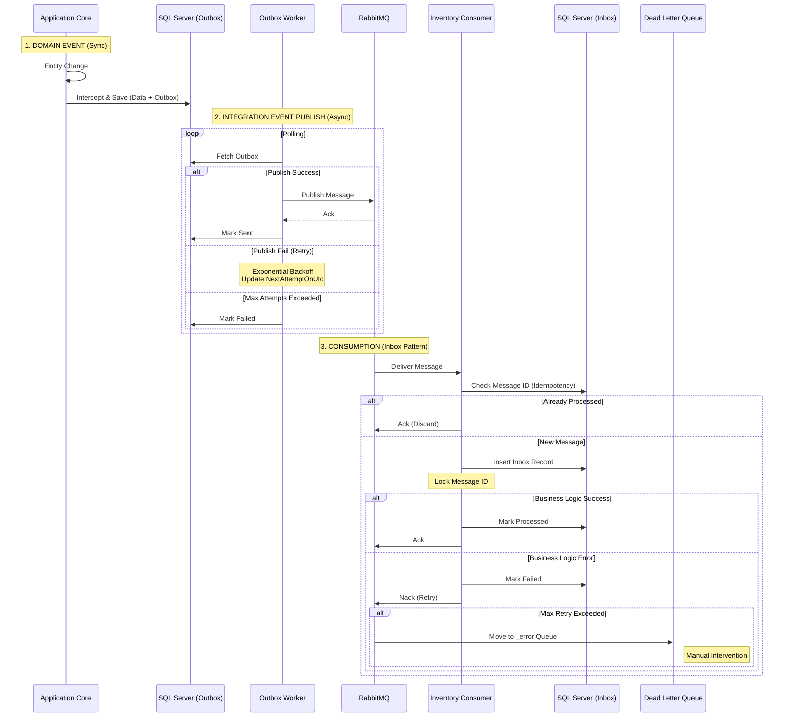

# Phân Tích Chi Tiết Kiến Trúc Event - Progcoder Shop Microservices

**Ngày cập nhật:** 19/01/2026
**Dự án:** Progcoder Shop Microservices
**Kiến trúc:** Microservices, DDD, CQRS, Event Sourcing

---

## 1. Tổng Quan
Hệ thống sử dụng kiến trúc **Event-Driven** kết hợp chặt chẽ với **Domain-Driven Design (DDD)**. Hệ thống phân tách rõ ràng hai loại sự kiện để giải quyết hai bài toán riêng biệt: xử lý logic nghiệp vụ nội bộ (Strong Consistency) và đồng bộ dữ liệu phân tán (Eventual Consistency).

## 2. Phân Loại Sự Kiện (Event Classification)

| Đặc điểm | Domain Event (Nội bộ) | Integration Event (Tích hợp) |
| :--- | :--- | :--- |
| **Mục đích** | Đảm bảo tính toàn vẹn dữ liệu trong cùng một Service (Aggregate Boundaries). | Đồng bộ dữ liệu giữa các Service khác nhau (System Boundaries). |
| **Phạm vi** | In-Process (Trong cùng tiến trình). | Out-of-Process (Gửi qua mạng). |
| **Cơ chế** | **MediatR** (In-memory bus). | **MassTransit** + **RabbitMQ**. |
| **Interface** | `IDomainEvent : INotification` | `IntegrationEvent` (Record base class). |
| **Transaction** | Chung transaction với hành động chính (ACID). | Tách biệt transaction thông qua **Outbox Pattern**. |
| **Xử lý lỗi** | Lỗi -> Rollback toàn bộ request. | Lỗi -> Retry -> Dead Letter Queue. |

---

## 3. Chi Tiết Cơ Chế Hoạt Động

### 3.1. Domain Events (Xử lý đồng bộ)
Được sử dụng để trigger các side-effects logic ngay khi một Entity thay đổi trạng thái.

*   **Vị trí:** `Core/{Service}.Domain/Events`
*   **Cấu trúc:** Implement `IDomainEvent`.
*   **Quy trình xử lý:**
    1.  **Trigger:** Entity gọi method (VD: `order.AddOrderItem()`) -> Event được thêm vào danh sách tạm của Entity.
    2.  **Intercept:** Khi `DbContext.SaveChangesAsync()` được gọi, **`DispatchDomainEventsInterceptor`** chặn lại.
    3.  **Dispatch:** Interceptor gọi `_mediator.Publish(event)`.
    4.  **Handle:** Các `INotificationHandler` thực thi logic.
    5.  **Commit:** Nếu không có lỗi, data được commit xuống DB.

### 3.2. Integration Events (Xử lý bất đồng bộ)
Được sử dụng để thông báo cho các service khác (Inventory, Notification, Search) về sự thay đổi.

*   **Vị trí:** `Shared/Contracts/{Service}.Contract`
*   **Cấu trúc:** Kế thừa từ `record IntegrationEvent`.
*   **Pattern:** **Transactional Outbox** + **Inbox**.
*   **Quy trình xử lý:**
    1.  **Persist (Producer):** Service không gửi message ngay. Message được lưu vào bảng `OutboxMessages` trong cùng transaction với dữ liệu chính.
    2.  **Poll & Publish (Worker):** Một **Worker Service** (VD: `Order.Worker.Outbox`) chạy định kỳ quét bảng Outbox.
    3.  **Send:** Worker dùng `MassTransit` (`_publishEndpoint.Publish`) gửi message lên RabbitMQ.
    4.  **Consume (Consumer):** Service đích (Consumer) nhận và xử lý message.

---

## 4. Phân Tích Chi Tiết Cài Đặt (Deep Dive Implementation)

### 4.1. Exponential Backoff & Retry Logic (Tại Outbox Processor)
Thay vì phụ thuộc hoàn toàn vào Retry policy của MassTransit sau khi message đã lên RabbitMQ, hệ thống áp dụng logic Retry ngay tại tầng cơ sở dữ liệu trong `OutboxProcessor`.

**File tham khảo:** `Order.Worker.Outbox/Processors/OutboxProcessor.cs`

**Cơ chế:**
1.  **Exponential Backoff (Lũy thừa bậc 2):**
    ```csharp
    // Code thực tế trong OutboxProcessor.cs
    var baseDelay = TimeSpan.FromSeconds(Math.Pow(2, attemptCount - 1));
    var maxDelay = TimeSpan.FromMinutes(5);
    var delay = TimeSpan.FromTicks(Math.Min(baseDelay.Ticks, maxDelay.Ticks));
    ```
    - Lần thử 1: 2^0 = 1 giây
    - Lần thử 2: 2^1 = 2 giây
    - Lần thử 3: 2^2 = 4 giây
    - ... tối đa 5 phút.

2.  **Jitter (Ngẫu nhiên):**
    ```csharp
    var jitter = TimeSpan.FromMilliseconds(Random.Shared.Next(0, 1000));
    var nextAttemptOnUtc = currentTime + delay + jitter;
    ```
    Thêm một thời gian ngẫu nhiên (0-1000ms) để tránh trường hợp hàng loạt message lỗi cùng lúc cố gắng thử lại (Thundering Herd Problem).

3.  **Max Attempts (Số lần thử tối đa):**
    Nếu `attemptCount >= message.MaxAttempts`, message được đánh dấu là lỗi vĩnh viễn (Permanent Error) trong DB và không được gửi đi nữa.

**Ưu điểm:**
*   Giảm tải cho RabbitMQ khi sự cố kéo dài.
*   Kiểm soát logic retry linh hoạt hơn so với MassTransit mặc định.

### 4.2. Inbox Pattern & Idempotency (Tại Consumer)
Để đảm bảo tính an toàn khi Consumer nhận tin nhắn trùng lặp (dù đã xóa khỏi Queue, RabbitMQ có thể ACK thất bại dẫn tới re-delivery), hệ thống áp dụng **Inbox Pattern**.

**File tham khảo:** `Inventory.Worker.Consumer/EventHandlers/Integrations/OrderCreatedIntegrationEventHandler.cs`

**Cơ chế:**
1.  **Check Message ID:**
    ```csharp
    var existingMessage = await unitOfWork.InboxMessages
        .GetByMessageIdAsync(messageId, context.CancellationToken);

    if (existingMessage != null)
    {
        // Tin nhắn đã tồn tại -> Bỏ qua (Idempotent)
        await transaction.RollbackAsync(context.CancellationToken);
        return;
    }
    ```

2.  **Lock Message ID:**
    Trước khi xử lý nghiệp vụ, Consumer tạo một bản ghi trong bảng `InboxMessages`. Việc này nằm trong một Transaction riêng, giúp chặn các Consumer khác (hoặc cùng Consumer xử lý lại) xử lý trùng lặp.

3.  **Mark Complete/Failed:**
    Sau khi nghiệp vụ xử lý xong, trạng thái trong Inbox được cập nhật thành `Processed` hoặc `Failed`.

**Ưu điểm:**
*   An toàn tuyệt đối trước việc xử lý trùng lặp (Idempotency).
*   Dễ dàng debug: Có thể truy vấn DB để xem tin nhắn nào đã đến nhưng xử lý thất bại.

### 4.3. Cấu Trúc Integration Event (Ví dụ thực tế)
Các Event được thiết kế dạng `record` (immutable) và có thể nested (chứa record con).

**File tham khảo:** `EventSourcing/Events/Orders/OrderCreatedIntegrationEvent.cs`

```csharp
public sealed record OrderCreatedIntegrationEvent : IntegrationEvent
{
    public Guid OrderId { get; init; }
    public string OrderNo { get; init; }
    public List<OrderItemIntegrationEvent> OrderItems { get; init; } // Nested list
    public decimal TotalPrice { get; init; }
    public decimal FinalPrice { get; init; }
}
```

**Lưu ý:** Các field quan trọng được đưa trực tiếp vào Event (ví dụ `ProductName`, `Quantity`, `Price`).
*   **Tại sao không chỉ gửi ProductId?**
    Để giảm sự phụ thuộc của Consumer vào gRPC hoặc Database của Service khác (Inventory có thể lấy thông tin sản phẩm trực tiếp từ Event này mà không cần gọi lại Catalog Service).

---

## 5. Cơ Chế Xử Lý Lỗi & Dead Letter Queue (DLQ)

Hệ thống sử dụng cơ chế bảo vệ tin nhắn của **MassTransit** trên nền **RabbitMQ**.

### 5.1. Khi nào message vào DLQ?
Message được chuyển vào hàng đợi lỗi (thường có hậu tố `_error` hoặc `_skipped`) khi:
1.  **Retry thất bại:** Consumer xử lý lỗi (Exception), MassTransit tự động Retry (theo cấu hình, ví dụ 3-5 lần). Nếu vẫn lỗi -> Move to DLQ.
2.  **Reject:** Message bị từ chối xử lý tường minh.
3.  **Serialization Error:** Message sai định dạng, không thể deserialize.

### 5.2. RabbitMQ làm gì với DLQ?
*   **Trạng thái:** RabbitMQ **lưu trữ thụ động** message này. Nó không tự động sửa hay gửi lại.
*   **Mục đích:** Để ngăn chặn mất mát dữ liệu (Data Loss) và cho phép con người can thiệp.

### 5.3. Quy trình xử lý sự cố (Ops)
1.  **Monitoring:** Cảnh báo khi số lượng message trong queue `_error` > 0.
2.  **Debugging:** Kiểm tra Header của message trong RabbitMQ Management UI để xem Stack Trace lỗi.
3.  **Action:**
    *   Nếu lỗi code: Fix bug -> Deploy -> Move message từ DLQ về Queue chính (Shovel).
    *   Nếu lỗi dữ liệu: Xử lý tay hoặc bỏ qua message.

---

## 6. Sơ Đồ Luồng Dữ Liệu (Cập nhật)



## 7. Các Class Quan Trọng trong Mã Nguồn

*   **`IntegrationEvent.cs`**: Base record cho mọi sự kiện tích hợp (Shared Kernel).
*   **`IDomainEvent.cs`**: Interface đánh dấu cho sự kiện nội bộ.
*   **`DispatchDomainEventsInterceptor.cs`**: Middleware quan trọng nhất để xử lý Domain Event tự động.
*   **`OutboxProcessor.cs`**: Worker chịu trách nhiệm đọc DB và đẩy tin nhắn ra RabbitMQ với logic Exponential Backoff.
*   **`IConsumer<T>`**: Interface của MassTransit để hứng tin nhắn tại các Service đích (đã tích hợp Inbox Pattern).
*   **`InboxMessages` (Entity)**: Bảng để Consumer đảm bảo tính Idempotency.
