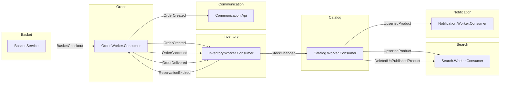

# Messaging Consumers Reference

> Tài liệu tham khảo về tất cả MassTransit/RabbitMQ consumers trong hệ thống microservices.

---

## Tổng Quan

| Metric | Giá trị |
|--------|---------|
| Tổng số Consumers | 10 |
| Số Services có Consumer | 6 |
| Số Integration Events | 8 |
| Message Broker | MassTransit/RabbitMQ |
| Base Class | `IntegrationEvent` |

---

## Event Flow Architecture



---

## Consumers Theo Service

### Order Service

| Consumer | Event | File |
|----------|-------|------|
| `BasketCheckoutIntegrationEventHandler` | `BasketCheckoutIntegrationEvent` | [Link](../src/Services/Order/Worker/Order.Worker.Consumer/EventHandlers/Integrations/BasketCheckoutIntegrationEventHandler.cs) |
| `ReservationExpiredIntegrationEventHandler` | `ReservationExpiredIntegrationEvent` | [Link](../src/Services/Order/Worker/Order.Worker.Consumer/EventHandlers/Integrations/ReservationExpiredIntegrationEventHandler.cs) |

**Chức năng:**
- Tạo order từ basket checkout
- Tự động cancel order khi reservation hết hạn

---

### Inventory Service

| Consumer | Event | File |
|----------|-------|------|
| `OrderCreatedIntegrationEventHandler` | `OrderCreatedIntegrationEvent` | [Link](../src/Services/Inventory/Worker/Inventory.Worker.Consumer/EventHandlers/Integrations/OrderCreatedIntegrationEventHandler.cs) |
| `OrderCancelledIntegrationEventHandler` | `OrderCancelledIntegrationEvent` | [Link](../src/Services/Inventory/Worker/Inventory.Worker.Consumer/EventHandlers/Integrations/OrderCancelledIntegrationEventHandler.cs) |
| `OrderDeliveredIntegrationEventHandler` | `OrderDeliveredIntegrationEvent` | [Link](../src/Services/Inventory/Worker/Inventory.Worker.Consumer/EventHandlers/Integrations/OrderDeliveredIntegrationEventHandler.cs) |

**Chức năng:**
- Reserve stock khi order được tạo
- Release stock khi order bị cancel
- Confirm stock consumption khi order delivered

---

### Catalog Service

| Consumer | Event | File |
|----------|-------|------|
| `StockChangedEventHandler` | `StockChangedIntegrationEvent` | [Link](../src/Services/Catalog/Worker/Catalog.Worker.Consumer/EventHandlers/Integrations/StockChangedEventHandler.cs) |

**Chức năng:**
- Cập nhật ProductStatus (InStock/OutOfStock) dựa trên stock amount

---

### Search Service

| Consumer | Event | File |
|----------|-------|------|
| `UpsertedProductIntegrationEventHandler` | `UpsertedProductIntegrationEvent` | [Link](../src/Services/Search/Worker/Search.Worker.Consumer/EventHandlers/Integrations/UpsertedProductIntegrationEventHandler.cs) |
| `DeletedUnPublishedProductIntegrationEventHandler` | `DeletedUnPublishedProductIntegrationEvent` | [Link](../src/Services/Search/Worker/Search.Worker.Consumer/EventHandlers/Integrations/DeletedUnPublishedProductIntegrationEventHandler.cs) |

**Chức năng:**
- Index/update product trong Elasticsearch
- Xóa unpublished product khỏi search index

---

### Notification Service

| Consumer | Event | File |
|----------|-------|------|
| `UpsertedProductIntegrationEventHandler` | `UpsertedProductIntegrationEvent` | [Link](../src/Services/Notification/Worker/Notification.Worker.Consumer/EventHandlers/Integrations/UpsertedProductIntegrationEventHandler.cs) |

**Chức năng:**
- Gửi notification khi có product mới/update

---

### Communication Service

| Consumer | Event | File |
|----------|-------|------|
| `OrderCreatedIntegrationEventHandler` | `OrderCreatedIntegrationEvent` | [Link](../src/Services/Communication/Api/Communication.Api/EventHandlers/Integrations/OrderCreatedIntegrationEventHandler.cs) |

**Chức năng:**
- Broadcast real-time notification qua SignalR Hub

---

## Integration Events

| Event | Location | Publishers | Subscribers |
|-------|----------|------------|-------------|
| `BasketCheckoutIntegrationEvent` | `Events/Baskets/` | Basket | Order |
| `OrderCreatedIntegrationEvent` | `Events/Orders/` | Order | Inventory, Communication |
| `OrderCancelledIntegrationEvent` | `Events/Orders/` | Order | Inventory |
| `OrderDeliveredIntegrationEvent` | `Events/Orders/` | Order | Inventory |
| `StockChangedIntegrationEvent` | `Events/Inventories/` | Inventory | Catalog |
| `ReservationExpiredIntegrationEvent` | `Events/Inventories/` | Inventory | Order |
| `UpsertedProductIntegrationEvent` | `Events/Catalog/` | Catalog | Search, Notification |
| `DeletedUnPublishedProductIntegrationEvent` | `Events/Catalog/` | Catalog | Search |

> Tất cả events nằm trong: `src/Shared/EventSourcing/Events/`

---

## Consumer Patterns

### Pattern 1: Simple Consumer

```csharp
public sealed class StockChangedEventHandler(IMediator sender)
    : IConsumer<StockChangedIntegrationEvent>
{
    public async Task Consume(ConsumeContext<StockChangedIntegrationEvent> context)
    {
        var message = context.Message;
        await sender.Send(new SomeCommand(...));
    }
}
```

**Sử dụng khi:** Event không cần đảm bảo exactly-once processing.

---

### Pattern 2: Inbox Pattern (Idempotency)

```csharp
public sealed class BasketCheckoutIntegrationEventHandler(
    IMediator sender,
    IUnitOfWork unitOfWork)
    : IConsumer<BasketCheckoutIntegrationEvent>
{
    public async Task Consume(ConsumeContext<BasketCheckoutIntegrationEvent> context)
    {
        var messageId = context.MessageId ?? Guid.NewGuid();
        
        // Check duplicate
        var existing = await unitOfWork.InboxMessages
            .FirstOrDefaultAsync(m => m.Id == messageId);
        if (existing != null) return;
        
        // Create inbox record
        var inbox = InboxMessageEntity.Create(messageId, ...);
        await unitOfWork.InboxMessages.AddAsync(inbox);
        
        try {
            await sender.Send(new CreateOrderCommand(...));
            inbox.CompleteProcessing(DateTimeOffset.UtcNow);
        } catch (Exception ex) {
            inbox.CompleteProcessing(DateTimeOffset.UtcNow, ex.Message);
            throw;
        }
    }
}
```

**Sử dụng khi:** Cần đảm bảo exactly-once processing, tránh duplicate processing.

---

## Tạo Consumer Mới

### 1. Định nghĩa Integration Event

```csharp
// src/Shared/EventSourcing/Events/YourDomain/YourIntegrationEvent.cs
namespace EventSourcing.Events.YourDomain;

public record YourIntegrationEvent : IntegrationEvent
{
    public Guid EntityId { get; init; }
    // Thêm các properties cần thiết
}
```

### 2. Tạo Consumer Handler

```csharp
// src/Services/YourService/Worker/EventHandlers/Integrations/YourIntegrationEventHandler.cs
public sealed class YourIntegrationEventHandler(
    IMediator sender,
    ILogger<YourIntegrationEventHandler> logger)
    : IConsumer<YourIntegrationEvent>
{
    public async Task Consume(ConsumeContext<YourIntegrationEvent> context)
    {
        logger.LogInformation("Processing {Event}", context.Message.GetType().Name);
        
        var message = context.Message;
        await sender.Send(new YourCommand(...));
    }
}
```

### 3. Đăng ký Consumer (tự động)

MassTransit tự động scan và đăng ký consumers implement `IConsumer<T>`.

---

## Tìm Consumers Với AST-Grep

```yaml
id: find-masstransit-consumers
language: csharp
rule:
  kind: class_declaration
  has:
    kind: base_list
    has:
      kind: generic_name
      has:
        kind: identifier
        regex: "^IConsumer$"
      stopBy: end
    stopBy: end
```

**Chạy:**
```bash
ast-grep scan --rule find-consumers.yaml src/
```

---

## Xem Thêm

- [RabbitMQ Architecture](../RabbitMQ/RabbitMQ_MassTransit_Architecture.md)
- [MassTransit Usage Guide](../RabbitMQ/RabbitMQ_MassTransit_Usage_Guide.md)
- [Integration Events Documentation](../../src/Shared/EventSourcing/README.md)
