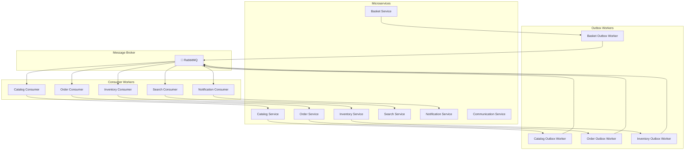
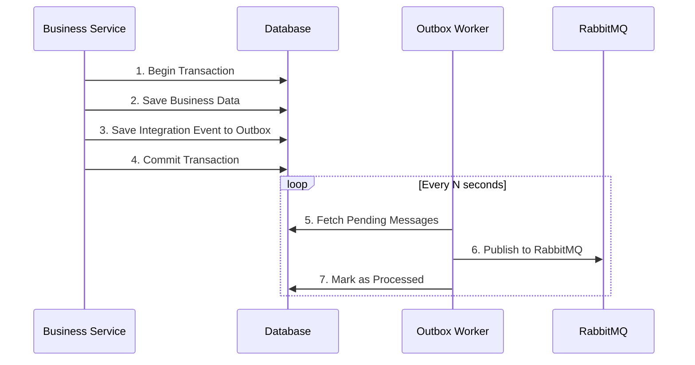
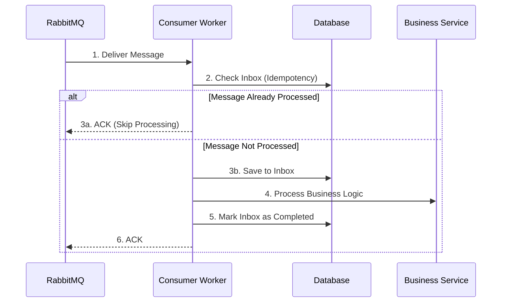
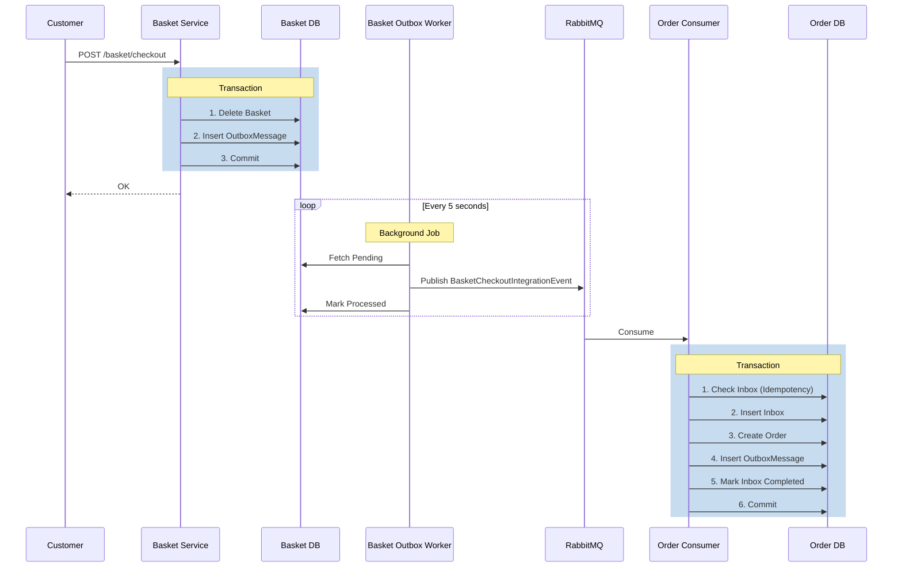
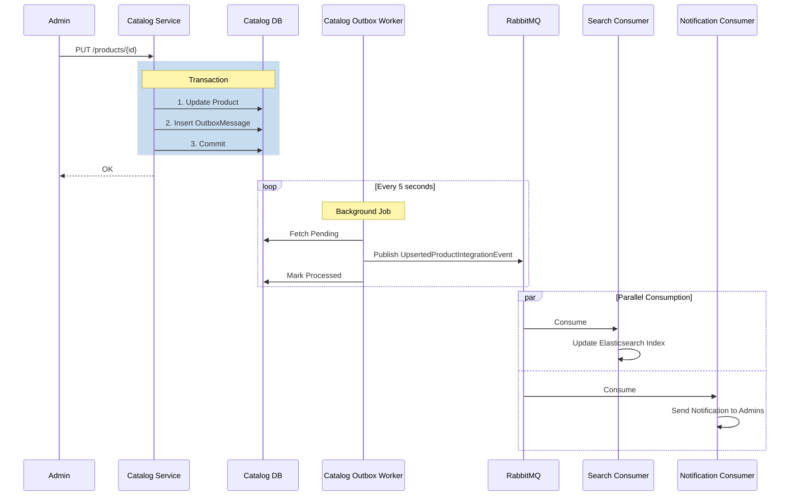
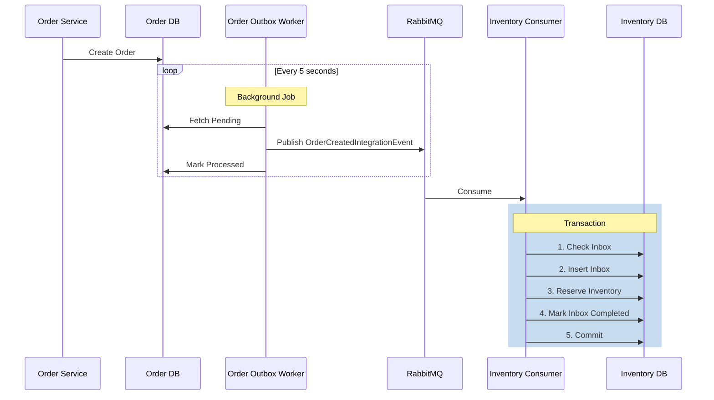

# RabbitMQ & MassTransit Architecture

> **Tài liệu chi tiết về kiến trúc Event-Driven sử dụng RabbitMQ và MassTransit trong hệ thống Microservices**

---

## 📑 Mục Lục

- [1. Tổng Quan](#1-tổng-quan)
- [2. Kiến Trúc Tổng Thể](#2-kiến-trúc-tổng-thể)
- [3. Cấu Hình MassTransit](#3-cấu-hình-masstransit)
- [4. Integration Events](#4-integration-events)
- [5. Outbox Pattern](#5-outbox-pattern)
- [6. Consumer Pattern](#6-consumer-pattern)
- [7. Event Flow Examples](#7-event-flow-examples)
- [8. Danh Sách Components](#8-danh-sách-components)
- [9. Best Practices](#9-best-practices)
- [10. Troubleshooting](#10-troubleshooting)

---

## 1. Tổng Quan

### 1.1. Giới Thiệu

Dự án sử dụng **MassTransit 8.5.1** làm abstraction layer cho **RabbitMQ** để triển khai kiến trúc **Event-Driven Architecture** với **Outbox Pattern** nhằm đảm bảo độ tin cậy cao trong giao tiếp giữa các microservices.

### 1.2. Công Nghệ Sử Dụng

| Công Nghệ | Version | Mục Đích |
|-----------|---------|----------|
| **MassTransit.RabbitMQ** | 8.5.1 | Abstraction layer cho message broker |
| **RabbitMQ** | 3-management | Message broker |
| **.NET** | 8.0 | Runtime platform |
| **MongoDB/PostgreSQL/MySQL/SQL Server** | Latest | Outbox/Inbox storage |

### 1.3. Ưu Điểm

- ✅ **Loose Coupling**: Services không phụ thuộc trực tiếp vào nhau
- ✅ **Scalability**: Dễ dàng scale horizontal
- ✅ **Reliability**: Guaranteed message delivery với Outbox Pattern
- ✅ **Idempotency**: Inbox Pattern đảm bảo không xử lý trùng lặp
- ✅ **Retry Mechanism**: Tự động retry khi có lỗi tạm thời
- ✅ **Observability**: Tích hợp OpenTelemetry cho monitoring

---

## 2. Kiến Trúc Tổng Thể

### 2.1. High-Level Architecture



### 2.2. Outbox Pattern Flow



### 2.3. Consumer Pattern Flow



---

## 3. Cấu Hình MassTransit

### 3.1. Extension Method

**File:** `src/Shared/EventSourcing/MassTransit/Extentions.cs`

```csharp
using MassTransit;
using Microsoft.Extensions.Configuration;
using Microsoft.Extensions.DependencyInjection;
using Common.Configurations;
using System.Reflection;

namespace EventSourcing.MassTransit;

public static class Extentions
{
    /// <summary>
    /// Đăng ký MassTransit với RabbitMQ
    /// </summary>
    /// <param name="services">Service collection</param>
    /// <param name="cfg">Configuration</param>
    /// <param name="assembly">Assembly chứa consumers (optional)</param>
    public static IServiceCollection AddMessageBroker(
        this IServiceCollection services,
        IConfiguration cfg,
        Assembly? assembly = null)
    {
        services.AddMassTransit(config =>
        {
            // Sử dụng kebab-case cho endpoint names
            config.SetKebabCaseEndpointNameFormatter();

            // Auto-register tất cả consumers từ assembly
            if (assembly != null)
                config.AddConsumers(assembly);

            // Cấu hình RabbitMQ transport
            config.UsingRabbitMq((context, configurator) =>
            {
                configurator.Host(new Uri(cfg[$"{MessageBrokerCfg.Section}:{MessageBrokerCfg.Host}"]!), host =>
                {
                    host.Username(cfg[$"{MessageBrokerCfg.Section}:{MessageBrokerCfg.UserName}"]!);
                    host.Password(cfg[$"{MessageBrokerCfg.Section}:{MessageBrokerCfg.Password}"]!);
                });
                
                // Auto-configure endpoints dựa trên consumers
                configurator.ConfigureEndpoints(context);
            });
        });

        return services;
    }
}
```

### 3.2. Cấu Hình appsettings.json

**File:** `appsettings.json` (Mọi service)

```json
{
  "MessageBroker": {
    "Host": "amqp://rabbitmq:5672",
    "UserName": "admin",
    "Password": "123456789Aa",
    "Port": 5672
  }
}
```

### 3.3. Đăng Ký Trong Program.cs

#### Outbox Worker (Publisher)

```csharp
// File: Basket.Worker.Outbox/Program.cs
var builder = WebApplication.CreateBuilder(args);

// Đăng ký MassTransit (không có consumers - chỉ publish)
builder.Services.AddMessageBroker(builder.Configuration);

// Đăng ký Outbox Processor
builder.Services.AddSingleton<OutboxProcessor>();
builder.Services.AddHostedService<OutboxBackgroundService>();
```

#### Consumer Worker (Subscriber)

```csharp
// File: Order.Worker.Consumer/Program.cs
var builder = WebApplication.CreateBuilder(args);

// Đăng ký MassTransit với auto-register consumers
builder.Services.AddMessageBroker(
    builder.Configuration, 
    Assembly.GetExecutingAssembly() // Assembly chứa consumers
);
```

---

## 4. Integration Events

### 4.1. Base Integration Event

**File:** `src/Shared/EventSourcing/Events/IntegrationEvent.cs`

```csharp
namespace EventSourcing.Events;

/// <summary>
/// Base class cho tất cả Integration Events
/// </summary>
public record IntegrationEvent
{
    /// <summary>
    /// Unique identifier của event
    /// </summary>
    public string Id { get; init; } = default!;

    /// <summary>
    /// Thời điểm event xảy ra
    /// </summary>
    public DateTimeOffset OccurredOn { get; init; } = DateTimeOffset.UtcNow;

    /// <summary>
    /// Loại event (AssemblyQualifiedName)
    /// </summary>
    public string? EventType => GetType()?.AssemblyQualifiedName;
}
```

### 4.2. Danh Sách Integration Events

#### 4.2.1. BasketCheckoutIntegrationEvent

**File:** `src/Shared/EventSourcing/Events/Baskets/BasketCheckoutIntegrationEvent.cs`

```csharp
namespace EventSourcing.Events.Baskets;

/// <summary>
/// Event được publish khi customer checkout giỏ hàng
/// </summary>
public sealed record BasketCheckoutIntegrationEvent : IntegrationEvent
{
    public Guid BasketId { get; init; }
    public CustomerIntegrationEvent Customer { get; init; } = default!;
    public AddressIntegrationEvent ShippingAddress { get; init; } = default!;
    public DiscountIntegrationEvent Discount { get; init; } = default!;
    public IReadOnlyCollection<CartItemIntegrationEvent> Items { get; init; } = Array.Empty<CartItemIntegrationEvent>();
}

public sealed record CustomerIntegrationEvent
{
    public Guid? Id { get; init; }
    public string Name { get; init; } = default!;
    public string Email { get; init; } = default!;
    public string PhoneNumber { get; init; } = default!;
}

public sealed record AddressIntegrationEvent
{
    public string AddressLine { get; init; } = default!;
    public string Subdivision { get; init; } = default!;
    public string City { get; init; } = default!;
    public string StateOrProvince { get; init; } = default!;
    public string Country { get; init; } = default!;
    public string PostalCode { get; init; } = default!;
}

public sealed record CartItemIntegrationEvent
{
    public Guid ProductId { get; init; }
    public int Quantity { get; init; }
}

public sealed record DiscountIntegrationEvent
{
    public string CouponCode { get; init; } = default!;
    public decimal DiscountAmount { get; init; }
}
```

**Mục đích:** Thông báo cho Order Service tạo đơn hàng

**Publisher:** `Basket.Worker.Outbox`

**Consumer:** `Order.Worker.Consumer`

---

#### 4.2.2. OrderCreatedIntegrationEvent

**File:** `src/Shared/EventSourcing/Events/Orders/OrderCreatedIntegrationEvent.cs`

```csharp
namespace EventSourcing.Events.Orders;

/// <summary>
/// Event được publish khi order được tạo thành công
/// </summary>
public sealed record OrderCreatedIntegrationEvent : IntegrationEvent
{
    public Guid OrderId { get; init; }
    public string OrderNo { get; init; } = default!;
    public List<OrderItemIntegrationEvent> OrderItems { get; init; } = default!;
    public decimal TotalPrice { get; init; }
    public decimal FinalPrice { get; init; }
}

public sealed record OrderItemIntegrationEvent
{
    public Guid ProductId { get; init; }
    public string ProductName { get; init; } = default!;
    public int Quantity { get; init; }
    public decimal UnitPrice { get; init; }
    public decimal LineTotal { get; init; }
}
```

**Mục đích:** Reserve inventory và gửi notification

**Publisher:** `Order.Worker.Outbox`

**Consumers:** 
- `Inventory.Worker.Consumer` (reserve stock)
- `Communication.Api` (send notification)

---

#### 4.2.3. OrderCancelledIntegrationEvent

**File:** `src/Shared/EventSourcing/Events/Orders/OrderCancelledIntegrationEvent.cs`

**Mục đích:** Release reserved inventory

**Publisher:** `Order.Worker.Outbox`

**Consumer:** `Inventory.Worker.Consumer`

---

#### 4.2.4. OrderDeliveredIntegrationEvent

**File:** `src/Shared/EventSourcing/Events/Orders/OrderDeliveredIntegrationEvent.cs`

**Mục đích:** Commit reserved inventory

**Publisher:** `Order.Worker.Outbox`

**Consumer:** `Inventory.Worker.Consumer`

---

#### 4.2.5. UpsertedProductIntegrationEvent

**File:** `src/Shared/EventSourcing/Events/Catalog/UpsertedProductIntegrationEvent.cs`

**Mục đích:** Sync product data đến Search và Notification services

**Publisher:** `Catalog.Worker.Outbox`

**Consumers:**
- `Search.Worker.Consumer` (index to Elasticsearch)
- `Notification.Worker.Consumer` (notify admins)

---

#### 4.2.6. DeletedUnPublishedProductIntegrationEvent

**File:** `src/Shared/EventSourcing/Events/Catalog/DeletedUnPublishedProductIntegrationEvent.cs`

**Mục đích:** Xóa product khỏi search index

**Publisher:** `Catalog.Worker.Outbox`

**Consumer:** `Search.Worker.Consumer`

---

#### 4.2.7. StockChangedIntegrationEvent

**File:** `src/Shared/EventSourcing/Events/Inventories/StockChangedIntegrationEvent.cs`

**Mục đích:** Sync stock quantity về Catalog

**Publisher:** `Inventory.Worker.Outbox`

**Consumer:** `Catalog.Worker.Consumer`

---

#### 4.2.8. ReservationExpiredIntegrationEvent

**File:** `src/Shared/EventSourcing/Events/Inventories/ReservationExpiredIntegrationEvent.cs`

**Mục đích:** Cancel order khi reservation hết hạn

**Publisher:** `Inventory.Worker.Outbox`

**Consumer:** `Order.Worker.Consumer`

---

### 4.3. Event Matrix

| Event | Publisher | Consumers | Mục Đích |
|-------|-----------|-----------|----------|
| `BasketCheckoutIntegrationEvent` | Basket.Worker.Outbox | Order.Worker.Consumer | Tạo đơn hàng từ giỏ hàng |
| `OrderCreatedIntegrationEvent` | Order.Worker.Outbox | Inventory.Worker.Consumer<br>Communication.Api | Reserve stock & Notify |
| `OrderCancelledIntegrationEvent` | Order.Worker.Outbox | Inventory.Worker.Consumer | Release reserved stock |
| `OrderDeliveredIntegrationEvent` | Order.Worker.Outbox | Inventory.Worker.Consumer | Commit stock changes |
| `UpsertedProductIntegrationEvent` | Catalog.Worker.Outbox | Search.Worker.Consumer<br>Notification.Worker.Consumer | Sync product data |
| `DeletedUnPublishedProductIntegrationEvent` | Catalog.Worker.Outbox | Search.Worker.Consumer | Remove from search |
| `StockChangedIntegrationEvent` | Inventory.Worker.Outbox | Catalog.Worker.Consumer | Sync stock quantity |
| `ReservationExpiredIntegrationEvent` | Inventory.Worker.Outbox | Order.Worker.Consumer | Cancel expired orders |

---

## 5. Outbox Pattern

### 5.1. Khái Niệm

**Outbox Pattern** đảm bảo rằng việc lưu business data và publish event xảy ra trong cùng một transaction, giải quyết vấn đề **dual-write problem**.

### 5.2. Outbox Entity

```csharp
public sealed class OutboxMessageEntity
{
    public Guid Id { get; set; }
    public string EventType { get; set; } = default!;
    public string Content { get; set; } = default!;
    public DateTimeOffset CreatedOnUtc { get; set; }
    public DateTimeOffset? ProcessedOnUtc { get; set; }
    public string? LastErrorMessage { get; set; }
    public int AttemptCount { get; set; }
    public int MaxAttempts { get; set; } = 3;
    public DateTimeOffset? NextAttemptOnUtc { get; set; }
    public DateTimeOffset? ClaimedOnUtc { get; set; }
    public string? ClaimedBy { get; set; }
}
```

### 5.3. Outbox Processor Implementation

**File:** `src/Services/Basket/Worker/Basket.Worker.Outbox/Processors/OutboxProcessor.cs`

```csharp
internal sealed class OutboxProcessor
{
    private readonly int _batchSize;
    private static readonly ConcurrentDictionary<string, Type> TypeCache = new();
    private readonly IOutboxRepository _outboxRepo;
    private readonly IPublishEndpoint _publish;
    private readonly ILogger<OutboxProcessor> _logger;

    public OutboxProcessor(
        IOutboxRepository outboxRepo,
        IConfiguration cfg,
        IPublishEndpoint publish,
        ILogger<OutboxProcessor> logger)
    {
        _batchSize = cfg.GetValue<int>($"{WorkerCfg.Outbox.Section}:{WorkerCfg.Outbox.BatchSize}", 1000);
        _outboxRepo = outboxRepo;
        _publish = publish;
        _logger = logger;
    }

    public async Task<int> ExecuteAsync(CancellationToken cancellationToken = default)
    {
        // 1. Fetch pending messages (new + retry)
        var newMessages = await _outboxRepo.GetAndClaimMessagesAsync(_batchSize, cancellationToken);
        var retryMessages = await _outboxRepo.GetAndClaimRetryMessagesAsync(_batchSize, cancellationToken);
        var allMessages = newMessages.Concat(retryMessages).ToList();

        if (allMessages.Count == 0) return 0;

        var updateQueue = new ConcurrentQueue<OutboxUpdate>();

        // 2. Process messages in parallel
        var publishTasks = allMessages
            .Select(message => ProcessMessageAsync(message, updateQueue, _publish, _logger, cancellationToken))
            .ToList();

        await Task.WhenAll(publishTasks);

        // 3. Bulk update processed messages
        if (!updateQueue.IsEmpty)
        {
            var messagesToUpdate = updateQueue.Select(update =>
            {
                var message = allMessages.First(m => m.Id == update.Id);
                message.CompleteProcessing(update.ProcessedOnUtc, update.LastErrorMessage);
                return message;
            }).ToList();

            await _outboxRepo.UpdateMessagesAsync(messagesToUpdate, cancellationToken);
        }
        else
        {
            // Release claims if no messages were processed
            await _outboxRepo.ReleaseClaimsAsync(allMessages, cancellationToken);
        }

        _logger.LogInformation("Processed {Count} messages from outbox", allMessages.Count);
        return allMessages.Count;
    }

    private static async Task ProcessMessageAsync(
        OutboxMessageEntity message,
        ConcurrentQueue<OutboxUpdate> updateQueue,
        IPublishEndpoint publish,
        ILogger<OutboxProcessor> logger,
        CancellationToken cancellationToken)
    {
        try
        {
            // 1. Deserialize event
            var messageType = GetOrAddMessageType(message.EventType!);
            var deserializedMessage = JsonSerializer.Deserialize(message.Content!, messageType)!;

            logger.LogInformation("Publishing message {Id} of type {EventType} (attempt {AttemptCount}/{MaxAttempts})",
                message.Id, message.EventType, message.AttemptCount, message.MaxAttempts);

            // 2. Publish to RabbitMQ via MassTransit
            await publish.Publish(deserializedMessage, cancellationToken);

            message.IncreaseAttemptCount();

            logger.LogInformation("Successfully published message {Id} of type {EventType}",
                message.Id, message.EventType);

            // 3. Mark as processed
            updateQueue.Enqueue(new OutboxUpdate(
                message.Id,
                DateTimeOffset.UtcNow,
                null,
                message.AttemptCount,
                null));
        }
        catch (Exception ex)
        {
            var currentTime = DateTimeOffset.UtcNow;
            message.RecordFailedAttempt(ex.ToString(), currentTime);

            if (message.IsPermanentlyFailed())
            {
                // Permanently failed - mark as processed with error
                updateQueue.Enqueue(new OutboxUpdate(
                    message.Id,
                    currentTime,
                    message.LastErrorMessage,
                    message.AttemptCount,
                    null));

                logger.LogError(ex, "Permanently failed to publish message {Id} after {AttemptCount} attempts",
                    message.Id, message.AttemptCount);
            }
            else
            {
                // Schedule for retry with exponential backoff
                updateQueue.Enqueue(new OutboxUpdate(
                    message.Id,
                    currentTime,
                    message.LastErrorMessage,
                    message.AttemptCount,
                    message.NextAttemptOnUtc));

                logger.LogWarning(ex, "Failed to publish message {Id} (attempt {AttemptCount}/{MaxAttempts}), will retry at {NextAttemptOnUtc}",
                    message.Id, message.AttemptCount, message.MaxAttempts, message.NextAttemptOnUtc);
            }
        }
    }

    private static Type GetOrAddMessageType(string typename)
    {
        return TypeCache.GetOrAdd(typename, name => Type.GetType(name)!);
    }
}
```

### 5.4. Background Service

**File:** `src/Services/Basket/Worker/Basket.Worker.Outbox/BackgroundServices/OutboxBackgroundService.cs`

```csharp
public sealed class OutboxBackgroundService : BackgroundService
{
    private readonly IServiceProvider _serviceProvider;
    private readonly ILogger<OutboxBackgroundService> _logger;
    private readonly int _intervalSeconds;

    public OutboxBackgroundService(
        IServiceProvider serviceProvider,
        IConfiguration cfg,
        ILogger<OutboxBackgroundService> logger)
    {
        _serviceProvider = serviceProvider;
        _logger = logger;
        _intervalSeconds = cfg.GetValue<int>($"{WorkerCfg.Outbox.Section}:{WorkerCfg.Outbox.IntervalSeconds}", 5);
    }

    protected override async Task ExecuteAsync(CancellationToken stoppingToken)
    {
        _logger.LogInformation("Outbox Background Service started");

        while (!stoppingToken.IsCancellationRequested)
        {
            try
            {
                using var scope = _serviceProvider.CreateScope();
                var processor = scope.ServiceProvider.GetRequiredService<OutboxProcessor>();
                
                var processedCount = await processor.ExecuteAsync(stoppingToken);
                
                if (processedCount > 0)
                {
                    _logger.LogInformation("Processed {Count} outbox messages", processedCount);
                }
            }
            catch (Exception ex)
            {
                _logger.LogError(ex, "Error occurred processing outbox messages");
            }

            await Task.Delay(TimeSpan.FromSeconds(_intervalSeconds), stoppingToken);
        }

        _logger.LogInformation("Outbox Background Service stopped");
    }
}
```

### 5.5. Cấu Hình Outbox Worker

```json
{
  "Worker": {
    "Outbox": {
      "IntervalSeconds": 5,
      "BatchSize": 1000
    }
  }
}
```

---

## 6. Consumer Pattern

### 6.1. Inbox Pattern (Idempotency)

**Inbox Entity:**

```csharp
public sealed class InboxMessageEntity
{
    public Guid Id { get; set; }
    public string EventType { get; set; } = default!;
    public string Content { get; set; } = default!;
    public DateTimeOffset ReceivedOnUtc { get; set; }
    public DateTimeOffset? ProcessedOnUtc { get; set; }
    public string? ErrorMessage { get; set; }
}
```

### 6.2. Consumer Implementation

**File:** `src/Services/Order/Worker/Order.Worker.Consumer/EventHandlers/Integrations/BasketCheckoutIntegrationEventHandler.cs`

```csharp
namespace Order.Worker.Consumer.EventHandlers.Integrations;

/// <summary>
/// Consumer xử lý BasketCheckoutIntegrationEvent để tạo order
/// </summary>
public sealed class BasketCheckoutIntegrationEventHandler(
    IMediator sender,
    IUnitOfWork unitOfWork,
    ILogger<BasketCheckoutIntegrationEventHandler> logger)
    : IConsumer<BasketCheckoutIntegrationEvent>
{
    public async Task Consume(ConsumeContext<BasketCheckoutIntegrationEvent> context)
    {
        var message = context.Message;
        var messageId = context.MessageId ?? Guid.NewGuid();

        logger.LogInformation("Received BasketCheckoutIntegrationEvent {MessageId} for Basket {BasketId}",
            messageId, message.BasketId);

        // 1. IDEMPOTENCY CHECK - Kiểm tra message đã xử lý chưa
        var existingMessage = await unitOfWork.InboxMessages
            .FirstOrDefaultAsync(m => m.Id == messageId, context.CancellationToken);

        if (existingMessage != null)
        {
            logger.LogInformation("Message {MessageId} already processed. Skipping.", messageId);
            return; // ACK message mà không xử lý
        }

        // 2. CREATE INBOX RECORD - Lưu message vào Inbox (idempotency)
        var inboxMessage = InboxMessageEntity.Create(
            messageId,
            message.GetType().AssemblyQualifiedName!,
            JsonSerializer.Serialize(message),
            DateTimeOffset.UtcNow);

        await unitOfWork.InboxMessages.AddAsync(inboxMessage, context.CancellationToken);
        await unitOfWork.SaveChangesAsync(context.CancellationToken);

        try
        {
            // 3. PROCESS EVENT - Xử lý business logic
            var dto = new CreateOrUpdateOrderDto
            {
                Customer = new CustomerDto
                {
                    Id = message.Customer.Id,
                    Name = message.Customer.Name,
                    Email = message.Customer.Email,
                    PhoneNumber = message.Customer.PhoneNumber
                },
                ShippingAddress = new AddressDto
                {
                    AddressLine = message.ShippingAddress.AddressLine,
                    Subdivision = message.ShippingAddress.Subdivision,
                    City = message.ShippingAddress.City,
                    StateOrProvince = message.ShippingAddress.StateOrProvince,
                    Country = message.ShippingAddress.Country,
                    PostalCode = message.ShippingAddress.PostalCode
                },
                OrderItems = message.Items.Select(item => new CreateOrderItemDto
                {
                    ProductId = item.ProductId,
                    Quantity = item.Quantity
                }).ToList(),
                CouponCode = message.Discount.CouponCode
            };

            var command = new CreateOrderCommand(dto, Actor.User(dto.Customer.Id.ToString()!));
            await sender.Send(command, context.CancellationToken);

            // 4. MARK AS COMPLETED - Đánh dấu đã xử lý thành công
            inboxMessage.CompleteProcessing(DateTimeOffset.UtcNow);
            await unitOfWork.SaveChangesAsync(context.CancellationToken);

            logger.LogInformation("Successfully processed event {MessageId}", messageId);
        }
        catch (Exception ex)
        {
            logger.LogError(ex, "Failed to process event {MessageId}", messageId);

            // 5. MARK AS FAILED - Lưu error message
            inboxMessage.CompleteProcessing(DateTimeOffset.UtcNow, ex.Message);
            await unitOfWork.SaveChangesAsync(context.CancellationToken);

            throw; // Re-throw để MassTransit retry
        }
    }
}
```

### 6.3. Consumer Registration

**File:** `Order.Worker.Consumer/DependencyInjection.cs`

```csharp
public static class DependencyInjection
{
    public static IServiceCollection AddWorkerServices(
        this IServiceCollection services,
        IConfiguration cfg)
    {
        // Đăng ký MassTransit với auto-register consumers
        services.AddMessageBroker(cfg, Assembly.GetExecutingAssembly());

        // Đăng ký Background Service
        services.AddHostedService<OrderBackgroudService>();

        return services;
    }
}
```

---

## 7. Event Flow Examples

### 7.1. Basket Checkout Flow



### 7.2. Product Update Flow



### 7.3. Order Creation to Inventory Reservation Flow



---

## 8. Danh Sách Components

### 8.1. Outbox Workers

| Worker | Service | Database | Events Published |
|--------|---------|----------|------------------|
| `Basket.Worker.Outbox` | Basket | MongoDB | `BasketCheckoutIntegrationEvent` |
| `Catalog.Worker.Outbox` | Catalog | PostgreSQL | `UpsertedProductIntegrationEvent`<br>`DeletedUnPublishedProductIntegrationEvent` |
| `Order.Worker.Outbox` | Order | SQL Server | `OrderCreatedIntegrationEvent`<br>`OrderCancelledIntegrationEvent`<br>`OrderDeliveredIntegrationEvent` |
| `Inventory.Worker.Outbox` | Inventory | MySQL | `StockChangedIntegrationEvent`<br>`ReservationExpiredIntegrationEvent` |

### 8.2. Consumer Workers

| Consumer | Events Consumed | Business Logic |
|----------|----------------|----------------|
| `Order.Worker.Consumer` | `BasketCheckoutIntegrationEvent`<br>`ReservationExpiredIntegrationEvent` | - Create Order from Basket<br>- Cancel Order on Reservation Expiry |
| `Inventory.Worker.Consumer` | `OrderCreatedIntegrationEvent`<br>`OrderCancelledIntegrationEvent`<br>`OrderDeliveredIntegrationEvent` | - Reserve Stock<br>- Release Reservation<br>- Commit Stock Changes |
| `Search.Worker.Consumer` | `UpsertedProductIntegrationEvent`<br>`DeletedUnPublishedProductIntegrationEvent` | - Index Product to Elasticsearch<br>- Remove Product from Index |
| `Notification.Worker.Consumer` | `UpsertedProductIntegrationEvent` | - Notify Admins about Product Changes |
| `Catalog.Worker.Consumer` | `StockChangedIntegrationEvent` | - Sync Stock Quantity to Catalog |
| `Communication.Api` | `OrderCreatedIntegrationEvent` | - Send Real-time Notification via SignalR |

### 8.3. RabbitMQ Configuration

| Setting | Value | Mô tả |
|---------|-------|-------|
| **Host** | `amqp://rabbitmq:5672` | AMQP connection string |
| **Username** | `admin` | RabbitMQ username |
| **Password** | `123456789Aa` | RabbitMQ password |
| **Management UI** | `http://localhost:15672` | Web UI for monitoring |
| **Metrics Port** | `15692` | Prometheus metrics endpoint |

### 8.4. MassTransit Conventions

| Convention | Value | Mô tả |
|-----------|-------|-------|
| **Endpoint Naming** | Kebab-case | `basket-checkout-integration-event` |
| **Exchange Type** | Fanout | Mỗi event có một exchange riêng |
| **Queue Naming** | `{service-name}_{event-name}` | `order-consumer_basket-checkout-integration-event` |
| **Retry Policy** | Exponential Backoff | Từ Outbox Processor |
| **Message TTL** | N/A | Không set TTL (persistent) |

---

## 9. Best Practices

### 9.1. Event Design

#### ✅ DO

```csharp
// Event chỉ chứa data cần thiết, immutable
public sealed record ProductPriceChangedIntegrationEvent : IntegrationEvent
{
    public Guid ProductId { get; init; }
    public decimal OldPrice { get; init; }
    public decimal NewPrice { get; init; }
}
```

#### ❌ DON'T

```csharp
// Không include business logic trong event
public class ProductPriceChangedIntegrationEvent : IntegrationEvent
{
    public Product Product { get; set; } // Quá nhiều data
    
    public void ApplyDiscount() // Logic không nên ở đây
    {
        // ...
    }
}
```

### 9.2. Consumer Implementation

#### ✅ DO

```csharp
// Luôn check idempotency
public async Task Consume(ConsumeContext<OrderCreatedIntegrationEvent> context)
{
    var messageId = context.MessageId ?? Guid.NewGuid();
    
    // Check inbox
    var existing = await _inbox.FindByIdAsync(messageId);
    if (existing != null) return; // Skip
    
    // Process...
}
```

#### ❌ DON'T

```csharp
// Không check idempotency -> risk duplicate processing
public async Task Consume(ConsumeContext<OrderCreatedIntegrationEvent> context)
{
    // Trực tiếp process mà không check
    await ProcessOrder(context.Message);
}
```

### 9.3. Error Handling

#### ✅ DO

```csharp
try
{
    await ProcessBusinessLogic();
    inboxMessage.CompleteProcessing(DateTimeOffset.UtcNow);
}
catch (Exception ex)
{
    inboxMessage.CompleteProcessing(DateTimeOffset.UtcNow, ex.Message);
    await _unitOfWork.SaveChangesAsync();
    throw; // Let MassTransit retry
}
```

#### ❌ DON'T

```csharp
try
{
    await ProcessBusinessLogic();
}
catch (Exception ex)
{
    _logger.LogError(ex, "Failed");
    // Swallow exception -> message sẽ bị ACK mà không retry
}
```

### 9.4. Transaction Management

#### ✅ DO

```csharp
// Sử dụng UnitOfWork để đảm bảo atomicity
await using var transaction = await _unitOfWork.BeginTransactionAsync();
try
{
    await _inbox.AddAsync(inboxMessage);
    await ProcessBusinessLogic();
    inboxMessage.MarkCompleted();
    await _unitOfWork.SaveChangesAsync();
    await transaction.CommitAsync();
}
catch
{
    await transaction.RollbackAsync();
    throw;
}
```

#### ❌ DON'T

```csharp
// Tách biệt operations -> risk inconsistency
await _inbox.AddAsync(inboxMessage);
await _inbox.SaveChangesAsync(); // Commit ngay

await ProcessBusinessLogic(); // Nếu fail thì inbox đã committed
```

### 9.5. Outbox Processor

#### ✅ DO

```csharp
// Batch processing với parallel
var messages = await _outbox.GetPendingAsync(batchSize: 1000);
var tasks = messages.Select(m => ProcessAsync(m));
await Task.WhenAll(tasks);

// Bulk update
await _outbox.BulkUpdateAsync(messages);
```

#### ❌ DON'T

```csharp
// Process từng message một -> slow
var messages = await _outbox.GetPendingAsync(batchSize: 1000);
foreach (var message in messages)
{
    await ProcessAsync(message); // Sequential
    await _outbox.UpdateAsync(message); // Multiple DB calls
}
```

### 9.6. Logging

#### ✅ DO

```csharp
_logger.LogInformation(
    "Publishing event {EventType} with ID {MessageId} (attempt {Attempt}/{MaxAttempts})",
    message.EventType, message.Id, message.AttemptCount, message.MaxAttempts);
```

#### ❌ DON'T

```csharp
_logger.LogInformation("Publishing event"); // Không đủ context
```

---

## 10. Troubleshooting

### 10.1. Common Issues

#### Issue 1: Messages không được publish

**Triệu chứng:**
- Outbox table có messages nhưng không thấy trong RabbitMQ
- Logs không có error

**Giải pháp:**

1. Kiểm tra Outbox Worker đã chạy chưa:
```bash
docker ps | grep outbox
```

2. Kiểm tra logs của Outbox Worker:
```bash
docker logs basket-worker-outbox
```

3. Kiểm tra connection đến RabbitMQ:
```bash
docker exec basket-worker-outbox ping rabbitmq
```

4. Verify appsettings.json:
```json
{
  "MessageBroker": {
    "Host": "amqp://rabbitmq:5672", // Đúng hostname
    "UserName": "admin",
    "Password": "123456789Aa"
  }
}
```

---

#### Issue 2: Consumer không nhận messages

**Triệu chứng:**
- RabbitMQ UI shows messages trong queue
- Consumer không process

**Giải pháp:**

1. Kiểm tra Consumer Worker đã chạy chưa:
```bash
docker ps | grep consumer
```

2. Kiểm tra logs:
```bash
docker logs order-worker-consumer
```

3. Verify consumer đã được register:
```csharp
// DependencyInjection.cs
services.AddMessageBroker(cfg, Assembly.GetExecutingAssembly());
```

4. Kiểm tra queue binding trong RabbitMQ UI:
   - Go to: http://localhost:15672
   - Queues tab → Click queue name → Check bindings

---

#### Issue 3: Duplicate message processing

**Triệu chứng:**
- Business logic chạy nhiều lần cho cùng một event
- Inbox table không có record

**Giải pháp:**

1. Đảm bảo sử dụng Inbox Pattern:
```csharp
var existing = await _inbox.FindByIdAsync(messageId);
if (existing != null) return; // Skip
```

2. Kiểm tra MessageId consistency:
```csharp
// Sử dụng MessageId từ context
var messageId = context.MessageId ?? Guid.NewGuid();
```

3. Verify transaction management:
```csharp
// Inbox insert phải trong cùng transaction với business logic
await using var transaction = await _unitOfWork.BeginTransactionAsync();
// ...
await transaction.CommitAsync();
```

---

#### Issue 4: Outbox messages stuck in "Processing"

**Triệu chứng:**
- Messages có `ClaimedOnUtc` nhưng không có `ProcessedOnUtc`
- Logs show errors

**Giải pháp:**

1. Kiểm tra error message trong Outbox table:
```sql
SELECT * FROM outbox_messages 
WHERE ProcessedOnUtc IS NULL 
AND ClaimedOnUtc IS NOT NULL;
```

2. Release stuck claims (sau khi fix lỗi):
```sql
UPDATE outbox_messages 
SET ClaimedOnUtc = NULL, ClaimedBy = NULL
WHERE ProcessedOnUtc IS NULL 
AND ClaimedOnUtc < DATEADD(minute, -5, GETUTCDATE());
```

3. Check retry configuration:
```csharp
message.MaxAttempts = 3; // Ensure có retry
message.NextAttemptOnUtc = CalculateNextAttempt(); // Exponential backoff
```

---

#### Issue 5: RabbitMQ connection failures

**Triệu chứng:**
- Logs: "Failed to connect to RabbitMQ"
- Application crash on startup

**Giải pháp:**

1. Verify RabbitMQ is running:
```bash
docker ps | grep rabbitmq
docker logs rabbitmq
```

2. Check network connectivity:
```bash
docker network inspect progcoder_network
```

3. Verify connection string:
```json
{
  "MessageBroker": {
    "Host": "amqp://rabbitmq:5672" // Use service name, not localhost
  }
}
```

4. Check RabbitMQ health:
```bash
curl http://localhost:15672/api/healthchecks/node
```

---

### 10.2. Monitoring

#### RabbitMQ Management UI

Access: http://localhost:15672 (admin / 123456789Aa)

**Key Metrics:**
- **Queues**: Message count, consumers, publish rate
- **Exchanges**: Bindings, message rate
- **Connections**: Active connections per service
- **Channels**: Active channels

#### Prometheus Metrics

Endpoint: http://rabbitmq:15692/metrics

**Important Metrics:**
```promql
# Queue depth
rabbitmq_queue_messages_ready

# Message rate
rate(rabbitmq_global_messages_received_total[5m])

# Consumer utilization
rabbitmq_consumers

# Memory usage
rabbitmq_process_resident_memory_bytes
```

#### Grafana Dashboard

Pre-configured dashboard: `config/grafana/dashboards/RabbitMQ.json`

**Panels:**
- Messages Ready
- Message Rate (In/Out)
- Consumer Count
- Memory Usage
- Connection Count

---

### 10.3. Performance Tuning

#### Outbox Worker Optimization

```json
{
  "Worker": {
    "Outbox": {
      "IntervalSeconds": 5,        // Polling interval (giảm nếu cần real-time hơn)
      "BatchSize": 1000,            // Messages per batch (tăng cho throughput)
      "MaxDegreeOfParallelism": 10 // Parallel processing (tùy CPU)
    }
  }
}
```

#### RabbitMQ Prefetch

```csharp
config.UsingRabbitMq((context, configurator) =>
{
    configurator.PrefetchCount = 100; // Messages prefetched per consumer
    // ...
});
```

#### Database Connection Pooling

```json
{
  "ConnectionStrings": {
    "Database": "Server=...;Max Pool Size=100;Min Pool Size=10;"
  }
}
```

---

## 11. Migration Guide

### 11.1. Adding New Integration Event

#### Step 1: Define Event

```csharp
// File: src/Shared/EventSourcing/Events/Orders/OrderShippedIntegrationEvent.cs
namespace EventSourcing.Events.Orders;

public sealed record OrderShippedIntegrationEvent : IntegrationEvent
{
    public Guid OrderId { get; init; }
    public string TrackingNumber { get; init; } = default!;
    public string Carrier { get; init; } = default!;
    public DateTimeOffset ShippedOnUtc { get; init; }
}
```

#### Step 2: Publish từ Domain Event Handler

```csharp
// Order.Application/Features/Order/EventHandlers/Domain/OrderShippedDomainEventHandler.cs
public async Task Handle(OrderShippedDomainEvent domainEvent, CancellationToken ct)
{
    var integrationEvent = new OrderShippedIntegrationEvent
    {
        Id = Guid.NewGuid().ToString(),
        OrderId = domainEvent.OrderId,
        TrackingNumber = domainEvent.TrackingNumber,
        Carrier = domainEvent.Carrier,
        ShippedOnUtc = DateTimeOffset.UtcNow
    };

    var outboxMessage = OutboxMessageEntity.Create(
        integrationEvent.Id,
        integrationEvent.EventType!,
        JsonSerializer.Serialize(integrationEvent));

    await _outboxRepo.AddAsync(outboxMessage, ct);
}
```

#### Step 3: Create Consumer

```csharp
// Notification.Worker.Consumer/EventHandlers/Integrations/OrderShippedIntegrationEventHandler.cs
public sealed class OrderShippedIntegrationEventHandler(
    INotificationService notificationService,
    IUnitOfWork unitOfWork,
    ILogger<OrderShippedIntegrationEventHandler> logger)
    : IConsumer<OrderShippedIntegrationEvent>
{
    public async Task Consume(ConsumeContext<OrderShippedIntegrationEvent> context)
    {
        var message = context.Message;
        var messageId = context.MessageId ?? Guid.NewGuid();

        // Idempotency check
        var existing = await unitOfWork.InboxMessages.FindByIdAsync(messageId);
        if (existing != null) return;

        // Create inbox
        var inbox = InboxMessageEntity.Create(messageId, ...);
        await unitOfWork.InboxMessages.AddAsync(inbox);

        try
        {
            // Send notification
            await notificationService.SendOrderShippedNotification(
                message.OrderId,
                message.TrackingNumber,
                message.Carrier);

            inbox.CompleteProcessing(DateTimeOffset.UtcNow);
        }
        catch (Exception ex)
        {
            inbox.CompleteProcessing(DateTimeOffset.UtcNow, ex.Message);
            throw;
        }

        await unitOfWork.SaveChangesAsync(context.CancellationToken);
    }
}
```

#### Step 4: Register Consumer

Consumer sẽ tự động được register nếu đã có:
```csharp
services.AddMessageBroker(cfg, Assembly.GetExecutingAssembly());
```

---

### 11.2. Adding New Service

#### Step 1: Add MassTransit Package

```xml
<PackageReference Include="MassTransit.RabbitMQ" />
```

#### Step 2: Configure appsettings.json

```json
{
  "MessageBroker": {
    "Host": "amqp://rabbitmq:5672",
    "UserName": "admin",
    "Password": "123456789Aa"
  }
}
```

#### Step 3: Register in Program.cs

```csharp
// For Publisher (Outbox Worker)
builder.Services.AddMessageBroker(builder.Configuration);

// For Consumer
builder.Services.AddMessageBroker(
    builder.Configuration,
    Assembly.GetExecutingAssembly());
```

#### Step 4: Setup Outbox (if publisher)

```csharp
builder.Services.AddSingleton<OutboxProcessor>();
builder.Services.AddHostedService<OutboxBackgroundService>();
```

---

## 12. References

### 12.1. Documentation

- [MassTransit Documentation](https://masstransit.io/)
- [RabbitMQ Documentation](https://www.rabbitmq.com/documentation.html)
- [Outbox Pattern](https://microservices.io/patterns/data/transactional-outbox.html)
- [Saga Pattern](https://microservices.io/patterns/data/saga.html)

### 12.2. Related Files

| File | Description |
|------|-------------|
| `src/Shared/EventSourcing/MassTransit/Extentions.cs` | MassTransit configuration |
| `src/Shared/EventSourcing/Events/IntegrationEvent.cs` | Base integration event |
| `src/Services/*/Worker/*.Outbox/Processors/OutboxProcessor.cs` | Outbox processors |
| `src/Services/*/Worker/*.Consumer/EventHandlers/Integrations/` | Event consumers |
| `config/grafana/dashboards/RabbitMQ.json` | Grafana dashboard |

### 12.3. Docker Services

```yaml
# docker-compose.yml
rabbitmq:
  image: rabbitmq:3-management
  ports:
    - "5672:5672"   # AMQP
    - "15672:15672" # Management UI
    - "15692:15692" # Prometheus metrics
  environment:
    RABBITMQ_DEFAULT_USER: admin
    RABBITMQ_DEFAULT_PASS: 123456789Aa
```

---

## 13. Appendix

### 13.1. Event Naming Conventions

| Pattern | Example | Description |
|---------|---------|-------------|
| `{Entity}{Action}IntegrationEvent` | `OrderCreatedIntegrationEvent` | Standard format |
| `{Entity}{State}ChangedIntegrationEvent` | `StockChangedIntegrationEvent` | State change |
| `{Entity}{Process}IntegrationEvent` | `BasketCheckoutIntegrationEvent` | Process completion |

### 13.2. Queue Naming (MassTransit)

| Component | Format | Example |
|-----------|--------|---------|
| Exchange | `{event-name}` | `basket-checkout-integration-event` |
| Queue | `{service}_{event-name}` | `order-consumer_basket-checkout-integration-event` |
| Error Queue | `{queue}_error` | `order-consumer_basket-checkout-integration-event_error` |
| Skipped Queue | `{queue}_skipped` | `order-consumer_basket-checkout-integration-event_skipped` |

### 13.3. Retry Policy

| Attempt | Delay | Calculation |
|---------|-------|-------------|
| 1 | 0s | Immediate |
| 2 | 30s | Base delay |
| 3 | 60s | Exponential backoff |
| 4+ | Permanent Failure | Max attempts reached |

### 13.4. Database Tables

#### Outbox Table Schema

```sql
CREATE TABLE outbox_messages (
    Id UUID PRIMARY KEY,
    EventType VARCHAR(500) NOT NULL,
    Content TEXT NOT NULL,
    CreatedOnUtc TIMESTAMP NOT NULL,
    ProcessedOnUtc TIMESTAMP NULL,
    LastErrorMessage TEXT NULL,
    AttemptCount INT NOT NULL DEFAULT 0,
    MaxAttempts INT NOT NULL DEFAULT 3,
    NextAttemptOnUtc TIMESTAMP NULL,
    ClaimedOnUtc TIMESTAMP NULL,
    ClaimedBy VARCHAR(100) NULL
);

CREATE INDEX idx_outbox_pending 
ON outbox_messages(ProcessedOnUtc, ClaimedOnUtc, NextAttemptOnUtc)
WHERE ProcessedOnUtc IS NULL;
```

#### Inbox Table Schema

```sql
CREATE TABLE inbox_messages (
    Id UUID PRIMARY KEY,
    EventType VARCHAR(500) NOT NULL,
    Content TEXT NOT NULL,
    ReceivedOnUtc TIMESTAMP NOT NULL,
    ProcessedOnUtc TIMESTAMP NULL,
    ErrorMessage TEXT NULL
);

CREATE UNIQUE INDEX idx_inbox_id ON inbox_messages(Id);
```

---

## 📝 Kết Luận

Hệ thống đã triển khai một kiến trúc **Event-Driven** hoàn chỉnh và **production-ready** với:

✅ **Reliable Messaging** - Outbox Pattern đảm bảo at-least-once delivery  
✅ **Idempotency** - Inbox Pattern ngăn chặn duplicate processing  
✅ **Scalability** - Hỗ trợ horizontal scaling cho workers  
✅ **Resilience** - Retry mechanism với exponential backoff  
✅ **Observability** - Integration với OpenTelemetry, Prometheus, Grafana  
✅ **Maintainability** - Clean separation of concerns, clear naming conventions  

Kiến trúc này đáp ứng các best practices trong thiết kế microservices và sẵn sàng cho production deployment.

---

**Last Updated:** 2024
**Version:** 1.0
**Author:** ProG Coder Team
