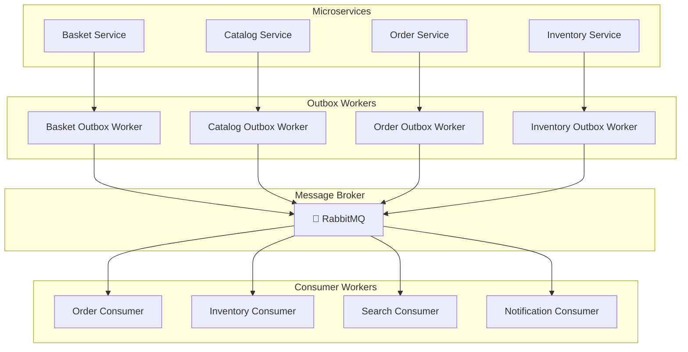
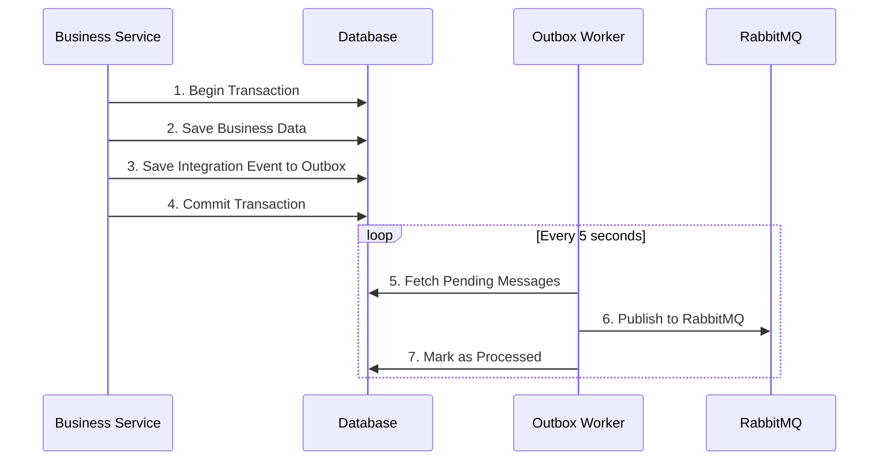
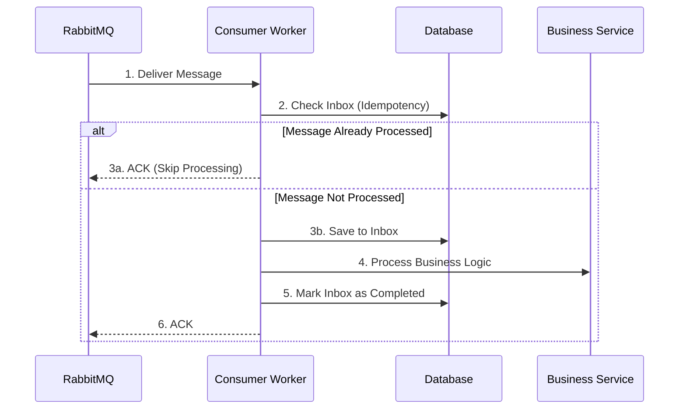
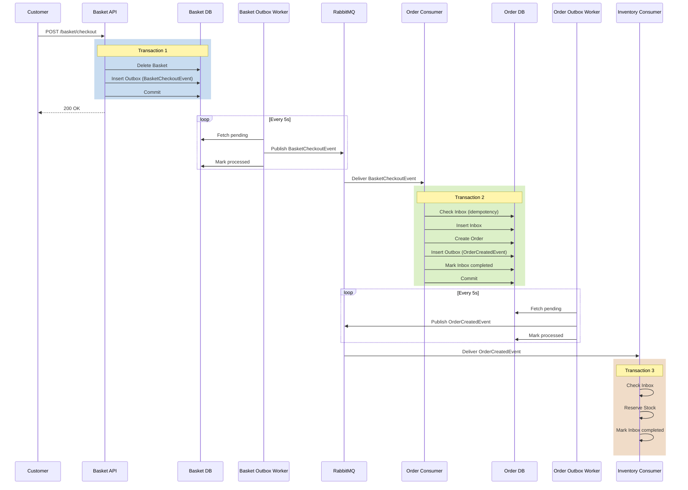

# RabbitMQ & MassTransit Onboarding Guide

> **Hướng dẫn cho lập trình viên mới tham gia dự án**  
> Tài liệu này giúp bạn hiểu và làm việc với RabbitMQ + MassTransit trong hệ thống microservices một cách nhanh chóng và hiệu quả.

---

## 📑 Mục Lục

- [0. Thông Tin Định Hướng](#0-thông-tin-định-hướng)
- [1. Tổng Quan Hệ Thống](#1-tổng-quan-hệ-thống)
- [2. Kiến Trúc Tổng Thể & Event Flow](#2-kiến-trúc-tổng-thể--event-flow)
- [3. Core Setup & Convention](#3-core-setup--convention)
- [4. Integration Events Trong Dự Án](#4-integration-events-trong-dự-án)
- [5. Làm Việc Với Outbox (Publisher Guide)](#5-làm-việc-với-outbox-publisher-guide)
- [6. Làm Việc Với Consumer & Inbox (Consumer Guide)](#6-làm-việc-với-consumer--inbox-consumer-guide)
- [7. Checklist "Thêm Event/Consumer Mới"](#7-checklist-thêm-eventconsumer-mới)
- [8. Best Practices Bắt Buộc Tuân Thủ](#8-best-practices-bắt-buộc-tuân-thủ)
- [9. Troubleshooting Cơ Bản](#9-troubleshooting-cơ-bản)
- [Appendix: Tham Khảo Chi Tiết](#appendix-tham-khảo-chi-tiết)

---

## 0. Thông Tin Định Hướng

### 🎯 Mục tiêu của tài liệu

Tài liệu này giúp bạn:
1. **Hiểu** hệ thống đang dùng RabbitMQ + MassTransit để làm gì
2. **Biết** khi cần thêm/sửa/debug một event, phải làm ở đâu
3. **Tuân thủ** các quy tắc bắt buộc để không gây lỗi production

### 👥 Đối tượng đọc

| Level | Nên đọc gì |
|-------|-----------|
| **Junior/Mid (mới vào dự án)** | Đọc tuần tự từ Phần 0 → 9 |
| **Senior (đã quen dự án)** | Tập trung Phần 2, 7, 8 + Appendix |
| **Architect/Tech Lead** | Đọc [Architecture Document](./RabbitMQ_MassTransit_Architecture.md) |

### 📖 Cách sử dụng tài liệu

- **Lần đầu đọc**: Đọc tuần tự từ đầu đến cuối (skip code chi tiết)
- **Khi implement**: Dùng Phần 7 (Checklist) + code examples
- **Khi debug**: Dùng Phần 9 (Troubleshooting)
- **Tra cứu nâng cao**: Xem [Architecture Document](./RabbitMQ_MassTransit_Architecture.md)

---

## 1. Tổng Quan Hệ Thống

### 1.1. Hệ thống này dùng RabbitMQ + MassTransit để làm gì?

Trong dự án microservices này, các services cần giao tiếp với nhau **bất đồng bộ** và **đáng tin cậy**. Chúng ta sử dụng:

- **RabbitMQ**: Message broker trung gian
- **MassTransit**: Thư viện .NET giúp làm việc với RabbitMQ dễ dàng hơn
- **Event-Driven Architecture**: Services giao tiếp qua events thay vì gọi API trực tiếp

**Ví dụ thực tế:**
```
Customer checkout giỏ hàng 
  → Basket Service gửi event "BasketCheckoutIntegrationEvent"
  → Order Service nhận event và tạo đơn hàng
  → Order Service gửi event "OrderCreatedIntegrationEvent"
  → Inventory Service nhận event và reserve stock
  → Notification Service nhận event và gửi email
```

### 1.2. Vai trò của các thành phần

| Thành phần | Vai trò | Ví dụ |
|-----------|---------|-------|
| **RabbitMQ** | Message broker (bưu điện) | Nhận messages từ Publisher và gửi đến Consumer |
| **MassTransit** | Abstraction layer | Giúp publish/consume messages dễ dàng |
| **Outbox Pattern** | Đảm bảo messages được gửi đi | Lưu message vào DB cùng transaction, sau đó worker gửi lên RabbitMQ |
| **Inbox Pattern** | Đảm bảo không xử lý trùng | Kiểm tra message đã xử lý chưa trước khi process |

### 1.3. Lợi ích

✅ **Loose Coupling**: Order Service không cần biết Inventory Service deploy ở đâu  
✅ **Reliability**: Nếu Inventory Service down, message vẫn được lưu và xử lý sau  
✅ **Scalability**: Dễ dàng thêm consumer để xử lý nhiều messages hơn  
✅ **Idempotency**: Xử lý cùng message nhiều lần cũng không bị lỗi  

---

## 2. Kiến Trúc Tổng Thể & Event Flow

### 2.1. High-Level Architecture



**Giải thích:**
- **Service**: Xử lý business logic, lưu event vào Outbox table
- **Outbox Worker**: Background service đọc Outbox table, gửi messages lên RabbitMQ
- **RabbitMQ**: Message broker trung gian
- **Consumer Worker**: Subscribe RabbitMQ, nhận messages và xử lý
- **Inbox**: Consumer lưu messageId vào Inbox table để đảm bảo idempotency

### 2.2. Outbox Pattern Flow



**Tại sao cần Outbox Pattern?**
- Đảm bảo business data và event được lưu cùng transaction
- Nếu RabbitMQ down, message vẫn an toàn trong DB
- Worker tự động retry nếu publish fail

### 2.3. Consumer + Inbox Flow



**Tại sao cần Inbox Pattern?**
- MassTransit có thể gửi lại cùng message nhiều lần (at-least-once delivery)
- Inbox giúp detect duplicate và skip processing
- Đảm bảo business logic chỉ chạy đúng 1 lần

---

## 3. Core Setup & Convention

### 3.1. Cách đăng ký MassTransit

**File:** `src/Shared/EventSourcing/MassTransit/Extentions.cs`

```csharp
public static IServiceCollection AddMessageBroker(
    this IServiceCollection services,
    IConfiguration cfg,
    Assembly? assembly = null)
{
    services.AddMassTransit(config =>
    {
        // Sử dụng kebab-case cho endpoint names
        config.SetKebabCaseEndpointNameFormatter();

        // Auto-register tất cả consumers từ assembly
        if (assembly != null)
            config.AddConsumers(assembly);

        // Cấu hình RabbitMQ transport
        config.UsingRabbitMq((context, configurator) =>
        {
            configurator.Host(new Uri(cfg[$"{MessageBrokerCfg.Section}:{MessageBrokerCfg.Host}"]!), host =>
            {
                host.Username(cfg[$"{MessageBrokerCfg.Section}:{MessageBrokerCfg.UserName}"]!);
                host.Password(cfg[$"{MessageBrokerCfg.Section}:{MessageBrokerCfg.Password}"]!);
            });
            
            configurator.ConfigureEndpoints(context);
        });
    });

    return services;
}
```

**Cách dùng:**

```csharp
// Publisher (Outbox Worker) - không cần assembly
builder.Services.AddMessageBroker(builder.Configuration);

// Consumer Worker - cần pass assembly chứa consumers
builder.Services.AddMessageBroker(
    builder.Configuration, 
    Assembly.GetExecutingAssembly()
);
```

### 3.2. appsettings.json mẫu

```json
{
  "MessageBroker": {
    "Host": "amqp://rabbitmq:5672",
    "UserName": "admin",
    "Password": "123456789Aa",
    "Port": 5672
  }
}
```

**⚠️ LƯU Ý:**
- `Host` phải là `amqp://rabbitmq:5672` khi chạy trong Docker
- Nếu chạy local (không Docker), dùng `amqp://localhost:5672`

### 3.3. Naming Conventions

| Thành phần | Convention | Ví dụ |
|-----------|-----------|-------|
| **Event Class** | `{Entity}{Action}IntegrationEvent` | `OrderCreatedIntegrationEvent` |
| **Exchange Name** | Kebab-case của event | `order-created-integration-event` |
| **Queue Name** | `{service}_{event}` | `inventory-consumer_order-created-integration-event` |
| **Consumer Class** | `{Event}Handler` | `OrderCreatedIntegrationEventHandler` |

**⚠️ BẮT BUỘC:**
- Event class phải `sealed record` và inherit từ `IntegrationEvent`
- Consumer class phải implement `IConsumer<TEvent>`
- Không được thay đổi naming convention (sẽ gây lỗi routing)

### 3.4. Retry Policy

Outbox Worker tự động retry với **exponential backoff**:

| Attempt | Delay | Formula |
|---------|-------|---------|
| 1 | 0s | Immediate |
| 2 | 30s | Base delay |
| 3 | 60s | `TimeSpan.FromSeconds(30 * attemptCount)` |
| 4+ | ❌ Permanent Failure | Max attempts reached |

**MaxAttempts mặc định:** 3 lần

---

## 4. Integration Events Trong Dự Án

### 4.1. Base Integration Event

**File:** `src/Shared/EventSourcing/Events/IntegrationEvent.cs`

```csharp
public record IntegrationEvent
{
    public string Id { get; init; } = default!;
    public DateTimeOffset OccurredOn { get; init; } = DateTimeOffset.UtcNow;
    public string? EventType => GetType()?.AssemblyQualifiedName;
}
```

**Quy tắc:**
- Tất cả events phải inherit từ `IntegrationEvent`
- Dùng `record` thay vì `class` (immutable)
- Không được thêm methods vào event (chỉ chứa data)

### 4.2. Event Matrix (Cheat Sheet cho Dev)

| Event | Publisher | Consumer(s) | Mục Đích |
|-------|-----------|-------------|----------|
| `BasketCheckoutIntegrationEvent` | Basket.Worker.Outbox | Order.Worker.Consumer | Tạo đơn hàng từ giỏ hàng |
| `OrderCreatedIntegrationEvent` | Order.Worker.Outbox | Inventory.Worker.Consumer<br>Communication.Api | Reserve stock & Gửi notification |
| `OrderCancelledIntegrationEvent` | Order.Worker.Outbox | Inventory.Worker.Consumer | Release reserved stock |
| `OrderDeliveredIntegrationEvent` | Order.Worker.Outbox | Inventory.Worker.Consumer | Commit stock changes |
| `UpsertedProductIntegrationEvent` | Catalog.Worker.Outbox | Search.Worker.Consumer<br>Notification.Worker.Consumer | Sync product đến Elasticsearch |
| `DeletedUnPublishedProductIntegrationEvent` | Catalog.Worker.Outbox | Search.Worker.Consumer | Xóa product khỏi search index |
| `StockChangedIntegrationEvent` | Inventory.Worker.Outbox | Catalog.Worker.Consumer | Sync stock quantity về Catalog |
| `ReservationExpiredIntegrationEvent` | Inventory.Worker.Outbox | Order.Worker.Consumer | Cancel order khi reservation hết hạn |

### 4.3. Ví dụ Event cụ thể

**File:** `src/Shared/EventSourcing/Events/Orders/OrderCreatedIntegrationEvent.cs`

```csharp
public sealed record OrderCreatedIntegrationEvent : IntegrationEvent
{
    public Guid OrderId { get; init; }
    public string OrderNo { get; init; } = default!;
    public List<OrderItemIntegrationEvent> OrderItems { get; init; } = default!;
    public decimal TotalPrice { get; init; }
    public decimal FinalPrice { get; init; }
}

public sealed record OrderItemIntegrationEvent
{
    public Guid ProductId { get; init; }
    public string ProductName { get; init; } = default!;
    public int Quantity { get; init; }
    public decimal UnitPrice { get; init; }
    public decimal LineTotal { get; init; }
}
```

**Khi nào dùng event này?**
- Sau khi Order được tạo thành công
- Inventory Service cần reserve stock
- Communication Service cần gửi email/notification

---

## 5. Làm Việc Với Outbox (Publisher Guide)

### 5.1. Khi nào cần publish event qua Outbox?

✅ **PHẢI dùng Outbox khi:**
- Bạn cần lưu business data + gửi event trong cùng transaction
- Event liên quan đến state change quan trọng (Order created, Stock changed, v.v.)

❌ **KHÔNG cần Outbox khi:**
- Event chỉ là notification đơn giản, không critical
- Dùng direct publish qua `IPublishEndpoint` (ít dùng trong dự án này)

### 5.2. Cách publish event qua Outbox

**Step 1: Tạo Integration Event**

```csharp
var integrationEvent = new OrderCreatedIntegrationEvent
{
    Id = Guid.NewGuid().ToString(),
    OrderId = order.Id,
    OrderNo = order.OrderNo,
    OrderItems = order.Items.Select(i => new OrderItemIntegrationEvent
    {
        ProductId = i.ProductId,
        ProductName = i.ProductName,
        Quantity = i.Quantity,
        UnitPrice = i.UnitPrice,
        LineTotal = i.LineTotal
    }).ToList(),
    TotalPrice = order.TotalPrice,
    FinalPrice = order.FinalPrice
};
```

**Step 2: Lưu vào Outbox table**

```csharp
var outboxMessage = OutboxMessageEntity.Create(
    integrationEvent.Id,
    integrationEvent.EventType!,
    JsonSerializer.Serialize(integrationEvent)
);

await _outboxRepo.AddAsync(outboxMessage, cancellationToken);
```

**Step 3: Commit transaction (bao gồm business data + outbox)**

```csharp
await _unitOfWork.SaveChangesAsync(cancellationToken);
```

**⚠️ QUAN TRỌNG:**
- Outbox message phải nằm trong **cùng transaction** với business data
- Nếu transaction rollback, outbox message cũng rollback
- Outbox Worker sẽ tự động fetch và publish message lên RabbitMQ

### 5.3. Outbox Worker là gì và hoạt động như thế nào?

**Outbox Worker** là một Background Service chạy liên tục:

```csharp
// Chạy mỗi 5 giây (configurable)
loop Every 5 seconds
{
    1. Fetch pending messages từ Outbox table
    2. Publish messages lên RabbitMQ (parallel)
    3. Mark messages as Processed
    4. Retry failed messages với exponential backoff
}
```

**Cấu hình:**

```json
{
  "Worker": {
    "Outbox": {
      "IntervalSeconds": 5,
      "BatchSize": 1000
    }
  }
}
```

### 5.4. Những điều KHÔNG được làm

❌ **ĐỪNG** publish trực tiếp qua `IPublishEndpoint` trong critical flow  
❌ **ĐỪNG** commit business data trước, rồi mới lưu Outbox sau (sẽ bị mất message nếu crash)  
❌ **ĐỪNG** tự ý thay đổi `MaxAttempts` mà không hiểu retry policy  
❌ **ĐỪNG** serialize event với nhiều nested objects (ảnh hưởng performance)  

---

## 6. Làm Việc Với Consumer & Inbox (Consumer Guide)

### 6.1. Consumer Lifecycle

```
RabbitMQ delivers message
  ↓
Consumer receives message
  ↓
Check Inbox (đã xử lý chưa?)
  ↓ NO
Save to Inbox
  ↓
Process Business Logic
  ↓
Mark Inbox as Completed
  ↓
ACK message to RabbitMQ
```

### 6.2. Cách implement Consumer chuẩn

**File:** `Order.Worker.Consumer/EventHandlers/Integrations/BasketCheckoutIntegrationEventHandler.cs`

```csharp
public sealed class BasketCheckoutIntegrationEventHandler(
    IMediator sender,
    IUnitOfWork unitOfWork,
    ILogger<BasketCheckoutIntegrationEventHandler> logger)
    : IConsumer<BasketCheckoutIntegrationEvent>
{
    public async Task Consume(ConsumeContext<BasketCheckoutIntegrationEvent> context)
    {
        var message = context.Message;
        var messageId = context.MessageId ?? Guid.NewGuid();

        logger.LogInformation("Received BasketCheckoutIntegrationEvent {MessageId}", messageId);

        // ✅ STEP 1: IDEMPOTENCY CHECK
        var existingMessage = await unitOfWork.InboxMessages
            .FirstOrDefaultAsync(m => m.Id == messageId, context.CancellationToken);

        if (existingMessage != null)
        {
            logger.LogInformation("Message {MessageId} already processed. Skipping.", messageId);
            return; // ACK mà không xử lý
        }

        // ✅ STEP 2: CREATE INBOX RECORD
        var inboxMessage = InboxMessageEntity.Create(
            messageId,
            message.GetType().AssemblyQualifiedName!,
            JsonSerializer.Serialize(message),
            DateTimeOffset.UtcNow
        );

        await unitOfWork.InboxMessages.AddAsync(inboxMessage, context.CancellationToken);
        await unitOfWork.SaveChangesAsync(context.CancellationToken);

        try
        {
            // ✅ STEP 3: PROCESS BUSINESS LOGIC
            var command = new CreateOrderCommand(dto, actor);
            await sender.Send(command, context.CancellationToken);

            // ✅ STEP 4: MARK AS COMPLETED
            inboxMessage.CompleteProcessing(DateTimeOffset.UtcNow);
            await unitOfWork.SaveChangesAsync(context.CancellationToken);

            logger.LogInformation("Successfully processed event {MessageId}", messageId);
        }
        catch (Exception ex)
        {
            logger.LogError(ex, "Failed to process event {MessageId}", messageId);

            // ✅ STEP 5: MARK AS FAILED
            inboxMessage.CompleteProcessing(DateTimeOffset.UtcNow, ex.Message);
            await unitOfWork.SaveChangesAsync(context.CancellationToken);

            throw; // Re-throw để MassTransit retry
        }
    }
}
```

### 6.3. Idempotency là gì và tại sao bắt buộc?

**Idempotency** = Xử lý cùng message nhiều lần không gây side-effect

**Tại sao cần?**
- RabbitMQ đảm bảo **at-least-once delivery** (có thể gửi trùng)
- Network issue có thể gây retry
- Consumer restart có thể process lại message cũ

**Cách đảm bảo:**
1. Check `messageId` trong Inbox table
2. Nếu đã tồn tại → skip processing
3. Nếu chưa → lưu vào Inbox, process, rồi mark completed

### 6.4. Transaction Boundaries (Quan trọng!)

**✅ ĐÚNG:**

```csharp
await using var transaction = await unitOfWork.BeginTransactionAsync();
try
{
    await unitOfWork.InboxMessages.AddAsync(inboxMessage);
    await ProcessBusinessLogic();
    inboxMessage.MarkCompleted();
    await unitOfWork.SaveChangesAsync();
    await transaction.CommitAsync();
}
catch
{
    await transaction.RollbackAsync();
    throw;
}
```

**❌ SAI:**

```csharp
// SAI: Commit inbox trước
await unitOfWork.InboxMessages.AddAsync(inboxMessage);
await unitOfWork.SaveChangesAsync(); // Commit ngay - SAI!

// Nếu ProcessBusinessLogic() fail → inbox đã committed nhưng business logic chưa chạy
await ProcessBusinessLogic();
```

### 6.5. Error Handling Best Practice

```csharp
try
{
    await ProcessBusinessLogic();
    inboxMessage.CompleteProcessing(DateTimeOffset.UtcNow);
}
catch (Exception ex)
{
    // Lưu error vào Inbox
    inboxMessage.CompleteProcessing(DateTimeOffset.UtcNow, ex.Message);
    await unitOfWork.SaveChangesAsync();
    
    // Re-throw để MassTransit retry
    throw;
}
```

**Tại sao phải `throw`?**
- MassTransit sẽ retry message (theo retry policy)
- Nếu không `throw`, message sẽ bị ACK và mất

---

## 7. Checklist "Thêm Event/Consumer Mới"

### 7.1. Checklist Publisher (Thêm Event Mới)

- [ ] **1. Define Integration Event**
  ```csharp
  // File: src/Shared/EventSourcing/Events/Orders/OrderShippedIntegrationEvent.cs
  public sealed record OrderShippedIntegrationEvent : IntegrationEvent
  {
      public Guid OrderId { get; init; }
      public string TrackingNumber { get; init; } = default!;
  }
  ```

- [ ] **2. Publish qua Outbox trong Domain Event Handler**
  ```csharp
  var integrationEvent = new OrderShippedIntegrationEvent { ... };
  var outboxMessage = OutboxMessageEntity.Create(...);
  await _outboxRepo.AddAsync(outboxMessage);
  ```

- [ ] **3. Verify Outbox Worker đã chạy**
  ```bash
  docker ps | grep outbox
  docker logs order-worker-outbox
  ```

- [ ] **4. Check RabbitMQ Management UI**
  - Go to http://localhost:15672
  - Exchanges tab → tìm `order-shipped-integration-event`

### 7.2. Checklist Consumer (Thêm Consumer Mới)

- [ ] **1. Create Consumer Class**
  ```csharp
  public sealed class OrderShippedIntegrationEventHandler(...)
      : IConsumer<OrderShippedIntegrationEvent>
  {
      public async Task Consume(ConsumeContext<OrderShippedIntegrationEvent> context)
      {
          // Idempotency check + Inbox + Business logic
      }
  }
  ```

- [ ] **2. Verify Consumer auto-registered**
  ```csharp
  // DependencyInjection.cs
  services.AddMessageBroker(cfg, Assembly.GetExecutingAssembly());
  ```

- [ ] **3. Implement Inbox Pattern**
  - Check messageId trong Inbox
  - Save to Inbox
  - Process business logic
  - Mark completed

- [ ] **4. Test locally**
  ```bash
  docker logs notification-worker-consumer
  # Should see: "Received OrderShippedIntegrationEvent..."
  ```

- [ ] **5. Verify Queue created trong RabbitMQ UI**
  - Queues tab → `notification-consumer_order-shipped-integration-event`

### 7.3. Testing Checklist

- [ ] **Unit Test**: Mock `IPublishEndpoint`, verify event được tạo đúng
- [ ] **Integration Test**: Publish event thật, verify consumer process
- [ ] **Idempotency Test**: Gửi cùng message 2 lần, verify chỉ process 1 lần
- [ ] **Retry Test**: Throw exception trong consumer, verify retry hoạt động
- [ ] **Load Test**: Publish 1000 messages, verify throughput

---

## 8. Best Practices Bắt Buộc Tuân Thủ

### 8.1. Event Design

#### ✅ DO

```csharp
// Event immutable, chỉ chứa data cần thiết
public sealed record ProductPriceChangedIntegrationEvent : IntegrationEvent
{
    public Guid ProductId { get; init; }
    public decimal OldPrice { get; init; }
    public decimal NewPrice { get; init; }
}
```

#### ❌ DON'T

```csharp
// ĐỪNG include business logic trong event
public class ProductPriceChangedIntegrationEvent : IntegrationEvent
{
    public Product Product { get; set; } // Quá nhiều data
    
    public void ApplyDiscount() // Logic không nên ở đây
    {
        // ...
    }
}
```

### 8.2. Consumer Implementation

#### ✅ DO

```csharp
// Luôn check idempotency
public async Task Consume(ConsumeContext<OrderCreatedIntegrationEvent> context)
{
    var messageId = context.MessageId ?? Guid.NewGuid();
    
    var existing = await _inbox.FindByIdAsync(messageId);
    if (existing != null) return; // Skip
    
    // Process...
}
```

#### ❌ DON'T

```csharp
// ĐỪNG skip idempotency check
public async Task Consume(ConsumeContext<OrderCreatedIntegrationEvent> context)
{
    await ProcessOrder(context.Message); // Risk duplicate
}
```

### 8.3. Transaction Management

#### ✅ DO

```csharp
// Sử dụng UnitOfWork để đảm bảo atomicity
await using var transaction = await _unitOfWork.BeginTransactionAsync();
try
{
    await _inbox.AddAsync(inboxMessage);
    await ProcessBusinessLogic();
    inboxMessage.MarkCompleted();
    await _unitOfWork.SaveChangesAsync();
    await transaction.CommitAsync();
}
catch
{
    await transaction.RollbackAsync();
    throw;
}
```

#### ❌ DON'T

```csharp
// ĐỪNG tách biệt operations
await _inbox.AddAsync(inboxMessage);
await _inbox.SaveChangesAsync(); // Commit ngay - SAI!

await ProcessBusinessLogic(); // Nếu fail → inbox đã committed
```

### 8.4. Logging

#### ✅ DO

```csharp
_logger.LogInformation(
    "Publishing event {EventType} with ID {MessageId} (attempt {Attempt}/{MaxAttempts})",
    message.EventType, message.Id, message.AttemptCount, message.MaxAttempts
);
```

#### ❌ DON'T

```csharp
_logger.LogInformation("Publishing event"); // Không đủ context
```

### 8.5. Quy tắc bắt buộc

| Quy tắc | Mô tả | Hậu quả nếu vi phạm |
|---------|-------|---------------------|
| ✅ Event phải immutable | Dùng `sealed record`, không có setters | Race condition, data corruption |
| ✅ Inbox bắt buộc trong Consumer | Luôn check messageId trước khi process | Duplicate processing, data corruption |
| ✅ UnitOfWork + Transaction | Inbox + Business logic cùng transaction | Inconsistent state |
| ✅ Re-throw exception trong Consumer | Để MassTransit retry | Message bị lost |
| ✅ Không serialize nhiều nested objects | Giữ event nhỏ gọn | Slow performance, large messages |

---

## 9. Troubleshooting Cơ Bản

### 9.1. Messages không được publish

**Triệu chứng:**
- Outbox table có messages nhưng không thấy trong RabbitMQ
- Logs không có error

**Giải pháp:**

```bash
# 1. Check Outbox Worker đã chạy chưa
docker ps | grep outbox

# 2. Check logs
docker logs basket-worker-outbox

# 3. Verify connection
docker exec basket-worker-outbox ping rabbitmq

# 4. Check appsettings.json
cat appsettings.json | grep MessageBroker
```

### 9.2. Consumer không nhận messages

**Triệu chứng:**
- RabbitMQ UI shows messages trong queue
- Consumer không process

**Giải pháp:**

```bash
# 1. Check Consumer Worker
docker ps | grep consumer

# 2. Check logs
docker logs order-worker-consumer

# 3. Verify consumer registered
# → Check DependencyInjection.cs:
# services.AddMessageBroker(cfg, Assembly.GetExecutingAssembly());
```

**Check RabbitMQ UI:**
1. Go to http://localhost:15672
2. Queues tab → Click queue name
3. Check bindings (phải có exchange binding)

### 9.3. Duplicate Message Processing

**Triệu chứng:**
- Business logic chạy nhiều lần cho cùng một event
- Inbox table không có record hoặc có nhiều records cùng messageId

**Giải pháp:**

```csharp
// Đảm bảo sử dụng Inbox Pattern
var existing = await _inbox.FindByIdAsync(messageId);
if (existing != null) return; // Skip

// Verify MessageId consistency
var messageId = context.MessageId ?? Guid.NewGuid();
```

**Check database:**

```sql
-- Check duplicate inbox records
SELECT Id, COUNT(*) 
FROM inbox_messages 
GROUP BY Id 
HAVING COUNT(*) > 1;
```

### 9.4. Outbox messages stuck in "Processing"

**Triệu chứng:**
- Messages có `ClaimedOnUtc` nhưng không có `ProcessedOnUtc`

**Giải pháp:**

```sql
-- 1. Check error messages
SELECT * FROM outbox_messages 
WHERE ProcessedOnUtc IS NULL 
  AND ClaimedOnUtc IS NOT NULL;

-- 2. Release stuck claims (sau khi fix lỗi)
UPDATE outbox_messages 
SET ClaimedOnUtc = NULL, ClaimedBy = NULL
WHERE ProcessedOnUtc IS NULL 
  AND ClaimedOnUtc < DATEADD(minute, -5, GETUTCDATE());
```

### 9.5. Quick Debug Commands

```bash
# Check all running workers
docker ps --filter "name=worker"

# Check RabbitMQ health
curl http://localhost:15672/api/healthchecks/node

# Tail logs real-time
docker logs -f order-worker-consumer

# Check network connectivity
docker network inspect progcoder_network
```

---

## Appendix: Tham Khảo Chi Tiết

### A. Tài liệu nâng cao

- [RabbitMQ & MassTransit Architecture](./RabbitMQ_MassTransit_Architecture.md) - Chi tiết kiến trúc, performance tuning, monitoring
- [MassTransit Documentation](https://masstransit.io/)
- [RabbitMQ Documentation](https://www.rabbitmq.com/documentation.html)

### B. Queue Naming Convention (MassTransit)

| Component | Format | Example |
|-----------|--------|---------|
| Exchange | `{event-name}` | `basket-checkout-integration-event` |
| Queue | `{service}_{event-name}` | `order-consumer_basket-checkout-integration-event` |
| Error Queue | `{queue}_error` | `order-consumer_basket-checkout-integration-event_error` |

### C. Database Schema

**Outbox Table:**

```sql
CREATE TABLE outbox_messages (
    Id UUID PRIMARY KEY,
    EventType VARCHAR(500) NOT NULL,
    Content TEXT NOT NULL,
    CreatedOnUtc TIMESTAMP NOT NULL,
    ProcessedOnUtc TIMESTAMP NULL,
    LastErrorMessage TEXT NULL,
    AttemptCount INT NOT NULL DEFAULT 0,
    MaxAttempts INT NOT NULL DEFAULT 3,
    NextAttemptOnUtc TIMESTAMP NULL,
    ClaimedOnUtc TIMESTAMP NULL,
    ClaimedBy VARCHAR(100) NULL
);
```

**Inbox Table:**

```sql
CREATE TABLE inbox_messages (
    Id UUID PRIMARY KEY,
    EventType VARCHAR(500) NOT NULL,
    Content TEXT NOT NULL,
    ReceivedOnUtc TIMESTAMP NOT NULL,
    ProcessedOnUtc TIMESTAMP NULL,
    ErrorMessage TEXT NULL
);
```

### D. Monitoring Tools

- **RabbitMQ Management UI**: http://localhost:15672
- **Grafana Dashboard**: http://localhost:3000
- **Prometheus Metrics**: http://rabbitmq:15692/metrics

### E. Configuration Reference

**Outbox Worker:**

```json
{
  "Worker": {
    "Outbox": {
      "IntervalSeconds": 5,
      "BatchSize": 1000
    }
  }
}
```

**RabbitMQ Connection:**

```json
{
  "MessageBroker": {
    "Host": "amqp://rabbitmq:5672",
    "UserName": "admin",
    "Password": "123456789Aa"
  }
}
```

### F. Complete Event Flow Example

**Scenario: Customer Checkout → Order Created → Stock Reserved**



---

## 📝 Kết Luận

Sau khi đọc tài liệu này, bạn đã hiểu:

✅ Hệ thống dùng RabbitMQ + MassTransit để giao tiếp bất đồng bộ giữa services  
✅ Outbox Pattern đảm bảo messages được gửi đi một cách đáng tin cậy  
✅ Inbox Pattern đảm bảo idempotency khi consume messages  
✅ Cách thêm event/consumer mới và troubleshoot issues  

**Next Steps:**
1. Đọc code của 1 event flow cụ thể (ví dụ: Basket Checkout → Order Created)
2. Implement 1 event mới theo checklist ở Phần 7
3. Khi cần hiểu sâu kiến trúc → đọc [Architecture Document](./RabbitMQ_MassTransit_Architecture.md)

**Câu hỏi?** Liên hệ Tech Lead hoặc tham khảo Architecture Document.

---

**Last Updated:** 2026-01-16  
**Version:** 2.0  
**Author:** ProG Coder Team
