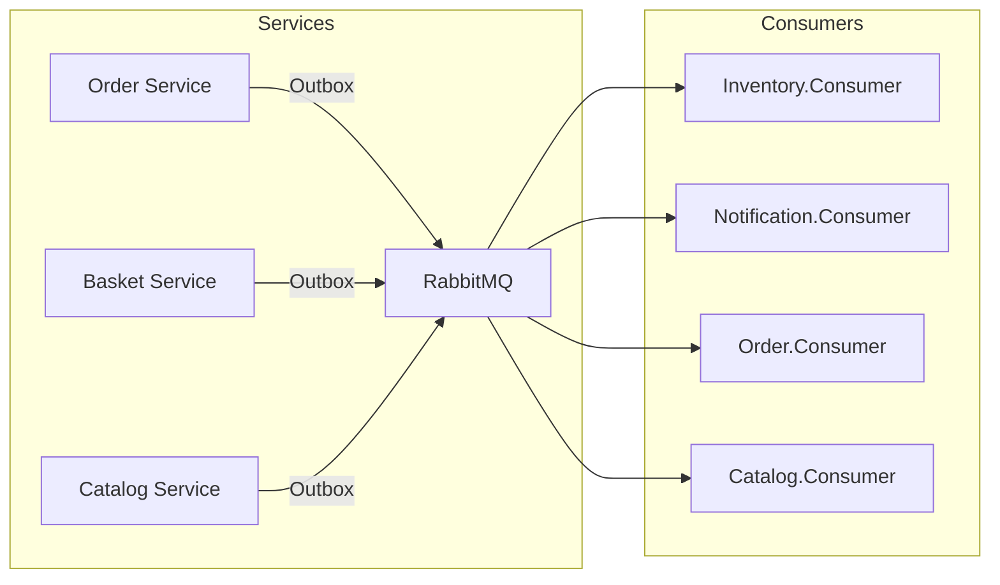
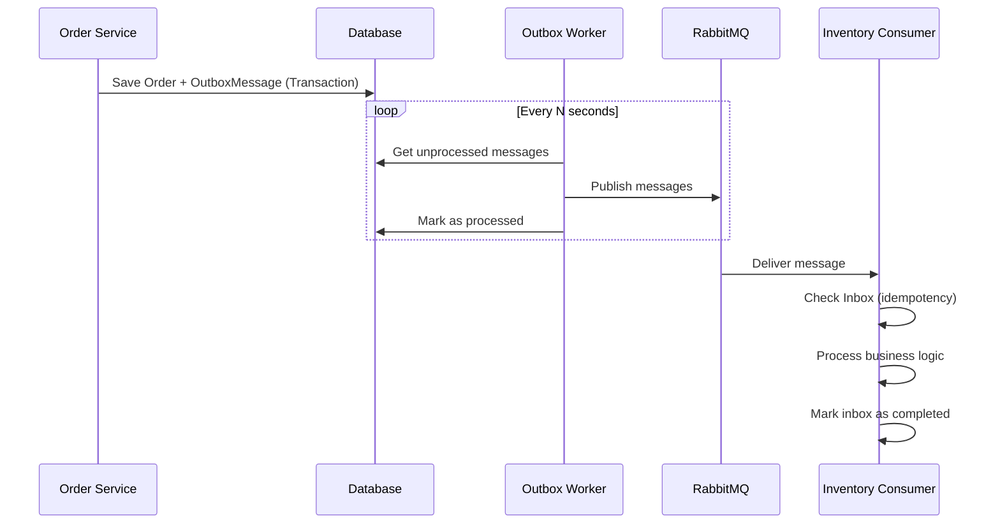

# Hướng dẫn Sử dụng RabbitMQ và MassTransit trong Project

> Tài liệu phân tích chi tiết cách triển khai RabbitMQ với MassTransit trong kiến trúc microservices.

---

## 1. Tổng quan Kiến trúc

Project sử dụng **MassTransit** làm abstraction layer cho **RabbitMQ** message broker, triển khai các patterns:

- **Transactional Outbox Pattern**: Đảm bảo messages được gửi đi một cách đáng tin cậy
- **Consumer Pattern**: Xử lý messages bất đồng bộ
- **Inbox Pattern**: Đảm bảo idempotency khi consume messages



---

## 2. Core Configuration

### 2.1. MassTransit Extensions

**File**: [Extentions.cs](file:///home/nguyen-thanh-hung/Documents/Code/progcoder-shop-microservices/src/Shared/EventSourcing/MassTransit/Extentions.cs)

```csharp
public static IServiceCollection AddMessageBroker(
    this IServiceCollection services,
    IConfiguration cfg,
    Assembly? assembly = null)
{
    services.AddMassTransit(config =>
    {
        config.SetKebabCaseEndpointNameFormatter();

        if (assembly != null)
            config.AddConsumers(assembly);

        config.UsingRabbitMq((context, configurator) =>
        {
            configurator.Host(new Uri(cfg[$"{MessageBrokerCfg.Section}:{MessageBrokerCfg.Host}"]!), host =>
            {
                host.Username(cfg[$"{MessageBrokerCfg.Section}:{MessageBrokerCfg.UserName}"]!);
                host.Password(cfg[$"{MessageBrokerCfg.Section}:{MessageBrokerCfg.Password}"]!);
            });
            configurator.ConfigureEndpoints(context);
        });
    });

    return services;
}
```

**Đặc điểm**:
- `SetKebabCaseEndpointNameFormatter()`: Queue names sẽ theo format `kebab-case`
- `AddConsumers(assembly)`: Tự động scan và đăng ký tất cả consumers trong assembly
- `ConfigureEndpoints(context)`: Tự động tạo endpoints cho các consumers

### 2.2. Configuration Settings

```json
{
  "MessageBroker": {
    "Host": "amqp://rabbitmq:5672",
    "UserName": "admin",
    "Password": "123456789Aa"
  }
}
```

---

## 3. Integration Events

### 3.1. Base Event

**File**: [IntegrationEvent.cs](file:///home/nguyen-thanh-hung/Documents/Code/progcoder-shop-microservices/src/Shared/EventSourcing/Events/IntegrationEvent.cs)

```csharp
public record IntegrationEvent
{
    public string Id { get; init; } = default!;
    public DateTimeOffset OccurredOn { get; init; } = DateTimeOffset.UtcNow;
    public string? EventType => GetType()?.AssemblyQualifiedName;
}
```

### 3.2. Danh sách Events

| Domain | Event | Mô tả |
|--------|-------|-------|
| **Baskets** | `BasketCheckoutIntegrationEvent` | Khi giỏ hàng được checkout |
| **Catalog** | `UpsertedProductIntegrationEvent` | Sản phẩm được tạo/cập nhật |
| **Catalog** | `DeletedUnPublishedProductIntegrationEvent` | Sản phẩm bị xóa |
| **Inventories** | `StockChangedIntegrationEvent` | Tồn kho thay đổi |
| **Inventories** | `ReservationExpiredIntegrationEvent` | Đặt trước hết hạn |
| **Orders** | `OrderCreatedIntegrationEvent` | Đơn hàng được tạo |
| **Orders** | `OrderCancelledIntegrationEvent` | Đơn hàng bị hủy |
| **Orders** | `OrderDeliveredIntegrationEvent` | Đơn hàng đã giao |

### 3.3. Ví dụ Event cụ thể

**File**: [OrderCreatedIntegrationEvent.cs](file:///home/nguyen-thanh-hung/Documents/Code/progcoder-shop-microservices/src/Shared/EventSourcing/Events/Orders/OrderCreatedIntegrationEvent.cs)

```csharp
public sealed record OrderCreatedIntegrationEvent : IntegrationEvent
{
    public Guid OrderId { get; init; }
    public string OrderNo { get; init; } = default!;
    public List<OrderItemIntegrationEvent> OrderItems { get; init; } = default!;
    public decimal TotalPrice { get; init; }
    public decimal FinalPrice { get; init; }
}
```

---

## 4. Outbox Pattern Implementation

### 4.1. Outbox Worker Structure

Mỗi service có một Outbox Worker riêng:

| Service | Outbox Worker |
|---------|--------------|
| Basket | `Basket.Worker.Outbox` |
| Catalog | `Catalog.Woker.Outbox` |
| Inventory | `Inventory.Worker.Outbox` |
| Order | `Order.Woker.Outbox` |

### 4.2. OutboxProcessor

**File**: [OutboxProcessor.cs](file:///home/nguyen-thanh-hung/Documents/Code/progcoder-shop-microservices/src/Services/Order/Worker/Order.Woker.Outbox/Processors/OutboxProcessor.cs)

```csharp
public async Task<int> ExecuteAsync(CancellationToken cancellationToken = default)
{
    // 1. Lấy messages chưa được xử lý
    var messages = await _databaseProvider.GetUnprocessedMessagesAsync(
        _connectionString, _batchSize, cancellationToken);

    if (messages.Count == 0)
        return 0;

    var updateQueue = new ConcurrentQueue<OutboxUpdate>();

    // 2. Publish song song
    var publishTasks = messages
        .Select(message => PublishMessageAsync(message, updateQueue, cancellationToken))
        .ToList();

    await Task.WhenAll(publishTasks);

    // 3. Cập nhật trạng thái
    if (!updateQueue.IsEmpty)
    {
        await _databaseProvider.UpdateProcessedMessagesAsync(
            _connectionString, updateQueue, cancellationToken);
    }

    return messages.Count;
}
```

**Đặc điểm**:
- **Retry with exponential backoff**: `TimeSpan.FromSeconds(Math.Pow(2, attemptCount - 1))`
- **Max retry attempts**: Configurable với `MaxAttempts`
- **Jitter**: Random delay để tránh thundering herd

### 4.3. OutboxBackgroundService

**File**: [OutboxBackgroundService.cs](file:///home/nguyen-thanh-hung/Documents/Code/progcoder-shop-microservices/src/Services/Order/Worker/Order.Woker.Outbox/BackgroundServices/OutboxBackgroundService.cs)

```csharp
protected override async Task ExecuteAsync(CancellationToken cancellationToken)
{
    var parallelOptions = new ParallelOptions
    {
        MaxDegreeOfParallelism = _maxParallelism,
        CancellationToken = cancellationToken
    };

    await Parallel.ForEachAsync(
        Enumerable.Range(0, _maxParallelism),
        parallelOptions,
        async (_, token) =>
        {
            await ProcessOutboxMessages(token);
        });
}
```

---

## 5. Consumer Pattern Implementation

### 5.1. Consumer Workers

| Service | Consumer Worker |
|---------|----------------|
| Catalog | `Catalog.Worker.Consumer` |
| Inventory | `Inventory.Worker.Consumer` |
| Notification | `Notification.Worker.Consumer` |
| Order | `Order.Worker.Consumer` |
| Search | `Search.Worker.Consumer` |

### 5.2. DependencyInjection trong Consumer

**File**: [DependencyInjection.cs](file:///home/nguyen-thanh-hung/Documents/Code/progcoder-shop-microservices/src/Services/Order/Worker/Order.Worker.Consumer/DependencyInjection.cs)

```csharp
public static IServiceCollection AddWorkerServices(
    this IServiceCollection services,
    IConfiguration cfg)
{
    services.AddSerilogLogging(cfg);
    services.AddMessageBroker(cfg, Assembly.GetExecutingAssembly());
    
    return services;
}
```

### 5.3. EventHandler với Inbox Pattern

**File**: [OrderCreatedIntegrationEventHandler.cs](file:///home/nguyen-thanh-hung/Documents/Code/progcoder-shop-microservices/src/Services/Inventory/Worker/Inventory.Worker.Consumer/EventHandlers/Integrations/OrderCreatedIntegrationEventHandler.cs)

```csharp
public sealed class OrderCreatedIntegrationEventHandler(...)
    : IConsumer<OrderCreatedIntegrationEvent>
{
    public async Task Consume(ConsumeContext<OrderCreatedIntegrationEvent> context)
    {
        var message = context.Message;
        var messageId = Guid.Parse(message.Id);

        await using var transaction = await unitOfWork.BeginTransactionAsync(...);

        try
        {
            // 1. Kiểm tra idempotency (Inbox pattern)
            var existingMessage = await unitOfWork.InboxMessages
                .GetByMessageIdAsync(messageId, context.CancellationToken);

            if (existingMessage != null)
            {
                logger.LogInformation("Message {MessageId} already processed. Skipping.", messageId);
                return;
            }

            // 2. Tạo inbox record
            var inboxMessage = InboxMessageEntity.Create(
                messageId,
                message.GetType().AssemblyQualifiedName!,
                JsonSerializer.Serialize(message),
                DateTimeOffset.UtcNow);

            await unitOfWork.InboxMessages.AddAsync(inboxMessage, ...);
            await unitOfWork.SaveChangesAsync(...);
            await transaction.CommitAsync(...);

            // 3. Xử lý business logic
            // ... reserve inventory for order items ...

            // 4. Mark as completed
            inboxMessage.CompleteProcessing(DateTimeOffset.UtcNow);
            await unitOfWork.SaveChangesAsync(...);
        }
        catch (Exception ex)
        {
            await transaction.RollbackAsync(...);
            throw;
        }
    }
}
```

---

## 6. Message Flow Diagram



---

## 7. Cấu trúc Thư mục

```
src/
├── Shared/
│   └── EventSourcing/
│       ├── Events/
│       │   ├── IntegrationEvent.cs
│       │   ├── Baskets/
│       │   ├── Catalog/
│       │   ├── Inventories/
│       │   └── Orders/
│       └── MassTransit/
│           └── Extentions.cs
│
└── Services/
    └── [ServiceName]/
        └── Worker/
            ├── [ServiceName].Worker.Consumer/
            │   ├── DependencyInjection.cs
            │   └── EventHandlers/
            │       └── Integrations/
            │           └── [Event]Handler.cs
            │
            └── [ServiceName].Worker.Outbox/
                ├── DependencyInjection.cs
                ├── BackgroundServices/
                │   └── OutboxBackgroundService.cs
                └── Processors/
                    └── OutboxProcessor.cs
```

---

## 8. Best Practices được áp dụng

| Practice | Mô tả |
|----------|-------|
| **Transactional Outbox** | Đảm bảo at-least-once delivery |
| **Inbox Pattern** | Đảm bảo idempotent message processing |
| **Assembly Scanning** | Auto-register consumers |
| **Exponential Backoff** | Retry với delay tăng dần |
| **Parallel Processing** | Xử lý nhiều messages đồng thời |
| **Unit of Work** | Transaction management trong consumers |

---

## 9. Monitoring

Project tích hợp **Grafana Dashboard** cho RabbitMQ monitoring:

**File**: `config/grafana/dashboards/RabbitMQ.json`

Metrics được monitor:
- Queue message counts
- Message rates (publish/deliver)
- Connections và Publishers
- Consumer status

---

*Tài liệu được tạo tự động bằng phân tích code với MCP tools: code-index, repomix, code-graph-rag*
