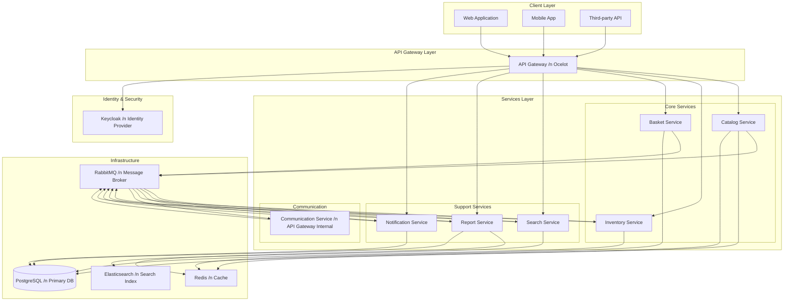
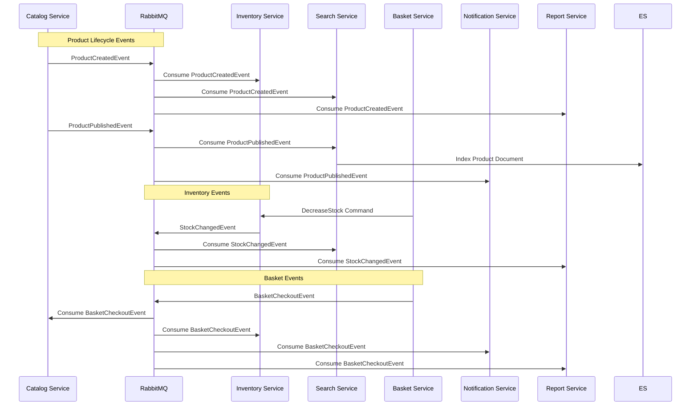
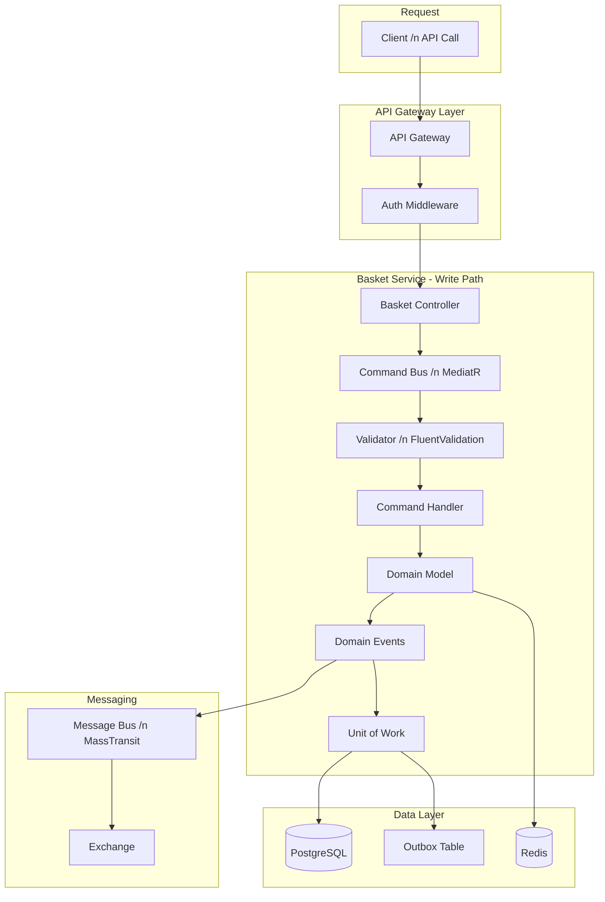
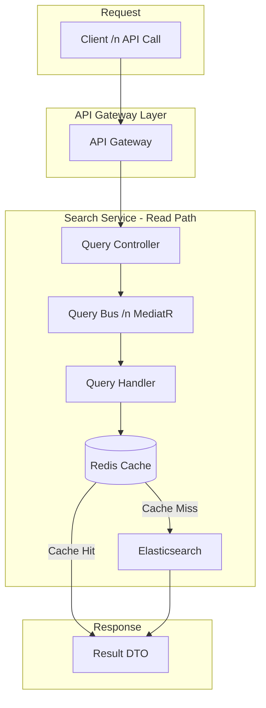
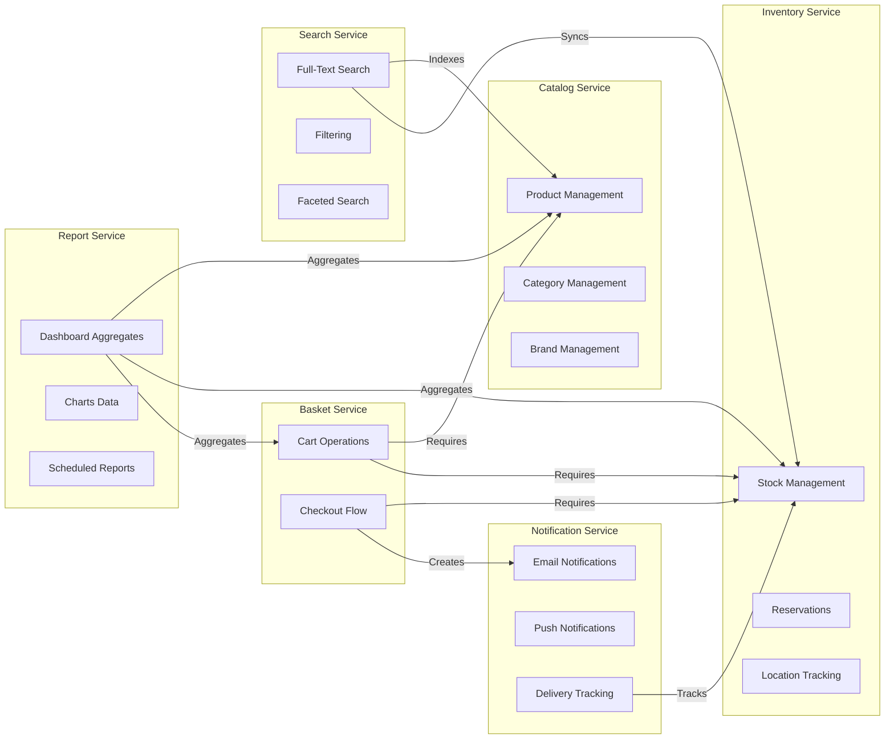
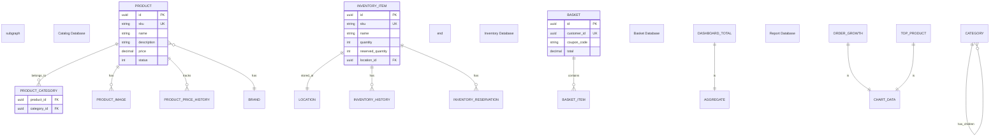
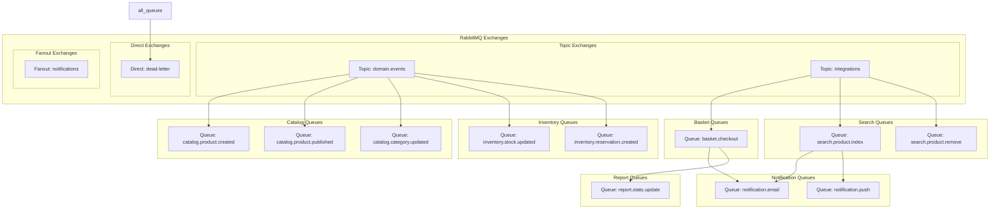
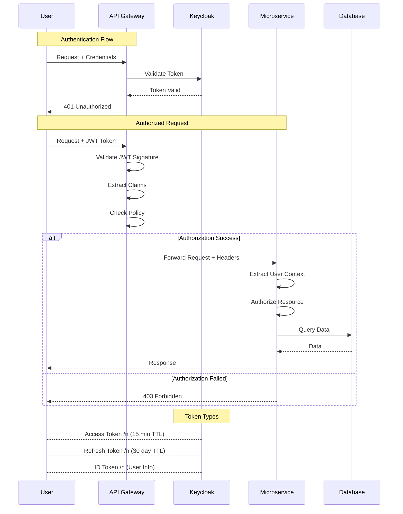
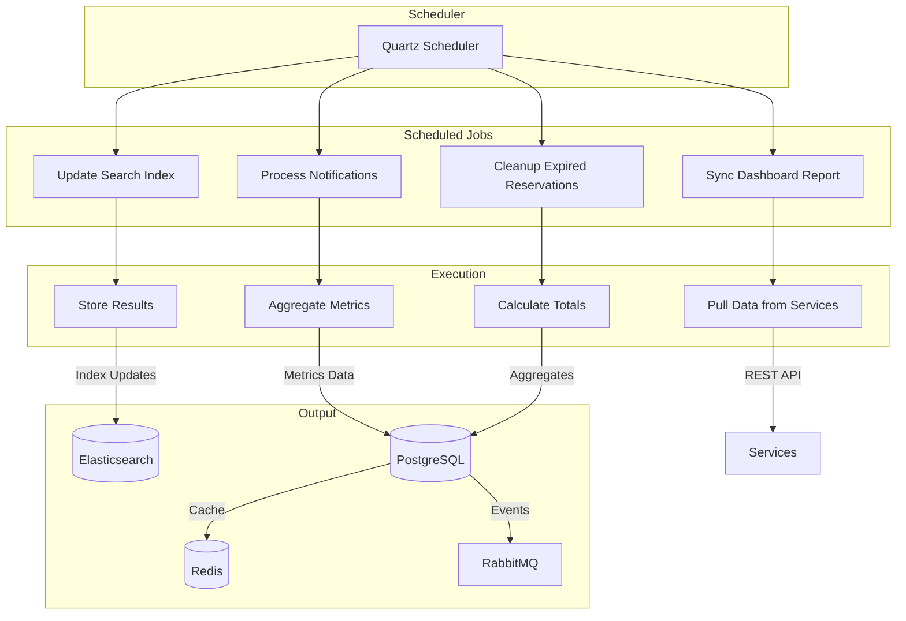

# Progcoder Shop Microservices - Technical Documentation

## Table of Contents

1. [Project Overview](#project-overview)
2. [Architecture Patterns](#architecture-patterns)
3. [Service Catalog](#service-catalog)
   - [Inventory Service](#1-inventory-service)
   - [Catalog Service](#2-catalog-service)
   - [Basket Service](#3-basket-service)
   - [Search Service](#4-search-service)
   - [Report Service](#5-report-service)
   - [Notification Service](#6-notification-service)
   - [Communication Service](#7-communication-service-api-gateway)
4. [Infrastructure & Shared Libraries](#infrastructure--shared-libraries)
5. [Technology Stack](#technology-stack)
6. [Data Flow & Integration](#data-flow--integration)

---

## Project Overview

**Progcoder Shop Microservices** là một hệ thống thương mại điện tử (e-commerce) được xây dựng trên nền tảng kiến trúc microservices, sử dụng .NET 8 làm framework chính. Dự án áp dụng các best practices hiện đại trong phát triển phần mềm doanh nghiệp, bao gồm Domain-Driven Design (DDD), CQRS (Command Query Responsibility Segregation), và Event-Driven Architecture.

Hệ thống được thiết kế để đáp ứng các yêu cầu về khả năng mở rộng (scalability), tính sẵn sàng cao (high availability), và khả năng bảo trì dễ dàng (maintainability). Mỗi service trong hệ thống được thiết kế để hoạt động độc lập, có thể deploy riêng biệt và scale theo nhu cầu thực tế. Kiến trúc microservices cho phép team phát triển làm việc độc lập trên từng service, giảm thiểu dependencies và tăng tốc độ phát triển sản phẩm.

### Key Characteristics

Dự án có một số đặc điểm nổi bật phản ánh tư duy thiết kế hiện đại. Đầu tiên, hệ thống sử dụng **Domain-Driven Design** để phân chia logic nghiệp vụ theo domain, giúp code dễ hiểu và dễ bảo trì. Thứ hai, mô hình **CQRS** được áp dụng triệt để, tách biệt rõ ràng giữa read operations (queries) và write operations (commands), cho phép tối ưu hóa từng loại operation một cách độc lập. Thứ ba, **Event-Driven Architecture** giúp các services giao tiếp với nhau thông qua messaging, đảm bảo loose coupling và eventual consistency.

---

## Architecture Patterns

### 1. CQRS (Command Query Responsibility Segregation)

Mô hình CQRS được áp dụng xuyên suốt trong tất cả các services của hệ thống. Trong mô hình này, mọi operation được phân loại rõ ràng thành hai loại: **Command** (thay đổi trạng thái hệ thống) và **Query** (đọc dữ liệu). Commands được xử lý bởi Command Handlers và thường trả về void hoặc một result object đơn giản. Queries được xử lý bởi Query Handlers và trả về DTOs (Data Transfer Objects) được tối ưu cho việc hiển thị.

Cấu trúc thư mục chuẩn của mỗi feature tuân theo pattern sau:
```
src/Services/[ServiceName]/Core/[Service].Application/Features/[Feature]/
├── Commands/
│   ├── [CommandName]/
│   │   ├── [CommandName].cs           # Command definition
│   │   ├── [CommandName]Handler.cs    # Command handler
│   │   └── [CommandName]Validator.cs  # Validation rules
├── Queries/
│   └── [QueryName]/
│       ├── [QueryName].cs             # Query definition
│       ├── [QueryName]Handler.cs      # Query handler
│       └── [QueryName]Result.cs       # Query result DTO
└── EventHandlers/
    ├── Domain/
    └── Integrations/
```

### 2. Domain-Driven Design (DDD)

Hệ thống áp dụng các khái niệm cốt lõi của DDD để thiết kế business logic. **Entities** đại diện cho các đối tượng có identity riêng biệt và vòng đời độc lập, ví dụ như Product, Order, Customer. **Value Objects** là các đối tượng không có identity riêng, được định nghĩa bởi các thuộc tính của chúng, ví dụ như Address, Money. **Aggregates** là một tập hợp các entities và value objects liên quan, được coi là một đơn vị thống nhất cho việc data consistency.

**Domain Events** đóng vai trò quan trọng trong việc truyền tải các thay đổi state trong hệ thống. Mỗi khi một significant business event xảy ra (ví dụ: OrderCreated, ProductPublished), một domain event sẽ được publish. Các handlers khác trong cùng service hoặc trong services khác có thể subscribe và xử lý các events này để thực hiện các side effects như sending notifications, updating search index, hay generating reports.

### 3. Event-Driven Architecture & Messaging

Các services giao tiếp với nhau thông qua message broker sử dụng **MassTransit**, một abstraction layer phổ biến trong hệ sinh thái .NET. MassTransit hỗ trợ nhiều message brokers như RabbitMQ, Azure Service Bus, và Amazon SQS, cho phép dễ dàng switch giữa các implementations.

**Integration Events** được sử dụng để giao tiếp giữa các services khác nhau. Khác với domain events chỉ được consume trong cùng service boundary, integration events được publish ra message broker và có thể được consume bởi bất kỳ service nào quan tâm. Điều này đảm bảo **loose coupling** giữa các services - service A không cần biết service B tồn tại hay không.

**Outbox Pattern** được áp dụng để đảm bảo reliable messaging. Thay vì publish message trực tiếp sau khi thực hiện business operation, messages được lưu vào một outbox table trong cùng database transaction với business data. Một separate message relay service sau đó sẽ đọc các messages từ outbox và publish chúng lên message broker. Điều này loại bỏ vấn đề "dual write" và đảm bảo eventual consistency.

### 4. Background Jobs & Scheduling

Một số operations cần được thực hiện theo lịch trình hoặc trong background mà không ảnh hưởng đến main request flow. Hệ thống sử dụng **Quartz.NET** cho scheduled jobs và **IHostedService** cho long-running background services. Ví dụ, `SyncDashboardReportJob` chạy định kỳ để tổng hợp dữ liệu từ các services khác và cập nhật reports.

---

## Service Catalog

### 1. Inventory Service

#### 1.1 Overview

Inventory Service chịu trách nhiệm quản lý toàn bộ hoạt động liên quan đến kho hàng, bao gồm quản lý số lượng tồn kho, vị trí lưu trữ, và reservation system. Service này đảm bảo tính chính xác của inventory data và cung cấp các APIs để các services khác có thể truy vấn và cập nhật trạng thái kho.

Inventory Service đóng vai trò quan trọng trong e-commerce workflow. Khi một customer đặt hàng, Basket Service sẽ gọi Inventory Service để decrease stock. Khi hàng được nhập về, Inventory Service sẽ increase stock. Service cũng quản lý các reservations - khi customer thêm sản phẩm vào giỏ hàng, một reservation được tạo để "giữ" số lượng tồn kho tạm thời.

#### 1.2 Business Models

**InventoryItem Entity**
```csharp
public class InventoryItem : BaseEntity
{
    public string SKU { get; private set; }           // Mã sản phẩm duy nhất
    public string Name { get; private set; }          // Tên sản phẩm
    public string Description { get; private set; }   // Mô tả sản phẩm
    public decimal Price { get; private set; }        // Giá bán
    public int Quantity { get; private set; }         // Số lượng tồn kho
    public int ReservedQuantity { get; private set; } // Số lượng đã đặt trước
    public Guid LocationId { get; private set; }      // Vị trí lưu trữ
    public Location Location { get; private set; }    // Navigation property
    public bool IsActive { get; private set; }        // Trạng thái hoạt động
    public DateTime CreatedAt { get; private set; }   // Thời điểm tạo
    public DateTime? UpdatedAt { get; private set; }  // Thời điểm cập nhật
}
```

InventoryItem là entity chính của service, đại diện cho một sản phẩm trong kho. Mỗi inventory item có một SKU (Stock Keeping Unit) duy nhất để định danh. Quan trọng, hệ thống phân biệt giữa `Quantity` (tổng số lượng) và `ReservedQuantity` (số lượng đang được giữ), giúp track chính xác available stock. Số lượng thực sự có thể bán được = `Quantity - ReservedQuantity`.

**Location Entity**
```csharp
public class Location : BaseEntity
{
    public string LocationCode { get; private set; }  // Mã vị trí (VD: A-01-02)
    public string Name { get; private set; }          // Tên vị trí
    public int Capacity { get; private set; }         // Dung lượng tối đa
    public int CurrentOccupancy { get; private set; } // Số lượng hiện tại
    public Guid? ParentLocationId { get; private set; } // Vị trí cha (cho khu vực lớn)
    public Location ParentLocation { get; private set; }
    public ICollection<InventoryItem> Items { get; private set; } // Items trong location này
}
```

Location đại diện cho các vị trí lưu trữ trong kho, tổ chức theo cấu trúc phân cấp (hierarchical). Ví dụ, warehouse có thể được chia thành các zones, mỗi zone có các aisles, và mỗi aisle có các shelves. Cấu trúc này giúp tối ưu hóa việc pick và pack orders.

**InventoryReservationEntity**
```csharp
public class InventoryReservationEntity : BaseEntity
{
    public Guid InventoryItemId { get; private set; }
    public InventoryItem InventoryItem { get; private set; }
    public Guid OrderId { get; private set; }           // Order reference
    public int Quantity { get; private set; }           // Số lượng đặt trước
    public ReservationStatus Status { get; private set; } // Trạng thái reservation
    public DateTime ExpiresAt { get; private set; }     // Thời điểm hết hạn
    public DateTime? CommittedAt { get; private set; }  // Thời điểm commit
    public DateTime? ReleasedAt { get; private set; }   // Thời điểm release
}

public enum ReservationStatus
{
    Created = 0,      // Vừa được tạo
    Committed = 1,    // Đã được commit (order confirmed)
    Released = 2,     // Đã được release (order cancelled)
    Expired = 3       // Đã hết hạn (không được commit kịp thời)
}
```

Reservation system giải quyết vấn đề race condition khi nhiều customers cùng mua một sản phẩm. Khi customer thêm sản phẩm vào giỏ hàng, một reservation được tạo để "giữ" số lượng. Reservation có thời hạn (expires in 15-30 minutes). Nếu order được checkout thành công, reservation được committed. Nếu customer hủy giỏ hàng hoặc reservation hết hạn, số lượng được released.

**InventoryHistory Entity**
```csharp
public class InventoryHistory : BaseEntity
{
    public Guid InventoryItemId { get; private set; }
    public HistoryAction Action { get; private set; }
    public int PreviousQuantity { get; private set; }
    public int NewQuantity { get; private set; }
    public int QuantityChanged { get; private set; }
    public string PerformedBy { get; private set; }     // User thực hiện
    public string Reason { get; private set; }          // Lý do thay đổi
    public string ReferenceId { get; private set; }     // OrderId hoặc TransferId
    public DateTime CreatedAt { get; private set; }
}

public enum HistoryAction
{
    Created = 0,
    Updated = 1,
    StockIncreased = 2,
    StockDecreased = 3,
    Transferred = 4,
    Reserved = 5,
    ReservationReleased = 6,
    ReservationCommitted = 7,
    Deleted = 8
}
```

InventoryHistory lưu trữ audit trail cho tất cả các thay đổi trong inventory. Điều này rất quan trọng cho việc troubleshooting, compliance, và understanding inventory movements. Mỗi record bao gồm previous và new quantity, giúp reconstruct inventory state tại bất kỳ thời điểm nào.

#### 1.3 Business Logic

##### Command Handlers

**CreateInventoryItemCommandHandler**
```
Location: src/Services/Inventory/Core/Inventory.Application/Features/InventoryItem/Commands/CreateInventoryItemCommand

Responsibilities:
- Validate input command (SKU uniqueness, required fields)
- Create new InventoryItem entity
- Create initial InventoryHistory record
- Publish InventoryItemCreatedDomainEvent
- Save changes to database

Business Rules:
- SKU must be unique across all items
- Price must be greater than or equal to zero
- Initial quantity must be >= 0
- Location must exist and have capacity
```

Command handler này xử lý việc tạo mới một sản phẩm trong kho. Quy trình bắt đầu với việc validate command input - kiểm tra SKU đã tồn tại chưa, các required fields có được cung cấp không. Nếu validation pass, một InventoryItem entity mới được tạo với các thuộc tính từ command. Đồng thời, một InventoryHistory record cũng được tạo để audit. Domain event `InventoryItemCreatedDomainEvent` được publish để các handlers khác có thể react.

**UpdateInventoryItemCommandHandler**
```
Location: src/Services/Inventory/Core/Inventory.Application/Features/InventoryItem/Commands/UpdateInventoryItemCommand

Responsibilities:
- Find existing InventoryItem by ID
- Validate update permissions
- Update entity properties
- Create InventoryHistory record
- Publish InventoryItemUpdatedDomainEvent

Updateable Fields:
- Name, Description, Price
- Location (với capacity check)
- IsActive status
```

Handler này cho phép cập nhật thông tin sản phẩm trong kho. Nếu location thay đổi, cần kiểm tra location mới có đủ capacity không. Nếu product bị deactivate, cần kiểm tra không có active reservations.

**UpdateStockCommandHandler & DecreaseStock / IncreaseStock**
```
Location: src/Services/Inventory/Core/Inventory.Application/Features/Stock/Commands/UpdateStockCommand

Responsibilities:
- Validate stock update request
- Handle two scenarios:
  * DecreaseStock: Giảm số lượng (cho orders)
  * IncreaseStock: Tăng số lượng (cho restocking)
- Update Quantity và ReservedQuantity
- Create InventoryHistory record
- Handle concurrent updates (optimistic locking)
- Publish appropriate domain events

Business Rules:
- Cannot decrease stock below available quantity
- DecreaseStock: Quantity - ReservedQuantity >= RequestedQuantity
- IncreaseStock: Update total quantity
- Return error if invalid operation
```

Stock management là heart của inventory service. DecreaseStock được gọi khi order được confirmed - giảm tổng quantity và committed reserved quantity. IncreaseStock được gọi khi nhập hàng mới hoặc khi order bị hủy - tăng tổng quantity. Hệ thống sử dụng optimistic locking (row version) để handle concurrent requests.

**DeleteInventoryItemCommandHandler**
```
Location: src/Services/Inventory/Core/Inventory.Application/Features/InventoryItem/Commands/DeleteInventoryItemCommand

Responsibilities:
- Soft delete hoặc hard delete (configurable)
- Check for existing reservations
- Transfer items out of location before delete
- Create final InventoryHistory record
- Publish InventoryItemDeletedDomainEvent

Business Rules:
- Cannot delete item with active reservations
- Must transfer items to another location or reduce to zero
- Audit trail preserved even after delete
```

Delete operation cần cẩn thận để không break existing orders. Nếu item có active reservations, delete sẽ bị reject. Sau khi transfer tất cả items ra khỏi location và release reservations, item có thể được soft delete (is_active = false) để preserve audit trail.

**CreateLocationCommandHandler**
```
Location: src/Services/Inventory/Core/Inventory.Application/Features/Location/Commands/CreateLocationCommand

Responsibilities:
- Validate location code uniqueness
- Validate parent location exists (nếu có parent)
- Check capacity constraints
- Create Location entity
- Setup hierarchical relationship
```

**UpdateLocationCommandHandler**
```
Location: src/Services/Inventory/Core/Inventory.Application/Features/Location/Commands/UpdateLocationCommand

Responsibilities:
- Update location properties
- Handle capacity changes (with items inside)
- Reorganize hierarchical structure
```

**DeleteLocationCommandHandler**
```
Location: src/Services/Inventory/Core/Inventory.Application/Features/Location/Commands/DeleteLocationCommand

Responsibilities:
- Check if location has items
- Transfer items to another location first
- Delete or archive location
- Update hierarchical relationships
```

##### Query Handlers

**GetInventoryItemsQueryHandler**
```
Location: src/Services/Inventory/Core/Inventory.Application/Features/InventoryItem/Queries/GetInventoryItemsQuery

Responsibilities:
- Filter by SKU, Name, Location, Status
- Pagination support
- Sort by various fields
- Return DTOs với computed properties:
  * AvailableQuantity = Quantity - ReservedQuantity

Query Parameters:
- Page, PageSize
- SKU (contains)
- Name (contains)
- LocationId
- IsActive
- MinQuantity, MaxQuantity
- SortBy, SortDirection
```

**GetLocationByIdQueryHandler**
```
Location: src/Services/Inventory/Core/Inventory.Application/Features/Location/Queries/GetLocationByIdQuery

Responsibilities:
- Load location với all items
- Return comprehensive location DTO
- Include parent location info
- Include child locations count
```

**GetAllLocationsQueryHandler**
```
Location: src/Services/Inventory/Core/Inventory.Application/Features/Location/Queries/GetAllLocationsQuery

Responsibilities:
- Return all locations
- Support hierarchical loading
- Filter by parent location
- Include item counts
```

##### Domain Event Handlers

**LocationChangedDomainEventHandler**
```
Location: src/Services/Inventory/Core/Inventory.Application/Features/Location/EventHandlers/Domain/LocationChangedDomainEventHandler

Handles: LocationChangedDomainEvent

Responsibilities:
- Log the location change in InventoryHistory
- Notify relevant systems about location transfer
- Update search indexes if applicable
```

**ReservationCreatedDomainEventHandler**
```
Location: src/Services/Inventory/Core/Inventory.Application/Features/Reservation/EventHandlers/Domain/ReservationCreatedDomainEventHandler

Handles: ReservationCreatedDomainEvent

Responsibilities:
- Log reservation creation in InventoryHistory
- Update item's ReservedQuantity
- Set expiration timer (Quartz job)
- Notify systems about reservation
```

**ReservationReleasedDomainEventHandler**
```
Location: src/Services/Inventory/Core/Inventory.Application/Features/Reservation/EventHandlers/Domain/ReservationReleasedDomainEventHandler

Handles: ReservationReleasedDomainEvent

Responsibilities:
- Log reservation release in InventoryHistory
- Update item's ReservedQuantity
- Free up inventory for other customers
- Notify downstream systems
```

**ReservationExpiredDomainEventHandler**
```
Location: src/Services/Inventory/Core/Inventory.Application/Features/Reservation/EventHandlers/Domain/ReservationExpiredDomainEventHandler

Handles: ReservationExpiredDomainEvent

Responsibilities:
- Log expiration in InventoryHistory
- Update ReservedQuantity
- Push expired reservation to outbox for reporting
- Cleanup operations
```

##### Background Services

**InventoryBackgroundService**
```
Location: src/Services/Inventory/Worker/Inventory.Worker/Services/InventoryBackgroundService

Type: IHostedService (runs continuously)

Responsibilities:
- Process pending outbox messages
- Monitor reservation expirations
- Sync inventory data with other services
- Health check monitoring
```

**SyncDashboardReportJob (Quartz Job)**
```
Location: src/Services/Inventory/Core/Inventory.Application/Features/Jobs/SyncDashboardReportJob

Schedule: Configurable (e.g., every hour)

Responsibilities:
- Get inventory statistics:
  * Total products count
  * Total quantity in stock
  * Low stock items
  * Top selling products
- Aggregate data for dashboard
- Push to Report Service via message broker
```

#### 1.4 Technology Stack

**Core Technologies:**
- .NET 8 SDK
- Entity Framework Core 8.0
- PostgreSQL (Primary Database)
- MediatR (CQRS Library)
- MassTransit (Message Bus)
- RabbitMQ (Message Broker)
- FluentValidation (Validation Library)
- AutoMapper (Object Mapping)
- Serilog (Structured Logging)

**Infrastructure:**
- Docker & Docker Compose
- Kubernetes (Production)
- Redis (Distributed Locking, Caching)
- Elasticsearch (Audit Log Indexing)
- Prometheus & Grafana (Monitoring)

**Key Design Patterns:**
- Repository Pattern
- Unit of Work Pattern
- Specification Pattern
- Domain Events Pattern
- Outbox Pattern
- Optimistic Concurrency Control

---

### 2. Catalog Service

#### 2.1 Overview

Catalog Service là service quản lý tất cả thông tin về sản phẩm, danh mục, và thương hiệu trong hệ thống. Đây là service "nguồn sự thật" (source of truth) cho tất cả product-related data - các services khác như Search, Basket, và Report sẽ consume và replicate data từ Catalog Service thông qua events.

Service cung cấp comprehensive APIs để quản lý product lifecycle từ lúc tạo mới (draft) cho đến khi xuất bản (published) và cuối cùng là deactivation. Quản lý categories theo cấu trúc cây (tree structure) cho phép hierarchical product organization - một sản phẩm có thể thuộc nhiều categories. Brand management cho phép filter và search theo thương hiệu.

#### 2.2 Business Models

**Product Entity**
```csharp
public class Product : BaseEntity
{
    public string SKU { get; private set; }              // Stock Keeping Unit
    public string Name { get; private set; }             // Product name
    public string Slug { get; private set; }             // URL-friendly name
    public string Description { get; private set; }      // Full description (HTML/Markdown)
    public decimal Price { get; private set; }           // Base price
    public decimal? CompareAtPrice { get; private set; } // Original price (for sales)
    public decimal Weight { get; private set; }          // Shipping weight
    public ProductStatus Status { get; private set; }    // Current status
    public Guid? BrandId { get; private set; }           // Brand reference
    public Brand Brand { get; private set; }             // Navigation property
    
    // Inventory relationship (through integration)
    public int StockQuantity { get; private set; }       // Synced from Inventory Service
    
    // SEO & Metadata
    public string MetaTitle { get; private set; }
    public string MetaDescription { get; private set; }
    public string[] Tags { get; private set; }
    
    // Audit
    public Guid CreatedBy { get; private set; }
    public Guid? UpdatedBy { get; private set; }
    public DateTime CreatedAt { get; private set; }
    public DateTime? PublishedAt { get; private set; }
    
    // Relationships
    public ICollection<ProductCategory> ProductCategories { get; private set; }
    public ICollection<ProductImage> Images { get; private set; }
    public ICollection<ProductPriceHistory> PriceHistory { get; private set; }
    public ICollection<ProductVariant> Variants { get; private set; }
}

public enum ProductStatus
{
    Draft = 0,        // Đang soạn thảo, không hiển thị
    Active = 1,       // Đang bán, hiển thị trên website
    Inactive = 2,     // Ngừng bán tạm thời
    Archived = 3      // Lưu trữ, không hiển thị
}
```

Product entity là phức tạp nhất trong Catalog Service. Product có thuộc tính `Status` để control visibility trên website. `CompareAtPrice` cho phép hiển thị giá gốc và giá sale. SEO fields (`MetaTitle`, `MetaDescription`, `Tags`) hỗ trợ search engine optimization. `Slug` là URL-friendly version của tên sản phẩm, quan trọng cho SEO.

**Category Entity**
```csharp
public class Category : BaseEntity
{
    public string Name { get; private set; }
    public string Slug { get; private set; }
    public string Description { get; private set; }
    public string ImageUrl { get; private set; }
    public int DisplayOrder { get; private set; }
    public bool IsActive { get; private set; }
    
    // Hierarchical structure
    public Guid? ParentCategoryId { get; private set; }
    public Category ParentCategory { get; private set; }
    public ICollection<Category> ChildCategories { get; private set; }
    
    // SEO
    public string MetaTitle { get; private set; }
    public string MetaDescription { get; private set; }
    
    // Relationships
    public ICollection<ProductCategory> ProductCategories { get; private set; }
}

public class ProductCategory : BaseEntity
{
    public Guid ProductId { get; private set; }
    public Product Product { get; private set; }
    public Guid CategoryId { get; private set; }
    public Category Category { get; private set; }
}
```

Categories được tổ chức theo cấu trúc phân cấp (parent-child). Một category có thể có nhiều subcategories, và subcategories có thể có subcategories con. Cấu trúc tree này giúp organization và navigation trên website. ProductCategory là join table cho many-to-many relationship giữa Product và Category - một sản phẩm có thể thuộc nhiều categories.

**Brand Entity**
```csharp
public class Brand : BaseEntity
{
    public string Name { get; private set; }
    public string Slug { get; private set; }
    public string Description { get; private set; }
    public string LogoUrl { get; private set; }
    public string WebsiteUrl { get; private set; }
    public int DisplayOrder { get; private set; }
    public bool IsActive { get; private set; }
    
    // SEO
    public string MetaTitle { get; private set; }
    public string MetaDescription { get; private set; }
    
    // Relationships
    public ICollection<Product> Products { get; private set; }
}
```

Brand management cho phép customers filter products by manufacturer. Mỗi brand có thông tin như logo, website URL, và description. Brands cũng có display order để control hiển thị trên frontend.

**ProductImage Entity**
```csharp
public class ProductImage : BaseEntity
{
    public Guid ProductId { get; private set; }
    public Product Product { get; private set; }
    public string ImageUrl { get; private set; }
    public string ThumbnailUrl { get; private set; }
    public string AltText { get; private set; }
    public int DisplayOrder { get; private set; }
    public bool IsPrimary { get; private set; }
}
```

ProductImage quản lý tất cả images cho một sản phẩm. Có thể có nhiều images, với một image được đánh dấu là primary (hiển thị mặc định). `AltText` quan trọng cho accessibility và SEO.

**ProductPriceHistory Entity**
```csharp
public class ProductPriceHistory : BaseEntity
{
    public Guid ProductId { get; private set; }
    public Product Product { get; private set; }
    public decimal OldPrice { get; private set; }
    public decimal NewPrice { get; private set; }
    public DateTime ChangedAt { get; private set; }
    public Guid ChangedBy { get; private set; }
    public string Reason { get; private set; }
}
```

Price history tracking quan trọng cho audit và analytics. Mỗi khi price thay đổi, một record được tạo. Điều này cho phép analysis về pricing strategies và promotions.

#### 2.3 Business Logic

##### Product Command Handlers

**CreateProductCommandHandler**
```
Location: src/Services/Catalog/Core/Catalog.Application/Features/Product/Commands/CreateProductCommand

Business Rules:
- SKU must be unique across all products
- Price must be > 0
- At least one category must be assigned
- Initial status is Draft
- CreatedBy set from current user context

Flow:
1. Validate command
2. Generate Slug from Name
3. Create Product entity
4. Create ProductCategories (from command)
5. Create ProductImages (from command)
6. Create initial PriceHistory record
7. Save to database
8. Publish ProductCreatedDomainEvent
```

**UpdateProductCommandHandler**
```
Location: src/Services/Catalog/Core/Catalog.Application/Features/Product/Commands/UpdateProductCommand

Updateable Fields:
- Name, Description, Price, CompareAtPrice
- BrandId, CategoryIds
- Images (add/remove/reorder)
- Tags, Meta fields
- Weight, Status

Business Rules:
- Cannot update if product has active orders (partial restriction)
- Price change creates PriceHistory record
- SKU cannot be changed after creation
- Categories must exist and be active

Flow:
1. Find product by ID
2. Validate update permissions
3. Track price changes for history
4. Update entity
5. Sync categories (add new, remove old)
6. Sync images
7. Save changes
8. Publish ProductUpdatedDomainEvent
```

**DeleteProductCommandHandler**
```
Location: src/Services/Catalog/Core/Catalog.Application/Features/Product/Commands/DeleteProductCommand

Business Rules:
- Soft delete by default (Status = Archived)
- Hard delete only if no orders reference this product
- Preserve price history for analytics
- Notify Search Service to remove from index
```

**PublishProductCommandHandler**
```
Location: src/Services/Catalog/Core/Catalog.Application/Features/Product/Commands/PublishProductCommand

Publish Conditions:
- Product must be in Active status
- Product must have at least one image
- Product must have at least one category
- Price must be > 0
- Product name and description must not be empty
- Inventory must have sufficient stock (optional check)

Flow:
1. Validate publish conditions
2. Set Status = Active
3. Set PublishedAt = DateTime.UtcNow
4. Publish ProductPublishedDomainEvent (triggers Search index update)
```

**UnpublishProductCommandHandler**
```
Location: src/Services/Catalog/Core/Catalog.Application/Features/Product/Commands/UnpublishProductCommand

Use Cases:
- Temporarily hide product from website
- Product is out of stock
- Product has issues needing correction

Flow:
1. Set Status = Inactive or keep in Active but unpublish
2. Publish ProductUnpublishedDomainEvent
3. Search Service removes from published index
```

**ChangeProductStatusCommandHandler**
```
Location: src/Services/Catalog/Core/Catalog.Application/Features/Product/Commands/ChangeProductStatusCommand

Allowed Status Transitions:
- Draft → Active, Inactive
- Active → Inactive, Archived, Draft
- Inactive → Active, Archived, Draft
- Archived → (no transitions, use restore)
```

##### Category Command Handlers

**CreateCategoryCommandHandler**
```
Location: src/Services/Catalog/Core/Catalog.Application/Features/Category/Commands/CreateCategoryCommand

Rules:
- Slug must be unique among sibling categories
- Parent category must exist and be active
- Circular reference not allowed (A cannot be parent of B if B is parent of A)
- DisplayOrder must be unique within same parent
```

**UpdateCategoryCommandHandler**
```
Location: src/Services/Catalog/Core/Catalog.Application/Features/Category/Commands/UpdateCategoryCommand

Rules:
- Cannot change parent to create circular reference
- If deactivating parent, children should also be inactive (optional)
- DisplayOrder must be unique within new parent level
```

**DeleteCategoryCommandHandler**
```
Location: src/Services/Catalog/Core/Catalog.Application/Features/Category/Commands/DeleteCategoryCommand

Rules:
- Cannot delete if products are assigned to it
- Cannot delete if it has child categories
- Options: Move products to another category first, or delete all products
```

##### Product Query Handlers

**GetProductsQueryHandler**
```
Location: src/Services/Catalog/Core/Catalog.Application/Features/Product/Queries/GetProductsQuery

Filters:
- Status (Draft/Active/Inactive/Archived)
- CategoryId (include subcategories)
- BrandId
- PriceRange (min, max)
- SearchText (name, description)
- Tags (any of, all of)
- SortBy (Name, Price, CreatedAt, Popularity)
- Pagination (Page, PageSize)

Response:
- List of ProductListDto
- Total count for pagination
- Filtered count
```

**GetProductByIdQueryHandler**
```
Location: src/Services/Catalog/Core/Catalog.Application/Features/Product/Queries/GetProductByIdQuery

Response: ProductDetailDto
- All product information
- Images (ordered)
- Categories (with parents)
- Brand info
- Variants (if any)
- Price history (last N entries)
- Inventory status (from Inventory Service)
```

**GetPublishProductsQueryHandler**
```
Location: src/Services/Catalog/Core/Catalog.Application/Features/Product/Queries/GetPublishProductsQuery

Filter: Status = Active only
Used By: Search Service, Frontend public catalog
```

**GetAllProductsQueryHandler**
```
Location: src/Services/Catalog/Core/Catalog.Application/Features/Product/Queries/GetAllProductsQuery

Includes: All statuses (admin view)
Used By: Admin dashboard, Management console
```

**GetAllAvailableProductsQueryHandler**
```
Location: src/Services/Catalog/Core/Catalog.Application/Features/Product/Queries/GetAllAvailableProductsQuery

Filter: Status = Active AND StockQuantity > 0
Used By: Frontend product listing
```

**GetCountProductQueryHandler**
```
Location: src/Services/Catalog/Core/Catalog.Application/Features/Product/Queries/GetCountProductsQuery

Metrics:
- Total products
- By status
- By category
- By brand
- Out of stock count
```

##### Category Query Handlers

**GetAllCategoriesQueryHandler**
```
Location: src/Services/Catalog/Core/Catalog.Application/Features/Category/Queries/GetAllCategoriesQuery

Response: List<CategoryDto>
- All categories (flat list)
- Include inactive
- Include product count per category
```

**GetTreeCategoriesQueryHandler**
```
Location: src/Services/Catalog/Core/Catalog.Application/Features/Category/Queries/GetTreeCategoriesQuery

Response: HierarchicalCategoryDto
- Tree structure (recursive)
- Only active categories (optional)
- Child categories nested under parent
- Display order respected
```

##### Domain Event Handlers

**UpsertedProductDomainEventHandler**
```
Location: src/Services/Catalog/Core/Catalog.Application/Features/Product/EventHandlers/Domain/UpsertedProductDomainEventHandler

Handles: ProductCreated, ProductUpdated events

Actions:
- Update Search Service index (UpsertProductCommand)
- Update Report Service (stats)
- Send notifications if needed (low stock)
```

**DeletedUnPublishedProductDomainEventHandler**
```
Location: src/Services/Catalog/Core/Catalog.Application/Features/Product/EventHandlers/Domain/DeletedUnPublishedProductDomainEventHandler

Handles: ProductDeleted (for unpublished products)

Actions:
- Remove from Search Service index
- Update Report Service
- Log audit record
```

##### Initial Data Handler

**InitialDataCommandHandler**
```
Location: src/Services/Catalog/Core/Catalog.Application/Features/System/InitialDataCommand

Purpose: Seed initial data when database is empty

Creates:
- Default categories (Electronics, Clothing, Home, etc.)
- Default brands (Sample brands)
- Sample products (for testing)
- Default admin user

Run: On application startup if database is empty
```

#### 2.4 Technology Stack

**Core Technologies:**
- .NET 8
- Entity Framework Core 8.0
- PostgreSQL
- MediatR
- MassTransit + RabbitMQ
- FluentValidation
- AutoMapper

**File & Media:**
- AWS S3 hoặc Cloudinary (tùy deployment)
- Image processing (resize, optimize)

**Search:**
- Elasticsearch (synced via events)

**Caching:**
- Redis (product data caching)

**API Documentation:**
- Swagger/OpenAPI
- Scalar

---

### 3. Basket Service

#### 3.1 Overview

Basket Service quản lý shopping cart functionality - một trong những critical path trong e-commerce user journey. Service này handle việc lưu trữ giỏ hàng tạm thời, quản lý items trong giỏ, và xử lý checkout process khi customer sẵn sàng thanh toán.

Khác với các services khác sử dụng database truyền thống, Basket Service sử dụng **Redis** làm primary storage vì performance requirements cao của shopping cart operations. Redis cung cấp sub-millisecond latency và hỗ trợ TTL (time-to-live) để tự động clean up abandoned carts.

#### 3.2 Business Models

**Basket Entity (Redis Hash)**
```csharp
public class Basket : ISerializable
{
    public Guid Id { get; private set; }              // Basket ID
    public Guid CustomerId { get; private set; }      // Customer identifier
    public List<BasketItem> Items { get; private set; }
    public decimal Subtotal { get; private set; }
    public decimal Tax { get; private set; }
    public decimal Shipping { get; private set; }
    public decimal Total { get; private set; }
    public string CouponCode { get; private set; }
    public decimal Discount { get; private set; }
    public DateTime CreatedAt { get; private set; }
    public DateTime UpdatedAt { get; private set; }
    public DateTime? ExpiresAt { get; private set; } // TTL expiration
}

public class BasketItem
{
    public Guid ProductId { get; private set; }
    public string ProductName { get; private set; }
    public string ProductSlug { get; private set; }
    public string SKU { get; private set; }
    public string ImageUrl { get; private set; }
    public int Quantity { get; private set; }
    public decimal UnitPrice { get; private set; }
    public decimal TotalPrice { get; private set; }
    public Guid? VariantId { get; private set; }     // For product variants
}
```

Basket được lưu trong Redis với key structure: `basket:{customerId}`. TTL được set (thường là 7-30 ngày) và renewed mỗi khi user tương tác với basket. `ExpiresAt` track expiration time để frontend có thể show countdown.

**BasketCheckout**
```csharp
public class BasketCheckout
{
    public Guid BasketId { get; private set; }
    public Guid CustomerId { get; private set; }
    public Address ShippingAddress { get; private set; }
    public Address BillingAddress { get; private set; }
    public string ShippingMethod { get; private set; }
    public string PaymentMethod { get; private set; }
    public string CouponCode { get; private set; }
    public string Notes { get; private set; }
    public List<BasketItem> Items { get; private set; }
    public decimal Subtotal { get; private set; }
    public decimal Tax { get; private set; }
    public decimal Shipping { get; private set; }
    public decimal Discount { get; private set; }
    public decimal Total { get; private set; }
    public Guid? RewardPointsUsed { get; private set; }
}
```

BasketCheckout là DTO được tạo từ Basket khi user proceed to checkout. Nó chứa tất cả thông tin cần thiết để tạo Order trong Order Service.

#### 3.3 Business Logic

##### Command Handlers

**StoreBasketCommandHandler**
```
Location: src/Services/Basket/Core/Basket.Application/Features/Basket/Commands/StoreBasketCommand

Redis Key: basket:{CustomerId}
TTL: Configurable (default 7 days)

Operations:
- Create new basket if not exists
- Add item to basket
- Update item quantity
- Remove item from basket
- Apply/remove coupon code
- Recalculate totals (Subtotal, Tax, Shipping, Total)

Validation Rules:
- Product must exist (call Catalog Service)
- Product must be available (call Inventory Service)
- Quantity must be <= available stock
- Coupon code must be valid (call Promotion Service)

Concurrency:
- Optimistic locking with Redis WATCH/MULTI/EXEC
- Handle race conditions from multiple browser tabs
```

**DeleteBasketCommandHandler**
```
Location: src/Services/Basket/Core/Basket.Application/Features/Basket/Commands/DeleteBasketCommand

Operations:
- Remove basket from Redis
- Called after successful checkout
- Called when user explicitly clears cart
- Called when basket expires
```

**BasketCheckoutCommandHandler**
```
Location: src/Services/Basket/Core/Basket.Application/Features/Basket/Commands/BasketCheckoutCommand

Critical Flow:
1. Validate basket exists and not expired
2. Validate all items still available
3. Validate inventory (reserve items)
4. Calculate final totals
5. Create BasketCheckout record
6. Publish BasketCheckoutIntegrationEvent
7. Delete basket from Redis
8. Return checkout confirmation

Failure Handling:
- If inventory check fails: return error, don't delete basket
- If payment fails: basket preserved
- If checkout succeeds: basket deleted, event published
```

##### Query Handlers

**GetBasketQueryHandler**
```
Location: src/Services/Basket/Core/Basket.Application/Features/Basket/Queries/GetBasketQuery

Response: BasketDto
- All basket items
- Item counts and totals
- Applied coupon info
- Expiration countdown

Redis Commands:
- GET basket:{CustomerId}
- TTL remaining
```

##### Domain Event Handlers

**BasketCheckoutDomainEventHandler**
```
Location: src/Services/Basket/Core/Basket.Application/Features/Basket/EventHandlers/Domain/BasketCheckoutDomainEventHandler

Handles: BasketCheckoutDomainEvent (internal event)

Actions:
- Log checkout attempt
- Update analytics (cart abandonment metrics)
- Track checkout flow for A/B testing
```

##### Integration Events Published

**BasketCheckoutIntegrationEvent**
```
Published to: RabbitMQ (basket.checkout)

Payload:
- CustomerId
- Items (ProductId, Quantity, UnitPrice)
- ShippingAddress
- Totals
- Timestamp

Subscribers:
- Order Service (creates order)
- Inventory Service (reserves stock)
- Notification Service (confirmation email)
- Report Service (metrics)
- Search Service (recently viewed updates)
```

#### 3.4 Technology Stack

**Core Technologies:**
- .NET 8
- StackExchange.Redis
- MediatR
- MassTransit
- Polly (retry, circuit breaker)

**Data Storage:**
- Redis (primary, with TTL)

**Validation:**
- FluentValidation
- Remote validation (call other services)

**Caching Strategy:**
- Basket data: Always from Redis
- Product metadata: Cached from Catalog Service
- Prices: Cached, validated at checkout

---

### 4. Search Service

#### 4.1 Overview

Search Service cung cấp full-text search và filtering capabilities cho products trong hệ thống. Service này maintain một Elasticsearch index được synced từ Catalog Service thông qua domain events.

Search Service index được optimize cho read operations với denormalized data structure - mỗi document chứa tất cả thông tin cần thiết để display search results mà không cần additional database calls. Điều này cho phép blazing fast search responses (< 100ms) ngay cả với hàng triệu products.

#### 4.2 Business Models

**ProductDocument (Elasticsearch)**
```csharp
public class ProductDocument
{
    [Keyword(Name = "id")]
    public string Id { get; set; }
    
    [Keyword(Name = "sku")]
    public string SKU { get; set; }
    
    [Text(Name = "name", Analyzer = "standard")]
    public string Name { get; set; }
    
    [Text(Name = "description", Analyzer = "standard")]
    public string Description { get; set; }
    
    [Keyword(Name = "slug")]
    public string Slug { get; set; }
    
    [Number(Name = "price")]
    public decimal Price { get; set; }
    
    [Number(Name = "compare_at_price")]
    public decimal? CompareAtPrice { get; set; }
    
    [Keyword(Name = "brand_id")]
    public string BrandId { get; set; }
    
    [Keyword(Name = "brand_name")]
    public string BrandName { get; set; }
    
    [Keyword(Name = "category_ids")]
    public List<string> CategoryIds { get; set; }
    
    [Keyword(Name = "category_names")]
    public List<string> CategoryNames { get; set; }
    
    [Keyword(Name = "category_hierarchy")]
    public List<string> CategoryHierarchy { get; set; }
    
    [Keyword(Name = "tags")]
    public List<string> Tags { get; set; }
    
    [Number(Name = "stock_quantity")]
    public int StockQuantity { get; set; }
    
    [Boolean(Name = "in_stock")]
    public bool InStock { get; set; }
    
    [Boolean(Name = "is_active")]
    public bool IsActive { get; set; }
    
    [Date(Name = "published_at")]
    public DateTime? PublishedAt { get; set; }
    
    [Keyword(Name = "image_url")]
    public string ImageUrl { get; set; }
    
    [Number(Name = "rating")]
    public double? Rating { get; set; }
    
    [Number(Name = "review_count")]
    public int ReviewCount { get; set; }
    
    [Number(Name = "sold_count")]
    public int SoldCount { get; set; }
}
```

Elasticsearch document được thiết kế với multiple field types để support various search scenarios. `Text` fields với analyzer được dùng cho full-text search. `Keyword` fields được dùng cho exact matching và filtering. `Number` và `Boolean` fields được dùng cho range queries và boolean filters.

**SearchQuery**
```csharp
public class SearchQuery
{
    public string QueryText { get; set; }           // Full-text search
    public List<string> CategoryIds { get; set; }   // Category filters
    public List<string> BrandIds { get; set; }      // Brand filters
    public decimal? MinPrice { get; set; }          // Price range
    public decimal? MaxPrice { get; set; }
    public List<string> Tags { get; set; }          // Tag filters
    public bool? InStock { get; set; }              // Stock filter
    public List<string> SortBy { get; set; }        // Sort options
    public int Page { get; set; } = 1
    public int PageSize { get; set; } = 20
}
```

**SearchResult**
```csharp
public class SearchResult
{
    public List<ProductDocument> Products { get; set; }
    public int TotalCount { get; set; }
    public int Page { get; set; }
    public int PageSize { get; set; }
    public int TotalPages { get; set; }
    
    // Facets for filtering UI
    public List<FacetResult> CategoryFacets { get; set; }
    public List<FacetResult> BrandFacets { get; set; }
    public PriceRangeFacet PriceRange { get; set; }
    public List<FacetResult> TagFacets { get; set; }
    
    // Search metadata
    public string QueryText { get; set; }
    public long SearchTimeMs { get; set; }
    public string Suggestion { get; set; }         // Did you mean?
}

public class FacetResult
{
    public string Key { get; set; }
    public string DisplayName { get; set; }
    public long Count { get; set; }
}

public class PriceRangeFacet
{
    public decimal Min { get; set; }
    public decimal Max { get; set; }
    public decimal? SelectedMin { get; set; }
    public decimal? SelectedMax { get; set; }
}
```

#### 4.3 Business Logic

##### Query Handlers

**SearchProductQueryHandler**
```
Location: src/Services/Search/Core/Search.Application/Features/Product/Queries/SearchProductQuery

Search Flow:
1. Parse and validate query
2. Build Elasticsearch query DSL
   - Multi-match query (name, description, tags)
   - Filter queries (categories, brands, price, stock)
   - Sort and pagination
3. Execute search
4. Aggregate facets
5. Map results to ProductDocument
6. Apply boosting (relevance tuning)
7. Return SearchResult

Relevance Tuning:
- Name matches: 3x boost
- Brand matches: 2x boost
- Tag matches: 1.5x boost
- Description matches: 1x boost
- Recently published: slight boost
```

##### Command Handlers

**UpsertProductCommandHandler**
```
Location: src/Services/Search/Core/Search.Application/Features/Product/Commands/UpsertProductCommand

Syncs data from Catalog Service to Elasticsearch

When: ProductCreated or ProductUpdated event received

Operations:
1. Get full product details from Catalog Service
2. Build ProductDocument with all fields
3. Denormalize related data (brand name, category names)
4. Index document in Elasticsearch
5. Handle conflicts (optimistic concurrency)
```

**DeleteProductCommandHandler**
```
Location: src/Services/Search/Core/Search.Application/Features/Product/Commands/DeleteProductCommand

When: ProductDeleted event received

Operations:
1. Delete document by ID
2. Or soft-delete: set is_active = false
```

##### Integration Event Handlers

**UpsertedProductIntegrationEventHandler**
```
Location: src/Services/Search/Worker/Search.Worker/Consumer/EventHandlers/Integrations/UpsertedProductIntegrationEventHandler

Listens: catalog.product.upserted

Calls: UpsertProductCommandHandler
```

**DeletedUnPublishedProductIntegrationEventHandler**
```
Location: src/Services/Search/Worker/Search.Worker/Consumer/EventHandlers/Integrations/DeletedUnPublishedProductIntegrationEventHandler

Listens: catalog.product.deleted

Calls: DeleteProductCommandHandler (or soft delete)
```

#### 4.4 Technology Stack

**Core Technologies:**
- .NET 8
- NEST (Elasticsearch .NET client)
- MediatR

**Search Engine:**
- Elasticsearch 8.x

**Caching:**
- Redis (search result caching for frequent queries)

**Performance:**
- Index optimization (shards, replicas)
- Query optimization (filter context vs query context)
- Pagination with search_after for deep pagination

---

### 5. Report Service

#### 5.1 Overview

Report Service aggregate và present business intelligence data từ various services trong hệ thống. Service này cung cấp dashboards và reports cho management và analytics purposes.

Report Service sử dụng một combination của:
- **Scheduled jobs** (Quartz) để pull data từ other services
- **Event consumers** để receive updates in real-time
- **Database aggregations** để pre-calculate report metrics

Dữ liệu report được store trong relational database với optimized schemas cho reporting queries (denormalized tables, aggregate tables).

#### 5.2 Business Models

**DashboardTotal Entity**
```csharp
public class DashboardTotal : BaseEntity
{
    public int TotalOrders { get; private set; }
    public int TotalProducts { get; private set; }
    public int TotalCustomers { get; private set; }
    public decimal TotalRevenue { get; private set; }
    public int PendingOrders { get; private set; }
    public int ProcessingOrders { get; private set; }
    public int CompletedOrders { get; private set; }
    public int CancelledOrders { get; private set; }
    public int LowStockProducts { get; private set; }
    public int OutOfStockProducts { get; private set; }
    public DateTime CalculatedAt { get; private set; }
    public DateTime? NextCalculationAt { get; private set; }
}
```

**OrderGrowthLineChart Entity**
```csharp
public class OrderGrowthLineChart : BaseEntity
{
    public DateTime Date { get; private set; }
    public int NewOrders { get; private set; }
    public int CompletedOrders { get; private set; }
    public decimal Revenue { get; private set; }
    public int CumulativeOrders { get; private set; }
    public decimal CumulativeRevenue { get; private set; }
    public ChartPeriod Period { get; private set; } // Daily, Weekly, Monthly
}

public enum ChartPeriod
{
    Daily = 0,
    Weekly = 1,
    Monthly = 2
}
```

**TopProductPieChart Entity**
```csharp
public class TopProductPieChart : BaseEntity
{
    public int Rank { get; private set; }
    public Guid ProductId { get; private set; }
    public string ProductName { get; private set; }
    public int SoldQuantity { get; private set; }
    public decimal Revenue { get; private set; }
    public decimal Percentage { get; private set; }
    public DateTime CalculatedAt { get; private set; }
    public DateTime PeriodStart { get; private set; }
    public DateTime PeriodEnd { get; private set; }
}
```

#### 5.3 Business Logic

##### Command Handlers

**UpdateDashboardTotalCommandHandler**
```
Location: src/Services/Report/Core/Report.Application/Features/DashboardTotal/Commands/UpdateDashboardTotalCommand

Aggregates metrics from all services:

Sources:
- Order Service: Order counts và revenue
- Catalog Service: Product counts
- Inventory Service: Stock levels
- User Service: Customer counts

Calculation:
1. Pull data from each service
2. Aggregate into DashboardTotal
3. Save to database
4. Publish DashboardUpdatedEvent
```

**UpdateOrderGrowthLineChartCommandHandler**
```
Location: src/Services/Report/Core/Report.Application/Features/OrderGrowthLineChart/Commands/UpdateOrderGrowthLineChartCommand

Data Sources:
- Order Service: Order creation/completion dates

Processing:
1. Group orders by date
2. Calculate daily metrics
3. Calculate cumulative totals
4. Store in OrderGrowthLineChart table
```

**UpdateTopProductPieChartCommandHandler**
```
Location: src/Services/Report/Core/Report.Application/Features/TopProductPieChart/Commands/UpdateTopProductPieChartCommand

Data Sources:
- Order Service: Order items

Processing:
1. Aggregate sales by product
2. Rank by quantity sold
3. Calculate revenue contribution
4. Update TopProductPieChart table
```

##### Query Handlers

**GetDashboardTotalsQueryHandler**
```
Location: src/Services/Report/Core/Report.Application/Features/DashboardTotal/Queries/GetDashboardTotalsQuery

Returns: DashboardTotalDto
- Current totals
- Previous period comparison
- Trend indicators (up/down/stable)
- Last updated timestamp
```

**GetOrderGrowthLineChartQueryHandler**
```
Location: src/Services/Report/Core/Report.Application/Features/OrderGrowthLineChart/Queries/GetOrderGrowthLineChartQuery

Parameters:
- Period (Daily, Weekly, Monthly)
- DateRange (StartDate, EndDate)
- IncludeCumulative (boolean)

Returns: Line chart data points for visualization
```

**GetTopProductPieChartQueryHandler**
```
Location: src/Services/Report/Core/Report.Application/Features/TopProductPieChart/Queries/GetTopProductPieChartQuery

Parameters:
- Limit (number of products to return)
- Period (Today, ThisWeek, ThisMonth, ThisYear)

Returns: Pie chart data for top selling products
```

##### Scheduled Jobs

**SyncDashboardReportJob**
```
Location: src/Services/Report/Core/Report.Application/Features/Jobs/SyncDashboardReportJob

Schedule: Cron expression (e.g., "0 */5 * * * ?" - every 5 minutes)

Operations:
1. Call UpdateDashboardTotalCommand
2. Call UpdateOrderGrowthLineChartCommand
3. Call UpdateTopProductPieChartCommand
4. Update cache with results
5. Publish sync completion event
```

#### 5.4 Technology Stack

**Core Technologies:**
- .NET 8
- Entity Framework Core
- PostgreSQL (reporting database)
- MediatR
- MassTransit
- Quartz.NET

**Data Sources:**
- Order Service (via API or events)
- Catalog Service (via API or events)
- Inventory Service (via API or events)

**Caching:**
- Redis (cache dashboard data)

**Visualization:**
- Chart.js / ApexCharts (frontend)
- Export to PDF/Excel (reporting module)

---

### 6. Notification Service

#### 6.1 Overview

Notification Service handle tất cả các hoạt động liên quan đến sending notifications và managing deliveries. Service này gửi emails, push notifications, SMS, và in-app notifications cho users dựa trên various events trong hệ thống.

Notification Service cũng quản lý delivery tracking và status updates, integration với third-party delivery providers nếu cần thiết.

#### 6.2 Business Models

**Notification Entity**
```csharp
public class Notification : BaseEntity
{
    public Guid UserId { get; private set; }
    public NotificationType Type { get; private set; }
    public NotificationChannel Channel { get; private set; }
    public string Title { get; private set; }
    public string Content { get; private set; }
    public string TemplateId { get; private set; }
    public Dictionary<string, string> TemplateData { get; private set; }
    public NotificationStatus Status { get; private set; }
    public DateTime CreatedAt { get; private set; }
    public DateTime? SentAt { get; private set; }
    public DateTime? ReadAt { get; private set; }
    public int RetryCount { get; private set; }
    public string ErrorMessage { get; private set; }
    public string ExternalId { get; private set; } // Provider's message ID
}

public enum NotificationType
{
    OrderConfirmation = 0,
    OrderShipped = 1,
    OrderDelivered = 2,
    PaymentReceived = 3,
    PaymentFailed = 4,
    ProductBackInStock = 5,
    PriceDrop = 6,
    NewReview = 7,
    SystemAlert = 8,
    Marketing = 9
}

public enum NotificationChannel
{
    Email = 0,
    Push = 1,
    SMS = 2,
    InApp = 3
}

public enum NotificationStatus
{
    Pending = 0,
    Queued = 1,
    Sent = 2,
    Delivered = 3,
    Read = 4,
    Failed = 5,
    Cancelled = 6
}
```

**Delivery Entity**
```csharp
public class Delivery : BaseEntity
{
    public Guid OrderId { get; private set; }
    public string TrackingNumber { get; private set; }
    public DeliveryStatus Status { get; private set; }
    public string Carrier { get; private set; }
    public Address ShippingAddress { get; private set; }
    public DateTime EstimatedDelivery { get; private set; }
    public DateTime? ActualDelivery { get; private set; }
    public List<DeliveryStatusUpdate> StatusUpdates { get; private set; }
    public DateTime CreatedAt { get; private set; }
    public DateTime UpdatedAt { get; private set; }
}

public enum DeliveryStatus
{
    Pending = 0,
    PickedUp = 1,
    InTransit = 2,
    OutForDelivery = 3,
    Delivered = 4,
    Failed = 5,
    Returned = 6
}

public class DeliveryStatusUpdate
{
    public DeliveryStatus Status { get; private set; }
    public string Location { get; private set; }
    public string Description { get; private set; }
    public DateTime Timestamp { get; private set; }
}
```

#### 6.3 Business Logic

##### Command Handlers

**CreateDeliveryCommandHandler**
```
Location: src/Services/Notification/Core/Notification.Application/Features/Delivery/Commands/CreateDeliveryCommand

Operations:
1. Create Delivery record
2. Generate tracking number
3. Set initial status = Pending
4. Notify carrier (if integrated)
5. Send confirmation notification to customer
```

**ProcessDeliveryCommandHandler**
```
Location: src/Services/Notification/Core/Notification.Application/Features/Delivery/Commands/ProcessDeliveryCommand

Operations:
1. Update delivery status
2. Create status update record
3. Send notification to customer
4. Notify carrier (if applicable)
```

**MarkAsReadNotificationCommandHandler**
```
Location: src/Services/Notification/Core/Notification.Application/Features/Notification/Commands/MarkAsReadNotificationCommand

Operations:
1. Find notification by ID
2. Verify ownership (UserId match)
3. Set Status = Read
4. Set ReadAt = DateTime.UtcNow
```

##### Query Handlers

**GetAllNotificationsQueryHandler**
```
Location: src/Services/Notification/Core/Notification.Application/Features/Notification/Queries/GetAllNotificationsQuery

Filters:
- UserId (from context)
- Status (Read/Unread)
- Type
- Channel
- DateRange
- Pagination
```

**GetNotificationsQueryHandler**
```
Location: src/Services/Notification/Core/Notification.Application/Features/Notification/Queries/GetNotificationsQuery

Paged results với sorting
```

**GetCountNotificationUnreadQueryHandler**
```
Location: src/Services/Notification/Core/Notification.Application/Features/Notification/Queries/GetCountNotificationUnreadQuery

Returns: Count of unread notifications for user
```

**GetTop10NotificationsUnreadQueryHandler**
```
Location: src/Services/Notification/Core/Notification.Application/Features/Notification/Queries/GetTop10NotificationsUnreadQuery

Returns: Latest 10 unread notifications
```

**GetDueDeliveriesQueryHandler**
```
Location: src/Services/Notification/Core/Notification.Application/Features/Delivery/Queries/GetDueDeliveriesQuery

Returns: Deliveries needing attention
- Overdue deliveries
- Pending pickup
- Failed delivery attempts
```

**Keycloak Query Handlers**
```
GetKeycloakUsersQueryHandler:
- Fetch users from Keycloak
- Filter by attributes
- Paginate results

GetKeycloakUsersByRoleQueryHandler:
- Fetch users with specific role
- Used for targeted notifications
```

##### Integration Event Handlers

**UpsertedProductIntegrationEventHandler**
```
Location: src/Services/Notification/Worker/Notification.Worker/Consumer/EventHandlers/Integrations/UpsertedProductIntegrationEventHandler

Listens: catalog.product.updated

Actions:
- Notify relevant users (wishlist, price alerts)
- Send internal notification to admins
```

#### 6.4 Technology Stack

**Core Technologies:**
- .NET 8
- Entity Framework Core
- PostgreSQL
- MediatR
- MassTransit

**Notification Providers:**
- SendGrid (Email)
- Firebase Cloud Messaging (Push)
- Twilio (SMS)
- SignalR (In-app real-time)

**Identity:**
- Keycloak API integration

**Background Jobs:**
- Quartz.NET (retry failed notifications)
- IHostedService (process notification queue)

---

### 7. Communication Service (API Gateway)

#### 7.1 Overview

Communication Service acts như API Gateway cho toàn bộ hệ thống. Service này handle cross-cutting concerns như authentication, authorization, rate limiting, request routing, và response caching. Tất cả external requests đi vào hệ thống thông qua Communication Service.

API Gateway pattern giúp centralize các concerns không liên quan đến business logic và cung cấp single entry point cho toàn bộ microservices architecture.

#### 7.2 Business Models

**Route Configuration**
```csharp
public class RouteConfig
{
    public string DownstreamPathTemplate { get; set; }
    public string UpstreamPathTemplate { get; set; }
    public List<string> UpstreamHttpMethod { get; set; }
    public string DownstreamHostAndPorts { get; set; }
    public string DownstreamScheme { get; set; }
    public List<string> AuthenticationOptions { get; set; }
    public RateLimitOptions RateLimitOptions { get; set; }
    public CacheOptions CacheOptions { get; set; }
    public List<HeaderMapping> HeaderMappings { get; set; }
}

public class RateLimitOptions
{
    public int PermitLimit { get; set; }
    public int WindowSeconds { get; set; }
    public string PolicyName { get; set; }
}

public class CacheOptions
{
    public int TtlSeconds { get; set; }
    public List<string> VaryByHeaders { get; set; }
}
```

#### 7.3 Business Logic

**Request Routing**
```
Responsibilities:
- Route requests to appropriate downstream service
- Handle path rewriting
- Handle header forwarding
- Handle query string parameters
- Handle HTTP method translation
```

**Authentication & Authorization**
```
Responsibilities:
- Validate JWT tokens
- Extract user claims
- Check permissions against policies
- Handle token refresh
- Integrate with Keycloak
```

**Rate Limiting**
```
Responsibilities:
- Track request counts per user/IP
- Return 429 Too Many Requests when exceeded
- Apply different limits per endpoint
- Support distributed rate limiting (Redis)
```

**Circuit Breaker**
```
Responsibilities:
- Monitor downstream service health
- Open circuit when failure threshold reached
- Return fallback response
- Periodically attempt to close circuit
```

**Request/Response Transformation**
```
Responsibilities:
- Transform headers
- Transform query parameters
- Transform response bodies (if needed)
- Handle version negotiation
```

#### 7.4 Business Logic - Event Handlers

**OrderCreatedIntegrationEventHandler**
```
Location: src/Services/Communication/Api/Communication.Api/EventHandlers/Integrations/OrderCreatedIntegrationEventHandler

Listens: order.created (from Order Service)

Actions:
- Trigger workflows based on order
- Notify relevant services
- Log integration event
- Track metrics
```

#### 7.5 Technology Stack

**Core Technologies:**
- .NET 8
- Ocelot hoặc YARP (API Gateway)
- JWT Bearer authentication
- Polly (circuit breaker, retry, timeout)

**Security:**
- Keycloak integration
- JWT validation
- CORS configuration
- HTTPS enforcement

**Performance:**
- Response caching
- Request coalescing
- Connection pooling

**Monitoring:**
- Request logging
- Metrics collection
- Distributed tracing

---

## Infrastructure & Shared Libraries

### Common Infrastructure Components

**1. Shared Kernel (src/BuildingBlocks/Shared)**
```
- BaseEntity: Common base class for all entities
- ValueObject: Base class for value objects
- Enumeration: Strongly typed enums
- Result<T>: Generic result pattern
- Error: Error details with codes
```

**2. Domain Events (src/BuildingBlocks/Events)**
```
- IDomainEvent: Interface for domain events
- DomainEventBase: Base implementation
- IEventPublisher: Event publishing interface
- EventDispatcher: Dispatches events to handlers
```

**3. Validation (src/BuildingBlocks/Validation)**
```
- FluentValidation integration
- Custom validators
- Validation behavior (MediatR pipeline)
```

**4. Exception Handling (src/BuildingBlocks/Exceptions)**
```
- Custom exception types
- Global exception handler
- Problem details formatting
- Error response standardization
```

**5. Health Checks (src/BuildingBlocks/HealthChecks)**
```
- Custom health checks
- Health check endpoints
- UI dashboard
```

### Message Broker Configuration

**MassTransit Setup**
```csharp
services.AddMassTransit(x =>
{
    x.UsingRabbitMq((context, cfg) =>
    {
        cfg.Host(configuration["RabbitMQ:Host"]);
        cfg.Port(configuration["RabbitMQ:Port"]);
        cfg.Username(configuration["RabbitMQ:Username"]);
        cfg.Password(configuration["RabbitMQ:Password"]);
        
        cfg.ConfigureEndpoints(context);
        
        // Outbox configuration
        cfg.UseEntityFrameworkOutbox<DbContext>(context);
    });
    
    // Register consumers
    x.AddConsumersFromNamespaceContaining<OrderCreatedConsumer>();
});
```

**Exchange & Queue Configuration**
```
Exchanges:
- domain-events: For internal domain events
- integrations: For cross-service communication
- dead-letter: For failed messages

Queues:
- {ServiceName}:{EventName}
- {ServiceName}:dead-letter
```

### Database Infrastructure

**PostgreSQL with Entity Framework Core**
```csharp
services.AddDbContext<DbContext>(options =>
{
    options.UseNpgsql(connectionString);
    
    // Enable automatic migrations
    options.UseMigrationAssembly(typeof<DbContext).Assembly.GetName().Name);
    
    // Enable lazy loading (optional)
    options.UseLazyLoadingProxies();
});
```

**Redis Configuration**
```csharp
services.AddStackExchangeRedisCache(options =>
{
    options.Configuration = configuration["Redis:ConnectionString"];
    options.InstanceName = configuration["Redis:InstanceName"];
});
```

### Background Job Infrastructure

**Quartz Configuration**
```csharp
services.AddQuartz(x =>
{
    x.UseMicrosoftDependencyInjectionJobFactory();
    
    // Register jobs
    x.AddJob<SyncDashboardReportJob>(jobConfig => 
        jobConfig.WithIdentity("SyncDashboardReport", "Reports"));
    
    x.AddTrigger(triggerConfig => 
        triggerConfig
            .ForJob("SyncDashboardReport", "Reports")
            .WithCronSchedule("0 */5 * * * ?"));
});
```

---

## Technology Stack

### Development & Runtime

| Category | Technology | Version | Purpose |
|----------|-----------|---------|---------|
| Runtime | .NET | 8.0 | Application framework |
| Language | C# | 12 | Programming language |
| Database | PostgreSQL | 15+ | Primary relational database |
| Cache | Redis | 7+ | Distributed cache, session storage |
| Message Broker | RabbitMQ | 3.12+ | Event-driven messaging |
| Search Engine | Elasticsearch | 8.x | Full-text search |
| API Gateway | Ocelot / YARP | Latest | Request routing, gateway |

### Application Frameworks & Libraries

| Library | Purpose |
|---------|---------|
| Entity Framework Core 8.0 | ORM for database operations |
| MediatR | CQRS implementation, in-process messaging |
| MassTransit | Distributed messaging abstraction |
| FluentValidation | Input validation |
| AutoMapper | Object-to-object mapping |
| Serilog | Structured logging |
| Polly | Resilience patterns (retry, circuit breaker) |
| Swagger/OpenAPI | API documentation |
| Carter | Lightweight API endpoints |

### Infrastructure & DevOps

| Tool | Purpose |
|------|---------|
| Docker | Containerization |
| Docker Compose | Multi-container orchestration |
| Kubernetes | Container orchestration (production) |
| GitHub Actions | CI/CD pipeline |
| Prometheus | Metrics collection |
| Grafana | Metrics visualization |
| ELK Stack | Log aggregation |

### Security & Identity

| Technology | Purpose |
|------------|---------|
| Keycloak | Identity provider, OAuth2/OIDC |
| JWT | Token-based authentication |
| ASP.NET Core Identity | User authentication |

---

## Data Flow & Integration

### Service Relationship Diagrams

#### 1. High-Level Architecture Diagram



#### 2. Event-Driven Communication Flow



#### 3. CQRS Command Flow



#### 4. CQRS Query Flow



#### 5. Inter-Service Dependencies



#### 6. Database Per Service



#### 7. Message Queue Topology



#### 8. Authentication & Authorization Flow



#### 9. Background Job Workflow



### Event-Driven Communication Flow

```
┌─────────────────┐     ┌─────────────────┐     ┌─────────────────┐
│   Catalog       │     │   Inventory     │     │    Search       │
│    Service      │     │    Service      │     │    Service      │
└────────┬────────┘     └────────┬────────┘     └────────┬────────┘
         │                       │                       │
         │   ProductCreated      │                       │
         │   ───────────────────►│                       │
         │                       │   StockUpdated        │
         │   ProductPublished    │◄──────────────────────│
         │   ───────────────────────────────────────────►│
         │                       │                       │
         ▼                       ▼                       ▼
┌─────────────────────────────────────────────────────────────┐
│                      RabbitMQ                               │
│                    Message Broker                           │
└─────────────────────────────────────────────────────────────┘
         │                       │                       │
         ▼                       ▼                       ▼
┌─────────────────┐     ┌─────────────────┐     ┌─────────────────┐
│    Basket       │     │   Notification  │     │    Report       │
│    Service      │     │    Service      │     │    Service      │
└─────────────────┘     └─────────────────┘     └─────────────────┘
```

### Request/Response Flow

```
Client Request
      │
      ▼
┌─────────────────────────┐
│  API Gateway (Ocelot)   │
│  - Authentication       │
│  - Authorization        │
│  - Rate Limiting        │
│  - Request Routing      │
└───────────┬─────────────┘
            │
            ▼ (HTTP)
┌─────────────────────────────────────────────────────────────┐
│                     Service Layer                            │
│  ┌─────────────┐  ┌─────────────┐  ┌─────────────────────┐  │
│  │ Controllers │──│ MediatR     │──│ Command/Query       │  │
│  │             │  │ (CQRS)      │  │ Handlers            │  │
│  └─────────────┘  └──────┬──────┘  └──────────┬──────────┘  │
│                         │                     │              │
│                         ▼                     ▼              │
│              ┌──────────────────┐  ┌──────────────────┐     │
│              │ Domain Layer    │  │ Data Access      │     │
│              │ - Entities      │  │ - Repositories   │     │
│              │ - Domain Events │  │ - DbContext      │     │
│              └──────────────────┘  └──────────────────┘     │
└─────────────────────────────────────────────────────────────┘
            │
            ▼ (Dapper/EF Core)
┌─────────────────────────────────────────────────────────────┐
│                      PostgreSQL                              │
│              (Primary Data Storage)                          │
└─────────────────────────────────────────────────────────────┘
```

### Outbox Pattern Flow

```
Business Transaction                Message Relay
      │                                   │
      ▼                                   │
┌─────────────────┐                      │
│   Application   │                      │
│   - Save Entity │                      │
│   - Save Outbox │                      │
│   ───────────────────                  │
│   (Single DB TX)                       │
└───────────┬─────────────┐              │
            │                            │
            ▼                            │
┌─────────────────┐                      │
│   Outbox Table  │                      │
│   (in Postgres) │◄─────────────────────│
└─────────────────┘    Polling loop      │
                             (1-5 sec)   │
                                        │
                                        ▼
                               ┌─────────────────┐
                               │   RabbitMQ      │
                               │   - Publish     │
                               │   - Ack         │
                               └─────────────────┘
```

### CQRS Flow Detail

```
QUERY (Read Operation)
─────────────────────
Controller
    │
    ▼
Query Bus (MediatR)
    │
    ▼
QueryHandler
    │
    ▼
Read Model (Database/Elasticsearch/Redis)
    │
    ▼
Result DTO
    │
    ▼
Controller Response


COMMAND (Write Operation)
─────────────────────────
Controller
    │
    ▼
Command Bus (MediatR)
    │
    ▼
CommandValidator (FluentValidation)
    │
    ▼
CommandHandler
    │
    ▼
Domain Model
    │
    ▼
Business Logic Validation
    │
    ▼
Domain Events (if applicable)
    │
    ▼
Save to Database (EF Core)
    │
    ▼
Publish Domain Events (via Mediator)
    │
    ▼
Integration Events (via MassTransit)
```

---

## Conclusion

**Progcoder Shop Microservices** là một hệ thống e-commerce quy mô enterprise được xây dựng với các best practices hiện đại trong .NET ecosystem. Kiến trúc microservices với CQRS, DDD, và Event-Driven patterns mang lại nhiều lợi ích như scalability, maintainability, và team autonomy.

Mỗi service được thiết kế để hoạt động độc lập với clear boundaries và responsibilities. Communication giữa các services thông qua events đảm bảo loose coupling trong khi MassTransit abstraction cho phép flexibility trong message broker selection.

Việc sử dụng Redis cho caching, Elasticsearch cho search, và PostgreSQL cho persistent storage tạo nên một stack công nghệ mạnh mẽ và đáng tin cậy. Infrastructure as Code với Docker và Kubernetes support deployment và operations ở quy mô lớn.

Tài liệu này cung cấp comprehensive overview về architecture, services, và technologies được sử dụng trong dự án, giúp developers và architects hiểu rõ hệ thống và contribute hiệu quả.