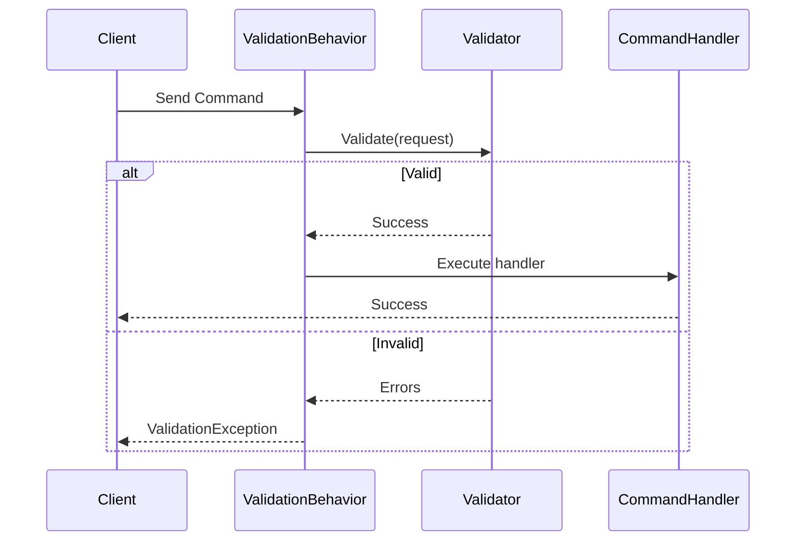
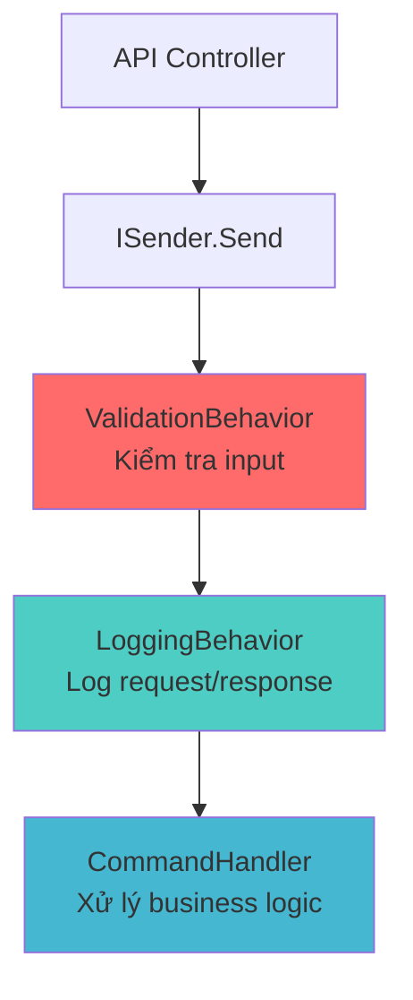
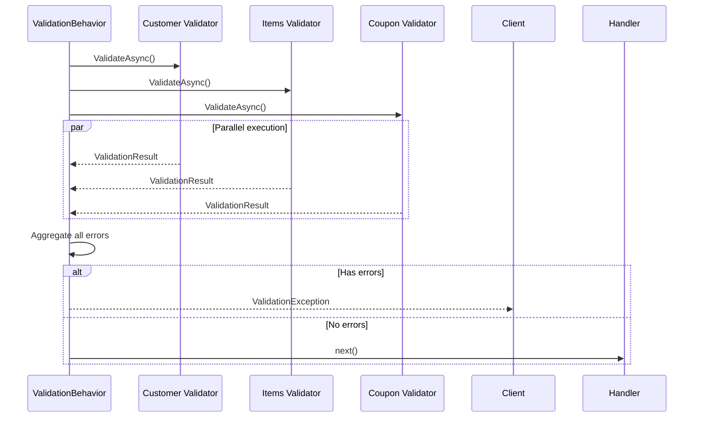
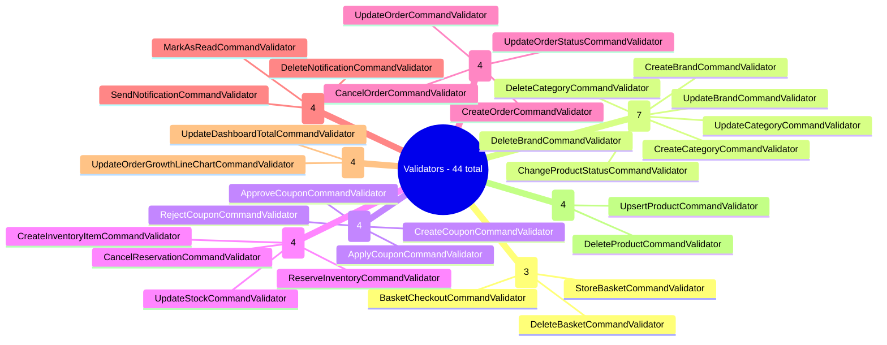
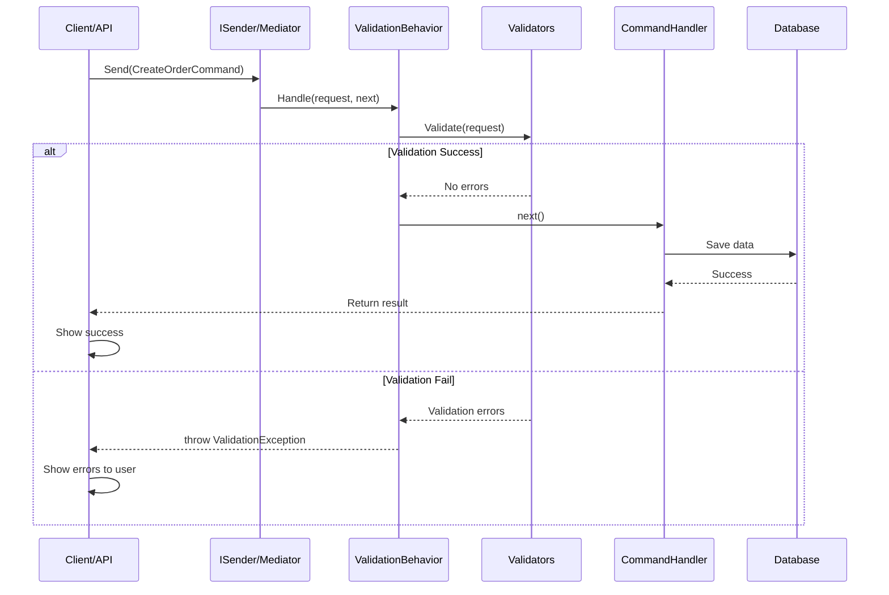
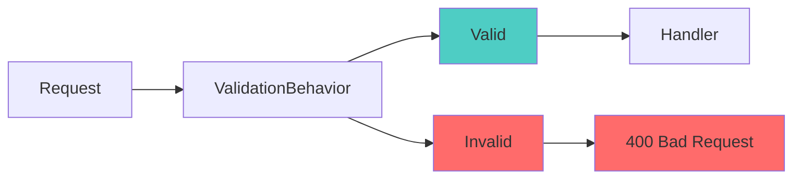
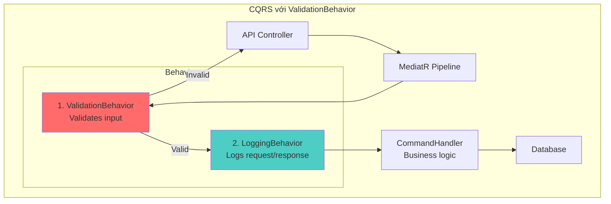

# ValidationBehavior - Phân Tích Chi Tiết

## Table of Contents
1. [ValidationBehavior Là Gì?](#1-validationbehavior-là-gì)
2. [Code ValidationBehavior](#2-code-validationbehavior)
3. [Vai Trò Trong Hệ Thống](#3-vai-trò-trong-hệ-thống)
4. [Cách Hoạt Động Chi Tiết](#4-cách-hoạt-động-chi-tiết)
5. [Ví Dụ Validator Thực Tế](#5-ví-dụ-validator-thực-tế)
6. [Tại Sao Cần ValidationBehavior?](#6-tại-sao-cần-validationbehavior)
7. [So Sánh Có vs Không Có ValidationBehavior](#7-so-sánh-có-vs-không-có-validationbehavior)
8. [Luồng Xử Lý Khi Validation Fail](#8-luồng-xử-lý-khi-validation-fail)
9. [Exception Handling](#9-exception-handling)
10. [Tóm Tắt](#10-tóm-tắt)

---

## 1. ValidationBehavior Là Gì?

**ValidationBehavior** là một **Pipeline Behavior** trong MediatR - nó hoạt động như một **middleware** đánh chặn và validate request trước khi đến Command Handler thực sự xử lý.

### 1.1. Vị trí trong Pipeline



**Đặc điểm quan trọng:**
- ✅ Chỉ áp dụng cho `ICommand<TResponse>` (không áp dụng cho Query)
- ✅ Chạy trước Command Handler
- ✅ Tự động tìm và chạy tất cả validators cho request type
- ✅ Aggregate tất cả validation errors

---

## 2. Code ValidationBehavior

### 2.1. Source Code

**File:** `src/Shared/BuildingBlocks/Behaviors/ValidationBehavior.cs`

```csharp
#region using

using BuildingBlocks.CQRS;
using FluentValidation;
using MediatR;

#endregion

namespace BuildingBlocks.Behaviors;

public sealed class ValidationBehavior<TRequest, TResponse>
    (IEnumerable<IValidator<TRequest>> validators)
    : IPipelineBehavior<TRequest, TResponse>
    where TRequest : ICommand<TResponse>
{
    #region Implementations

    public async Task<TResponse> Handle(
        TRequest request,
        RequestHandlerDelegate<TResponse> next,
        CancellationToken cancellationToken)
    {
        // Bước 1: Tạo validation context
        var context = new ValidationContext<TRequest>(request);

        // Bước 2: Chạy tất cả validators song song
        var validationResults =
            await Task.WhenAll(validators.Select(v =>
                v.ValidateAsync(context, cancellationToken)));

        // Bước 3: Gom tất cả errors
        var failures =
            validationResults
                .Where(r => r.Errors.Any())
                .SelectMany(r => r.Errors)
                .ToList();

        // Bước 4: Nếu có lỗi, throw exception
        if (failures.Any())
            throw new ValidationException(failures);

        // Bước 5: Nếu valid, tiếp tục pipeline
        return await next();
    }

    #endregion
}
```

### 2.2. Phân Tích Chi Tiết Mỗi Bước

| Bước | Code | Giải thích |
|-------|-------|-------------|
| **1** | `var context = new ValidationContext<TRequest>(request)` | Tạo context validation chứa request object |
| **2** | `await Task.WhenAll(validators.Select(...))` | Chạy **TẤT CẢ** validators **song song** (parallel) |
| **3** | `.Where(r => r.Errors.Any()).SelectMany(r => r.Errors)` | Filter và flatten tất cả errors từ tất cả validators |
| **4** | `if (failures.Any()) throw new ValidationException(failures)` | Nếu có lỗi, stop pipeline và throw exception |
| **5** | `return await next()` | Nếu valid, tiếp tục đến handler tiếp theo |

### 2.3. Constructor với Primary Constructor

```csharp
public sealed class ValidationBehavior<TRequest, TResponse>
    (IEnumerable<IValidator<TRequest>> validators)
    : IPipelineBehavior<TRequest, TResponse>
    where TRequest : ICommand<TResponse>
```

**Giải thích:**
- Sử dụng **C# 12 Primary Constructor**
- Dependency Injection: `IEnumerable<IValidator<TRequest>>` - MediatR tự động inject tất cả validators cho type `TRequest`
- Generic constraint `where TRequest : ICommand<TResponse>` - Chỉ validate Commands, không validate Queries

---

## 3. Vai Trò Trong Hệ Thống

### 3.1. Chức Năng Chính

| # | Chức năng | Giải thích |
|---|------------|-------------|
| 1 | **Validation Layer** | Tách biệt logic validation khỏi business logic |
| 2 | **Input Sanitization** | Kiểm tra dữ liệu đầu vào trước khi xử lý |
| 3 | **Fail Fast** | Reject invalid data sớm, tránh xử lý vô ích |
| 4 | **Centralized Validation** | Tất cả validation được quy chuẩn hóa |
| 5 | **Error Aggregation** | Thu thập tất cả validation errors cùng lúc |

### 3.2. Đăng Ký Trong Hệ Thống

ValidationBehavior được đăng ký trong **tất cả 8 services**:

```
📁 Services/
├── 📦 Basket.Application/DependencyInjection.cs
├── 📦 Catalog.Application/DependencyInjection.cs
├── 📦 Discount.Application/DependencyInjection.cs
├── 📦 Inventory.Application/DependencyInjection.cs
├── 📦 Notification.Application/DependencyInjection.cs
├── 📦 Order.Application/DependencyInjection.cs
├── 📦 Report.Application/DependencyInjection.cs
└── 📦 Search.Application/DependencyInjection.cs

Mỗi file đều có:
config.AddOpenBehavior(typeof(ValidationBehavior<,>));
```

### 3.3. Pipeline MediatR với Behaviors



**Thứ tự thực hiện:**
1. API Controller gửi request qua `ISender.Send()`
2. MediatR pipeline bắt đầu
3. **ValidationBehavior** đánh chặn và validate
4. Nếu valid → tiếp tục đến **LoggingBehavior**
5. LoggingBehavior → **CommandHandler**
6. CommandHandler xử lý business logic

---

## 4. Cách Hoạt Động Chi Tiết

### 4.1. Dependency Injection Validators

Khi một Command có nhiều Validators:

```csharp
// Command
public sealed record CreateOrderCommand(
    CreateOrUpdateOrderDto Dto,
    Actor Actor
) : ICommand<Guid>;

// Validator 1: Customer validation
public class CustomerValidator : AbstractValidator<CreateOrderCommand>
{
    public CustomerValidator()
    {
        RuleFor(x => x.Dto.Customer)
            .NotNull()
            .WithMessage("Customer is required");

        RuleFor(x => x.Dto.Customer.Email)
            .NotEmpty()
            .EmailAddress()
            .WithMessage("Invalid email");
    }
}

// Validator 2: Items validation
public class ItemsValidator : AbstractValidator<CreateOrderCommand>
{
    public ItemsValidator()
    {
        RuleFor(x => x.Dto.Items)
            .NotEmpty()
            .WithMessage("Items cannot be empty");

        RuleForEach(x => x.Dto.Items)
            .Must(item => item.Quantity > 0)
            .WithMessage("Quantity must be greater than 0");
    }
}

// Validator 3: Coupon validation
public class CouponValidator : AbstractValidator<CreateOrderCommand>
{
    public CouponValidator()
    {
        RuleFor(x => x.Dto.CouponCode)
            .MaximumLength(50)
            .WithMessage("Coupon code too long");
    }
}
```

**ValidationBehavior nhận tất cả:**
```csharp
// Tự động inject 3 validators
ValidationBehavior<CreateOrderCommand, Guid>(
    validators: [CustomerValidator, ItemsValidator, CouponValidator]
)
```

### 4.2. Parallel Validation



**Lợi ích của parallel validation:**
- ⚡ Tối ưu performance - chạy 3 validators cùng lúc thay vì tuần tự
- 🎯 Tất cả errors được thu thập - user biết ngay tất cả sai sót

### 4.3. Error Aggregation

```csharp
// Ví dụ request với nhiều lỗi
CreateOrderCommand command = new()
{
    Dto = new()
    {
        Customer = null,                    // ❌ Lỗi 1
        Items = [],                        // ❌ Lỗi 2
        CouponCode = "A".PadRight(100, 'B') // ❌ Lỗi 3
    }
};

// ValidationBehavior trả về
ValidationException with 3 errors:
{
    Errors: [
        "Customer is required",
        "Items cannot be empty",
        "Coupon code too long (max 50 characters)"
    ]
}
```

---

## 5. Ví Dụ Validator Thực Tế

### 5.1. Các Validators Trong Hệ Thống

Hệ thống có **44 validators** được tìm thấy. Phân bổ theo service:



### 5.2. Ví Dụ Chi Tiết: BasketCheckoutCommandValidator

```csharp
// File: src/Services/Basket/Core/Basket.Application/Features/Basket/Commands/BasketCheckoutCommand.cs

public sealed class BasketCheckoutCommandValidator
    : AbstractValidator<BasketCheckoutCommand>
{
    public BasketCheckoutCommandValidator()
    {
        // Rule 1: UserId không được rỗng
        RuleFor(x => x.UserId)
            .NotEmpty()
            .WithMessage("UserId is required");

        // Rule 2: Email phải đúng định dạng
        RuleFor(x => x.Dto.Email)
            .NotEmpty()
            .WithMessage("Email is required")
            .EmailAddress()
            .WithMessage("Invalid email format");

        // Rule 3: Items không được rỗng
        RuleFor(x => x.Dto.Items)
            .NotEmpty()
            .WithMessage("Basket items cannot be empty");

        // Rule 4: Phone number validation
        RuleFor(x => x.Dto.PhoneNumber)
            .NotEmpty()
            .Matches(@"^\+?[0-9]{10,15}$")
            .WithMessage("Invalid phone number format");

        // Rule 5: Address validation
        RuleFor(x => x.Dto.ShippingAddress)
            .NotNull()
            .WithMessage("Shipping address is required");

        RuleFor(x => x.Dto.ShippingAddress.AddressLine)
            .NotEmpty()
            .WithMessage("Address line is required");

        RuleFor(x => x.Dto.ShippingAddress.City)
            .NotEmpty()
            .WithMessage("City is required");

        RuleFor(x => x.Dto.ShippingAddress.PostalCode)
            .NotEmpty()
            .WithMessage("Postal code is required");
    }
}
```

### 5.3. FluentValidation Common Rules

| Rule | Mô tả | Ví dụ sử dụng |
|------|---------|---------------|
| `NotEmpty()` | Không null và không rỗng | `RuleFor(x => x.Name).NotEmpty()` |
| `NotNull()` | Không null (có thể rỗng) | `RuleFor(x => x.Address).NotNull()` |
| `EmailAddress()` | Validate email format | `RuleFor(x => x.Email).EmailAddress()` |
| `MaximumLength(int)` | Độ dài tối đa | `RuleFor(x => x.CouponCode).MaximumLength(50)` |
| `MinimumLength(int)` | Độ dài tối thiểu | `RuleFor(x => x.Password).MinimumLength(8)` |
| `InclusiveBetween(min, max)` | Trong khoảng | `RuleFor(x => x.Age).InclusiveBetween(18, 100)` |
| `Matches(regex)` | Khớp với regex | `RuleFor(x => x.Phone).Matches(@"^\d{10}$")` |
| `Must(predicate)` | Custom predicate | `RuleFor(x => x.Quantity).Must(q => q > 0)` |
| `LessThan(value)` | Nhỏ hơn | `RuleFor(x => x.Discount).LessThan(100)` |

---

## 6. Tại Sao Cần ValidationBehavior?

### 6.1. Ưu Điểm (Pros)

| Ưu điểm | Giải thích | Ví dụ |
|---------|-------------|-------|
| **Separation of Concerns** | Validation tách biệt khỏi business logic | Handler chỉ xử lý logic, không lo validation |
| **Reusability** | Validators có thể dùng lại ở nhiều nơi | `CustomerValidator` dùng trong CreateOrder, UpdateOrder |
| **Testability** | Validator dễ viết unit test riêng biệt | Test riêng cho validation, không phụ thuộc handler |
| **Consistency** | Tất cả commands đều được validate theo chuẩn | Mỗi service đều có ValidationBehavior |
| **Performance** | Validate sớm, tránh gọi database với dữ liệu sai | Validate trước khi query database |
| **User Experience** | Trả về lỗi cụ thể thay vì generic error | User biết chính xác lỗi gì thay vì "Internal Error" |
| **Parallel Validation** | Chạy nhiều validators song song | 3 validators chạy cùng lúc thay vì tuần tự |
| **Error Aggregation** | Thu thập tất cả errors cùng lúc | User biết 10 lỗi cùng lúc thay vì 1 lần 1 lỗi |

### 6.2. Nhược Điểm (Cons)

| Nhược điểm | Giải thích | Cách khắc phục |
|------------|-------------|----------------|
| **Complexity** | Thêm một layer nữa vào pipeline | Documentation tốt, training team |
| **Validation Duplication** | Có thể duplicate với Entity constraints | Use `DataAnnotations` on entity + validation in handler |
| **Learning Curve** | Phải học FluentValidation syntax | Training, examples, documentation |
| **Extra Code** | Mỗi command cần validator class | Scaffolding tools, code templates |

---

## 7. So Sánh Có vs Không Có ValidationBehavior

### 7.1. KHÔNG Có ValidationBehavior (Bad Practice)

```csharp
public sealed class CreateOrderCommandHandler
{
    public async Task<Guid> Handle(CreateOrderCommand command, ...)
    {
        // ❌ Validation nằm trộn lẫn với business logic
        if (command.Dto.Customer == null)
            throw new Exception("Customer required");

        if (string.IsNullOrEmpty(command.Dto.Customer.Email))
            throw new Exception("Email required");

        if (!IsValidEmail(command.Dto.Customer.Email))
            throw new Exception("Invalid email format");

        if (command.Dto.Items == null || command.Dto.Items.Count == 0)
            throw new Exception("Items required");

        foreach (var item in command.Dto.Items)
        {
            if (item.Quantity <= 0)
                throw new Exception($"Item {item.ProductId} invalid quantity");

            if (item.Price < 0)
                throw new Exception($"Item {item.ProductId} invalid price");
        }

        if (!string.IsNullOrEmpty(command.Dto.CouponCode))
        {
            if (command.Dto.CouponCode.Length > 50)
                throw new Exception("Coupon code too long");
        }

        // ❌ Business logic bắt đầu sau 20+ dòng validation
        var order = OrderEntity.Create(...);
        // ...
    }
}
```

**Vấn đề:**
- ❌ Validation và business logic trộn lẫn nhau
- ❌ Khó test validation riêng biệt
- ❌ Khó reuse validation logic
- ❌ Handler quá dài
- ❌ Lỗi không đồng bộ (Exception, ValidationException, etc.)

### 7.2. CÓ ValidationBehavior (Best Practice)

```csharp
// ✅ Validation tách riêng - Clean code
public class CreateOrderCommandValidator
    : AbstractValidator<CreateOrderCommand>
{
    public CreateOrderCommandValidator()
    {
        RuleFor(x => x.Dto.Customer)
            .NotNull()
            .WithMessage("Customer is required");

        RuleFor(x => x.Dto.Customer.Email)
            .NotEmpty()
            .EmailAddress()
            .WithMessage("Invalid email format");

        RuleFor(x => x.Dto.Items)
            .NotEmpty()
            .WithMessage("Items cannot be empty");

        RuleForEach(x => x.Dto.Items)
            .Must(item => item.Quantity > 0)
            .WithMessage("Invalid quantity");

        RuleFor(x => x.Dto.CouponCode)
            .MaximumLength(50)
            .When(x => !string.IsNullOrEmpty(x.Dto.CouponCode));
    }
}

// ✅ Handler chỉ có business logic - Single responsibility
public sealed class CreateOrderCommandHandler
{
    public async Task<Guid> Handle(CreateOrderCommand command, ...)
    {
        // ✅ Không cần validation ở đây
        // Handler chỉ xử lý business logic thuần túy

        var order = OrderEntity.Create(
            customer: command.Dto.Customer,
            items: command.Dto.Items,
            couponCode: command.Dto.CouponCode
        );

        await _unitOfWork.Orders.AddAsync(order);
        await _unitOfWork.SaveChangesAsync();

        return order.Id;
    }
}
```

**Lợi ích:**
- ✅ Validation và business logic tách biệt
- ✅ Validator dễ test riêng
- ✅ Handler ngắn gọn, dễ hiểu
- ✅ Validation dễ reuse
- ✅ Lỗi đồng bộ (ValidationException)

---

## 8. Luồng Xử Lý Khi Validation Fail

### 8.1. Sequence Diagram



### 8.2. ValidationException Response

**API Response khi validation fail:**

```json
{
  "type": "ValidationException",
  "errors": [
    {
      "property": "Dto.Customer.Email",
      "message": "Email is required"
    },
    {
      "property": "Dto.Items",
      "message": "Items cannot be empty"
    },
    {
      "property": "Dto.CouponCode",
      "message": "Coupon code too long (max 50 characters)"
    }
  ],
  "timestamp": "2026-01-22T10:30:00Z"
}
```

### 8.3. HTTP Status Code



---

## 9. Exception Handling

### 9.1. Exceptions Trong Hệ Thống

Dựa trên tìm kiếm, hệ thống sử dụng nhiều loại exceptions:

| Exception Type | Nơi định nghĩa | Khi nào dùng |
|---------------|----------------|--------------|
| `ValidationException` | FluentValidation | Tự động throw khi validation fail |
| `ClientValidationException` | BuildingBlocks/Exceptions | Custom exception cho client validation errors |
| `DomainException` | Domain layer | Business rule violations |
| `NotFoundException` | BuildingBlocks/Exceptions | Entity not found |

### 9.2. ClientValidationException

**File:** `src/Shared/BuildingBlocks/Exceptions/ClientValidationException.cs`

```csharp
public sealed class ClientValidationException : Exception
{
    public MessageCode Code { get; }

    public ClientValidationException(MessageCode code)
        : base(code.ToString())
    {
        Code = code;
    }

    public ClientValidationException(MessageCode code, object? parameter)
        : base($"{code}: {parameter}")
    {
        Code = code;
    }
}
```

### 9.3. Ví Dụ Sử Dụng ClientValidationException

```csharp
// Trong Command Handler
public sealed class BasketCheckoutCommandHandler
{
    public async Task<Guid> Handle(BasketCheckoutCommand command, ...)
    {
        // Validation trong handler (business validation)
        var basket = await _basketRepository
            .GetByUserIdAsync(command.UserId);

        if (basket?.Items == null || basket.Items.Count == 0)
            throw new ClientValidationException(
                MessageCode.BasketIsRequired);

        // Validate products exist
        var missingProducts = products
            .Where(p => p == null)
            .Select(p => p?.ProductId);

        if (missingProducts.Any())
            throw new ClientValidationException(
                MessageCode.ProductsIsNotExistsOrNotInStock);

        // ...
    }
}
```

**Lưu ý:** `ClientValidationException` khác `ValidationException`:
- `ValidationException`: Được throw bởi `ValidationBehavior` (input validation)
- `ClientValidationException`: Được throw bởi Handler (business validation)

---

## 10. Tóm Tắt

### 10.1. ValidationBehavior Trong CQRS



### 10.2. Checklist ValidationBehavior

| Checklist | Đã implement? | Giải thích |
|-----------|----------------|-------------|
| ✅ Pipeline Behavior | Yes | Implement `IPipelineBehavior<TRequest, TResponse>` |
| ✅ Generic Type Constraint | Yes | `where TRequest : ICommand<TResponse>` |
| ✅ Dependency Injection | Yes | `IEnumerable<IValidator<TRequest>> validators` |
| ✅ Parallel Validation | Yes | `Task.WhenAll(...)` |
| ✅ Error Aggregation | Yes | `SelectMany(r => r.Errors)` |
| ✅ Throw Exception | Yes | `throw new ValidationException(failures)` |
| ✅ Continue Pipeline | Yes | `return await next()` |
| ✅ Registered in Services | Yes | Tất cả 8 services |
| ✅ Custom Exceptions | Yes | `ClientValidationException` |

### 10.3. Key Takeaways

1. **ValidationBehavior là middleware** của MediatR pipeline
2. **Chỉ validate Commands**, không validate Queries
3. **Chạy song song** tất cả validators
4. **Fail fast** - reject invalid data sớm
5. **Separation of Concerns** - validation tách biệt khỏi business logic
6. **Error Aggregation** - thu thập tất cả errors cùng lúc
7. **Centralized** - áp dụng cho tất cả services
8. **Customizable** - dễ thêm validators mới

### 10.4. Best Practices

| Best Practice | Giải thích |
|---------------|-------------|
| ✅ Tạo Validator cho mọi Command | Đảm bảo input luôn valid |
| ✅ Sử dụng FluentValidation rules | Đủ mạnh, dễ đọc |
| ✅ Provide clear error messages | User biết phải sửa gì |
| ✅ Test validators riêng biệt | Unit test cho validation logic |
| ✅ Use parallel validators | Tối ưu performance |
| ✅ Aggregate all errors | User biết tất cả lỗi cùng lúc |
| ✅ Keep validation logic simple | Validator không nên chứa business logic |

### 10.5. Khi Nên Sử Dụng ValidationBehavior

- ✅ Microservices architecture
- ✅ CQRS pattern
- ✅ Complex validation rules
- ✅ Need consistent validation across services
- ✅ Want fail-fast validation
- ✅ Want detailed error messages

### 10.6. Khi KHÔNG Nên Sử Dụng

- ❌ Simple CRUD apps
- ❌ Queries (ValidationBehavior chỉ áp dụng Commands)
- ❌ Performance critical (validation có thể add latency)
- ❌ No need for complex validation

---

## Kết Luận

**ValidationBehavior đóng vai trò gì trong hệ thống?**

1. ✅ **Middleware cho MediatR** - Đánh chặn và validate request trước khi handler xử lý
2. ✅ **Fail Fast Pattern** - Reject invalid data sớm, tiết kiệm tài nguyên
3. ✅ **Separation of Concerns** - Tách validation khỏi business logic
4. ✅ **Centralized Validation** - Chuẩn hóa validation toàn bộ hệ thống
5. ✅ **Error Aggregation** - Thu thập tất cả lỗi và trả về cùng lúc
6. ✅ **Parallel Validation** - Chạy validators song song cho performance
7. ✅ **User Experience** - Cung cấp error messages cụ thể

**Trong CQRS, ValidationBehavior là phần quan trọng của Command Side - đảm bảo data đầu vào luôn valid trước khi thay đổi trạng thái hệ thống.**

---

## Tài Liệu Tham Khảo

- [FluentValidation Documentation](https://docs.fluentvalidation.net/)
- [MediatR Pipeline Behaviors](https://github.com/jbogard/MediatR/wiki/Behaviors)
- [CQRS Pattern](https://martinfowler.com/bliki/CQRS.html)
- [BuildingBlocks Code Reference](./src/Shared/BuildingBlocks/)

---

**Document Version:** 1.0
**Last Updated:** January 22, 2026
**Author:** ProgCoder Shop Team
