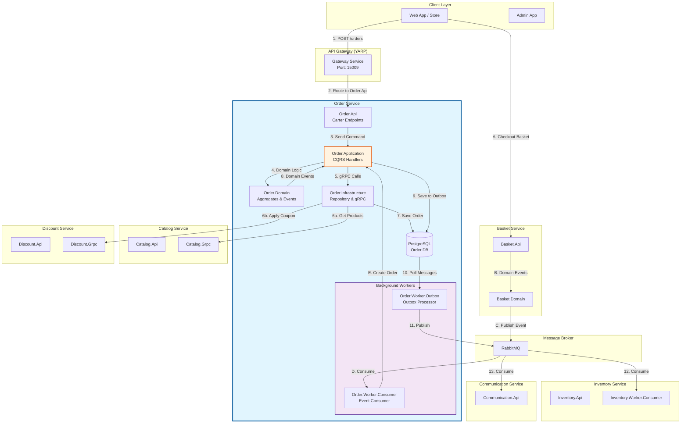
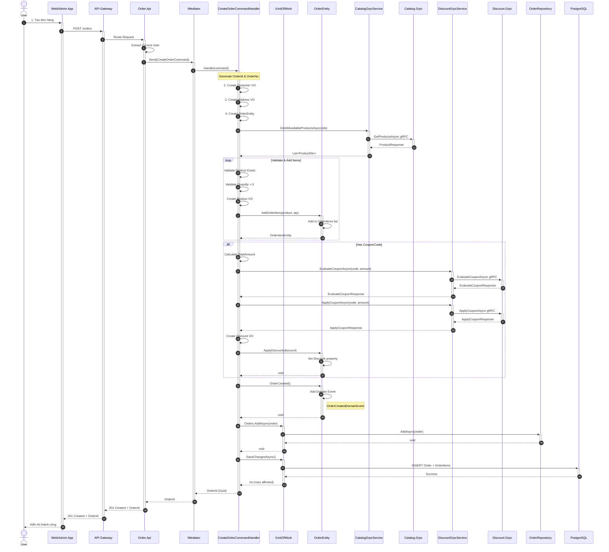
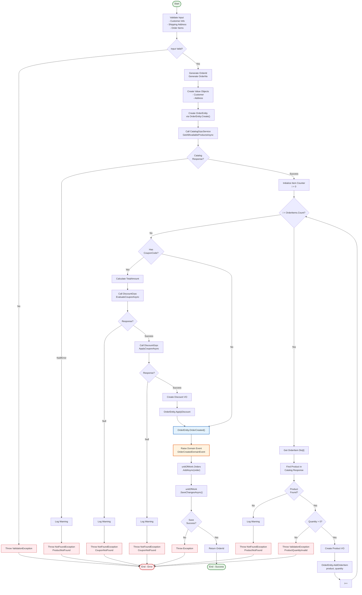
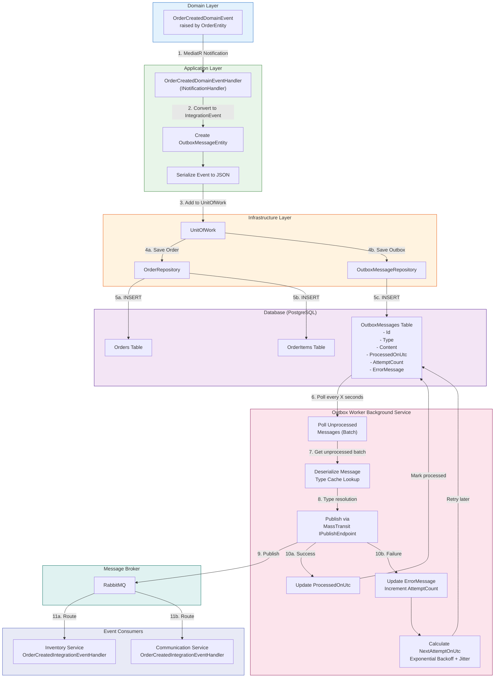
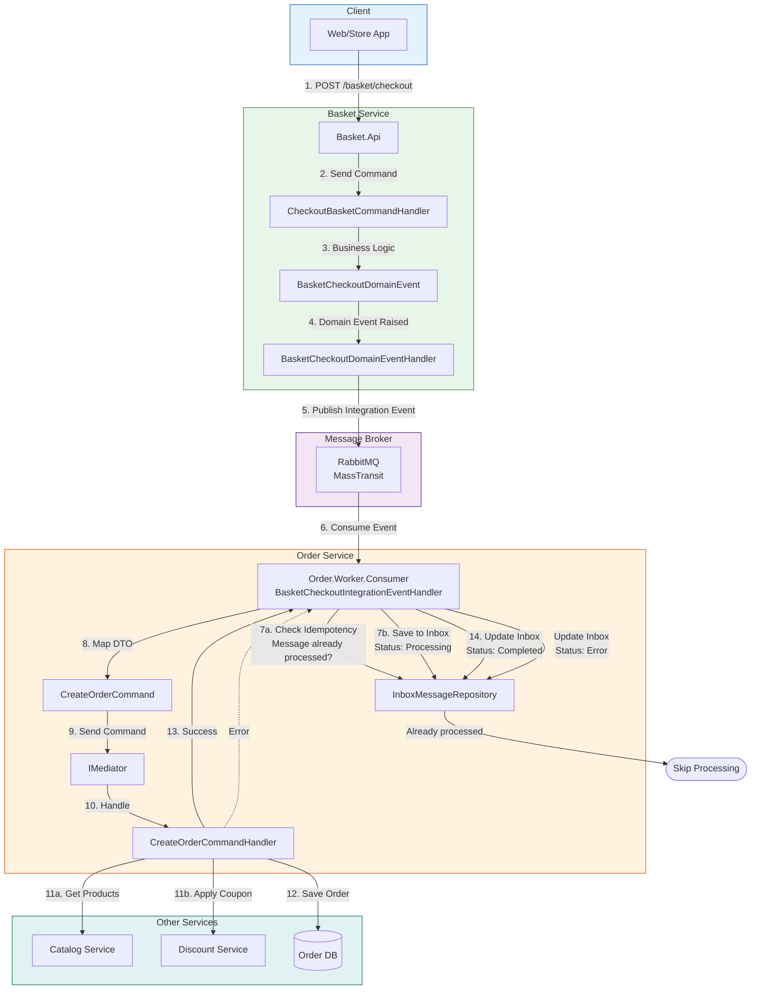
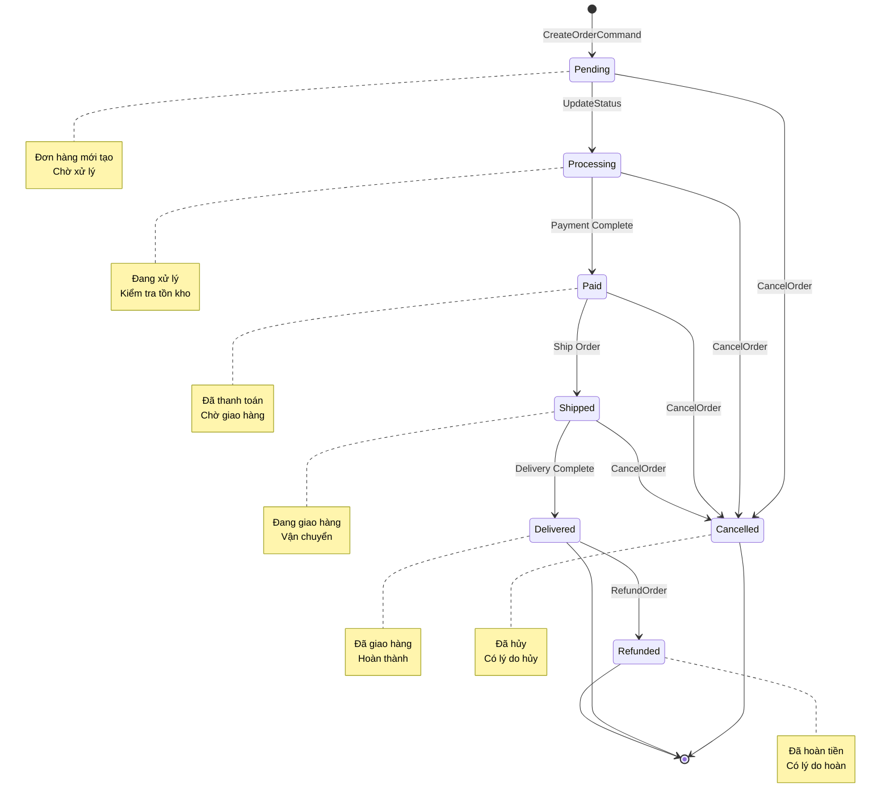
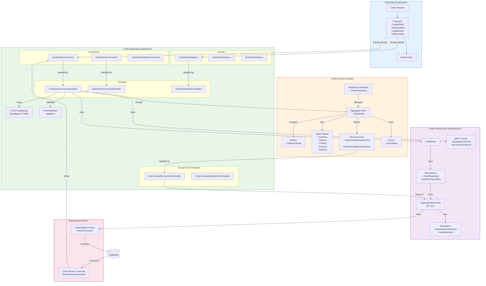

# Order Creation Workflow Documentation

Tài liệu này mô tả chi tiết workflow tạo đơn hàng trong hệ thống ProgCoder Shop Microservices sử dụng Mermaid diagrams.

---

## Mục lục (Table of Contents)

1. [Overall Architecture Diagram](#1-overall-architecture-diagram)
2. [Sequence Diagram - Order Creation Flow](#2-sequence-diagram---order-creation-flow)
3. [Flowchart - CreateOrderCommand Handler](#3-flowchart---createordercommand-handler)
4. [Outbox Pattern Flow](#4-outbox-pattern-flow)
5. [Basket Checkout to Order Flow](#5-basket-checkout-to-order-flow)
6. [Class Diagram - Order Domain Model](#6-class-diagram---order-domain-model)
7. [State Machine - Order Status Flow](#7-state-machine---order-status-flow)
8. [Component Diagram - Order Service Internals](#8-component-diagram---order-service-internals)

---

## 1. Overall Architecture Diagram

Sơ đồ tổng quan kiến trúc và các service liên quan đến việc tạo đơn hàng.



---

## 2. Sequence Diagram - Order Creation Flow

Sơ đồ sequence chi tiết quá trình tạo đơn hàng từ API đến Database và các service liên quan.



---

## 3. Flowchart - CreateOrderCommand Handler

Sơ đồ luồng chi tiết xử lý trong CreateOrderCommandHandler.



---

## 4. Outbox Pattern Flow

Sơ đồ luồng xử lý Outbox Pattern để đảm bảo reliable message publishing.



---

## 5. Basket Checkout to Order Flow

Sơ đồ luồng tạo đơn hàng từ Basket Checkout thông qua Integration Events.



---

## 6. Class Diagram - Order Domain Model

Sơ đồ lớp cho Order Domain Model và các thành phần liên quan.

```mermaid
classDiagram
    direction TB

    class OrderEntity {
        +Guid Id
        +List~OrderItemEntity~ OrderItems
        +Customer Customer
        +OrderNo OrderNo
        +Address ShippingAddress
        +OrderStatus Status
        +Discount Discount
        +string Notes
        +decimal TotalPrice
        +decimal FinalPrice
        +Create()$ OrderEntity
        +UpdateShippingAddress(address)
        +UpdateCustomerInfo(customer)
        +AddOrderItem(product, quantity)
        +RemoveOrderItem(orderItemId)
        +ApplyDiscount(discount)
        +UpdateStatus(status)
        +CancelOrder(reason)
        +RefundOrder(reason)
        +OrderCreated()
        +OrderDelivered()
    }

    class OrderItemEntity {
        +Guid Id
        +Guid OrderId
        +Product Product
        +int Quantity
        +decimal UnitPrice
        +decimal LineTotal
        +Create(orderId, product, quantity, price)$ OrderItemEntity
    }

    class Customer {
        +string FirstName
        +string LastName
        +string Email
        +string Phone
        +string FullName
        +Create(firstName, lastName, email, phone)$ Customer
    }

    class Address {
        +string Street
        +string City
        +string State
        +string Country
        +string ZipCode
        +Create(street, city, state, country, zipCode)$ Address
    }

    class Product {
        +Guid Id
        +string Name
        +string Sku
        +decimal Price
        +Create(id, name, sku, price)$ Product
    }

    class OrderNo {
        +string Value
        +Generate()$ OrderNo
    }

    class Discount {
        +string Code
        +decimal Amount
        +decimal Percentage
        +Create(code, amount, percentage)$ Discount
    }

    class OrderStatus {
        <<enumeration>>
        Pending
        Processing
        Paid
        Shipped
        Delivered
        Cancelled
        Refunded
    }

    class Aggregate~T~ {
        <<abstract>>
        +T Id
        +List~IDomainEvent~ DomainEvents
        +AddDomainEvent(event)
        +ClearDomainEvents()
    }

    class IDomainEvent {
        <<interface>>
    }

    class OrderCreatedDomainEvent {
        +OrderEntity Order
    }

    class OrderCancelledDomainEvent {
        +OrderEntity Order
        +string Reason
    }

    class OrderDeliveredDomainEvent {
        +OrderEntity Order
    }

    class CreateOrderCommand {
        +CreateOrUpdateOrderDto Dto
        +Actor Actor
    }

    class CreateOrderCommandHandler {
        -IUnitOfWork unitOfWork
        -ICatalogGrpcService catalog
        -IDiscountGrpcService discount
        +Handle(command, ct) Task~Guid~
    }

    class IUnitOfWork {
        <<interface>>
        +IOrderRepository Orders
        +SaveChangesAsync()
    }

    class ICatalogGrpcService {
        <<interface>>
        +GetProductByIdAsync(id) ProductDto
        +GetProductsAsync(ids, searchText) List~ProductDto~
        +GetAllAvailableProductsAsync(ids, searchText) List~ProductDto~
    }

    class IDiscountGrpcService {
        <<interface>>
        +ApplyCouponAsync(code, amount) ApplyCouponResponse
        +EvaluateCouponAsync(code, amount) EvaluateCouponResponse
    }

    %% Relationships
    Aggregate~T~ <|-- OrderEntity
    OrderEntity "1" --> "*" OrderItemEntity : contains
    OrderEntity --> Customer : has
    OrderEntity --> Address : has
    OrderEntity --> OrderNo : has
    OrderEntity --> Discount : has
    OrderEntity --> OrderStatus : has status
    OrderItemEntity --> Product : has
    
    IDomainEvent <|.. OrderCreatedDomainEvent
    IDomainEvent <|.. OrderCancelledDomainEvent
    IDomainEvent <|.. OrderDeliveredDomainEvent
    
    OrderEntity ..> OrderCreatedDomainEvent : raises
    OrderEntity ..> OrderCancelledDomainEvent : raises
    OrderEntity ..> OrderDeliveredDomainEvent : raises
    
    CreateOrderCommandHandler ..> CreateOrderCommand : handles
    CreateOrderCommandHandler --> IUnitOfWork : uses
    CreateOrderCommandHandler --> ICatalogGrpcService : uses
    CreateOrderCommandHandler --> IDiscountGrpcService : uses
    CreateOrderCommandHandler ..> OrderEntity : creates
```



---

## 7. State Machine - Order Status Flow

Sơ đồ trạng thái của đơn hàng từ khi tạo đến khi hoàn thành.



---

## 8. Component Diagram - Order Service Internals

Sơ đồ thành phần chi tiết bên trong Order Service.



---

## Tóm tắt kiến trúc

### Các thành phần chính trong workflow tạo đơn hàng:

| Thành phần | Mô tả | Vai trò |
|------------|-------|---------|
| **Order.Api** | Carter Endpoints | Tiếp nhận HTTP requests, xác thực |
| **CreateOrderCommand** | CQRS Command | Định nghĩa dữ liệu tạo order |
| **CreateOrderCommandHandler** | Command Handler | Xử lý business logic, gọi gRPC services |
| **OrderEntity** | Aggregate Root | Quản lý trạng thái và domain logic |
| **CatalogGrpcService** | gRPC Client | Lấy thông tin sản phẩm |
| **DiscountGrpcService** | gRPC Client | Áp dụng và tính toán coupon |
| **UnitOfWork** | Transaction Manager | Quản lý transaction và repositories |
| **OutboxProcessor** | Background Worker | Đảm bảo reliable message publishing |
| **BasketCheckoutIntegrationEvent** | Integration Event | Tạo order từ basket checkout |

### Design Patterns sử dụng:

1. **CQRS** - Phân tách Commands và Queries
2. **Domain-Driven Design (DDD)** - Aggregates, Value Objects, Domain Events
3. **Outbox Pattern** - Đảm bảo consistency giữa database và message broker
4. **Unit of Work** - Quản lý transaction
5. **gRPC** - Inter-service communication (Catalog, Discount)
6. **Event-Driven Architecture** - Domain Events và Integration Events
7. **Background Workers** - Xử lý async tasks (Outbox, Event Consumers)

### Luồng dữ liệu chính:

```
Client Request 
  → API Gateway 
  → Order.Api Endpoint 
  → MediatR 
  → CreateOrderCommandHandler 
  → gRPC (Catalog + Discount) 
  → OrderEntity (Domain Logic) 
  → UnitOfWork 
  → Database (Transactional Save)
  → Domain Event Raised
  → Outbox Message Saved
  → Outbox Processor (Background)
  → RabbitMQ
  → Event Consumers (Inventory, Communication)
```