# Tài liệu tham khảo: Reverse Proxy Library & YARP trong .NET

> **Phiên bản:** 2.0 - Diagram Edition  
> **Cập nhật:** Tháng 2/2026  
> **Đối tượng:** Developers mới bắt đầu với .NET microservices

---

## Mục lục

1. [Tổng quan về Reverse Proxy Library](#1-tổng-quan-về-reverse-proxy-library)
2. [Phân tích YARP](#2-phân-tích-yarp-yet-another-reverse-proxy)
3. [Best Practices 2026](#3-best-practices-2026)
4. [Tài liệu tham khảo](#4-tài-liệu-tham-khảo)

---

## 1. Tổng quan về Reverse Proxy Library

### 1.1 Reverse Proxy là gì?

**Reverse Proxy** là máy chủ trung gian đứng giữa **clients** và **backend servers**, nhận requests từ clients và chuyển tiếp đến các servers phù hợp.

#### Forward Proxy vs Reverse Proxy

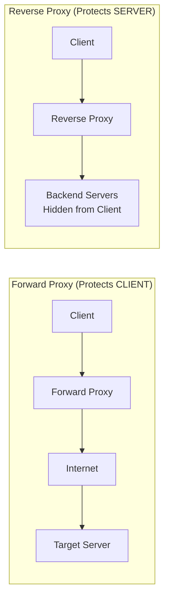
```mermaid
flowchart LR
    subgraph Forward["Forward Proxy (Protects CLIENT)"]
        C1[Client] --> FP[Forward Proxy] --> Internet[Internet] --> TS[Target Server]
    end

    subgraph Reverse["Reverse Proxy (Protects SERVER)"]
        C2[Client] --> RP[Reverse Proxy] --> BS[Backend Servers<br/>Hidden from Client]
    end
```

| Đặc điểm | Forward Proxy | Reverse Proxy |
|----------|--------------|---------------|
| **Vị trí** | Client-side | Server-side |
| **Bảo vệ** | Client identity | Backend servers |
| **Traffic** | Outbound | Inbound |
| **Mục đích** | Anonymity, filtering | Load balancing, security |
| **Ví dụ** | Corporate proxy, VPN | Nginx, YARP, Envoy |

### 1.2 Cách thức hoạt động

#### Sequence Diagram - Request Flow

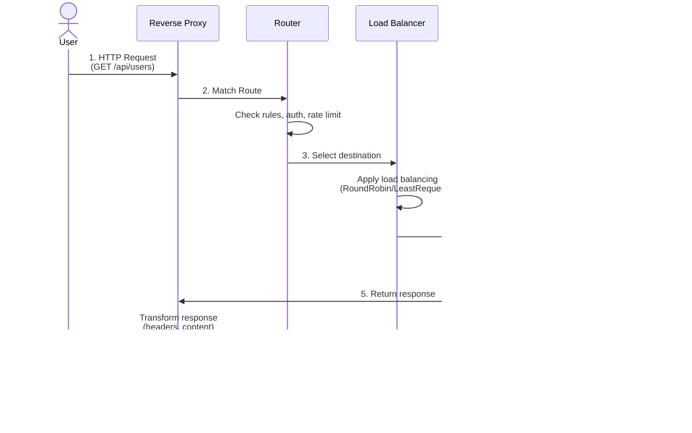
```mermaid
sequenceDiagram
    actor User
    participant RP as Reverse Proxy
    participant R as Router
    participant LB as Load Balancer
    participant S1 as Backend Server 1
    participant S2 as Backend Server 2

    User->>RP: 1. HTTP Request<br/>(GET /api/users)
    RP->>R: 2. Match Route
    R->>R: Check rules, auth, rate limit
    R->>LB: 3. Select destination
    LB->>LB: Apply load balancing<br/>(RoundRobin/LeastRequests)
    LB->>S2: 4. Forward request
    S2->>S2: Process request
    S2->>RP: 5. Return response
    RP->>RP: Transform response<br/>(headers, content)
    RP->>User: 6. Send response
```

### 1.3 Các chức năng chính

#### Chức năng Reverse Proxy

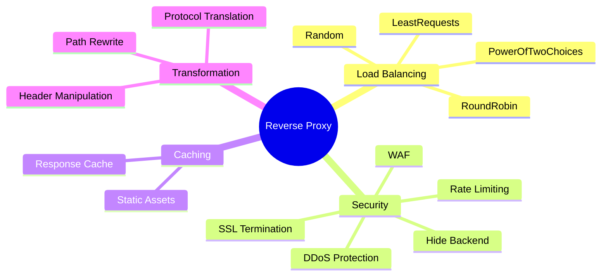
```mermaid
mindmap
  root((Reverse Proxy))
    Load Balancing
      RoundRobin
      LeastRequests
      Random
      PowerOfTwoChoices
    Security
      DDoS Protection
      WAF
      Rate Limiting
      SSL Termination
      Hide Backend
    Caching
      Response Cache
      Static Assets
    Transformation
      Path Rewrite
      Header Manipulation
      Protocol Translation
```

### 1.4 Các thư viện/Tool phổ biến

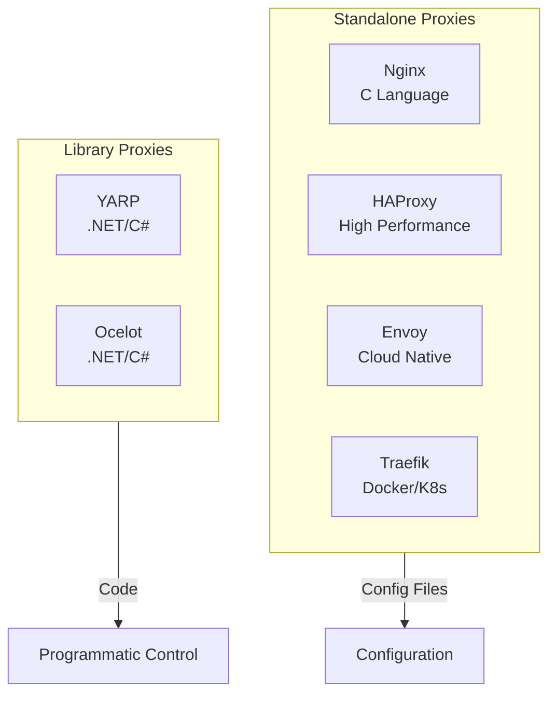
```mermaid
flowchart TB
    subgraph Standalone["Standalone Proxies"]
        N[Nginx<br/>C Language]
        H[HAProxy<br/>High Performance]
        E[Envoy<br/>Cloud Native]
        T[Traefik<br/>Docker/K8s]
    end

    subgraph Library["Library Proxies"]
        Y[YARP<br/>.NET/C#]
        O[Ocelot<br/>.NET/C#]
    end

    Standalone -->|Config Files| Config[Configuration]
    Library -->|Code| Code[Programmatic Control]
```

---

## 2. Phân tích YARP (Yet Another Reverse Proxy)

### 2.1 Giới thiệu YARP

**YARP** là reverse proxy library được Microsoft phát triển cho .NET.

#### YARP vs Ocelot

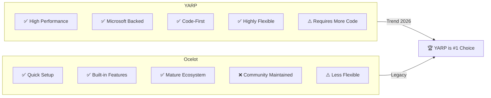
```mermaid
flowchart LR
    subgraph Y["YARP"]
        Y1["✅ High Performance"]
        Y2["✅ Microsoft Backed"]
        Y3["✅ Code-First"]
        Y4["✅ Highly Flexible"]
        Y5["⚠️ Requires More Code"]
    end

    subgraph O["Ocelot"]
        O1["✅ Quick Setup"]
        O2["✅ Built-in Features"]
        O3["✅ Mature Ecosystem"]
        O4["❌ Community Maintained"]
        O5["⚠️ Less Flexible"]
    end

    Y -->|Trend 2026| Winner["🏆 YARP is #1 Choice"]
    O -->|Legacy| Winner
```

### 2.2 Kiến trúc YARP

#### Component Architecture

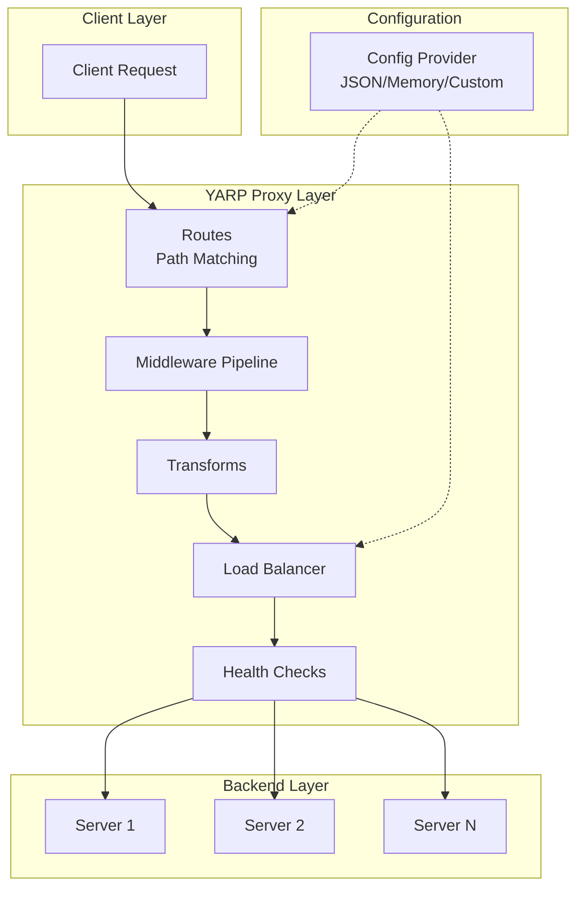
```mermaid
flowchart TB
    subgraph Client["Client Layer"]
        C[Client Request]
    end

    subgraph YARP["YARP Proxy Layer"]
        R[Routes<br/>Path Matching]
        M[Middleware Pipeline]
        T[Transforms]
        LB[Load Balancer]
        HC[Health Checks]
    end

    subgraph Config["Configuration"]
        CP[Config Provider<br/>JSON/Memory/Custom]
    end

    subgraph Backend["Backend Layer"]
        S1[Server 1]
        S2[Server 2]
        S3[Server N]
    end

    C --> R
    R --> M
    M --> T
    T --> LB
    LB --> HC
    HC --> S1
    HC --> S2
    HC --> S3
    CP -.-> R
    CP -.-> LB
```

#### Request Processing Pipeline

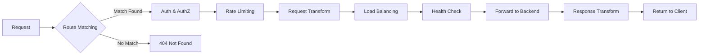
```mermaid
flowchart LR
    A[Request] --> B{Route Matching}
    B -->|Match Found| C[Auth & AuthZ]
    C --> D[Rate Limiting]
    D --> E[Request Transform]
    E --> F[Load Balancing]
    F --> G[Health Check]
    G --> H[Forward to Backend]
    H --> I[Response Transform]
    I --> J[Return to Client]
    B -->|No Match| K[404 Not Found]
```

### 2.3 Cài đặt và Cấu hình cơ bản

#### Installation

```bash
dotnet add package Yarp.ReverseProxy
```

#### Basic Setup

```csharp
// Program.cs
var builder = WebApplication.CreateBuilder(args);

// Add YARP services
builder.Services.AddReverseProxy()
    .LoadFromConfig(builder.Configuration.GetSection("ReverseProxy"));

var app = builder.Build();
app.MapReverseProxy();
app.Run();
```

#### Configuration (appsettings.json)

```json
{
  "ReverseProxy": {
    "Routes": {
      "api-route": {
        "ClusterId": "api-cluster",
        "Match": { "Path": "/api/{**catchall}" }
      }
    },
    "Clusters": {
      "api-cluster": {
        "Destinations": {
          "server1": { "Address": "https://api1.com" },
          "server2": { "Address": "https://api2.com" }
        }
      }
    }
  }
}
```

### 2.4 Cấu hình nâng cao

#### Load Balancing Flow

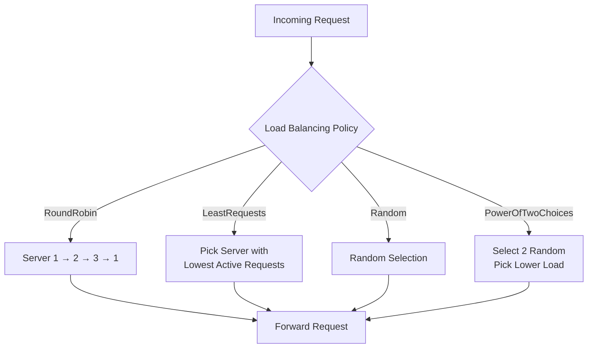
```mermaid
flowchart TD
    A[Incoming Request] --> B{Load Balancing Policy}
    B -->|RoundRobin| C[Server 1 → 2 → 3 → 1]
    B -->|LeastRequests| D[Pick Server with<br/>Lowest Active Requests]
    B -->|Random| E[Random Selection]
    B -->|PowerOfTwoChoices| F[Select 2 Random<br/>Pick Lower Load]
    C --> G[Forward Request]
    D --> G
    E --> G
    F --> G
```

#### Session Affinity (Sticky Sessions)

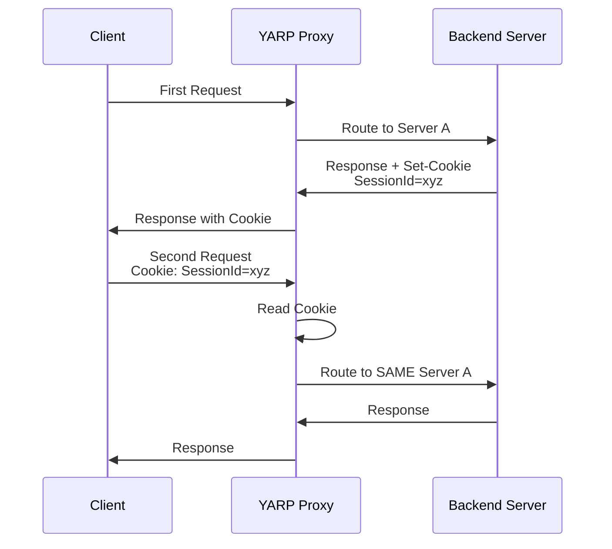
```mermaid
sequenceDiagram
    participant C as Client
    participant RP as YARP Proxy
    participant S as Backend Server

    C->>RP: First Request
    RP->>S: Route to Server A
    S->>RP: Response + Set-Cookie<br/>SessionId=xyz
    RP->>C: Response with Cookie

    C->>RP: Second Request<br/>Cookie: SessionId=xyz
    RP->>RP: Read Cookie
    RP->>S: Route to SAME Server A
    S->>RP: Response
    RP->>C: Response
```

#### Health Check Mechanism

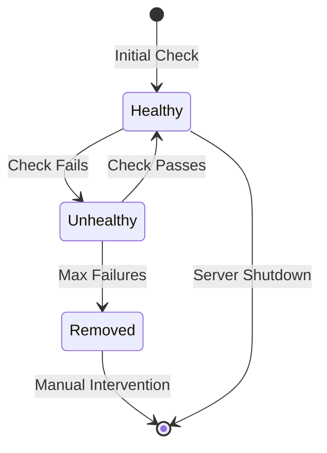
```mermaid
stateDiagram-v2
    [*] --> Healthy: Initial Check
    Healthy --> Unhealthy: Check Fails
    Unhealthy --> Healthy: Check Passes
    Unhealthy --> Removed: Max Failures
    Removed --> [*]: Manual Intervention
    Healthy --> [*]: Server Shutdown
```

### 2.5 YARP trong .NET Aspire

#### Aspire 9.4 Architecture

```mermaid
flowchart TB
    subgraph Aspire[".NET Aspire App Host"]
        B[builder.AddYarp\("gateway"\)]
        R1[WithRoute\("catalog"\)]
        R2[WithRoute\("basket"\)]
        T[WithTransformPathRemovePrefix]
        REF[WithReference\(Services\)]
    end

    subgraph Services["Backend Services"]
        C[Catalog Service]
        BK[Basket Service]
    end

    B --> R1
    B --> R2
    R1 --> T
    R2 --> T
    T --> REF
    REF --> C
    REF --> BK
```

---

## 3. Best Practices 2026

### 3.1 Security Architecture

#### Multi-Layer Security

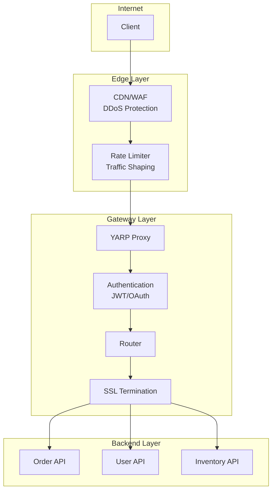
```mermaid
flowchart TB
    subgraph Internet["Internet"]
        C[Client]
    end

    subgraph Edge["Edge Layer"]
        CDN[CDN/WAF<br/>DDoS Protection]
        RL[Rate Limiter<br/>Traffic Shaping]
    end

    subgraph Gateway["Gateway Layer"]
        Y[YARP Proxy]
        Auth[Authentication<br/>JWT/OAuth]
        Route[Router]
        SSL[SSL Termination]
    end

    subgraph Backend["Backend Layer"]
        API1[Order API]
        API2[User API]
        API3[Inventory API]
    end

    C --> CDN
    CDN --> RL
    RL --> Y
    Y --> Auth
    Auth --> Route
    Route --> SSL
    SSL --> API1
    SSL --> API2
    SSL --> API3
```

#### Authentication Flow

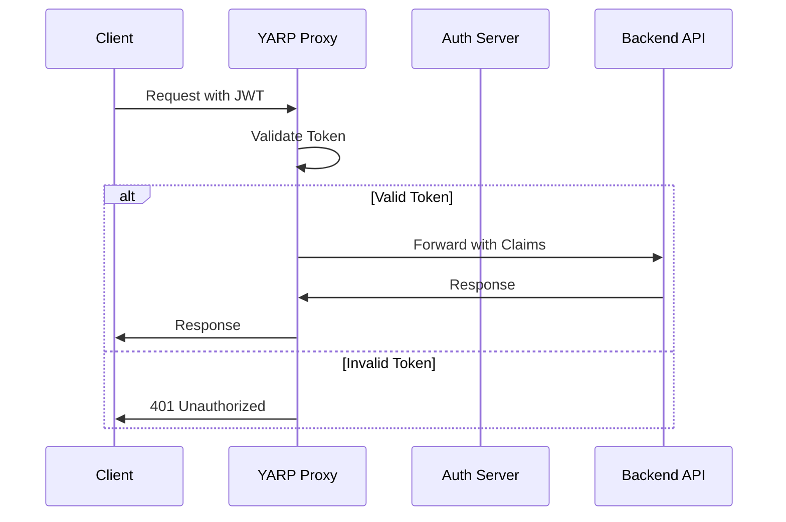
```mermaid
sequenceDiagram
    participant C as Client
    participant RP as YARP Proxy
    participant Auth as Auth Server
    participant API as Backend API

    C->>RP: Request with JWT
    RP->>RP: Validate Token
    alt Valid Token
        RP->>API: Forward with Claims
        API->>RP: Response
        RP->>C: Response
    else Invalid Token
        RP->>C: 401 Unauthorized
    end
```

### 3.2 Rate Limiting Strategy

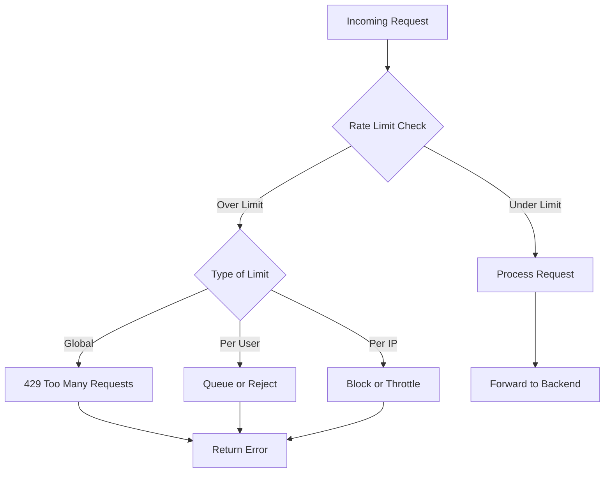
```mermaid
flowchart TD
    A[Incoming Request] --> B{Rate Limit Check}
    B -->|Under Limit| C[Process Request]
    B -->|Over Limit| D{Type of Limit}
    D -->|Global| E[429 Too Many Requests]
    D -->|Per User| F[Queue or Reject]
    D -->|Per IP| G[Block or Throttle]
    C --> H[Forward to Backend]
    E --> I[Return Error]
    F --> I
    G --> I
```

### 3.3 Architecture Patterns

#### API Gateway Pattern

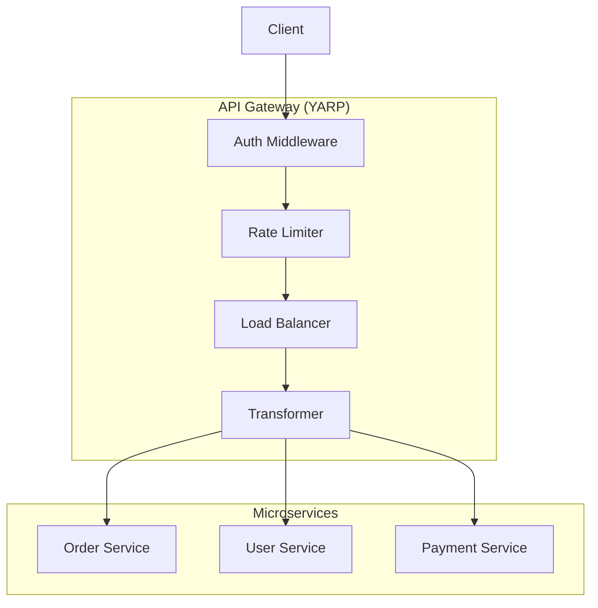
```mermaid
flowchart TB
    subgraph Gateway["API Gateway (YARP)"]
        A[Auth Middleware]
        R[Rate Limiter]
        L[Load Balancer]
        T[Transformer]
    end

    subgraph Services["Microservices"]
        S1[Order Service]
        S2[User Service]
        S3[Payment Service]
    end

    Client --> A
    A --> R
    R --> L
    L --> T
    T --> S1
    T --> S2
    T --> S3
```

#### Backend-for-Frontend (BFF) Pattern

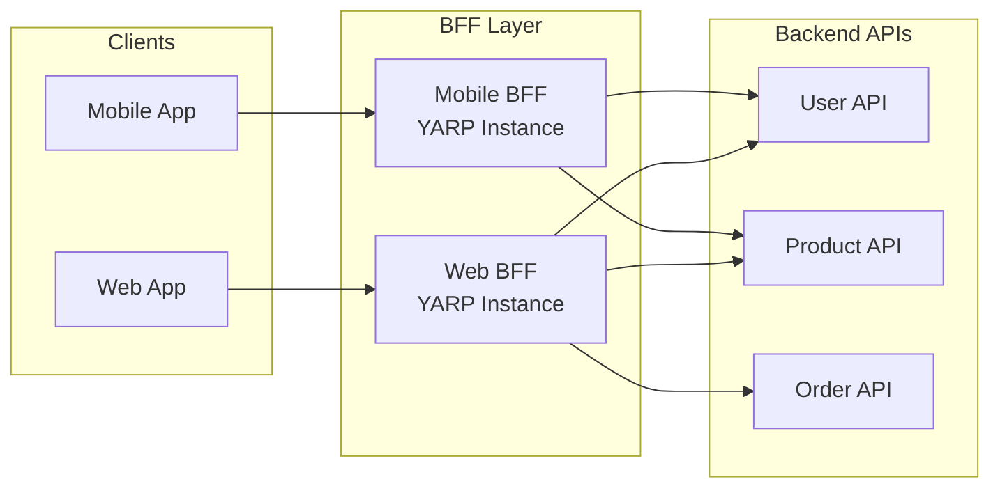
```mermaid
flowchart LR
    subgraph Clients["Clients"]
        Mobile[Mobile App]
        Web[Web App]
    end

    subgraph BFF["BFF Layer"]
        MBFF[Mobile BFF<br/>YARP Instance]
        WBFF[Web BFF<br/>YARP Instance]
    end

    subgraph APIs["Backend APIs"]
        API1[User API]
        API2[Product API]
        API3[Order API]
    end

    Mobile --> MBFF
    Web --> WBFF
    MBFF --> API1
    MBFF --> API2
    WBFF --> API1
    WBFF --> API2
    WBFF --> API3
```

#### Strangler Fig Pattern (Migration)

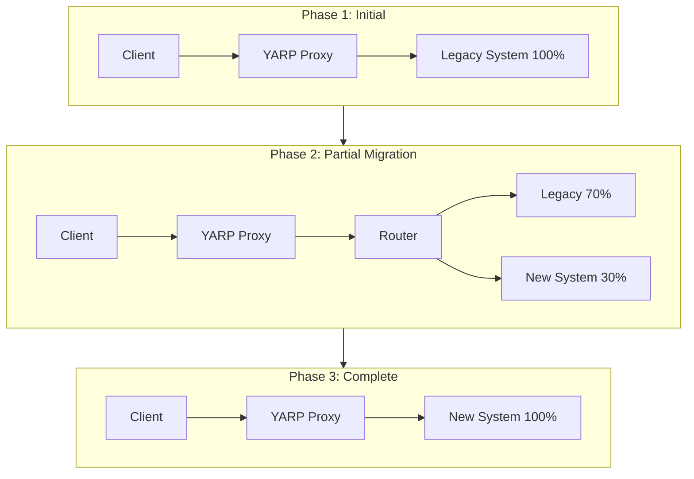
```mermaid
flowchart TB
    subgraph Phase1["Phase 1: Initial"]
        C1[Client]
        RP1[YARP Proxy]
        L1[Legacy System 100%]
        C1 --> RP1 --> L1
    end

    subgraph Phase2["Phase 2: Partial Migration"]
        C2[Client]
        RP2[YARP Proxy]
        R2[Router]
        L2[Legacy 70%]
        N2[New System 30%]
        C2 --> RP2 --> R2
        R2 --> L2
        R2 --> N2
    end

    subgraph Phase3["Phase 3: Complete"]
        C3[Client]
        RP3[YARP Proxy]
        N3[New System 100%]
        C3 --> RP3 --> N3
    end

    Phase1 --> Phase2 --> Phase3
```

### 3.4 Monitoring & Observability

#### Observability Stack

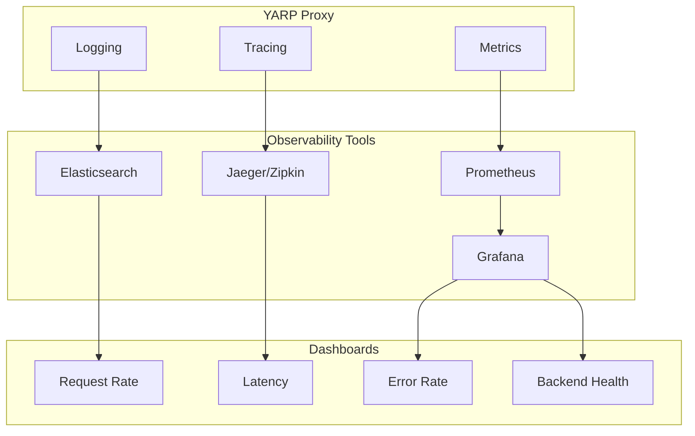
```mermaid
flowchart TB
    subgraph YARP["YARP Proxy"]
        L[Logging]
        M[Metrics]
        T[Tracing]
    end

    subgraph Tools["Observability Tools"]
        PL[Prometheus]
        G[Grafana]
        J[Jaeger/Zipkin]
        ES[Elasticsearch]
    end

    subgraph Visualization["Dashboards"]
        D1[Request Rate]
        D2[Latency]
        D3[Error Rate]
        D4[Backend Health]
    end

    L --> ES
    M --> PL
    T --> J
    PL --> G
    ES --> D1
    J --> D2
    G --> D3
    G --> D4
```

#### Health Check Monitoring

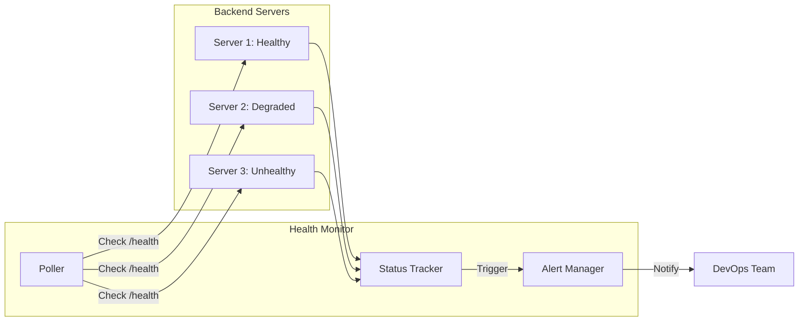
```mermaid
flowchart LR
    subgraph Monitor["Health Monitor"]
        P[Poller]
        S[Status Tracker]
        A[Alert Manager]
    end

    subgraph Backends["Backend Servers"]
        H1[Server 1: Healthy]
        H2[Server 2: Degraded]
        H3[Server 3: Unhealthy]
    end

    P -->|Check /health| H1
    P -->|Check /health| H2
    P -->|Check /health| H3
    H1 --> S
    H2 --> S
    H3 --> S
    S -->|Trigger| A
    A -->|Notify| Ops[DevOps Team]
```

### 3.5 Configuration Management

#### Dynamic Configuration Flow

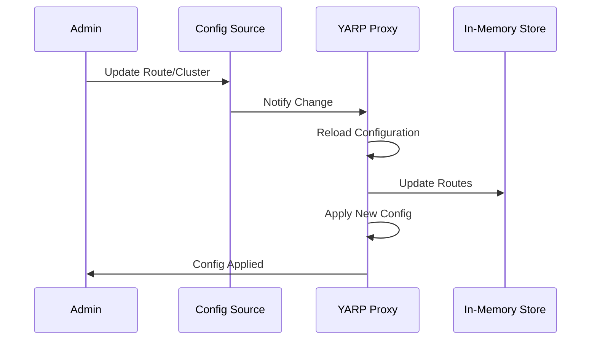
```mermaid
sequenceDiagram
    participant Admin as Admin
    participant Config as Config Source
    participant Y as YARP Proxy
    participant Store as In-Memory Store

    Admin->>Config: Update Route/Cluster
    Config->>Y: Notify Change
    Y->>Y: Reload Configuration
    Y->>Store: Update Routes
    Y->>Y: Apply New Config
    Y->>Admin: Config Applied
```

---

## 4. Tài liệu tham khảo

### Official Documentation

- **YARP GitHub:** https://github.com/dotnet/yarp
- **Microsoft Docs:** https://learn.microsoft.com/aspnet/core/fundamentals/servers/yarp/
- **NuGet Package:** `Yarp.ReverseProxy`

### Related Technologies

```mermaid
mindmap
  root((Ecosystem))
    Microsoft
      ASP.NET Core
      .NET Aspire
      Azure API Management
    Cloud Native
      Kubernetes Ingress
      Istio Service Mesh
      Envoy Proxy
    Observability
      Prometheus
      Grafana
      OpenTelemetry
```

### Learning Resources

- [YARP Documentation](https://microsoft.github.io/reverse-proxy/)
- [Microservices Architecture with YARP](https://www.udemy.com/course/microservices-architecture-and-implementation-on-dotnet/)
- [Building API Gateways with YARP](https://learn.microsoft.com/en-us/training/modules/implement-api-gateway/)

---

## Quick Reference Cards

### YARP Configuration Cheat Sheet

```mermaid
flowchart LR
    subgraph KeyConcepts["Key Concepts"]
        R[Routes<br/>Match: Path, Host, Method]
        C[Clusters<br/>Destinations + LoadBalancing]
        D[Destinations<br/>Address + Health]
        T[Transforms<br/>Request/Response]
    end

    R -->|uses| C
    C -->|contains| D
    C -->|applies| T
```

### Decision Tree: When to Use YARP

```mermaid
flowchart TD
    A[Need Reverse Proxy?] --> B{.NET Ecosystem?}
    B -->|Yes| C{Custom Logic?}
    B -->|No| D[Use Nginx/Envoy]
    C -->|Yes| E{High Performance?}
    C -->|No| F[Use Ocelot]
    E -->|Yes| G[Use YARP]
    E -->|No| H[Evaluate Both]
```

---

*End of Document*
