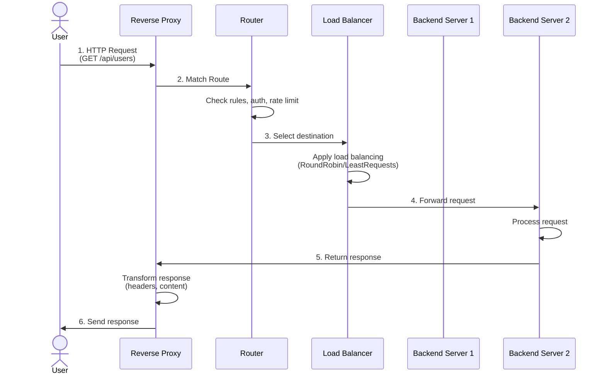

# Tài liệu tham khảo: Reverse Proxy Library & YARP trong .NET

> **Phiên bản:** 2.0 - Diagram Edition  
> **Cập nhật:** Tháng 2/2026  
> **Đối tượng:** Developers mới bắt đầu với .NET microservices

---

## Mục lục

1. [Tổng quan về Reverse Proxy Library](#1-tổng-quan-về-reverse-proxy-library)
2. [Phân tích YARP](#2-phân-tích-yarp-yet-another-reverse-proxy)
3. [Best Practices 2026](#3-best-practices-2026)
4. [Tài liệu tham khảo](#4-tài-liệu-tham-khảo)

---

## 1. Tổng quan về Reverse Proxy Library

### 1.1 Reverse Proxy là gì?

**Reverse Proxy** là máy chủ trung gian đứng giữa **clients** và **backend servers**, nhận requests từ clients và chuyển tiếp đến các servers phù hợp.

#### Forward Proxy vs Reverse Proxy


| Đặc điểm | Forward Proxy | Reverse Proxy |
|----------|--------------|---------------|
| **Vị trí** | Client-side | Server-side |
| **Bảo vệ** | Client identity | Backend servers |
| **Traffic** | Outbound | Inbound |
| **Mục đích** | Anonymity, filtering | Load balancing, security |
| **Ví dụ** | Corporate proxy, VPN | Nginx, YARP, Envoy |

### 1.2 Cách thức hoạt động

#### Sequence Diagram - Request Flow



### 1.3 Các chức năng chính

#### Chức năng Reverse Proxy


### 1.4 Các thư viện/Tool phổ biến


---

## 2. Phân tích YARP (Yet Another Reverse Proxy)

### 2.1 Giới thiệu YARP

**YARP** là reverse proxy library được Microsoft phát triển cho .NET.

#### YARP vs Ocelot

```mermaid
flowchart LR
    subgraph Y["YARP"]
        Y1["✅ High Performance"]
        Y2["✅ Microsoft Backed"]
        Y3["✅ Code-First"]
        Y4["✅ Highly Flexible"]
        Y5["⚠️ Requires More Code"]
    end

    subgraph O["Ocelot"]
        O1["✅ Quick Setup"]
        O2["✅ Built-in Features"]
        O3["✅ Mature Ecosystem"]
        O4["❌ Community Maintained"]
        O5["⚠️ Less Flexible"]
    end

    Y -->|Trend 2026| Winner["🏆 YARP is #1 Choice"]
    O -->|Legacy| Winner
```



### 2.2 Kiến trúc YARP

#### Component Architecture


#### Request Processing Pipeline


### 2.3 Cài đặt và Cấu hình cơ bản

#### Installation

```bash
dotnet add package Yarp.ReverseProxy
```

#### Basic Setup

```csharp
// Program.cs
var builder = WebApplication.CreateBuilder(args);

// Add YARP services
builder.Services.AddReverseProxy()
    .LoadFromConfig(builder.Configuration.GetSection("ReverseProxy"));

var app = builder.Build();
app.MapReverseProxy();
app.Run();
```

#### Configuration (appsettings.json)

```json
{
  "ReverseProxy": {
    "Routes": {
      "api-route": {
        "ClusterId": "api-cluster",
        "Match": { "Path": "/api/{**catchall}" }
      }
    },
    "Clusters": {
      "api-cluster": {
        "Destinations": {
          "server1": { "Address": "https://api1.com" },
          "server2": { "Address": "https://api2.com" }
        }
      }
    }
  }
}
```

### 2.4 Cấu hình nâng cao

#### Load Balancing Flow

```mermaid
flowchart TD
    A[Incoming Request] --> B{Load Balancing Policy}
    B -->|RoundRobin| C[Server 1 → 2 → 3 → 1]
    B -->|LeastRequests| D[Pick Server with<br/>Lowest Active Requests]
    B -->|Random| E[Random Selection]
    B -->|PowerOfTwoChoices| F[Select 2 Random<br/>Pick Lower Load]
    C --> G[Forward Request]
    D --> G
    E --> G
    F --> G
```



#### Session Affinity (Sticky Sessions)


#### Health Check Mechanism


### 2.5 YARP trong .NET Aspire

#### Aspire 9.4 Architecture

```mermaid
flowchart TB
    subgraph Aspire[".NET Aspire App Host"]
        B[builder.AddYarp\("gateway"\)]
        R1[WithRoute\("catalog"\)]
        R2[WithRoute\("basket"\)]
        T[WithTransformPathRemovePrefix]
        REF[WithReference\(Services\)]
    end

    subgraph Services["Backend Services"]
        C[Catalog Service]
        BK[Basket Service]
    end

    B --> R1
    B --> R2
    R1 --> T
    R2 --> T
    T --> REF
    REF --> C
    REF --> BK
```

---

## 3. Best Practices 2026

### 3.1 Security Architecture

#### Multi-Layer Security


#### Authentication Flow


### 3.2 Rate Limiting Strategy


### 3.3 Architecture Patterns

#### API Gateway Pattern


#### Backend-for-Frontend (BFF) Pattern


#### Strangler Fig Pattern (Migration)


### 3.4 Monitoring & Observability

#### Observability Stack


#### Health Check Monitoring


### 3.5 Configuration Management

#### Dynamic Configuration Flow


---

## 4. Tài liệu tham khảo

### Official Documentation

- **YARP GitHub:** https://github.com/dotnet/yarp
- **Microsoft Docs:** https://learn.microsoft.com/aspnet/core/fundamentals/servers/yarp/
- **NuGet Package:** `Yarp.ReverseProxy`

### Related Technologies

```mermaid
mindmap
  root((Ecosystem))
    Microsoft
      ASP.NET Core
      .NET Aspire
      Azure API Management
    Cloud Native
      Kubernetes Ingress
      Istio Service Mesh
      Envoy Proxy
    Observability
      Prometheus
      Grafana
      OpenTelemetry
```

### Learning Resources

- [YARP Documentation](https://microsoft.github.io/reverse-proxy/)
- [Microservices Architecture with YARP](https://www.udemy.com/course/microservices-architecture-and-implementation-on-dotnet/)
- [Building API Gateways with YARP](https://learn.microsoft.com/en-us/training/modules/implement-api-gateway/)

---

## Quick Reference Cards

### YARP Configuration Cheat Sheet

```mermaid
flowchart LR
    subgraph KeyConcepts["Key Concepts"]
        R[Routes<br/>Match: Path, Host, Method]
        C[Clusters<br/>Destinations + LoadBalancing]
        D[Destinations<br/>Address + Health]
        T[Transforms<br/>Request/Response]
    end

    R -->|uses| C
    C -->|contains| D
    C -->|applies| T
```

### Decision Tree: When to Use YARP

```mermaid
flowchart TD
    A[Need Reverse Proxy?] --> B{.NET Ecosystem?}
    B -->|Yes| C{Custom Logic?}
    B -->|No| D[Use Nginx/Envoy]
    C -->|Yes| E{High Performance?}
    C -->|No| F[Use Ocelot]
    E -->|Yes| G[Use YARP]
    E -->|No| H[Evaluate Both]
```

---

*End of Document*
