# Tài Liệu Hệ Thống Unit of Work (UoW)

## A. Tổng Quan Hệ Thống

### 1. Giới Thiệu

Hệ thống **Unit of Work (UoW)** trong dự án ProgCoder Shop Microservices là một pattern quan trọng được triển khai theo nguyên tắc **Clean Architecture** và **Domain-Driven Design (DDD)**. Pattern này đảm bảo tính nhất quán của dữ liệu khi thực hiện nhiều thao tác trên nhiều repository khác nhau trong một transaction duy nhất.

### 2. Mục Tiêu Thiết Kế

- **Quản lý transaction**: Tập trung điều khiển transaction tại một điểm duy nhất
- **Đảm bảo tính nhất quán**: Tất cả thay đổi được commit hoặc rollback đồng thởi
- **Tách biệt concerns**: Tách biệt logic nghiệp vụ khỏi infrastructure concerns
- **Hỗ trợ đa database**: Hoạt động với cả MongoDB và Entity Framework Core
- **Hỗ trợ Outbox/Inbox pattern**: Tích hợp với hệ thống messaging

### 3. Kiến Trúc Tổng Thể

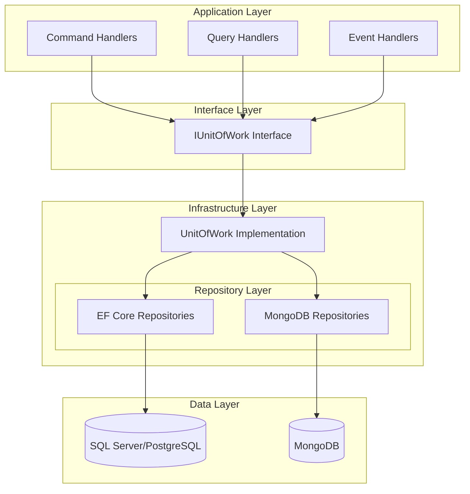

## B. Chi Tiết Triển Khai

### 1. Cấu Trúc Interface IUnitOfWork

#### 1.1 Discount Service (MongoDB)

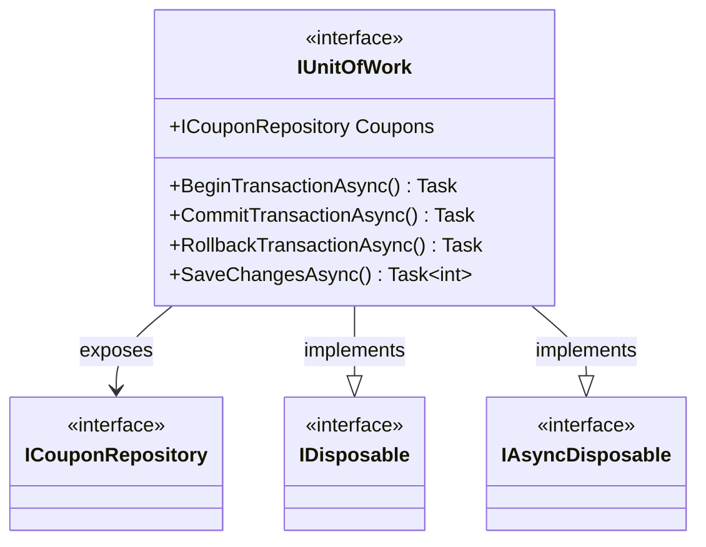

**File**: `Discount.Application/Repositories/IUnitOfWork.cs`

**Đặc điểm:**
- Kế thừa `IDisposable` và `IAsyncDisposable` để quản lý tài nguyên
- Hỗ trợ MongoDB transactions với explicit methods
- Property `Coupons` cung cấp truy cập đến repository

#### 1.2 Inventory Service (EF Core)

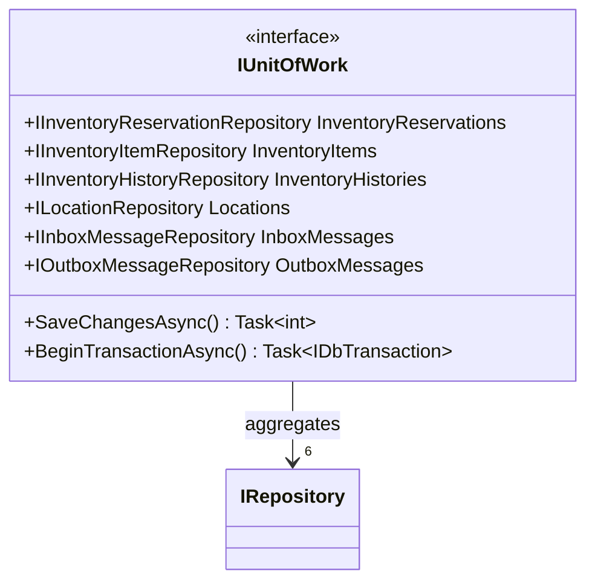

**File**: `Inventory.Domain/Abstractions/IUnitOfWork.cs`

**Đặc điểm:**
- Sử dụng EF Core với `IDbTransaction`
- Tích hợp Outbox/Inbox pattern với `InboxMessages` và `OutboxMessages`
- 6 repositories cho các domain entities khác nhau

#### 1.3 Order Service (EF Core)

Cấu trúc tương tự Inventory Service với 4 repositories:
- `IOrderRepository Orders`
- `IOrderItemRepository OrderItems`
- `IInboxMessageRepository InboxMessages`
- `IOutboxMessageRepository OutboxMessages`

### 2. Implementations

#### 2.1 MongoDB UnitOfWork (Discount Service)

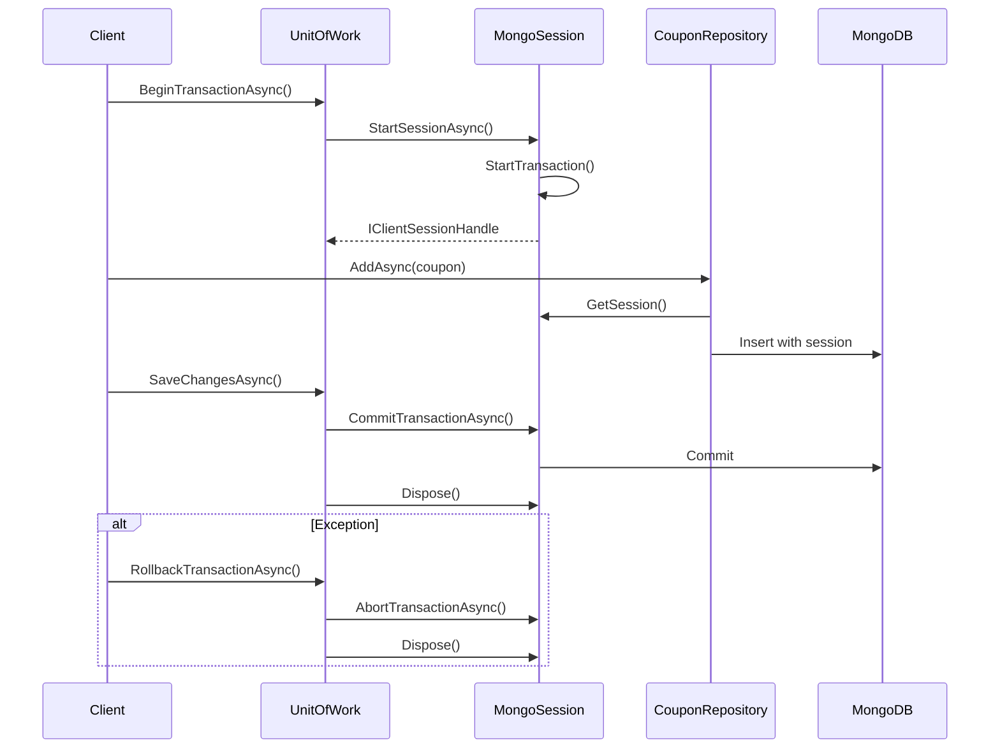

**File**: `Discount.Infrastructure/Repositories/UnitOfWork.cs`

**Giải thích chi tiết:**

1. **IMongoSessionProvider**: Interface cho phép repository truy cập session hiện tại
2. **Transaction Management**: 
   - Session được tạo và gắn với transaction
   - Repositories sử dụng session này cho mọi operations
   - Commit/Rollback thông qua session
3. **SaveChangesAsync**: Tự động commit nếu có transaction active
4. **Disposal**: Tự động rollback nếu transaction còn active khi dispose

#### 2.2 EF Core UnitOfWork (Inventory & Order Service)

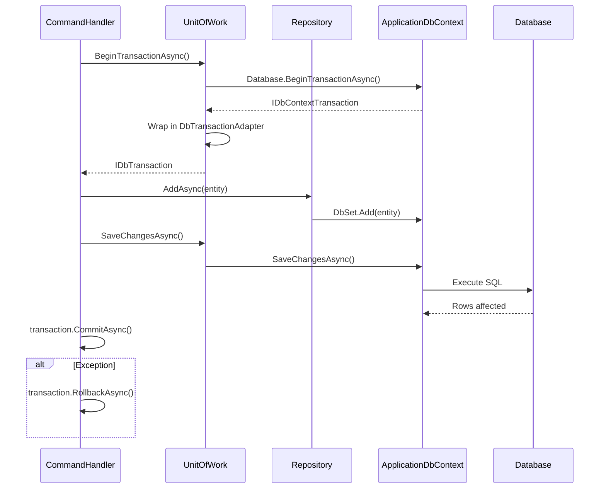

**File**: `Inventory.Infrastructure/UnitOfWork/UnitOfWork.cs` (tương tự cho Order)

```csharp
public class UnitOfWork(
    IInventoryReservationRepository inventoryReservations,
    IInventoryItemRepository inventoryItems,
    // ... other repositories
    ApplicationDbContext context) : IUnitOfWork
{
    public IInventoryReservationRepository InventoryReservations { get; } = inventoryReservations;
    // ... other properties

    public Task<int> SaveChangesAsync(CancellationToken cancellationToken = default)
        => context.SaveChangesAsync(cancellationToken);

    public async Task<IDbTransaction> BeginTransactionAsync(CancellationToken cancellationToken = default)
    {
        var tx = await context.Database.BeginTransactionAsync(cancellationToken);
        return new DbTransactionAdapter(tx);
    }
}
```

**Giải thích:**
1. **Primary Constructor**: Sử dụng C# 12 primary constructor để inject dependencies
2. **Repository Properties**: Tất cả repositories được inject và expose qua properties
3. **SaveChangesAsync**: Delegate trực tiếp đến EF Core DbContext
4. **BeginTransactionAsync**: Sử dụng EF Core transaction với `DbTransactionAdapter`

### 3. Dependency Injection Registration

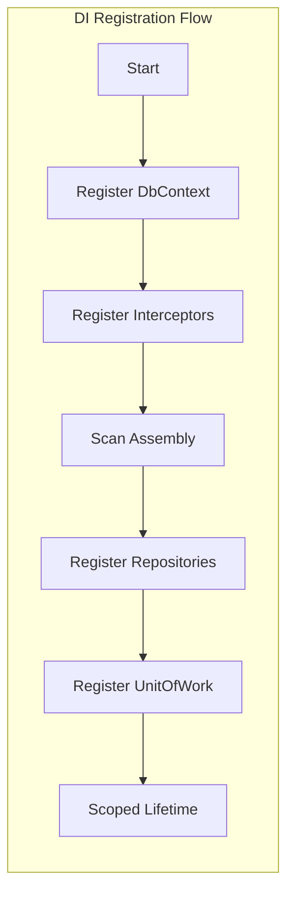

**Cấu hình DI (Inventory/Order Service):**

```csharp
// Repository & Unit of Work
{
    services.Scan(s => s
        .FromAssemblyOf<InfrastructureMarker>()
        .AddClasses(c => c.Where(t => t.Name.EndsWith("Repository")))
        .UsingRegistrationStrategy(Scrutor.RegistrationStrategy.Skip)
        .AsImplementedInterfaces()
        .WithScopedLifetime());

    services.AddScoped<Domain.Abstractions.IUnitOfWork, UnitOfWork.UnitOfWork>();
}
```

**Quy trình:**
1. Scrutor scan và register tất cả repositories từ assembly
2. Register UnitOfWork sau repositories để đảm bảo dependencies đã sẵn sàng
3. Cả đều sử dụng **Scoped Lifetime**

**Cấu hình DI (Discount Service):**

```csharp
// Register UnitOfWork as scoped (must be after repositories)
services.AddScoped<Discount.Application.Repositories.IUnitOfWork, Repositories.UnitOfWork>();
```

### 4. Usage Patterns trong Handlers

#### 4.1 Pattern 1: Explicit Transaction

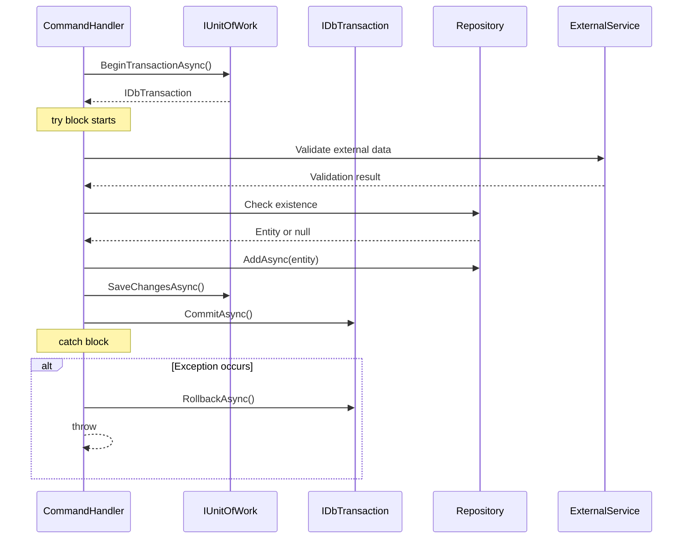

**Ví dụ: CreateInventoryItemCommand**

```csharp
public async Task<Guid> Handle(CreateInventoryItemCommand command, CancellationToken cancellationToken)
{
    var transaction = await unitOfWork.BeginTransactionAsync(cancellationToken);

    try
    {
        // Validate product exists
        var product = await catalogGrpc.GetProductByIdAsync(dto.ProductId.ToString(), cancellationToken)
            ?? throw new ClientValidationException(MessageCode.ProductIsNotExists, dto.ProductId);
        
        // Check for existing inventory item
        var existingItem = await unitOfWork.InventoryItems
            .FirstOrDefaultAsync(x => x.Product.Id == product.Id && x.LocationId == dto.LocationId, cancellationToken);

        if (existingItem is not null) 
            throw new ClientValidationException(MessageCode.InventoryItemAlreadyExists, dto.ProductId);

        // Create entity
        var entity = InventoryItemEntity.Create(...);
        await unitOfWork.InventoryItems.AddAsync(entity);

        // Persist
        await unitOfWork.SaveChangesAsync(cancellationToken);
        await transaction.CommitAsync(cancellationToken);

        return entity.Id;
    }
    catch (Exception)
    {
        await transaction.RollbackAsync(cancellationToken);
        throw;
    }
}
```

**Đặc điểm:**
- Sử dụng `try-catch-finally` pattern
- Explicit `BeginTransactionAsync`, `CommitAsync`, `RollbackAsync`
- Validate trước khi thực hiện thay đổi
- `SaveChangesAsync` trước khi commit transaction

#### 4.2 Pattern 2: Implicit Transaction

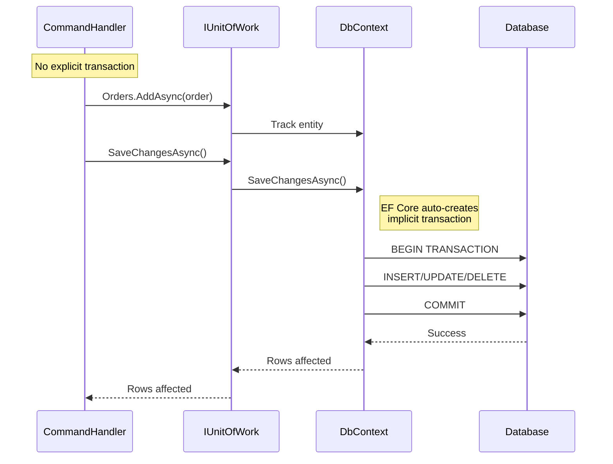

**Ví dụ: CreateOrderCommand**

```csharp
public async Task<Guid> Handle(CreateOrderCommand command, CancellationToken cancellationToken)
{
    // Build domain entities
    var order = OrderEntity.Create(...);
    
    // Fetch and validate products
    var products = await catalogGrpc.GetAllAvailableProductsAsync(cancellationToken);
    
    // Add order items
    foreach (var item in dto.OrderItems)
    {
        var product = products.Items.FirstOrDefault(x => x.Id == item.ProductId);
        order.AddOrderItem(product, item.Quantity);
    }
    
    // Apply discount if applicable
    if (!string.IsNullOrWhiteSpace(dto.CouponCode))
    {
        var discount = await discountGrpc.EvaluateCouponAsync(...);
        order.ApplyDiscount(discount);
    }
    
    // Persist - EF Core creates implicit transaction
    await unitOfWork.Orders.AddAsync(order, cancellationToken);
    await unitOfWork.SaveChangesAsync(cancellationToken);

    return order.Id;
}
```

**Đặc điểm:**
- Không sử dụng explicit transaction
- EF Core tự động tạo implicit transaction cho `SaveChangesAsync`
- Phù hợp cho single-operation scenarios
- Code đơn giản hơn, dễ đọc

### 5. So Sánh Các Patterns

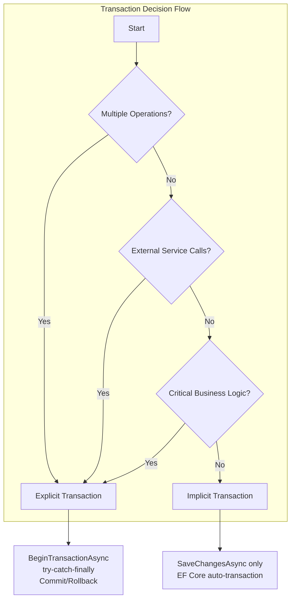

## C. Tích Hợp Outbox/Inbox Pattern

### 1. Kiến Trúc Outbox/Inbox với UnitOfWork

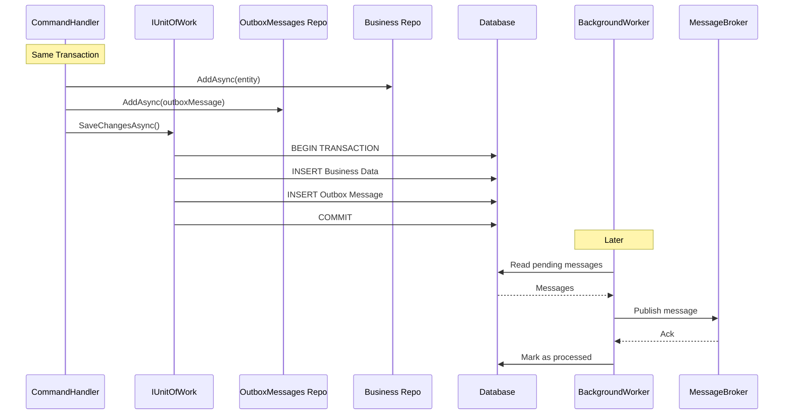

### 2. Outbox Pattern

Outbox pattern được sử dụng để đảm bảo message được publish đáng tin cậy:

1. Message được lưu vào `OutboxMessages` table cùng với business data trong cùng một transaction
2. Background worker đọc từ Outbox và publish message
3. Nếu publish thành công, message được đánh dấu đã xử lý

### 3. Inbox Pattern

Inbox pattern ngăn chặn việc xử lý message trùng lặp:

1. Message từ message broker được lưu vào `InboxMessages`
2. Xử lý message và đánh dấu đã xử lý
3. Nếu message đã tồn tại, bỏ qua xử lý

## D. So Sánh Các Triển Khai

| Feature | Discount (MongoDB) | Inventory (EF Core) | Order (EF Core) |
|---------|-------------------|---------------------|-----------------|
| **Database** | MongoDB | SQL Server/PostgreSQL/MySQL | SQL Server/PostgreSQL/MySQL |
| **Transaction Type** | MongoDB Session | EF Core Transaction | EF Core Transaction |
| **Disposal** | IDisposable, IAsyncDisposable | Không (repositories scoped) | Không (repositories scoped) |
| **Outbox/Inbox** | Không | Có | Có |
| **SaveChanges** | Manual commit hoặc auto | EF Core Change Tracker | EF Core Change Tracker |
| **Error Handling** | Rollback session | Rollback transaction | Rollback transaction |

## E. Best Practices

### 1. Luôn Sử Dụng Transaction cho Multi-Operation

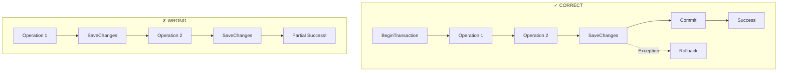

### 2. Code Pattern Tốt

**Đúng:**
```csharp
await unitOfWork.Repo1.AddAsync(entity1);
await unitOfWork.Repo2.AddAsync(entity2);
await unitOfWork.SaveChangesAsync(ct);  // Single SaveChanges
```

**Sai:**
```csharp
await unitOfWork.Repo1.AddAsync(entity1);
await unitOfWork.SaveChangesAsync(ct);  // Multiple SaveChanges
await unitOfWork.Repo2.AddAsync(entity2);
await unitOfWork.SaveChangesAsync(ct);  // Tạo nhiều transaction
```

### 3. Exception Handling Pattern

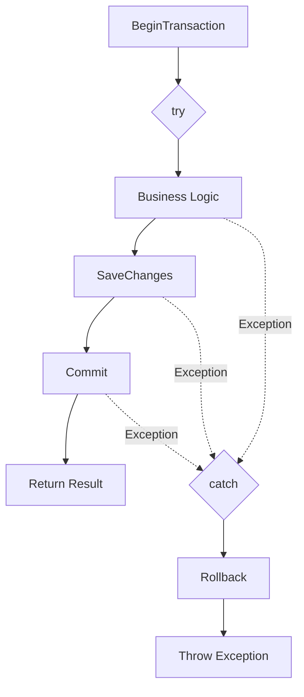

### 4. Quy Tắc Quan Trọng

| Quy Tắc | Mô Tả |
|---------|-------|
| **Single SaveChanges** | Chỉ gọi `SaveChangesAsync` một lần cho tất cả thay đổi |
| **Always Rollback** | Luôn rollback khi exception xảy ra |
| **Validate First** | Validate input trước khi bắt đầu transaction |
| **Keep Transactions Short** | Không thực hiện operations dài trong transaction |
| **External Calls** | Gọi external services trước khi bắt đầu transaction nếu có thể |

## F. Tools và Technologies

| Category | Technologies |
|----------|-------------|
| **Ngôn ngữ** | C# 12 (.NET 8) |
| **MongoDB** | MongoDB.Driver, MongoDB Transactions |
| **EF Core** | Entity Framework Core 8, SQL Server/PostgreSQL/MySQL providers |
| **DI Container** | Microsoft.Extensions.DependencyInjection, Scrutor |
| **Architecture** | Clean Architecture, Domain-Driven Design |

## G. Kết Luận

Hệ thống Unit of Work trong ProgCoder Shop Microservices được thiết kế linh hoạt, hỗ trợ cả MongoDB và EF Core với các patterns:

1. **Repository Pattern**: Tách biệt data access logic
2. **Unit of Work Pattern**: Quản lý transactions
3. **Outbox/Inbox Pattern**: Đảm bảo reliable messaging

Hệ thống này đảm bảo tính nhất quán của dữ liệu trong microservices architecture với event-driven communication.

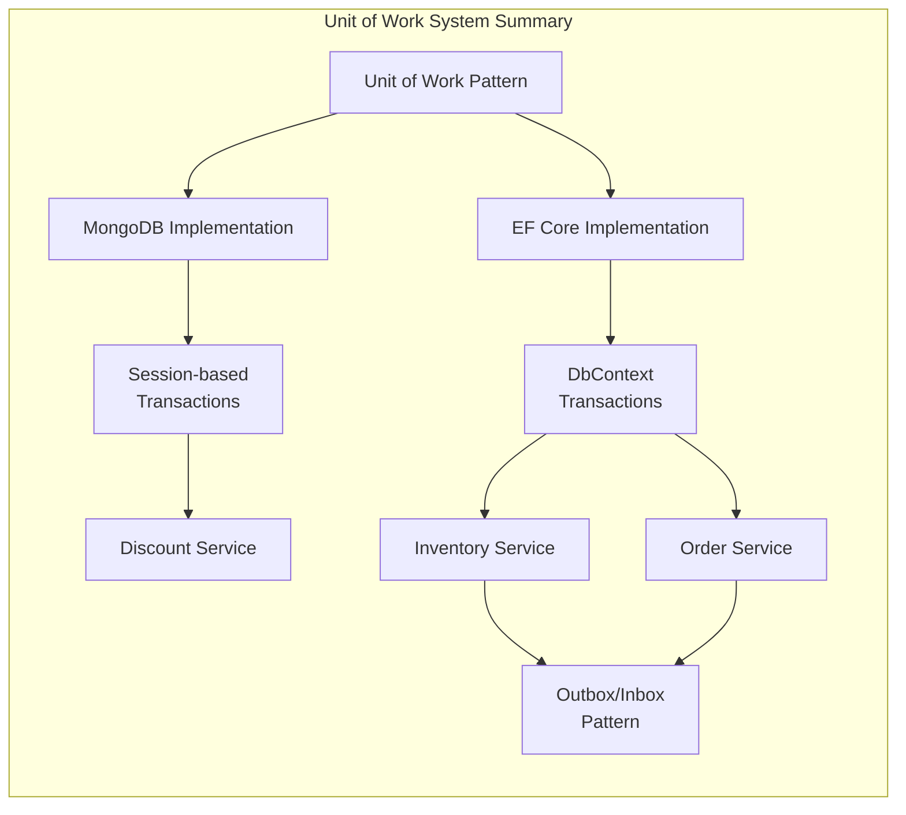
